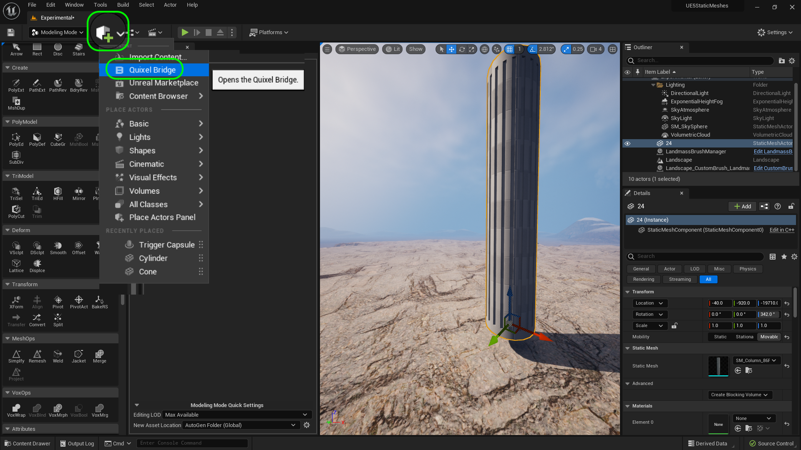
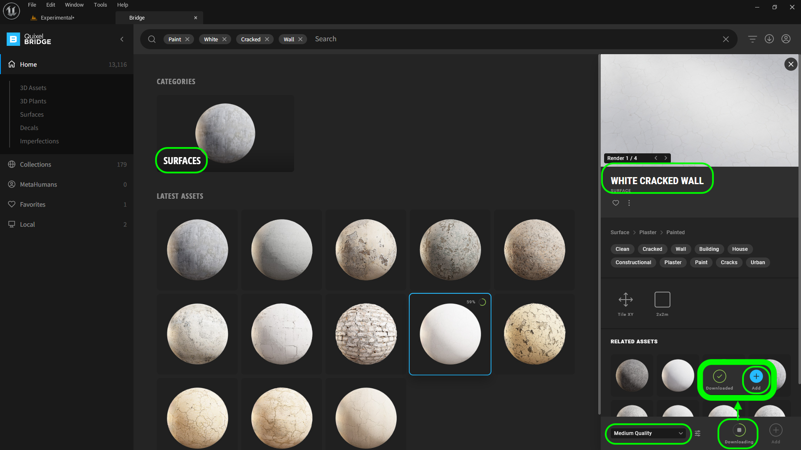
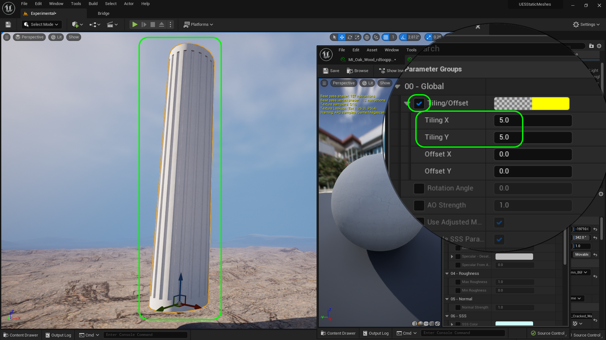
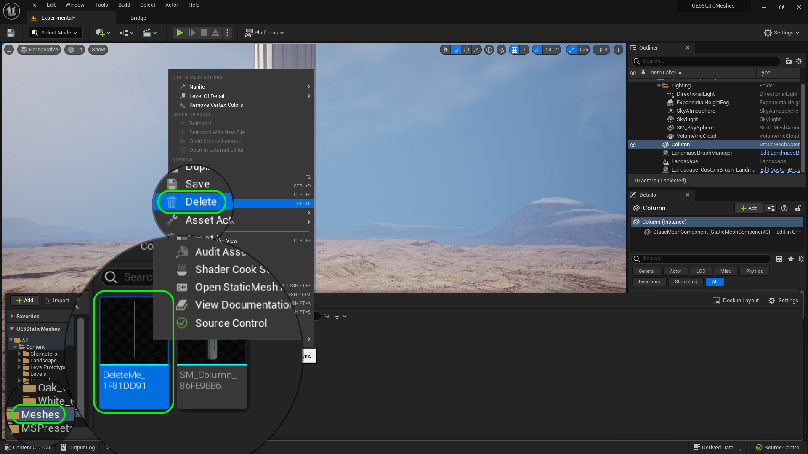
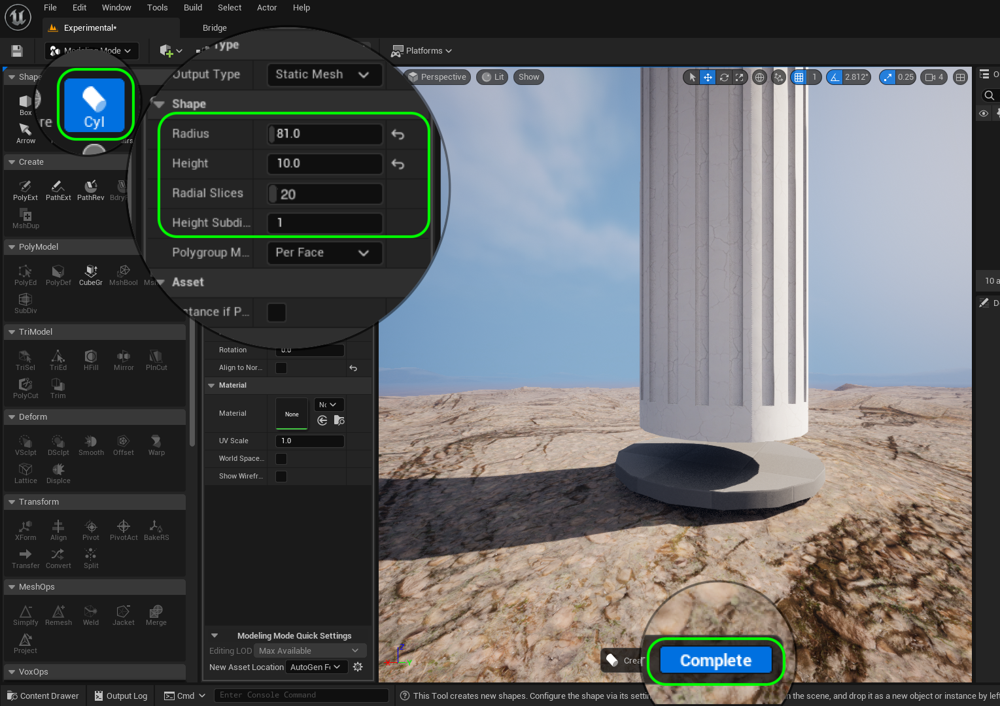
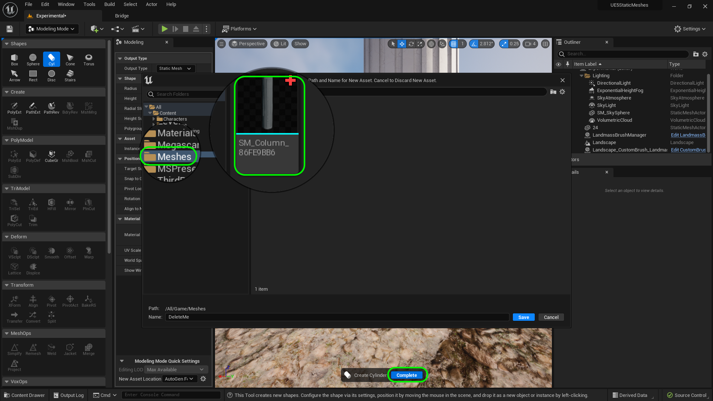
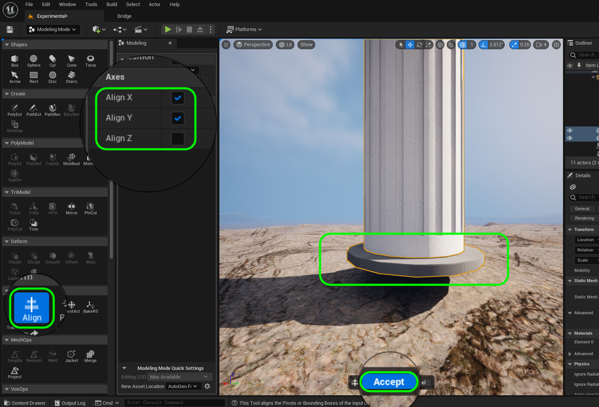
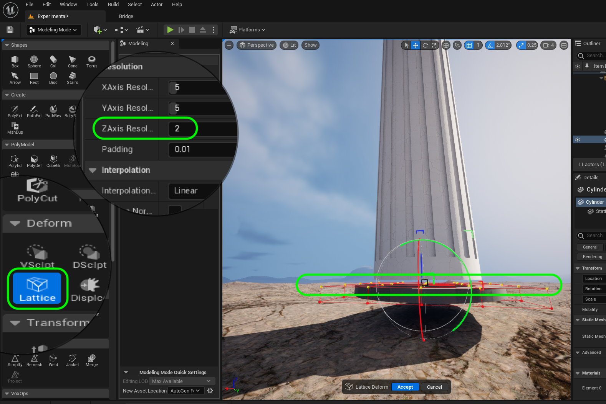
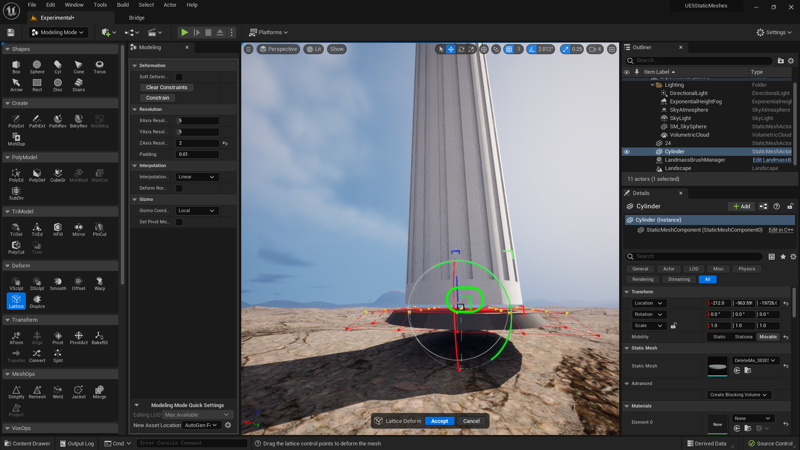
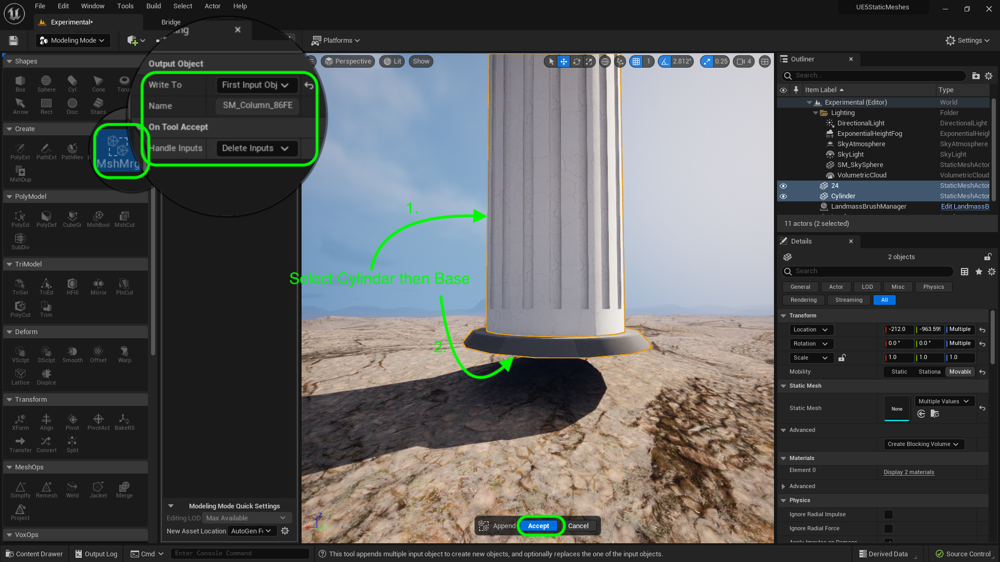

### Basic Column II

[previous](../basic-column/README.md#user-content-basic-column) • [home](../README.md#user-content-ue4-static-meshes) • [next](../)

Lets finish off the flutes and the top and bottom support for the column.  Lets also pick a nice material that we can use to finish it off.

 

---

##### `Step 1.`\|`ITSM`|:small_blue_diamond:

Now rotate the main column to cut 18 more holes at 18° each.  Rotate to `36`°, `54`°,`72`°, `90`°, `108`°, `126`°, `144`°, `162`°, `180`°, `198`°, `216`°, `234`°, `252`°, `270`°, `288`°, `306`°, `324`°, and `342`°.  Then do a boolean to cut out the shape 18 more times.               

https://user-images.githubusercontent.com/5504953/183221393-719dace0-27b3-4522-b98e-46a69a1ddbea.mp4

##### `Step 2.`\|`ITSM`|:small_blue_diamond: :small_blue_diamond: 

Now we can get acess to a plethera of free assets for our student projects at **Quixel**.  Open up the **Add Content** button and select **Quixel Bridge**.

##### `Step 3.`\|`ITSM`|:small_blue_diamond: :small_blue_diamond: :small_blue_diamond:

Now login with your **Unreal** credentials and select **Surfaces**.  Pick a solid surface that is fairly large (minimum 2m x 2m). I liked **White Cracked Wall**. I selected **Medium Quality** which is a **2K** texture (2048 x 2048) which is large enough.  Press the <kbd>Download</kbd> button which will get it onto your hard drive.  Then to add it to your project press the <kbd>Add</kbd> button.

##### `Step 4.`\|`ITSM`|:small_blue_diamond: :small_blue_diamond: :small_blue_diamond: :small_blue_diamond:

This now adds a **Megascans | Surfaces | White Cracked Wall** folder to your project's **Content Browswer**.

##### `Step 5.`\|`ITSM`| :small_orange_diamond:

Assign `MI_Cracked_Wall` as a material to our **SM_Column** static mesh. Then double click the **MI_Cracked_Wall** material instance and set **Tiling Offset** to `true`.  Then adust the **Tiling X** and *Tiling Y** to match the scale.  I like a value of `5.0`.

##### `Step 6.`\|`ITSM`| :small_orange_diamond: :small_blue_diamond:

Now we do not need the small column anymore as we have used it.  Go to the **Meshes** folder and right click on **DeleteMe** and delete this static mesh.

##### `Step 7.`\|`ITSM`| :small_orange_diamond: :small_blue_diamond: :small_blue_diamond:

Now lets add a bottom to the pillar.  Make sure you are in **Modeling Mode** and select **Shape | Cyl**.  Set the **Radius** to `81.0` cm, **Height** to `10.0` cm, **Radial Slices** to `20.0` and finaly **Height Subdivisions** to `1`.

##### `Step 8.`\|`ITSM`| :small_orange_diamond: :small_blue_diamond: :small_blue_diamond: :small_blue_diamond:

Now press the left mouse button to place it in the level.  It will bring up the static mesh prompt to save it.  Select the **Meshes** folder then call it `DeleteMe`. Press the <kbd>Save</kbd> button. 

Now this may not work as it might say this name is in use.  If it does you need to right click on **Meshes** and select **Fix Up Redirectors** (CHECK THIS).  Then try saving again. 

Once it is done, press the <kbd>Complete</kbd> button (if another save menu pops up press cancel).

##### `Step 9.`\|`ITSM`| :small_orange_diamond: :small_blue_diamond: :small_blue_diamond: :small_blue_diamond: :small_blue_diamond:

Now select both the main column and this new bottom plate you have made.  Select **Transform | Align**.  Now we want to center it on the X and Y axis so set the **Axis | Align X** and **Axis | Align Y** to `true`.  Turn off **Align Z**. Now move the piece so that it fits over the column without a gap.  Press the <kbd>Accept</kbd> button.

##### `Step 10.`\|`ITSM`| :large_blue_diamond:

We are going to create a slant in the disc.  Go to the **Deform | Lattice** tool and set **Z Axis Resolution** to `2`.  Now left click and select all th points on the top of the mesh.  Triple check that you selected all of them and none of the ones below.

##### `Step 11.`\|`ITSM`| :large_blue_diamond: :small_blue_diamond: 

Now you can bring in the scale on both X & Y axis to tilt the top edge inwards. When you are happy press the <kbd>Accept</kbd> button.

##### `Step 12.`\|`ITSM`| :large_blue_diamond: :small_blue_diamond: :small_blue_diamond: 

Now make sure the bottom ring is colliding with the cylinder.  

##### `Step 13.`\|`ITSM`| :large_blue_diamond: :small_blue_diamond: :small_blue_diamond:  :small_blue_diamond: 

##### `Step 14.`\|`ITSM`| :large_blue_diamond: :small_blue_diamond: :small_blue_diamond: :small_blue_diamond:  :small_blue_diamond: 

##### `Step 15.`\|`ITSM`| :large_blue_diamond: :small_orange_diamond: 

##### `Step 16.`\|`ITSM`| :large_blue_diamond: :small_orange_diamond:   :small_blue_diamond: 

##### `Step 17.`\|`ITSM`| :large_blue_diamond: :small_orange_diamond: :small_blue_diamond: :small_blue_diamond:

##### `Step 18.`\|`ITSM`| :large_blue_diamond: :small_orange_diamond: :small_blue_diamond: :small_blue_diamond: :small_blue_diamond:

##### `Step 19.`\|`ITSM`| :large_blue_diamond: :small_orange_diamond: :small_blue_diamond: :small_blue_diamond: :small_blue_diamond: :small_blue_diamond:

##### `Step 20.`\|`ITSM`| :large_blue_diamond: :large_blue_diamond:

##### `Step 21.`\|`ITSM`| :large_blue_diamond: :large_blue_diamond: :small_blue_diamond:

<!--  -->

| [previous](../basic-column/README.md#user-content-basic-column)| [home](../README.md#user-content-ue4-static-meshes) | [next](../)|
|---|---|---|
