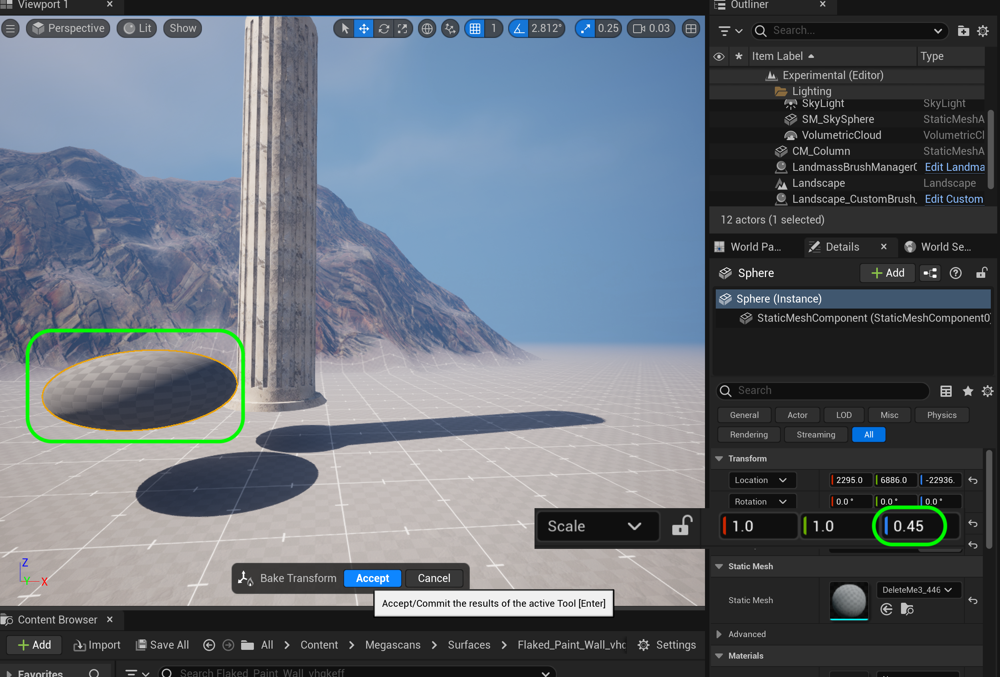

### Basic Column II

[previous](../basic-column/README.md#user-content-basic-column) • [home](../README.md#user-content-ue5-intro-to-static-meshes) • [next](../basic-column-iii/README.md#user-content-basic-column-iii)

Lets finish off the flutes and the top and bottom support for the column.  Lets also pick a nice material that we can use to finish it off.

 

---

##### `Step 1.`\|`ITSM`|:small_blue_diamond:

Now rotate the main column to cut 18 more holes at 18° each.  Rotate to `36`°, `54`°,`72`°, `90`°, `108`°, `126`°, `144`°, `162`°, `180`°, `198`°, `216`°, `234`°, `252`°, `270`°, `288`°, `306`°, `324`°, and `342`°.  Then do a boolean to cut out the shape 18 more times.               

https://user-images.githubusercontent.com/5504953/183221393-719dace0-27b3-4522-b98e-46a69a1ddbea.mp4

##### `Step 2.`\|`ITSM`|:small_blue_diamond: :small_blue_diamond: 

Now we can get acess to a plethera of free assets, including surface materials, for our student projects at **Quixel**.  Open up the **Add Content** button and select **Quixel Bridge**. 

##### `Step 3.`\|`ITSM`|:small_blue_diamond: :small_blue_diamond: :small_blue_diamond:

Now login with your **Unreal** credentials and select **Surfaces**.  Pick a solid surface that is fairly large (minimum 2m x 2m). I liked **Flaked Paint Wall**. I selected **Medium Quality** which is a **2K** texture (2048 x 2048) which is large enough.  Press the <kbd>Download</kbd> button which will get it onto your hard drive.  Then you need to add it to your project by *pressing* the <kbd>Add</kbd> button.

##### `Step 4.`\|`ITSM`|:small_blue_diamond: :small_blue_diamond: :small_blue_diamond: :small_blue_diamond:

This now adds a **Megascans | Surfaces | Flaked_Paint_Wall** folder to your project's **Content Browser**. The material has a green line under it and the red line objects are textures used by the material.

##### `Step 5.`\|`ITSM`| :small_orange_diamond:

Assign `MI_Cracked_Wall` as a material to our **SM_Column** static mesh. Then double click the **MI_Flaked_Paint_Wall** material instance and set **Tiling Offset** to `true`.  Then adust the **Tiling X** and **Tiling Y** to match the scale.  I like a value of `7.0` to make the paint chips smaller.

##### `Step 6.`\|`ITSM`| :small_orange_diamond: :small_blue_diamond:

Now we do not need the small column anymore as we have used it.  Remove it from the level and press the **File | Save Level** menu item. Go to the **Meshes** folder and *right click* on **DeleteMe** and delete this static mesh. Select **Force Delete** as it was used in the level - we don't mind here as we are not using it anymore.  

##### `Step 7.`\|`ITSM`| :small_orange_diamond: :small_blue_diamond: :small_blue_diamond:

Now lets add a bottom to the pillar.  Make sure you are in **Modeling Mode** and select **Shape | Cyl**.  Set the **Radius** to `81.0` cm, **Height** to `10.0` cm, **Radial Slices** to `20.0` and finaly **Height Subdivisions** to `1`.

##### `Step 8.`\|`ITSM`| :small_orange_diamond: :small_blue_diamond: :small_blue_diamond: :small_blue_diamond:

Now press the left mouse button to place it in the level.  It will bring up the static mesh prompt to save it.  Select the **Meshes** folder then call it `DeleteMe`. Press the <kbd>Save</kbd> button. 

Now this may not work as it might say this name is in use.  If it does you need to right click on **Meshes** and select **Fix Up Redirectors in Folder**.  Then try saving again. 

##### `Step 9.`\|`ITSM`| :small_orange_diamond: :small_blue_diamond: :small_blue_diamond: :small_blue_diamond: :small_blue_diamond:

Now select both the main column and this new bottom plate you have made.  Select **Transform | Align**.  Now we want to center it on the X and Y axis so set the **Axis | Align X** and **Axis | Align Y** to `true`.  Turn off **Align Z**. Now move the piece so that it fits over the column without a gap.  Press the <kbd>Accept</kbd> button.

##### `Step 10.`\|`ITSM`| :large_blue_diamond:

We are going to create a slant in the disc.  Go to the **Deform | Lattice** tool and set **Z Axis Resolution** to `2`.  Now left click and select all th points on the top of the mesh.  Triple check that you selected all of them and none of the ones below.

##### `Step 11.`\|`ITSM`| :large_blue_diamond: :small_blue_diamond: 

Now you can bring in the scale all axis by selecting the scaling square in the middle of the widget. This will tilt the top edge inwards or outwards. I want the inwards tilt but just a slight one. When you are happy press the <kbd>Accept</kbd> button.

https://github.com/maubanel/UE5-Static-Meshes/assets/5504953/f75c90eb-c2cf-4928-9d8e-5a15a58fbd66

##### `Step 12.`\|`ITSM`| :large_blue_diamond: :small_blue_diamond: :small_blue_diamond: 

Now we want to merge the column with this base.  We no longer need the bottom faces of the column as they will be buried in the face.  We can go into **TriModel | TriSel** and pick a small paintbrsuh **Size**.  *Select* all the bottom faces of the column and press the <kbd>Delete</kbd> button. You should now see those faces disapear.  Make sure you didn't eliminage any side faces by accident and undo and try again if you did. To finish off, *press* the <kbd>Accept</kbd> button. 

##### `Step 13.`\|`ITSM`| :large_blue_diamond: :small_blue_diamond: :small_blue_diamond:  :small_blue_diamond: 

Now before we merge lets cut out the portion we don't need when the two objects collide.  If you need to , re-align the to shapes so they are centered.  Drag the large column 1 unit (1cm) above the bottom to remove that section.  You might need to adjust the snap to grid to 1.

##### `Step 14.`\|`ITSM`| :large_blue_diamond: :small_blue_diamond: :small_blue_diamond: :small_blue_diamond:  :small_blue_diamond: 

Now lets remove that piece that we won't see by *selecting* both the base and the column and *select* **PolyModel | MshBool**.  Then select the **Operation** that has the column cutting the hole (in my case **Difference B-A**) and leave the settings of **WriteTo** as `LeastInputObject` and **Handle Inputs** to `Keep Inputs`. When you are happy press the <kbd>Accept<kbd> button.

##### `Step 15.`\|`ITSM`| :large_blue_diamond: :small_orange_diamond: 

Now if you go into the column you will see that there are still polygon's left over after the subtraction.  Lets remove those. Go into the **TriModel | TriSel** tool and pick a brush size.  Pick all the of the polygons along the ring at the bottom.

Remove them by pressing the <kbd>Delete</kbd> button.

##### `Step 16.`\|`ITSM`| :large_blue_diamond: :small_orange_diamond:   :small_blue_diamond: 

Dothe same thing with the ring around that is inside the column and remove those polygons as well. Now we have cleane up most of the junk on the inside of the column.

##### `Step 17.`\|`ITSM`| :large_blue_diamond: :small_orange_diamond: :small_blue_diamond: :small_blue_diamond:

Now this is a signle column, but two meshes.  We need to merge them into one. Go back outside the columna nd double check that we are still centered and the bottom ring is colliding with the cylinder.  Deselect both and then select the large cylinder then the base piece.  Go to **Create | MshMrg** (Mesh Merge) and select **Write To** as `First Input Object` and **Handle Inputs** to `Delete Inputs`.  *Press* the <kbd>Accept<kbd> button.

##### `Step 18.`\|`ITSM`| :large_blue_diamond: :small_orange_diamond: :small_blue_diamond: :small_blue_diamond: :small_blue_diamond:

Notice that we have a second material slot in the model.  Now we don't want this as we want to use the same material.  We can fix this all in Unreal by selecting **Attributes | MatEd** (Material Editor). Then paint all of the triangles in the untextured new portion.  Double check that all are red including the bottom.  Then select **Materials | Input 0** and press the <kbd>Assign Active Material</kbd> button.

##### `Step 19.`\|`ITSM`| :large_blue_diamond: :small_orange_diamond: :small_blue_diamond: :small_blue_diamond: :small_blue_diamond: :small_blue_diamond:

That should assign the same material to the entire model.  Now you can select the drop down arrow on  the second slot and press the <kbd>Delete</kbd> button. Then when all is done press the <kbd>Accept</kbd> button. Now yo0u have one material for the entire static mesh.

##### `Step 20.`\|`ITSM`| :large_blue_diamond: :large_blue_diamond:

We will add a rounded base under the column we have now.  So we will need to get rid of the bottom faces. Se;ect the column and go to **TriModel | TriSel** mode and select all the bottom face triangles with an appropriate sized brush.  Double check that you are not selecting any on the side (you can <kbd>Shift Select</kbd> to deselect any stray tris that are selected (red)). Press the <kbd>Delete</kbd> and <kbd>Accept</kbd> button to finish cutting the bottom off.

##### `Step 21.`\|`ITSM`| :large_blue_diamond: :large_blue_diamond: :small_blue_diamond:

Now lets add a **Sphere** shape and make it a radius of `90` and turn off **Align to Normal**. Place it in the world and press the <kbd>Accept</kbd> button. Call this temporary mesh `DeleteMe2` in the **Meshes** folder.  Lets flatten the shape out by adjusting the **Transform | Scale | Z** to `.45` units making it a flat-ish disc.

##### `Step 22.`\|`ITSM`| :large_blue_diamond: :large_blue_diamond: :small_blue_diamond: :small_blue_diamond:

Now if we make further changes it will lose the scale adjustments we made.  We need to bake this so it is considered the base form. Select **Transform | BaseRS** (Bake Rotation & Scale).  Leave the default settings and press the <kbd>Accept</kbd> button.  Now the **Scale** shoudl show 3 `1.0` as it baked that scale change into the base model.

<!--  -->

| [previous](../basic-column/README.md#user-content-basic-column)| [home](../README.md#user-content-ue5-intro-to-static-meshes) | [next](../basic-column-iii/README.md#user-content-basic-column-iii)|
|---|---|---|
