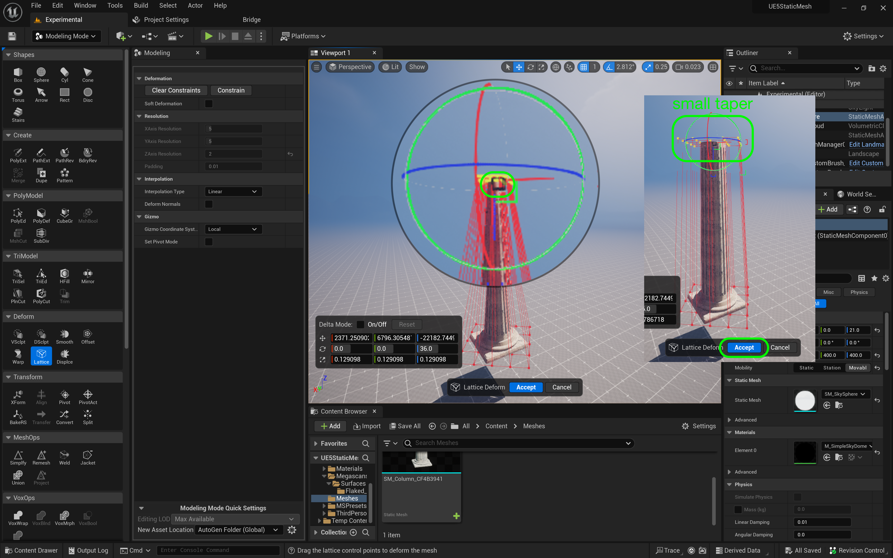

### Basic Column III

[previous](../basic-column-ii/README.md#user-content-basic-column-ii) • [home](../README.md#user-content-ue5-intro-to-static-meshes) • [next](../basic-column-iv/README.md#user-content-basic-column-iv)

Finish up the column.

 

---

##### `Step 1.`\|`ITSM`|:small_blue_diamond:

Select the **Tri Model | Pln Cut** (Plane Cut) tool.  Press **Flip Plane** if necessary to cut off top third of the squished sphere. Press the <kbd>Accept</kbd> button.

##### `Step 2.`\|`ITSM`|:small_blue_diamond: :small_blue_diamond: 

Reselect **Tri Model | Pln Cut** and **flip the plane** then repeat this by taking off an equal size chunk from the bottom.  We should end up with what looks like a round of cheese.

##### `Step 3.`\|`ITSM`|:small_blue_diamond: :small_blue_diamond: :small_blue_diamond:

Select both pieces and then select **Transform | Align** and realign along the **X** and **Y** axis.  Press the <kbd>Accept</kbd> button. 

##### `Step 4.`\|`ITSM`|:small_blue_diamond: :small_blue_diamond: :small_blue_diamond: :small_blue_diamond:

Now we need to cut out the portion of the sphere that we will not see and use the column to cut it.  Align the column so it is just colliding with the stone (using the snap to grid tool set to `1`). Go into the **Right** orthoganal view and line it up carefully.

##### `Step 5.`\|`ITSM`| :small_orange_diamond:

Select the column first then the disc.  Press the **PolyModel | MeshBool** mode and set the **Operation** to `Difference B-A` and set **Handle Inputs** to `Keep Inputs`. Press the <kbd>Accept</kbd> button. Now notice that it has cut a hole out of the disc so we have no internal polygons when inside our column.

##### `Step 6.`\|`ITSM`| :small_orange_diamond: :small_blue_diamond:

 Make sure the new bottom piece is still touching and is in the same place as when you perfomed the bool operation and select the large column first then the small bottom piece second.  Press the **Create | MshMrg** button. Make sure **Write To** is set to `From Input Object` and **Hanlde Inputs** is set to `Delete Inputs`.  Press the <kbd>Accept</kbd> button.

Now you have the same issue with an additional material and we want to only have one. Since this was one disc before it is in its own poly group.  You can change the **Selection Mode** to `All Connected` and select this new area in one mouse click. Now go to **Attributes | MatEd** and select the untextured material, press the first material and then the <kbd>Assign Active Material</kbd> button.  Delete the dangling empty material so you only have one. 

##### `Step 7.`\|`ITSM`| :small_orange_diamond: :small_blue_diamond: :small_blue_diamond:

Now we will create a box that the pillar can sit on at the bottom. This will be the very bottom so we need to remove the bottom of the disc shape we just created. 

##### `Step 8.`\|`ITSM`| :small_orange_diamond: :small_blue_diamond: :small_blue_diamond: :small_blue_diamond:

Now we will create a box that the pillar can sit on at the bottom.  Go to the **Top** view and make sure you are in **Wireframe**.  Now selet **Create | Box**.  Set **Align to Normal** to `false`. Make it a size that extends over the border of the spherical bottom. I selected a **Width** and **Depth** of `185` with a height of `20` cm.  Press the <kbd>Accept</kbd> button.

##### `Step 9.`\|`ITSM`| :small_orange_diamond: :small_blue_diamond: :small_blue_diamond: :small_blue_diamond: :small_blue_diamond:

Press the left mouse button to place it and save it in the **Meshes** folder as `DeleteMe4` (I had taken a few attempts at the disc so I am at DeleteMe4 but you can use DeleteMe3 if you want). Press the <kbd>Save</kbd> button.

##### `Step 10.`\|`ITSM`| :large_blue_diamond:

Go to **Poly Edit** mode and select all 4 top **Edges** of the box shape.  To make it easier you can allow **ONLY** the selection of edges by turning off the **Select Vertices** and **Select Faces** buttons. Leave just the **Edge** button. Press the <kbd>Bevel</kbd> button.

##### `Step 11.`\|`ITSM`| :large_blue_diamond: :small_blue_diamond: 

Now all you have to do is adjust the **Bevel Distance** to add a bevel of a certain amount.  Pick a number that looks good to you then press the <kbd>Accept</kbd> button.

##### `Step 12.`\|`ITSM`| :large_blue_diamond: :small_blue_diamond: :small_blue_diamond: 

Repeat this by adding a smaller bevel to all four corners and eight edges. Press the <kbd>Bevel</kbd> button and I selected `3` for a smaller bevel on the sides.

##### `Step 13.`\|`ITSM`| :large_blue_diamond: :small_blue_diamond: :small_blue_diamond:  :small_blue_diamond: 

Now we need to cut out the portion of the cube that we are not going to see.  Move the column to be just one below the cube so it penetrates it. Select the column then the cube and select **PolyModel | MshBool**.  Change the **Operation** to `Difference B - A` and set **Handle Inputs** to `Keep Inputs`.  Press the <kbd>Accept</kbd> button and you will see the hole is now cut out and the pieces fit together with no stray triangles inside the column.

##### `Step 14.`\|`ITSM`| :large_blue_diamond: :small_blue_diamond: :small_blue_diamond: :small_blue_diamond:  :small_blue_diamond: 

Now apply a mesh merge to the selected column then bottom box.  Fix up the materials so that they share the same one material as before.

##### `Step 15.`\|`ITSM`| :large_blue_diamond: :small_orange_diamond: 

Now it is possible that the engine might crash as these are new tools.  So it is a good idea to select **File | Save All** after each step.

##### `Step 16.`\|`ITSM`| :large_blue_diamond: :small_orange_diamond:   :small_blue_diamond: 

Go to your **Content Browser** and delete the extraneous meshes that you named with **DeleteMeX**. Right click on the **Meshes** folder and select **Fix Up Redirectors**.

##### `Step 17.`\|`ITSM`| :large_blue_diamond: :small_orange_diamond: :small_blue_diamond: :small_blue_diamond:

Now our column is symmetrical.  These columns all had a taper and went from thick at the bottom to thinner at the top.

##### `Step 18.`\|`ITSM`| :large_blue_diamond: :small_orange_diamond: :small_blue_diamond: :small_blue_diamond: :small_blue_diamond:

Select the **Lattice Deform** tool and make sure the **ZAxis Resolution** is set to `2`.  We will be tapering from top to bottom!

##### `Step 19.`\|`ITSM`| :large_blue_diamond: :small_orange_diamond: :small_blue_diamond: :small_blue_diamond: :small_blue_diamond: :small_blue_diamond:

Select all the points at the top. Scale the **X** and the **Y** axis to taper the column. You need to select the scalar box which sometimes is hidden and hard to select.  If it is not tapering and expanding you have not selected the correct par t of the gizmo. When you are happy, press the <kbd>Accept</kbd> button.  Now you will see that it looks more like a proper column!

<!--  -->

| [previous](../basic-column-ii/README.md#user-content-basic-column-ii)| [home](../README.md#user-content-ue5-intro-to-static-meshes) | [next](../basic-column-iv/README.md#user-content-basic-column-iv)|
|---|---|---|
