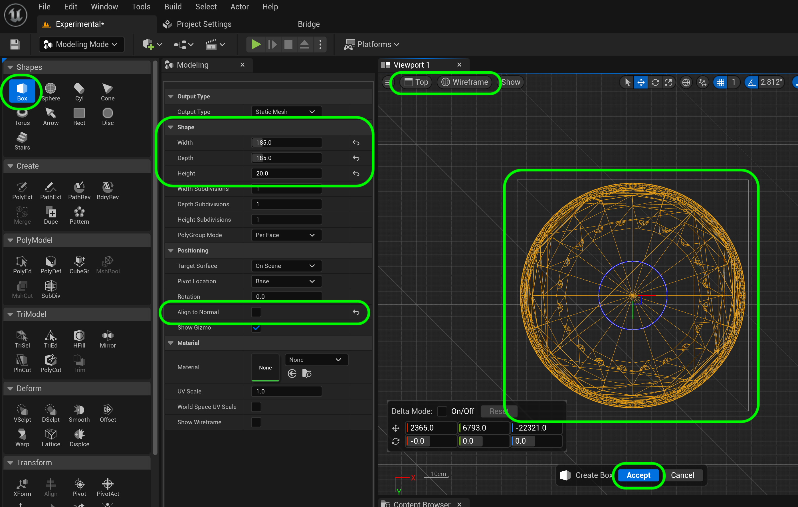

### Basic Column III

[previous](../basic-column-ii/README.md#user-content-basic-column-ii) • [home](../README.md#user-content-ue4-static-meshes) • [next](../basic-column/README.md#)

Chapter introduction here.

 

---

##### `Step 1.`\|`ITSM`|:small_blue_diamond:

Now we will create a box that the pillar can sit on at the bottom.  Go to the **Top** view and make sure you are in **Wireframe**.  Now selet **Create | Box**.  Make it a size that extends over the border of the spherical bottom. I selected a **Width** and **Depth** of `190` with a height of `20` cm.  

##### `Step 2.`\|`ITSM`|:small_blue_diamond: :small_blue_diamond: 

Press the left mouse button to place it and save it in the **Meshes** folder as `DeleteMe4`.

##### `Step 3.`\|`ITSM`|:small_blue_diamond: :small_blue_diamond: :small_blue_diamond:

Go to **Poly Edit** mode and select all the top **Edges** of the box shape.  Press the <kbd>Bevel</kbd> button.

##### `Step 4.`\|`ITSM`|:small_blue_diamond: :small_blue_diamond: :small_blue_diamond: :small_blue_diamond:

Now all you have to do is adjust the **Bevel Distance** to add a bevel of a certain amount.  Pick a number that looks good to you then press the <kbd>Accept</kbd> button.

##### `Step 5.`\|`ITSM`| :small_orange_diamond:

Repeat this by adding a bevel to all four corners.

##### `Step 6.`\|`ITSM`| :small_orange_diamond: :small_blue_diamond:

##### `Step 7.`\|`ITSM`| :small_orange_diamond: :small_blue_diamond: :small_blue_diamond:

##### `Step 8.`\|`ITSM`| :small_orange_diamond: :small_blue_diamond: :small_blue_diamond: :small_blue_diamond:

##### `Step 9.`\|`ITSM`| :small_orange_diamond: :small_blue_diamond: :small_blue_diamond: :small_blue_diamond: :small_blue_diamond:

##### `Step 10.`\|`ITSM`| :large_blue_diamond:

##### `Step 11.`\|`ITSM`| :large_blue_diamond: :small_blue_diamond: 

##### `Step 12.`\|`ITSM`| :large_blue_diamond: :small_blue_diamond: :small_blue_diamond: 

##### `Step 13.`\|`ITSM`| :large_blue_diamond: :small_blue_diamond: :small_blue_diamond:  :small_blue_diamond: 

##### `Step 14.`\|`ITSM`| :large_blue_diamond: :small_blue_diamond: :small_blue_diamond: :small_blue_diamond:  :small_blue_diamond: 

##### `Step 15.`\|`ITSM`| :large_blue_diamond: :small_orange_diamond: 

##### `Step 16.`\|`ITSM`| :large_blue_diamond: :small_orange_diamond:   :small_blue_diamond: 

##### `Step 17.`\|`ITSM`| :large_blue_diamond: :small_orange_diamond: :small_blue_diamond: :small_blue_diamond:

##### `Step 18.`\|`ITSM`| :large_blue_diamond: :small_orange_diamond: :small_blue_diamond: :small_blue_diamond: :small_blue_diamond:

##### `Step 19.`\|`ITSM`| :large_blue_diamond: :small_orange_diamond: :small_blue_diamond: :small_blue_diamond: :small_blue_diamond: :small_blue_diamond:

##### `Step 20.`\|`ITSM`| :large_blue_diamond: :large_blue_diamond:

##### `Step 21.`\|`ITSM`| :large_blue_diamond: :large_blue_diamond: :small_blue_diamond:

Finish off the bottom of the pillar.

<!--  -->

| [previous](../basic-column-ii/README.md#user-content-basic-column-ii)| [home](../README.md#user-content-ue4-static-meshes) | [next](../)|
|---|---|---|
