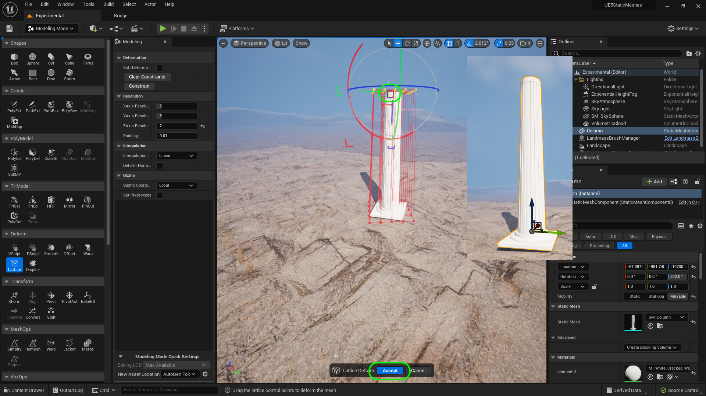

### Basic Column III

[previous](../basic-column-ii/README.md#user-content-basic-column-ii) • [home](../README.md#user-content-ue4-static-meshes) • [next](../basic-column/README.md#)

Chapter introduction here.

 

---

##### `Step 1.`\|`ITSM`|:small_blue_diamond:

Now we will create a box that the pillar can sit on at the bottom.  Go to the **Top** view and make sure you are in **Wireframe**.  Now selet **Create | Box**.  Make it a size that extends over the border of the spherical bottom. I selected a **Width** and **Depth** of `190` with a height of `20` cm.  

##### `Step 2.`\|`ITSM`|:small_blue_diamond: :small_blue_diamond: 

Press the left mouse button to place it and save it in the **Meshes** folder as `DeleteMe4`. Press the <kbd>Save</kbd> button.

##### `Step 3.`\|`ITSM`|:small_blue_diamond: :small_blue_diamond: :small_blue_diamond:

Go to **Poly Edit** mode and select all the top **Edges** of the box shape.  Press the <kbd>Bevel</kbd> button.

##### `Step 4.`\|`ITSM`|:small_blue_diamond: :small_blue_diamond: :small_blue_diamond: :small_blue_diamond:

Now all you have to do is adjust the **Bevel Distance** to add a bevel of a certain amount.  Pick a number that looks good to you then press the <kbd>Accept</kbd> button.

##### `Step 5.`\|`ITSM`| :small_orange_diamond:

Repeat this by adding a smaller bevel to all four corners.

##### `Step 6.`\|`ITSM`| :small_orange_diamond: :small_blue_diamond:

Now apply a mesh merge to the selected column then bottom box.  Fix up the materials so that they share the same one material as before.

##### `Step 7.`\|`ITSM`| :small_orange_diamond: :small_blue_diamond: :small_blue_diamond:

Now it is possible that the engine might crash as these are new tools.  So it is a good idea to select **File | Save All** after each step.

##### `Step 8.`\|`ITSM`| :small_orange_diamond: :small_blue_diamond: :small_blue_diamond: :small_blue_diamond:

Got to your **Content Browser** and delete the extraneous meshes that you named with **DeleteMeX**. Right click on the **Meshes** folder and select **Fix Up Redirectors ????**.

##### `Step 9.`\|`ITSM`| :small_orange_diamond: :small_blue_diamond: :small_blue_diamond: :small_blue_diamond: :small_blue_diamond:

Now our column is symmetrical.  These columns all had a taper and went from thick at the bottom to thinner at the top.

##### `Step 10.`\|`ITSM`| :large_blue_diamond:

Select the **Lattice Deform** tool and make sure the **ZAxis Resolution** is set to `2`.  We will be tapering from top to bottom!

##### `Step 11.`\|`ITSM`| :large_blue_diamond: :small_blue_diamond: 

Scale the **X** and the **Y** axis to taper the column.  When you are happy, press the <kbd>Accept</kbd> button.  Now you will see that it looks more like a proper column!

##### `Step 12.`\|`ITSM`| :large_blue_diamond: :small_blue_diamond: :small_blue_diamond: 

Now lets creat the box on top of the column that supports the ceiling pieces.  Go to the **Top** view and make sure you are in **Wireframe** render mode and select a size that works best for you. The one I used ended up a bit large which I will fix later.

##### `Step 13.`\|`ITSM`| :large_blue_diamond: :small_blue_diamond: :small_blue_diamond:  :small_blue_diamond: 

Now left click to place the mesh and save it in **Meshes** as `DeleteMe`.

##### `Step 14.`\|`ITSM`| :large_blue_diamond: :small_blue_diamond: :small_blue_diamond: :small_blue_diamond:  :small_blue_diamond: 

Now I want to have rounded corners on this box.  We can do this by adding 4 edge loops to the shape.  The further the edge loop is away from the corner the greater the rounding of the corner.  The closer the less rounding happens on the edge.  So go to **PolyEd** and select the <kbd>Insert Edge Loop </kbd>button.  Add them with the large rounded area at the bottom.  It should look like the image below...

When you are happy press the <kbd>Accept</kbd> button.

##### `Step 15.`\|`ITSM`| :large_blue_diamond: :small_orange_diamond: 

Now this is where the magic happens.

##### `Step 16.`\|`ITSM`| :large_blue_diamond: :small_orange_diamond:   :small_blue_diamond: 

##### `Step 17.`\|`ITSM`| :large_blue_diamond: :small_orange_diamond: :small_blue_diamond: :small_blue_diamond:

##### `Step 18.`\|`ITSM`| :large_blue_diamond: :small_orange_diamond: :small_blue_diamond: :small_blue_diamond: :small_blue_diamond:

##### `Step 19.`\|`ITSM`| :large_blue_diamond: :small_orange_diamond: :small_blue_diamond: :small_blue_diamond: :small_blue_diamond: :small_blue_diamond:

##### `Step 20.`\|`ITSM`| :large_blue_diamond: :large_blue_diamond:

##### `Step 21.`\|`ITSM`| :large_blue_diamond: :large_blue_diamond: :small_blue_diamond:

Finish off the bottom of the pillar.

<!--  -->

| [previous](../basic-column-ii/README.md#user-content-basic-column-ii)| [home](../README.md#user-content-ue4-static-meshes) | [next](../)|
|---|---|---|
