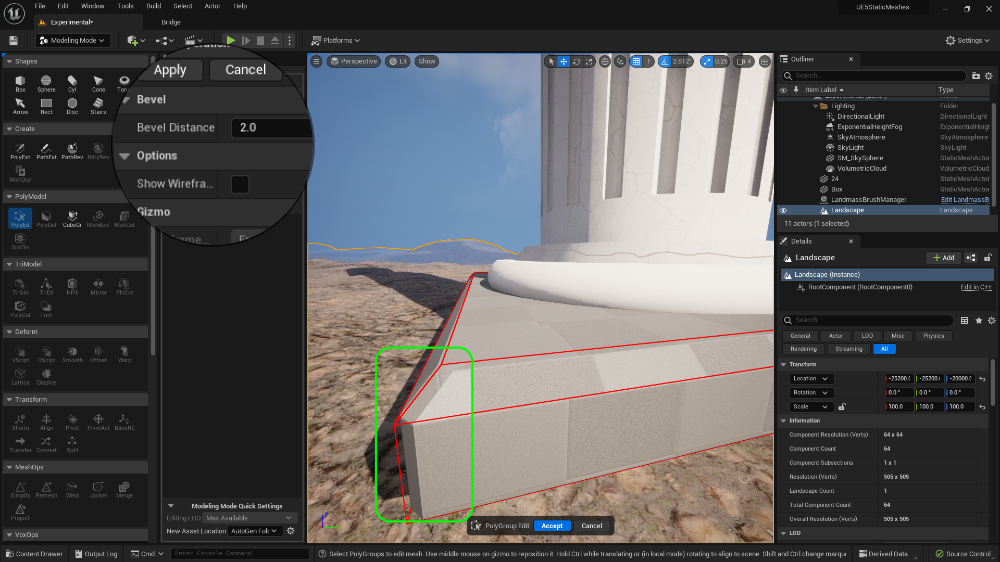

### Basic Column III

[previous](../basic-column-ii/README.md#user-content-basic-column-ii) • [home](../README.md#user-content-ue5-intro-to-static-meshes) • [next](../collisions/README.md#user-content-collisions)

Finish up the column.

 

---

##### `Step 1.`\|`ITSM`|:small_blue_diamond:

Select the **Tri Model | Pln Cut** (Plane Cut) tool.  Press **Flip Plane** if necessary to cut off top third of the squished sphere. Press the <kbd>Accept</kbd> button.

##### `Step 2.`\|`ITSM`|:small_blue_diamond: :small_blue_diamond: 

Reselect **Tri Model | Pln Cut** and **flip the plane** then repeat this by taking off an equal size chunk from the bottom.  We should end up with what looks like a round of cheese.

##### `Step 3.`\|`ITSM`|:small_blue_diamond: :small_blue_diamond: :small_blue_diamond:

Select both pieces and then select **Transform | Align** and realign along the **X** and **Y** axis.  Press the <kbd>Accept</kbd> button. 

##### `Step 4.`\|`ITSM`|:small_blue_diamond: :small_blue_diamond: :small_blue_diamond: :small_blue_diamond:

Now we need to cut out the portion of the sphere that we will not see and use the column to cut it.  Align the column so it is just colliding with the stone (using the snap to grid tool set to `1`). Go into the **Right** orthoganal view and line it up carefully.

##### `Step 5.`\|`ITSM`| :small_orange_diamond:

Select the column first then the disc.  Press the **PolyModel | MeshBool** mode and set the **Operation** to `Difference B-A` and set **Handle Inputs** to `Keep Inputs`. Press the <kbd>Accept</kbd> button. Now notice that it has cut a hole out of the disc so we have no internal polygons when inside our column.

##### `Step 6.`\|`ITSM`| :small_orange_diamond: :small_blue_diamond:

 Make sure the new bottom piece is still touching and is in the same place as when you perfomed the bool operation and select the large column first then the small bottom piece second.  Press the **Create | MshMrg** button. Make sure **Write To** is set to `From Input Object` and **Hanlde Inputs** is set to `Delete Inputs`.  Press the <kbd>Accept</kbd> button.

Now you have the same issue with an additional material so go to **Attributes | MatEd** and select the unchosen material, press the first material and then the <kbd>Assign Active Material</kbd> button.  Delete the dangling empty material so you only have one.

##### `Step 7.`\|`ITSM`| :small_orange_diamond: :small_blue_diamond: :small_blue_diamond:

Now we will create a box that the pillar can sit on at the bottom.  Go to the **Top** view and make sure you are in **Wireframe**.  Now selet **Create | Box**.  Make it a size that extends over the border of the spherical bottom. I selected a **Width** and **Depth** of `190` with a height of `20` cm.  

Press the left mouse button to place it and save it in the **Meshes** folder as `DeleteMe4`. Press the <kbd>Save</kbd> button.

Go to **Poly Edit** mode and select all 4 top **Edges** of the box shape.  To make it easier you can allow **ONLY** the selection of edges by turning **Select Vertices** and **Select Faces** `off`. Press the <kbd>Bevel</kbd> button.

Now all you have to do is adjust the **Bevel Distance** to add a bevel of a certain amount.  Pick a number that looks good to you then press the <kbd>Accept</kbd> button.

Repeat this by adding a smaller bevel to all four corners.

Now apply a mesh merge to the selected column then bottom box.  Fix up the materials so that they share the same one material as before.

Now it is possible that the engine might crash as these are new tools.  So it is a good idea to select **File | Save All** after each step.

##### `Step 8.`\|`ITSM`| :small_orange_diamond: :small_blue_diamond: :small_blue_diamond: :small_blue_diamond:

Got to your **Content Browser** and delete the extraneous meshes that you named with **DeleteMeX**. Right click on the **Meshes** folder and select **Fix Up Redirectors ????**.

##### `Step 9.`\|`ITSM`| :small_orange_diamond: :small_blue_diamond: :small_blue_diamond: :small_blue_diamond: :small_blue_diamond:

Now our column is symmetrical.  These columns all had a taper and went from thick at the bottom to thinner at the top.

##### `Step 10.`\|`ITSM`| :large_blue_diamond:

Select the **Lattice Deform** tool and make sure the **ZAxis Resolution** is set to `2`.  We will be tapering from top to bottom!

##### `Step 11.`\|`ITSM`| :large_blue_diamond: :small_blue_diamond: 

Scale the **X** and the **Y** axis to taper the column.  When you are happy, press the <kbd>Accept</kbd> button.  Now you will see that it looks more like a proper column!

##### `Step 12.`\|`ITSM`| :large_blue_diamond: :small_blue_diamond: :small_blue_diamond: 

Now lets creat the box on top of the column that supports the ceiling pieces.  Go to the **Top** view and make sure you are in **Wireframe** render mode and select a size that works best for you. The one I used ended up a bit large which I will fix later.

##### `Step 13.`\|`ITSM`| :large_blue_diamond: :small_blue_diamond: :small_blue_diamond:  :small_blue_diamond: 

Now left click to place the mesh and save it in **Meshes** as `DeleteMe`.

##### `Step 14.`\|`ITSM`| :large_blue_diamond: :small_blue_diamond: :small_blue_diamond: :small_blue_diamond:  :small_blue_diamond: 

Now I want to have rounded corners on this box.  We can do this by adding 4 edge loops to the shape.  The further the edge loop is away from the corner the greater the rounding of the corner.  The closer the less rounding happens on the edge.  So go to **PolyEd** and select the <kbd>Insert Edge Loop </kbd>button.  Add them with the large rounded area at the bottom.  It should look like the image below...

When you are happy press the <kbd>Accept</kbd> button.

##### `Step 15.`\|`ITSM`| :large_blue_diamond: :small_orange_diamond: 

Now this is where the magic happens. Select the **SubDiv** (Sub Division) tool and in **Wireframe** mode select how many subdivisions you want.  I set my **Subdivision Level** to `3`.  Look at the image as a lit perspective and you will see that all the edges are now rounded based on the location of your edge loops. When you are happy press the <kbd>Accept</kbd> button.

##### `Step 16.`\|`ITSM`| :large_blue_diamond: :small_orange_diamond:   :small_blue_diamond: 

Move the new rounded box to the top of the column and **Align** it on the **X** and **Y** axis so they are perfectly centered. Press the <kbd>Accept</kbd> button.

##### `Step 17.`\|`ITSM`| :large_blue_diamond: :small_orange_diamond: :small_blue_diamond: :small_blue_diamond:

Now we will perform our final merge and clean up the materials so there is one slot with one color.

##### `Step 18.`\|`ITSM`| :large_blue_diamond: :small_orange_diamond: :small_blue_diamond: :small_blue_diamond: :small_blue_diamond:

That is it for the base modeling.  We could have done so much more but we have looked at many of the common and useful tools in UE5's modeling package so I think this is good enough.  Next up lets look at it as an interactive model in the game.

##### `Step 19.`\|`ITSM`| :large_blue_diamond: :small_orange_diamond: :small_blue_diamond: :small_blue_diamond: :small_blue_diamond: :small_blue_diamond:
Select the **File | Save All** then press the <kbd>Source Control</kbd> button and select **Submit Content**.  If you are prompted, select **Check Out** for all items that are not checked out of source control. Update the **Changelist Description** message and with the latest changes. Make sure all the files are correct and press the <kbd>Submit</kbd> button. A confirmation will pop up on the bottom right with a message about a changelist was submitted with a commit number.

<!--  -->

| [previous](../basic-column-ii/README.md#user-content-basic-column-ii)| [home](../README.md#user-content-ue5-intro-to-static-meshes) | [next](../collisions/README.md#user-content-collisions)|
|---|---|---|
