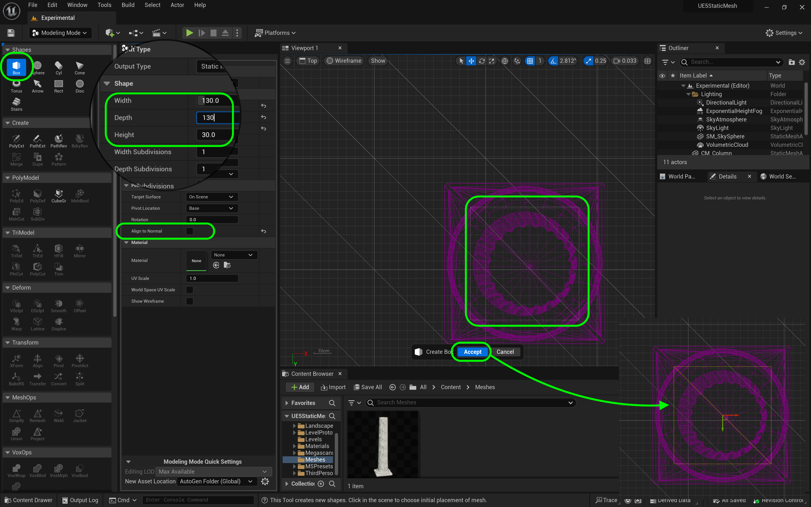
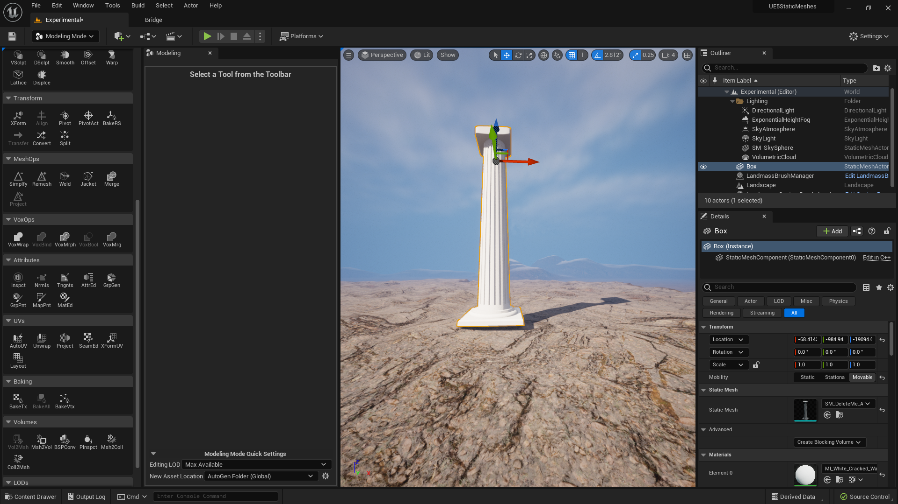
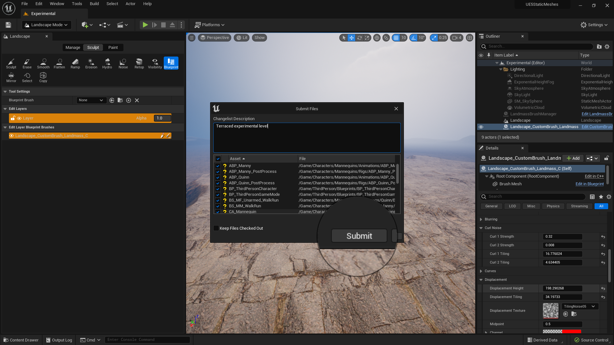

### Basic Column IV

[previous](../basic-column-iii/README.md#user-content-basic-column-iii) • [home](../README.md#user-content-ue5-intro-to-static-meshes) • [next](../collisions/README.md#user-content-collisions)

Lets complete the pillar by adding a final piece on top that would support a beam so it can lie flat.

 

---

##### `Step 1.`\|`ITSM`|:small_blue_diamond:

Now lets create the box on top of the column that supports the ceiling/beam.  Go to the **Top** view and make sure you are in **Wireframe** render mode and select a size that works best for you. Pick a **Shapes | Box** tool with a **Width** and **Depth** of `130` and a **Height** of `30`.  Make sure **Align to Normal** is set to `false`. This is just larger that the top ring which is what I am looking for.

##### `Step 2.`\|`ITSM`|:small_blue_diamond: :small_blue_diamond: 

Now left click to place the mesh and save it in **Meshes** as `DeleteMe`.

##### `Step 3.`\|`ITSM`|:small_blue_diamond: :small_blue_diamond: :small_blue_diamond:

Lets remove the top of the column as we need to cut a hole to join with the box on top.  

##### `Step 4.`\|`ITSM`|:small_blue_diamond: :small_blue_diamond: :small_blue_diamond: :small_blue_diamond:

Now I want to have rounded corners on this box.  We can do this by adding 4 edge loops to the shape.  The further the edge loop is away from the corner the greater the rounding of the corner.  The closer the less rounding happens on the edge.  So go to **PolyEd** and select the <kbd>Insert Edge Loop </kbd>button.  Add them with the large rounded area at the bottom.  It should look like the image below...

When you are happy press the <kbd>Accept</kbd> button.

Now this is where the magic happens. Select the **SubDiv** (Sub Division) tool and in **Wireframe** mode select how many subdivisions you want.  I set my **Subdivision Level** to `3`.  Look at the image as a lit perspective and you will see that all the edges are now rounded based on the location of your edge loops. When you are happy press the <kbd>Accept</kbd> button.

##### `Step 5.`\|`ITSM`| :small_orange_diamond:

Move the new rounded box to the top of the column and **Align** it on the **X** and **Y** axis so they are perfectly centered. Press the <kbd>Accept</kbd> button.

##### `Step 6.`\|`ITSM`| :small_orange_diamond: :small_blue_diamond:

Now we will perform our final merge and clean up the materials so there is one slot with one color.

##### `Step 7.`\|`ITSM`| :small_orange_diamond: :small_blue_diamond: :small_blue_diamond:

That is it for the base modeling.  We could have done so much more but we have looked at many of the common and useful tools in UE5's modeling package so I think this is good enough.  Next up lets look at it as an interactive model in the game.

##### `Step 8.`\|`ITSM`| :small_orange_diamond: :small_blue_diamond: :small_blue_diamond: :small_blue_diamond:

Select the **File | Save All** then press the <kbd>Source Control</kbd> button and select **Submit Content**.  If you are prompted, select **Check Out** for all items that are not checked out of source control. Update the **Changelist Description** message and with the latest changes. Make sure all the files are correct and press the <kbd>Submit</kbd> button. A confirmation will pop up on the bottom right with a message about a changelist was submitted with a commit number.

##### `Step 9.`\|`ITSM`| :small_orange_diamond: :small_blue_diamond: :small_blue_diamond: :small_blue_diamond: :small_blue_diamond:

##### `Step 10.`\|`ITSM`| :large_blue_diamond:

##### `Step 11.`\|`ITSM`| :large_blue_diamond: :small_blue_diamond: 

##### `Step 12.`\|`ITSM`| :large_blue_diamond: :small_blue_diamond: :small_blue_diamond: 

##### `Step 13.`\|`ITSM`| :large_blue_diamond: :small_blue_diamond: :small_blue_diamond:  :small_blue_diamond: 

##### `Step 14.`\|`ITSM`| :large_blue_diamond: :small_blue_diamond: :small_blue_diamond: :small_blue_diamond:  :small_blue_diamond: 

##### `Step 15.`\|`ITSM`| :large_blue_diamond: :small_orange_diamond: 

##### `Step 16.`\|`ITSM`| :large_blue_diamond: :small_orange_diamond:   :small_blue_diamond: 

##### `Step 17.`\|`ITSM`| :large_blue_diamond: :small_orange_diamond: :small_blue_diamond: :small_blue_diamond:

##### `Step 18.`\|`ITSM`| :large_blue_diamond: :small_orange_diamond: :small_blue_diamond: :small_blue_diamond: :small_blue_diamond:

##### `Step 19.`\|`ITSM`| :large_blue_diamond: :small_orange_diamond: :small_blue_diamond: :small_blue_diamond: :small_blue_diamond: :small_blue_diamond:

##### `Step 20.`\|`ITSM`| :large_blue_diamond: :large_blue_diamond:

##### `Step 21.`\|`ITSM`| :large_blue_diamond: :large_blue_diamond: :small_blue_diamond:

<!--  -->

| [previous](../basic-column-iii/README.md#user-content-basic-column-iii)| [home](../README.md#user-content-ue5-intro-to-static-meshes) | [next](../collisions/README.md#user-content-collisions)|
|---|---|---|
