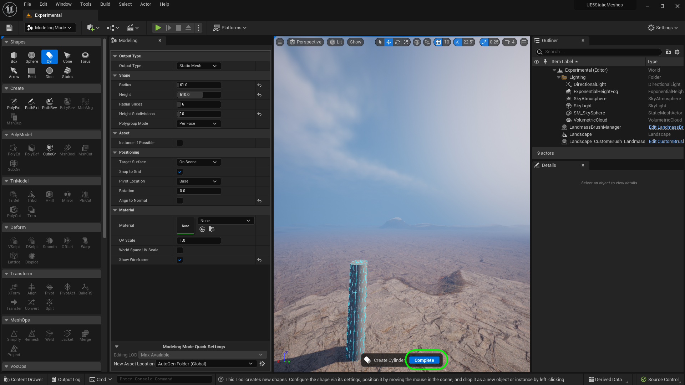

### Basic Column

We will make a **Greco Roman** style column.  It will have flutes and a base for the ground and the top to hold a load.

 

---

##### `Step 1.`\|`ITSM`|:small_blue_diamond:

Lets start by opening up **File | Project Settings**.  Select **Plugins - Modeling Mode** and select the **Asset Generation Mode** to be `Interactive Prompt to Save` and **Asset Generation Location** to `Auto Generated Global Asset Path`.  This way it will not add an asset without prompting you to save it first.  Also create a new **Folder** called `Meshes`.

##### `Step 2.`\|`ITSM`|:small_blue_diamond: :small_blue_diamond: 

We will use this as a starting point which is an 1849 etching. We will start with the column section then include 20 flutes.

##### `Step 3.`\|`ITSM`|:small_blue_diamond: :small_blue_diamond: :small_blue_diamond:

Enter into **Modeling** mode and select the **Cyl** (Cylinder) shape and lets give it a radius of `61` cm (2') and height of `610` cm (20'). This will be roughly two stories tall.  We can then think for a more complex environment to surround it after the fact. Do not press the **Complete** button yet.

##### `Step 4.`\|`ITSM`|:small_blue_diamond: :small_blue_diamond: :small_blue_diamond: :small_blue_diamond:

Set **Show Wireframe** to `true`.  Now the faces along the vertical axis are very long.  We want to have the faces sort of match how the object is constructed.  Now these pillars were not carved into one piece of stone, they were equally sized rounds stacked on top of each other.  A common number was ten.  We lets subdivide the height by setting the **Height Subdivision** to `10`.  Now you see that it splits a face for each of the pieces. Do not press the **Complete** button yet.

##### `Step 5.`\|`ITSM`| :small_orange_diamond:

The pillars in the Acropolis had 20 flutes.  So we will set the **Radial Slices** to `20`.  This will split up the sections like 20 pizza slices in the circle with each representing a polygon.

Set **Align to Normal** to `false`. This way the column will be straight up and down and it won't rotate it to match the landscape normal.

Do not press the **Complete** button yet.

##### `Step 6.`\|`ITSM`| :small_orange_diamond: :small_blue_diamond:

Now left click and place the column in the middle of your platform in the level. It will automatically bring up the save menu and select the **Meshes** folder and call the mesh `SM_Column` and then press the <kbd>Save</kbd> button.

##### `Step 7.`\|`ITSM`| :small_orange_diamond: :small_blue_diamond: :small_blue_diamond:

Now sometimes it asks me to save it again, I just hit cancel.  I then hit the <kbd>Complete</kbd> button. 

##### `Step 8.`\|`ITSM`| :small_orange_diamond: :small_blue_diamond: :small_blue_diamond: :small_blue_diamond:

Why is it round, and why do we not see 20 flat pieces forming 20 flat sides?  This is because the light and how it is picked up is determined by a normal.  This vector is a unit legth of 1 and is normally perpendicular to the plane.  This indicates the direction that light bounces off of it.

##### `Step 9.`\|`ITSM`| :small_orange_diamond: :small_blue_diamond: :small_blue_diamond: :small_blue_diamond: :small_blue_diamond:

Now if you click on the model and go to **Attributes | Inspct** and turn **Normal Vectors* to `true` you will see one normal for the edge instead of two perpendicular nomras.  This means that the light will respond at an angle that is NOT perpendicular to the faces and will replicate light around a smooth surface. It gives the illusion that we are looking at a round pole most of the time.  

##### `Step 10.`\|`ITSM`| :large_blue_diamond:

Now we can change this and make it flat faces.  Go to **Attributes | Nrmls** (Normals) and change 

##### `Step 11.`\|`ITSM`| :large_blue_diamond: :small_blue_diamond: 

##### `Step 12.`\|`ITSM`| :large_blue_diamond: :small_blue_diamond: :small_blue_diamond: 

##### `Step 13.`\|`ITSM`| :large_blue_diamond: :small_blue_diamond: :small_blue_diamond:  :small_blue_diamond: 

##### `Step 14.`\|`ITSM`| :large_blue_diamond: :small_blue_diamond: :small_blue_diamond: :small_blue_diamond:  :small_blue_diamond: 

##### `Step 15.`\|`ITSM`| :large_blue_diamond: :small_orange_diamond: 

##### `Step 16.`\|`ITSM`| :large_blue_diamond: :small_orange_diamond:   :small_blue_diamond: 

##### `Step 17.`\|`ITSM`| :large_blue_diamond: :small_orange_diamond: :small_blue_diamond: :small_blue_diamond:

##### `Step 18.`\|`ITSM`| :large_blue_diamond: :small_orange_diamond: :small_blue_diamond: :small_blue_diamond: :small_blue_diamond:

##### `Step 19.`\|`ITSM`| :large_blue_diamond: :small_orange_diamond: :small_blue_diamond: :small_blue_diamond: :small_blue_diamond: :small_blue_diamond:

##### `Step 20.`\|`ITSM`| :large_blue_diamond: :large_blue_diamond:

##### `Step 21.`\|`ITSM`| :large_blue_diamond: :large_blue_diamond: :small_blue_diamond:

<!--  -->

| [previous](../)| [home](../README.md#user-content-ue4-static-meshes) | [next](../)|
|---|---|---|
