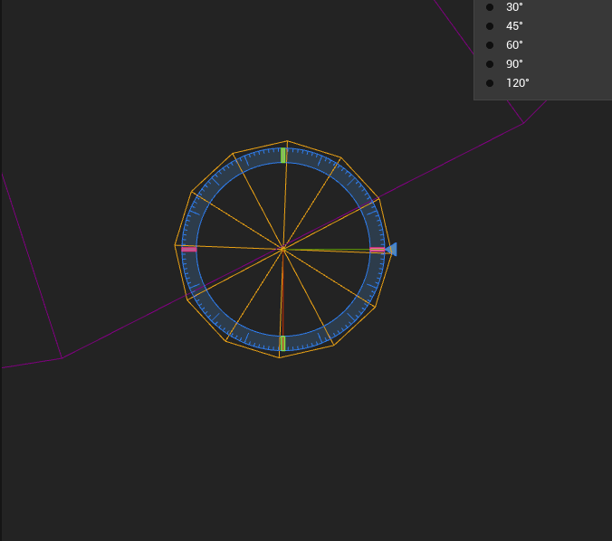
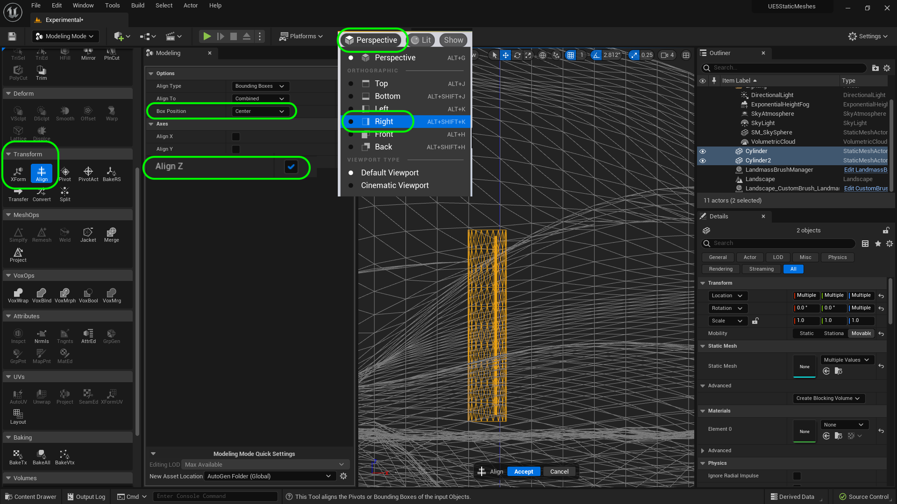

### Basic Column

[previous](../lexicon/README.md#user-content-3-d-lexicon) • [home](../README.md#user-content-ue5-intro-to-static-meshes) • [next](../basic-column-ii/README.md#user-content-basic-column-ii)

We will make a **Greco Roman** style column.  It will have flutes and a base for the ground and the top to hold a load.

 

---

##### `Step 1.`\|`ITSM`|:small_blue_diamond:

Lets start by opening up **File | Project Settings**.  Select **Plugins - Modeling Mode** and select the **Asset Generation Mode** to be `Interactive Prompt to Save` and **Asset Generation Location** to `Auto Generated Global Asset Path`.  This way it will not add an asset without prompting you to save it first.  Also create a new **Folder** called `Meshes`.

##### `Step 2.`\|`ITSM`|:small_blue_diamond: :small_blue_diamond: 

We will use this as a starting point which is an 1849 etching. We will start with the column section then include 20 flutes.

##### `Step 3.`\|`ITSM`|:small_blue_diamond: :small_blue_diamond: :small_blue_diamond:

Enter into **Modeling** mode and select the **Cyl** (Cylinder) shape and lets give it a radius of `61` cm (2') and height of `610` cm (20'). This will be roughly two stories tall.  We can then think for a more complex environment to surround it after the fact. Do not press the **Complete** button yet.

##### `Step 4.`\|`ITSM`|:small_blue_diamond: :small_blue_diamond: :small_blue_diamond: :small_blue_diamond:

Now the column is horizontal to the ground as it is perpendicular to the normals in the ground plane. Set **Align to Normal** to `false`. This way the column will be straight up and down and it won't rotate it to match the landscape normal.

Do not press the **Complete** button yet.

##### `Step 5.`\|`ITSM`| :small_orange_diamond:

Set **Show Wireframe** to `true`.  Now the faces along the vertical axis are very long.  We want to have the faces sort of match how the object is constructed.  Now these pillars were not carved into one piece of stone, they were equally sized rounds stacked on top of each other.  A common number was ten.  We lets subdivide the height by setting the **Height Subdivision** to `10`.  Now you see that it splits a face for each of the pieces. Do not press the **Complete** button yet.

##### `Step 6.`\|`ITSM`| :small_orange_diamond: :small_blue_diamond:

The pillars in the Acropolis had 20 flutes.  So we will set the **Radial Slices** to `20`.  This will split up the sections like 20 pizza slices in the circle with each representing a polygon.

Set **Align to Normal** to `false`. This way the column will be straight up and down and it won't rotate it to match the landscape normal.

Do not press the **Complete** button yet.

##### `Step 7.`\|`ITSM`| :small_orange_diamond: :small_blue_diamond: :small_blue_diamond:

Now left click and place the column in the middle of your platform in the level. Press the <kbd>Accept</kbd> button and it will automatically bring up the save menu.  Right click and add a folder called `Meshes`. Select the **Meshes** folder and call the mesh `SM_Column` and then press the <kbd>Save</kbd> button.

##### `Step 8.`\|`ITSM`| :small_orange_diamond: :small_blue_diamond: :small_blue_diamond: :small_blue_diamond:

Why is it round, and why do we not see 20 flat pieces forming 20 flat sides?  This is because the light and how it is picked up is determined by a normal.  This vector is a unit legth of 1 and is normally perpendicular to the plane.  This indicates the direction that light bounces off of it.

##### `Step 9.`\|`ITSM`| :small_orange_diamond: :small_blue_diamond: :small_blue_diamond: :small_blue_diamond: :small_blue_diamond:

Now if you click on the model and go to **Attributes | Inspct** and turn **Normal Vectors* to `true` you will see one normal for the edge instead of two perpendicular nomras.  This means that the light will respond at an angle that is NOT perpendicular to the faces and will replicate light around a smooth surface. It gives the illusion that we are looking at a round pole most of the time.  

##### `Step 10.`\|`ITSM`| :large_blue_diamond:

Now we can change this and make it flat faces.  Go to **Attributes | Nrmls** (Normals) and change the **Split Normal Method** to `Face Normal Threshold` and adjust the **Sharp Edge Angle Threshold** from `60` degrees to `0`.  Now press the <kbd>Accept</kbd> button and notice that is represents the shape we created as it was 20 straigh lines.  

##### `Step 11.`\|`ITSM`| :large_blue_diamond: :small_blue_diamond: 

Now if you go back to the **Attributes | Inspct** you will see that you have two normals, one for each face that is perpendicular.

##### `Step 12.`\|`ITSM`| :large_blue_diamond: :small_blue_diamond: :small_blue_diamond: 

Now the reason I say most of the time it looks round is that still is not the shilouette.  If we look at it from above the is no way of hiding the fact that we have 20 flat side latices.  Now we are not flying above the columns and will not see this in our game so we do not care for this model.

##### `Step 13.`\|`ITSM`| :large_blue_diamond: :small_blue_diamond: :small_blue_diamond:  :small_blue_diamond: 

Now go back to *Attributes | Nrmls** (Normals)** and lets flip the normals.  Now we can see that a face is only viewed from one side (the side the normals are facing).  So if we were supposed to be inside the column, it would disappear.  But if we flip the normals we see the inside but not the outside.  We need to be careful that anything that is facing the cameras needs to have a normal facing it.  We can edit this in Unreal though.

Go to **Attributes | Nrmls** (Normals) and change the **Split Normal Method** to `Face Normal Threshold` and adjust the **Sharp Edge Angle Threshold** from `0` degrees back to `60`, so we have a round tube instead. 

https://user-images.githubusercontent.com/5504953/183265040-46e16c53-32e5-4265-a9d4-6af61a6892d0.mp4

##### `Step 14.`\|`ITSM`| :large_blue_diamond: :small_blue_diamond: :small_blue_diamond: :small_blue_diamond:  :small_blue_diamond: 

Now lets make a cutter for the flutes in the column.  We will select a **Shape | Cylinder** and set the **Radius** to `4` cm (you can go up to roughly 10), a **Height** of `570` cm.  Set your **Radial Slices** to `12` and **Height Subdivision** to 1.  We don't need to subdivide the height as it is just going to cut out the shape in our original model. 

##### `Step 15.`\|`ITSM`| :large_blue_diamond: :small_orange_diamond: 

Place it in the scene and save it to the **Meshes** directory and call it `DeleteMe` as we are using this to cut a shape of a flute out of our column.

##### `Step 16.`\|`ITSM`| :large_blue_diamond: :small_orange_diamond:   :small_blue_diamond: 

Lets align the flute vertically with the pillar. Select both pillars and **Transform | ALign**.  Make sure you are **ONLY** alighintg the **Z** axis (up and down).  Make sure **Box Position** is in `Center`. Now our posts should be centered vertically. It is easiest to see in **Wireframe** in **Right** viewport to see just the single plane.

##### `Step 17.`\|`ITSM`| :large_blue_diamond: :small_orange_diamond: :small_blue_diamond: :small_blue_diamond:

Now switch the view to **Above** and move the flute so that the center is penetrated by the edge of the cylinder. Also rotate it so it is perpendicular to the edge.  You might have to change the angle amount to get it just right. When it is perfect hit the <kbd>Accept</kbd> button.

##### `Step 18.`\|`ITSM`| :large_blue_diamond: :small_orange_diamond: :small_blue_diamond: :small_blue_diamond: :small_blue_diamond:

Now select the small flute *then* then the larger cylinder.  Go to **PolyModel | MshBool** and select **Operation** `Different B - A` (as we selected the large cylinder last) and change the **Output Object** to `Last Input Object` (so update the second shape we created). When you are happy press the <kbd>Accept</kbd> button. Finally we want to keep using this shape to continue cutting so set **Handle Inputs** to `Keep Inputs`.

##### `Step 19.`\|`ITSM`| :large_blue_diamond: :small_orange_diamond: :small_blue_diamond: :small_blue_diamond: :small_blue_diamond: :small_blue_diamond:

Now we have 20 flutes to go on 20 sides.  So if we divide 360° by 20 we get 18° rotation per turn.  So select the large cylinder and rotate on the **Z** to `18`. So go to the top view and reconfirm that the flute is perfectly aligned with the edge.  

##### `Step 20.`\|`ITSM`| :large_blue_diamond: :large_blue_diamond:

Now go back to **PolyModel | MeshBool** and cut a second hole by pressing <kbd>Accept</kbd>

<!--  -->

| [previous](../lexicon/README.md#user-content-3-d-lexicon)| [home](../README.md#user-content-ue5-intro-to-static-meshes) | [next](../basic-column-ii/README.md#user-content-basic-column-ii)|
|---|---|---|
