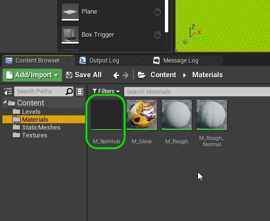
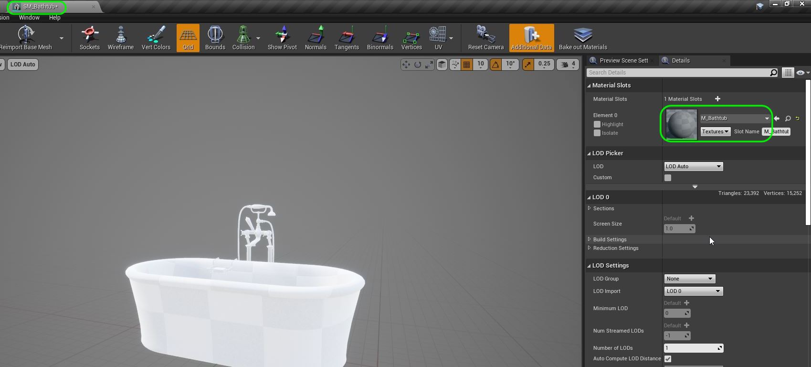
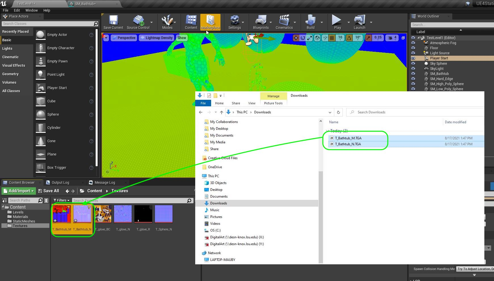

### Bathtub Test Material

[previous](../lightmap/README.md#user-content-lightmap-uvs) • [home](../README.md#user-content-ue4-static-meshes) • [next](../)

Why is the shape so odd in the texture maps, how is this determined? Lets take a closer look at UV Mapping and see how we can test how well a modeler has implemented them.

 

---

##### `Step 1.`\|`SUU&G`|:small_blue_diamond:

Create a new Material called `M_Bathtub` and place it in the **Materials** folder. 

##### `Step 2.`\|`FHIU`|:small_blue_diamond: :small_blue_diamond: 

Apply the **M_Bathtub** material to the static mesh in the **SM_Model** viewer so that it will apply to all future instances.

##### `Step 3.`\|`SUU&G`|:small_blue_diamond: :small_blue_diamond: :small_blue_diamond:

Download [T_Bathtub_M.TGA](../Assets/T_Bathtub_M.TGA) and [T_Bathtub_N.TGA](../Assets/T_Bathtub_N.TGA) and drag them into the **Textures** folder in UE4.

##### `Step 4.`\|`SUU&G`|:small_blue_diamond: :small_blue_diamond: :small_blue_diamond: :small_blue_diamond:

Open [M_Bathtub.COPY](../Assets/M_Bathtub.COPY) in a text editor and copy it into your clipboard.  Paste it inside the graph of the new **M_Bathtub**.  Make sure the textures are found and that the top texture is the **_M** and the bottom is the texture that ends in **_N**.  Connect the top pin top **Lerp** pin to **Base Color**, the second empty **Lerp** pin to **Roughness** and the third lerp pin to **Metallic**.  Connect the bottom **Texture Sample** node to the **Normal** pin.  Press the **Apply button**.  I got an error on the main texture sample and needed to change its sampler type from **Mask** to **Color**.  I loaded up the model from the game into the material previewer and made sure it looked correct.  I then assigned the material to the bathtub in game.",
  
  

##### `Step 5.`\|`SUU&G`| :small_orange_diamond:

##### `Step 6.`\|`SUU&G`| :small_orange_diamond: :small_blue_diamond:

##### `Step 7.`\|`SUU&G`| :small_orange_diamond: :small_blue_diamond: :small_blue_diamond:

##### `Step 8.`\|`SUU&G`| :small_orange_diamond: :small_blue_diamond: :small_blue_diamond: :small_blue_diamond:

##### `Step 9.`\|`SUU&G`| :small_orange_diamond: :small_blue_diamond: :small_blue_diamond: :small_blue_diamond: :small_blue_diamond:

##### `Step 10.`\|`SUU&G`| :large_blue_diamond:

##### `Step 11.`\|`SUU&G`| :large_blue_diamond: :small_blue_diamond: 

##### `Step 12.`\|`SUU&G`| :large_blue_diamond: :small_blue_diamond: :small_blue_diamond: 

##### `Step 13.`\|`SUU&G`| :large_blue_diamond: :small_blue_diamond: :small_blue_diamond:  :small_blue_diamond: 

##### `Step 14.`\|`SUU&G`| :large_blue_diamond: :small_blue_diamond: :small_blue_diamond: :small_blue_diamond:  :small_blue_diamond: 

##### `Step 15.`\|`SUU&G`| :large_blue_diamond: :small_orange_diamond: 

##### `Step 16.`\|`SUU&G`| :large_blue_diamond: :small_orange_diamond:   :small_blue_diamond: 

##### `Step 17.`\|`SUU&G`| :large_blue_diamond: :small_orange_diamond: :small_blue_diamond: :small_blue_diamond:

##### `Step 18.`\|`SUU&G`| :large_blue_diamond: :small_orange_diamond: :small_blue_diamond: :small_blue_diamond: :small_blue_diamond:

##### `Step 19.`\|`SUU&G`| :large_blue_diamond: :small_orange_diamond: :small_blue_diamond: :small_blue_diamond: :small_blue_diamond: :small_blue_diamond:

##### `Step 20.`\|`SUU&G`| :large_blue_diamond: :large_blue_diamond:

##### `Step 21.`\|`SUU&G`| :large_blue_diamond: :large_blue_diamond: :small_blue_diamond:

___

| [previous](../lightmap/README.md#user-content-lightmap-uvs)| [home](../README.md#user-content-ue4-static-meshes) | [next](../)|
|---|---|---|
