### Bathtub Test Material

[previous](../lightmap/README.md#user-content-lightmap-uvs) • [home](../README.md#user-content-ue4-static-meshes) • [next](../)

Why is the shape so odd in the texture maps, how is this determined? Lets take a closer look at UV Mapping and see how we can test how well a modeler has implemented them.

 

---

##### `Step 1.`\|`SUU&G`|:small_blue_diamond:

Create a new Material called `M_Bathtub` and place it in the **Materials** folder. 

##### `Step 2.`\|`FHIU`|:small_blue_diamond: :small_blue_diamond: 

Apply the **M_Bathtub** material to the static mesh in the **SM_Model** viewer so that it will apply to all future instances.

##### `Step 3.`\|`SUU&G`|:small_blue_diamond: :small_blue_diamond: :small_blue_diamond:

Download [T_Bathtub_M.TGA](../Assets/T_Bathtub_M.TGA) and [T_Bathtub_N.TGA](../Assets/T_Bathtub_N.TGA) and drag them into the **Textures** folder in UE4.

##### `Step 4.`\|`SUU&G`|:small_blue_diamond: :small_blue_diamond: :small_blue_diamond: :small_blue_diamond:

Open up **T_Bathtrub_N.TGA** and make sure the **Compression Settings** is set to `Normalmap`.
  

##### `Step 5.`\|`SUU&G`| :small_orange_diamond:
Open [M_Bathtub.COPY](../Assets/M_Bathtub.COPY) in GitHub and press the <kbd>Raw</kbd> button.  Then select all the text and copy it into your clipboard with <kbd>cntrl C</kbd> (PC) or <kbd>command C<kbd>.

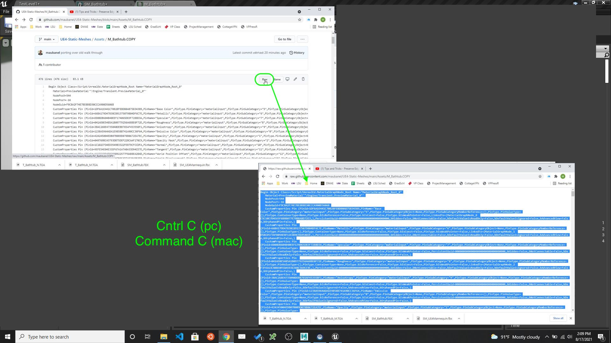

##### `Step 6.`\|`SUU&G`| :small_orange_diamond: :small_blue_diamond:
The cool thing about materials is that you can cut and paste them between projects.  So Paste it inside the graph of the new **M_Bathtub**.  Make sure the textures are found and that the top texture is the **_M** and the bottom is the texture that ends in **_N**.  

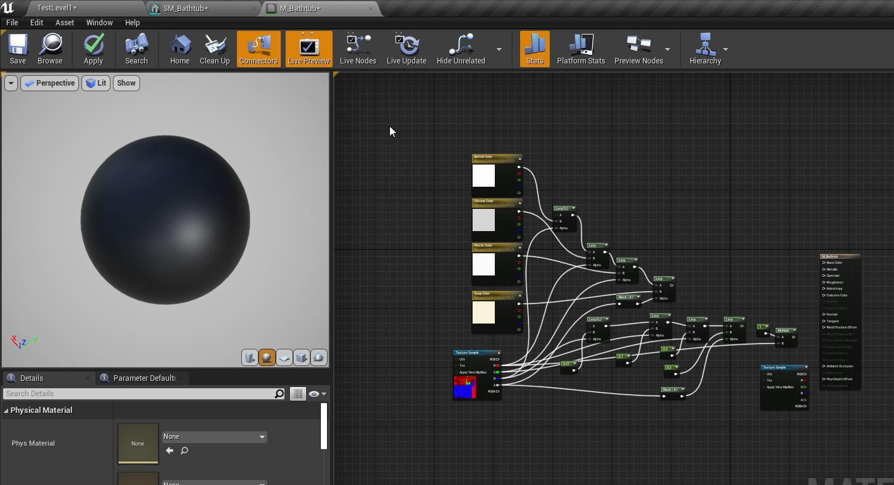

##### `Step 7.`\|`SUU&G`| :small_orange_diamond: :small_blue_diamond: :small_blue_diamond:
If you press the <kbd>Apply</kbd> button and render the material you get an error on the main texture sample and needed to change its **Sampler Type** from **Mask** to **Color**.  This was done as the engine misinterpreted the texture's use.

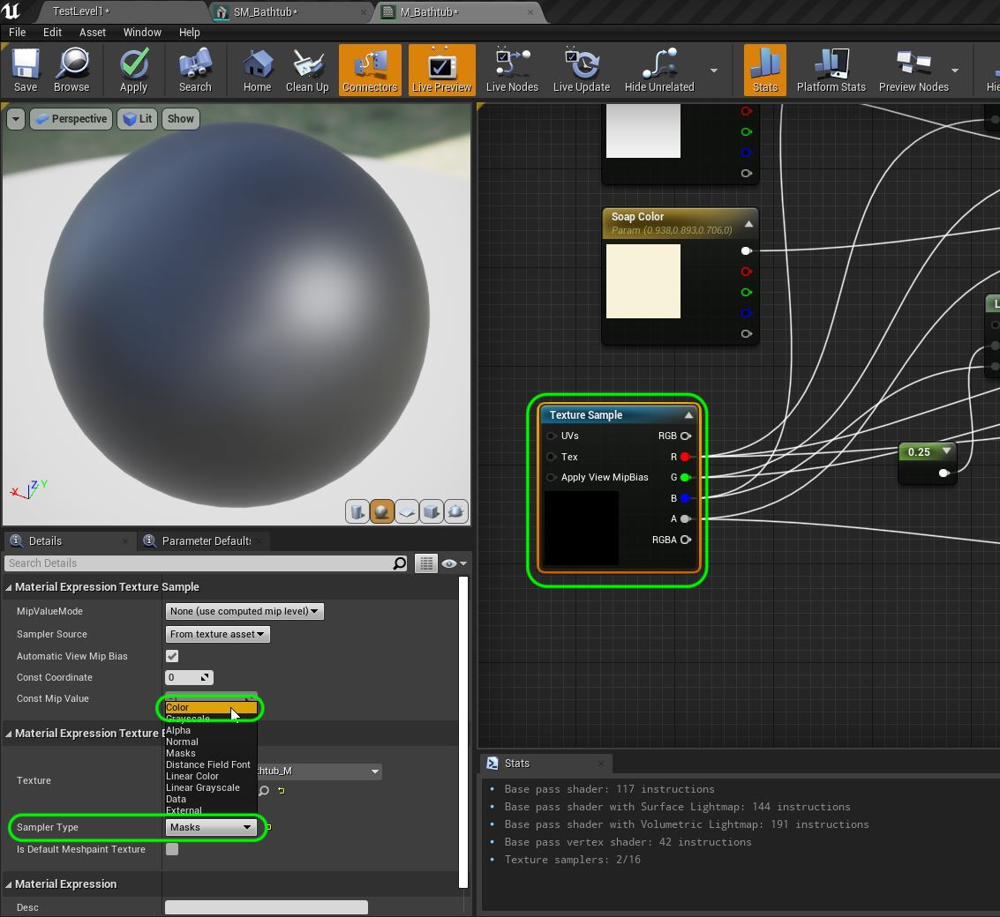

##### `Step 8.`\|`SUU&G`| :small_orange_diamond: :small_blue_diamond: :small_blue_diamond: :small_blue_diamond:

  Connect the bottom **Texture Sample** node to the **Normal** pin.  Press the **Apply button**.  Look at how it adds the illusion of geometry to the sphere.  Pretty cool!

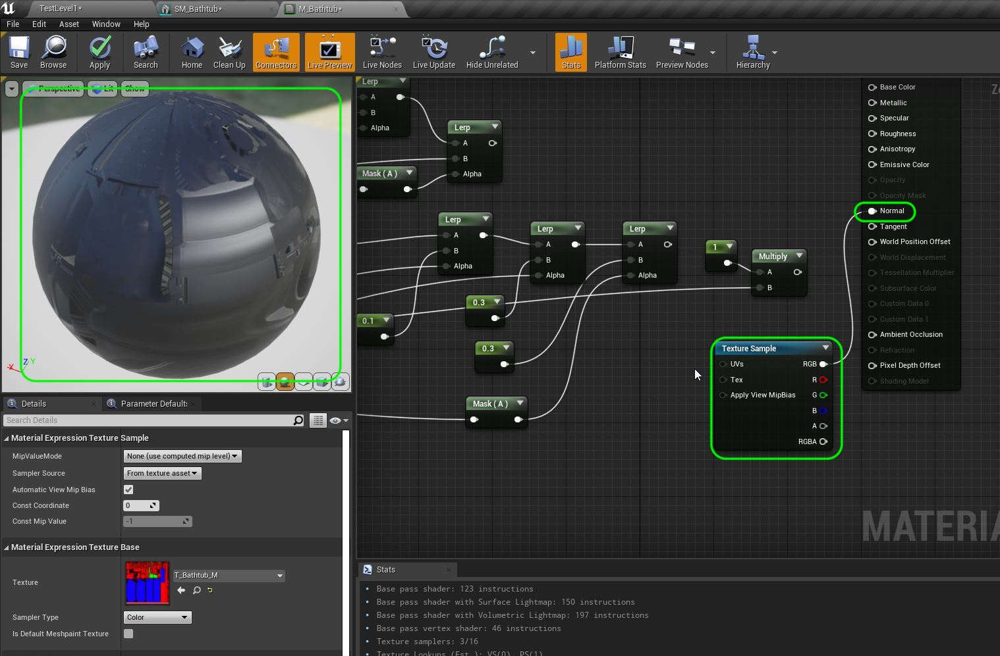

##### `Step 9.`\|`SUU&G`| :small_orange_diamond: :small_blue_diamond: :small_blue_diamond: :small_blue_diamond: :small_blue_diamond:

Connect the top pin top **Lerp** pin to **Base Color**.

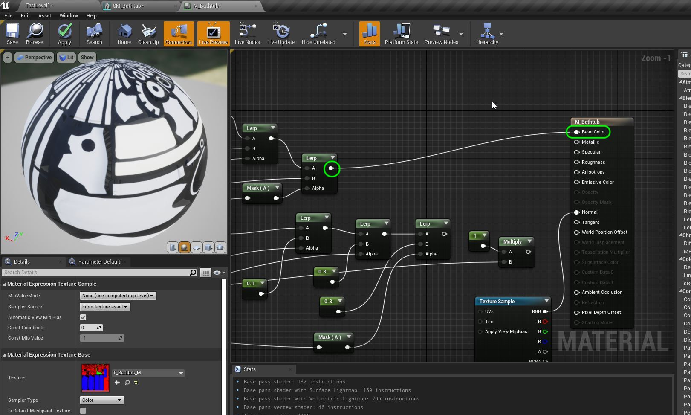

##### `Step 10.`\|`SUU&G`| :large_blue_diamond:

Now in the game engine select **StaticMeshes | SM_Bathtub** then go back to the material and select 

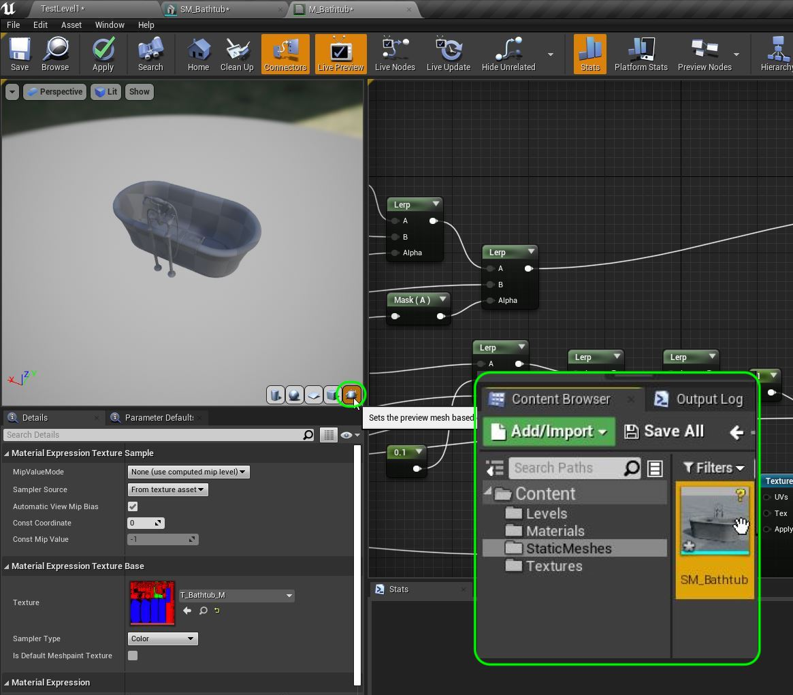

##### `Step 11.`\|`SUU&G`| :large_blue_diamond: :small_blue_diamond: 
 
 Connect the output of the **Multiply** pin to the **Metallic** input on the shader. 
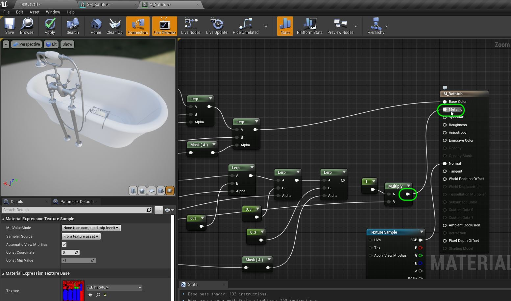

##### `Step 12.`\|`SUU&G`| :large_blue_diamond: :small_blue_diamond: :small_blue_diamond: 
Connect the final empty **Lerp** pin to **Roughness** input pin in the shader.  Press the <kbd>Apply</kbd> button.

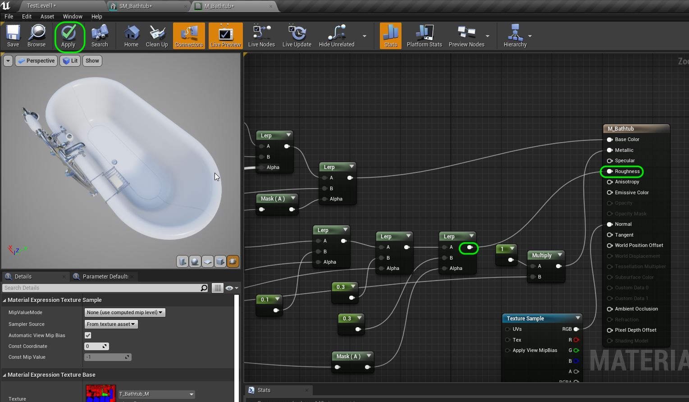

##### `Step 13.`\|`SUU&G`| :large_blue_diamond: :small_blue_diamond: :small_blue_diamond:  :small_blue_diamond: 

Go back to the game and change the render mode back to **Lit**.

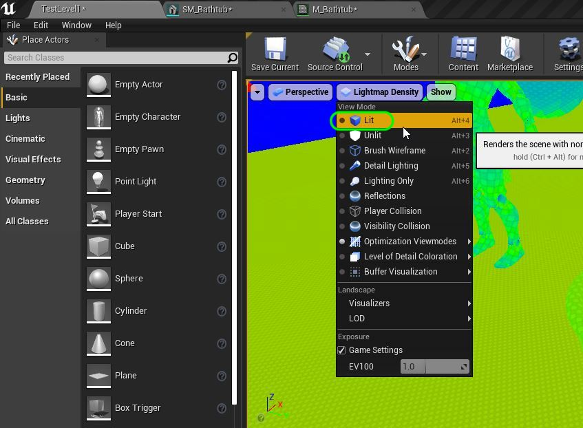

##### `Step 14.`\|`SUU&G`| :large_blue_diamond: :small_blue_diamond: :small_blue_diamond: :small_blue_diamond:  :small_blue_diamond: 

Add the material **M_Bathtub** to the bathtub model in game if it is not loaded.

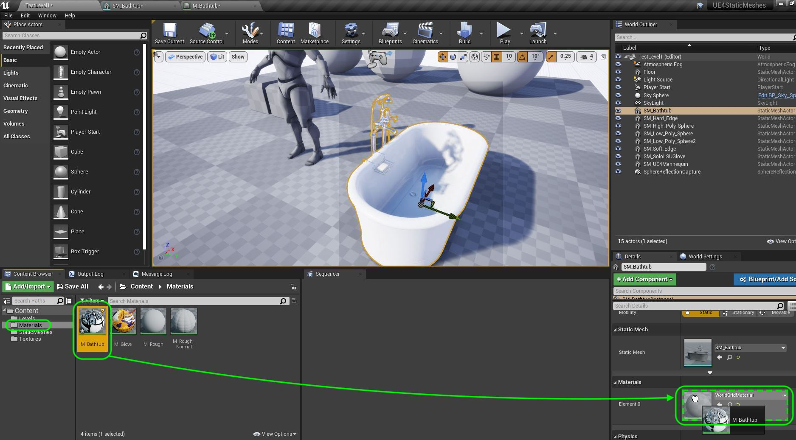

##### `Step 15.`\|`SUU&G`| :large_blue_diamond: :small_orange_diamond: 

Now play the game and look at the model and how the material reads in game.

##### `Step 16.`\|`SUU&G`| :large_blue_diamond: :small_orange_diamond:   :small_blue_diamond: 

We can also look at how the UV's work by placing a test material in place to see if there are any distortions or obvious issues.  Create a new **Material** called `M_TestTexture` in the **Materials** folder. Drag into the **Textures** folder the [T_UV_Grid.TGA](../Assets/T_UV_Grid.TGA) and see that it has more information than the black and white grid in maya.  It will tell us what part of the texture maps to where. We will use this to see how the UV's project in UE4 instead of Maya this time and you can use this on any model to test the UVs.

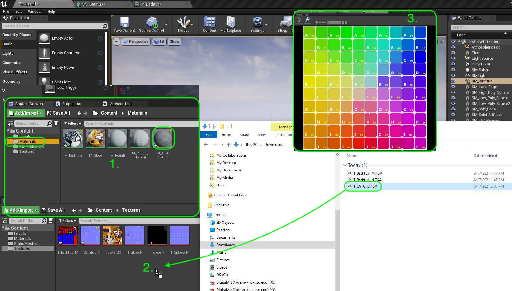

##### `Step 17.`\|`SUU&G`| :large_blue_diamond: :small_orange_diamond: :small_blue_diamond: :small_blue_diamond:

Reopen **M_TestTexture** and press the <kbd>T</kbd> key and pressing the **Left Mouse** button.  Load the **Texture** `T_UV_Grid`.

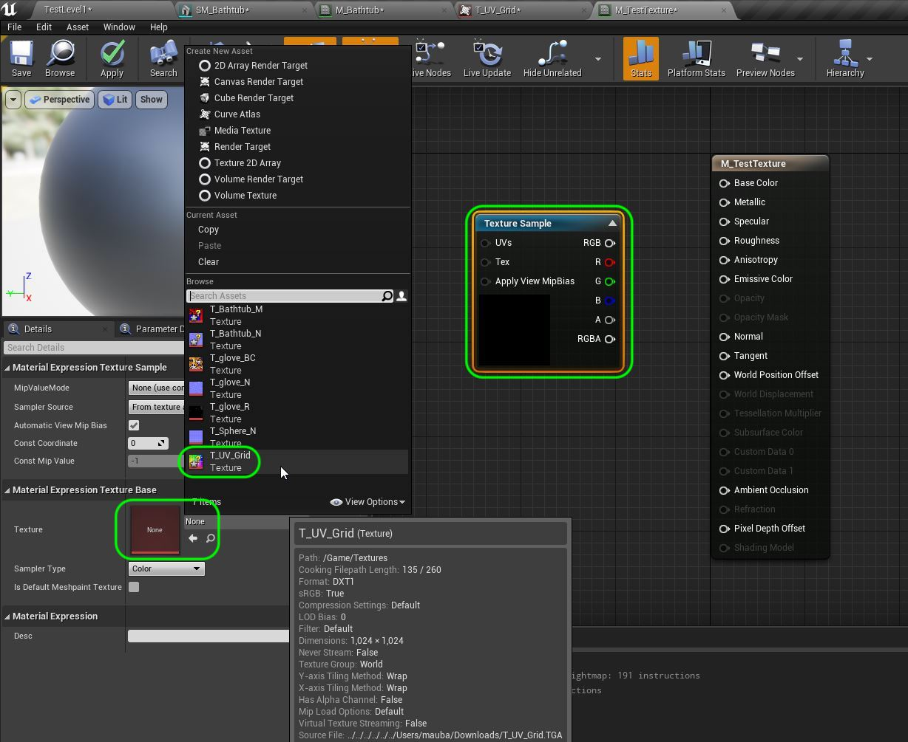

##### `Step 18.`\|`SUU&G`| :large_blue_diamond: :small_orange_diamond: :small_blue_diamond: :small_blue_diamond: :small_blue_diamond:

Attach the **RGB** to **Base Color**. Press the <kb>Apply</kbd> button.  You can see what part of the texture is used on what part of the model.

##### `Step 19.`\|`SUU&G`| :large_blue_diamond: :small_orange_diamond: :small_blue_diamond: :small_blue_diamond: :small_blue_diamond: :small_blue_diamond:

Duplicate the bathtub in the level and assign the **M_TestTexture**.  Move around the model and look at how the UV's pick portions of the texture map.

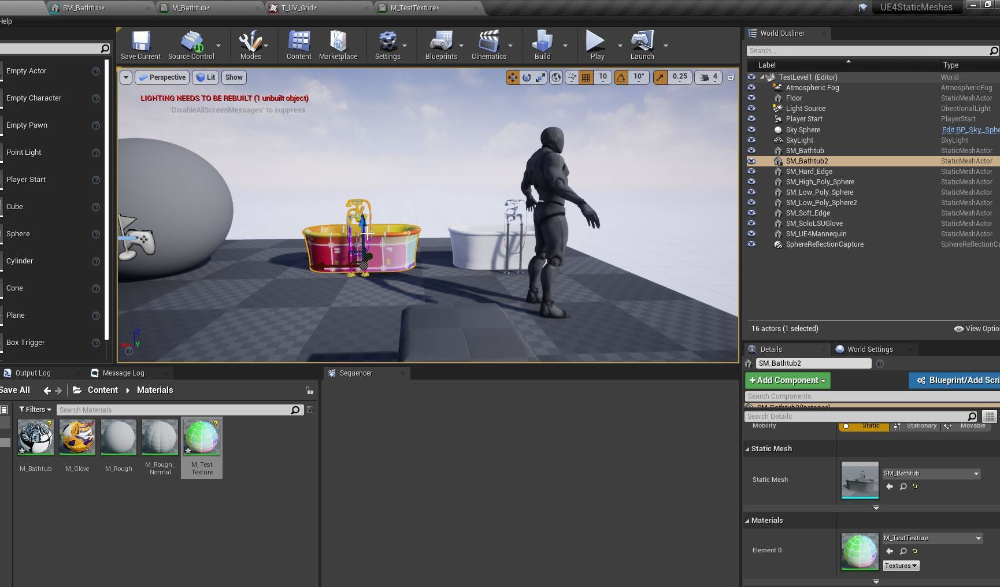

https://user-images.githubusercontent.com/5504953/129808512-e0ddc3b0-a473-4ea3-bcca-078bb363426a.mp4

##### `Step 20.`\|`SUU&G`| :large_blue_diamond: :large_blue_diamond:

##### `Step 21.`\|`SUU&G`| :large_blue_diamond: :large_blue_diamond: :small_blue_diamond:

___

| [previous](../lightmap/README.md#user-content-lightmap-uvs)| [home](../README.md#user-content-ue4-static-meshes) | [next](../)|
|---|---|---|
