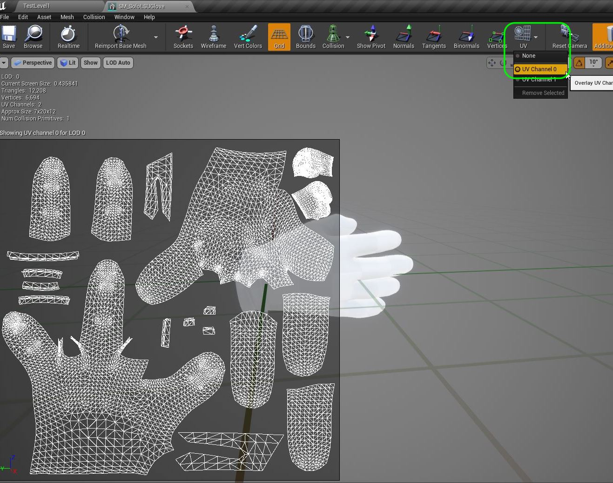
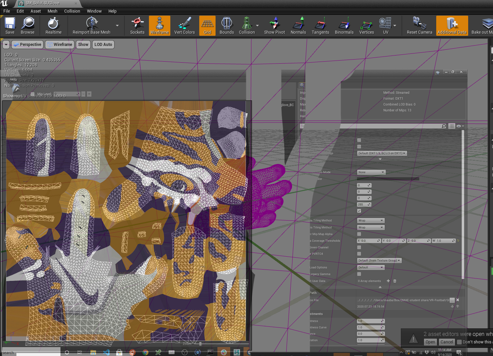
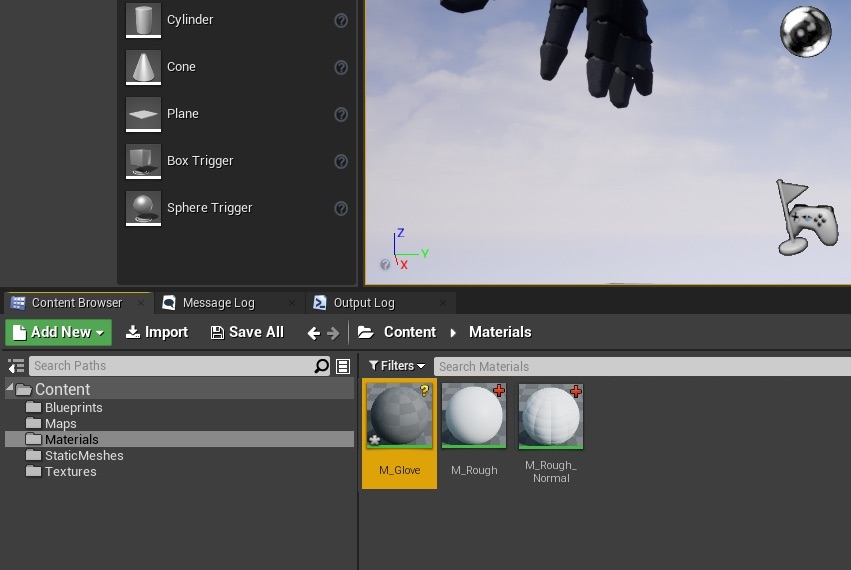
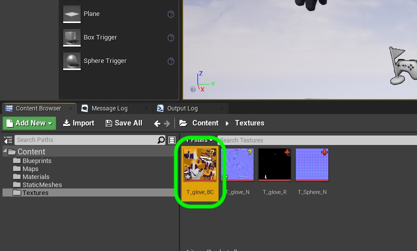
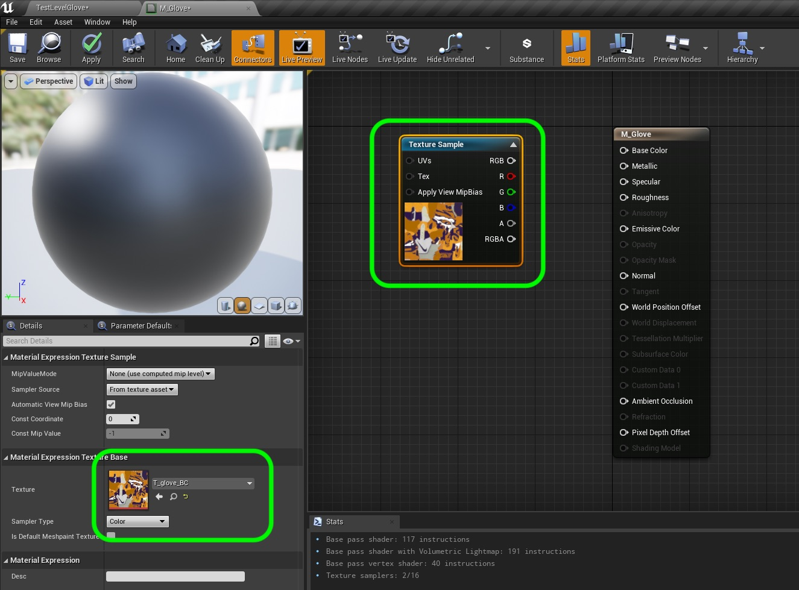
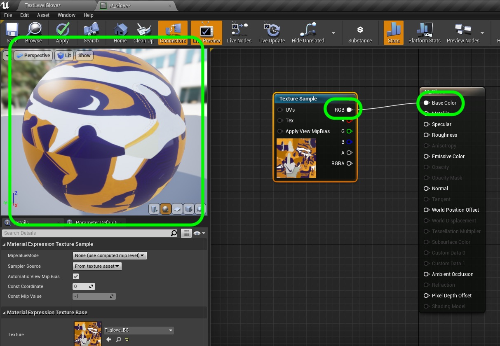
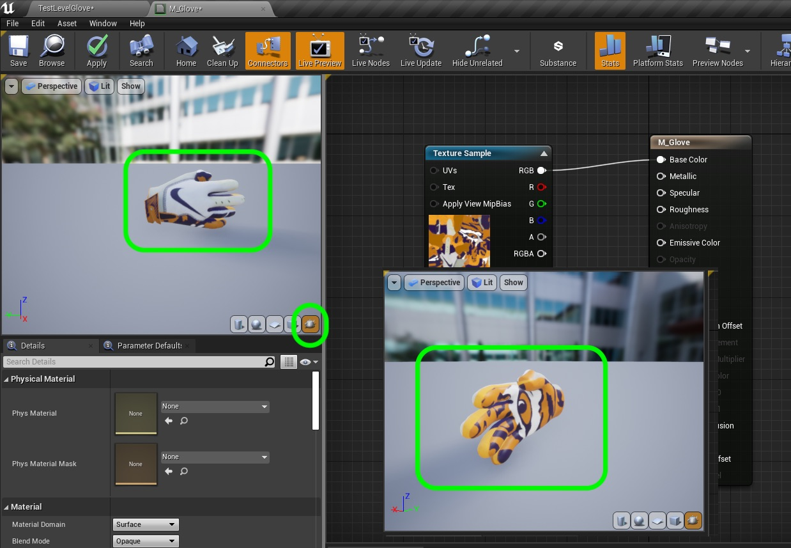
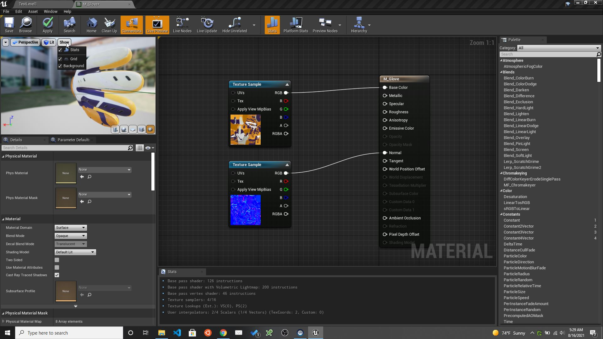

### Case Study - The Material

[previous](../case-study/README.md#user-content-case-study---the-model) • [home](../README.md#user-content-ue4-static-meshes) • [next](../)

The materials and textures defines how the model reflects light and is colored.  It defines the pixels, detail in the model and the way it reflects light.  We can combine all the materials on a model in one material/texture sheet or can separate elements. Please note that **Each** material we use increases the render time by a factor of 1.  So the fewer materials we can use on a model the better.

>>> A 3D material is basically what you layer on top of a 3D object, to control the way the object is perceived when rendered. It behaves much the way a material does in the real world - whether that's the way light interacts with its surface, or the nuances of colour, texture, transparency and reflectivity - [The Foundry](https://www.foundry.com/insights/design/3d-materials-explained)

 

---

##### `Step 1.`\|`SUU&G`|:small_blue_diamond:

[UV]() mapping is the process of projecting a 2-D image to a 3D model's surface for texture mapping.  This allows the model to know what pixel in the 2-d image goes to what portion of the polygon (face) in a model.  The larger the size of the texture, the more detail you will get in the model.  The letters "U" and "V" are used to represent the two axis of a 2-D texture as **X, Y & Z** are already representing the points of the 3-D model.  **U** represents the horizontal axis (x) and **V** represents the vertical axis (y) of the texture.

* Picture from Wikipedia

##### `Step 2.`\|`FHIU`|:small_blue_diamond: :small_blue_diamond: 

To undertand materials we need to look at how 2-D textures are mapped to the 3-D model. Open up **SM_SoloLSUGlove** and select **UV | UV0** in Unreal.  This is the 3-D shaped unwrapped so that it is like you cut the seams on the glove and laid them out flat (or what the material looked like before it was sewed into a glove.

##### `Step 3.`\|`SUU&G`|:small_blue_diamond: :small_blue_diamond: :small_blue_diamond:

So all of our texture maps need to line up with the UV's as it dictates where each pixel will land on the glove. So the color channel assigns a pixel to a location on the UV which then projects it onto the glove like so.  Try to guess where the tiger eye and Nike swoosh will go on the final model in game?

##### `Step 4.`\|`SUU&G`|:small_blue_diamond: :small_blue_diamond: :small_blue_diamond: :small_blue_diamond:

Import the [T_glove_BC.png](../Assets/T_glove_BC.png), [T_glove_N.png](../Assets/T_glove_N.png) and [T_glove_R.png](../Assets/T_glove_R.png) to the **Textures** folder in the project.
    

##### `Step 5.`\|`SUU&G`| :small_orange_diamond:

Add a new **Material** into the **Materials** folder called `M_Glove`.

##### `Step 6.`\|`SUU&G`| :small_orange_diamond: :small_blue_diamond:

Now in that folder please select the **T_glove_BC** texture that decides the color on each area on the model to be applied based on the **UV 0** map.

##### `Step 7.`\|`SUU&G`| :small_orange_diamond: :small_blue_diamond: :small_blue_diamond:

Open up **M_Glove** and press the <kbd>T</kbd> key and left click on the graph **or** right click and add a `TextureSample` node to the graph.  It will automatically assign the texture you seleted in the editor which is the glove texture.",

##### `Step 8.`\|`SUU&G`| :small_orange_diamond: :small_blue_diamond: :small_blue_diamond: :small_blue_diamond:

Drag from the **RGB** pin from the **Texture Sample** node and connect it to the **Base Color**.  Wait a bit and see the sphere update.  Now the texture looks weird as it is applied to sphere without the proper UV's so we can't really see if it works.  Lets fix that by loading the game model we are using.

##### `Step 9.`\|`SUU&G`| :small_orange_diamond: :small_blue_diamond: :small_blue_diamond: :small_blue_diamond: :small_blue_diamond:

Go back to the editor and select **StaticMeshes | SM_SoloLSUGlove** in the **Content Browser**.
    

##### `Step 10.`\|`SUU&G`| :large_blue_diamond:

Open up **M_Glove** and select the far right **Preview** button under the sphere to change it to the mesh you are selecting in the editor.  Press the **Alt** button and turn around to see how the texture now is translated from 2-d back to the 3-d model where the pixels line up correctly. Now do the pixels line up with the UV's?

##### `Step 11.`\|`SUU&G`| :large_blue_diamond: :small_blue_diamond: 

Now go to the **Textures** folder and select **T_Glove_N** for the normal map.  Go back to the **M_Glove** material and add another **TextureSample** node.  It should default with the normal map.\n\nAttach the **RGB** pin to the **Normal** pin in the material.  This adds detail that gives the surface some added geometric detail (it is an illusion) that looks like there are raised and dimpled surfaces on the glove.  This is most pronounced with the air holes. 

##### `Step 12.`\|`SUU&G`| :large_blue_diamond: :small_blue_diamond: :small_blue_diamond: 

##### `Step 13.`\|`SUU&G`| :large_blue_diamond: :small_blue_diamond: :small_blue_diamond:  :small_blue_diamond: 

##### `Step 14.`\|`SUU&G`| :large_blue_diamond: :small_blue_diamond: :small_blue_diamond: :small_blue_diamond:  :small_blue_diamond: 

##### `Step 15.`\|`SUU&G`| :large_blue_diamond: :small_orange_diamond: 

##### `Step 16.`\|`SUU&G`| :large_blue_diamond: :small_orange_diamond:   :small_blue_diamond: 

##### `Step 17.`\|`SUU&G`| :large_blue_diamond: :small_orange_diamond: :small_blue_diamond: :small_blue_diamond:

##### `Step 18.`\|`SUU&G`| :large_blue_diamond: :small_orange_diamond: :small_blue_diamond: :small_blue_diamond: :small_blue_diamond:

##### `Step 19.`\|`SUU&G`| :large_blue_diamond: :small_orange_diamond: :small_blue_diamond: :small_blue_diamond: :small_blue_diamond: :small_blue_diamond:

##### `Step 20.`\|`SUU&G`| :large_blue_diamond: :large_blue_diamond:

##### `Step 21.`\|`SUU&G`| :large_blue_diamond: :large_blue_diamond: :small_blue_diamond:

___

| [previous](../case-study/README.md#user-content-case-study---the-model)| [home](../README.md#user-content-ue4-static-meshes) | [next](../)|
|---|---|---|
