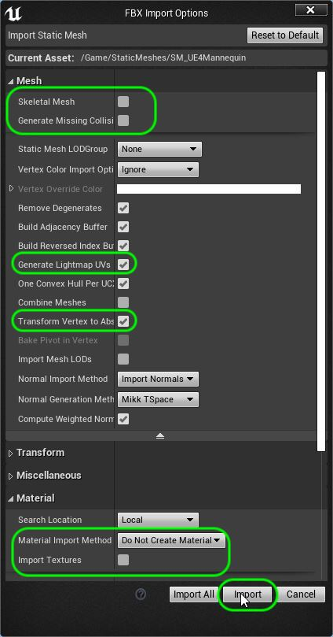
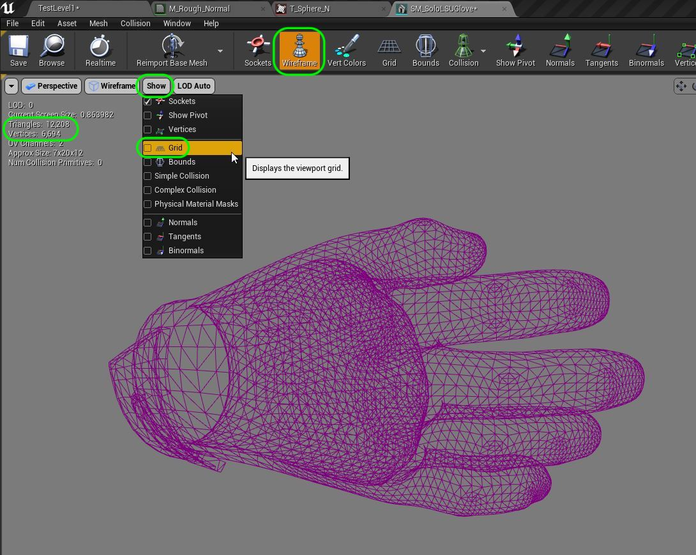
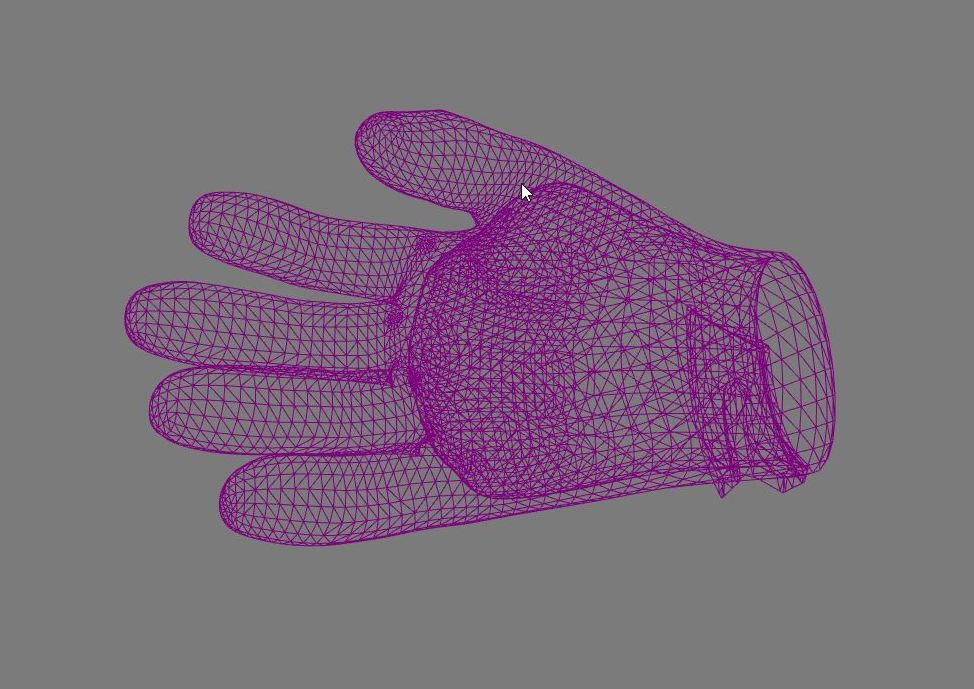
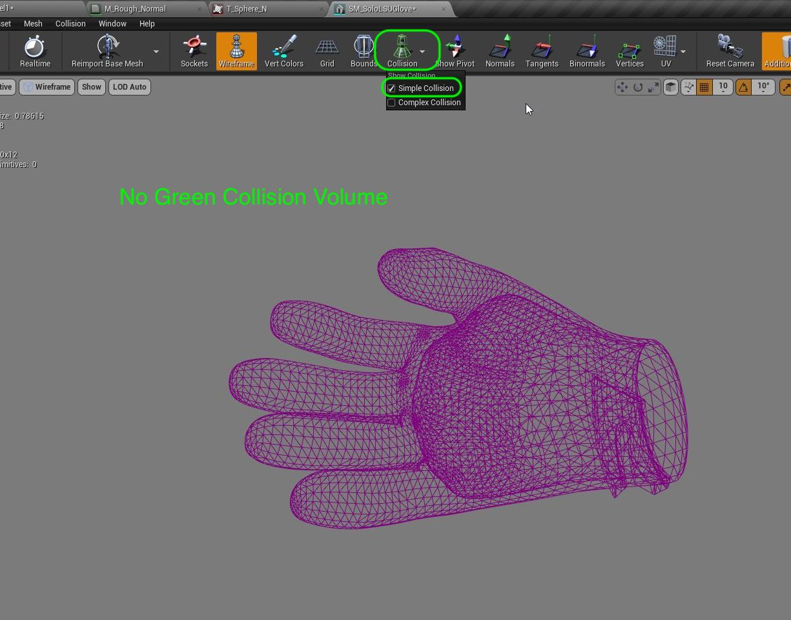
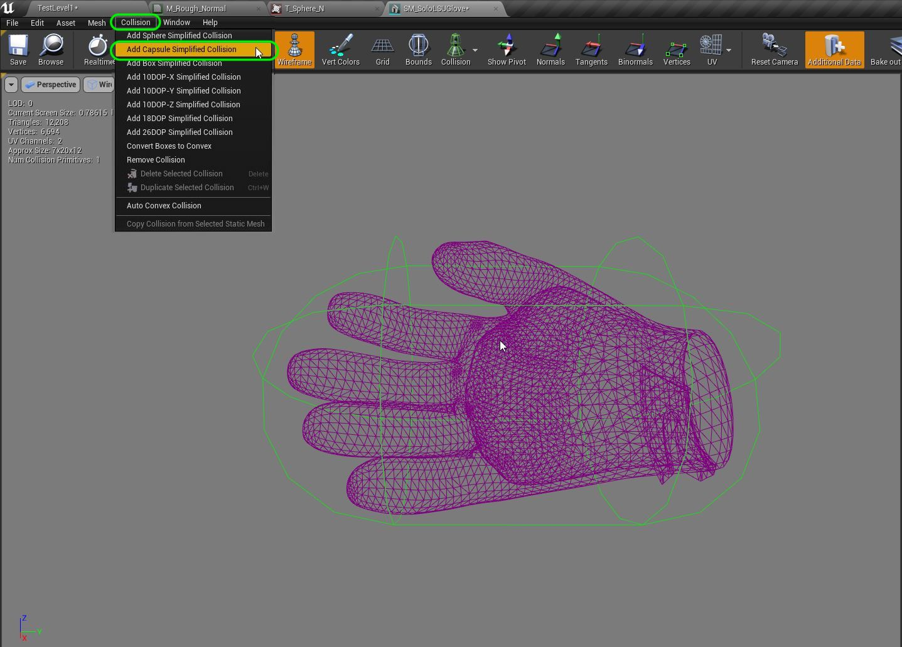
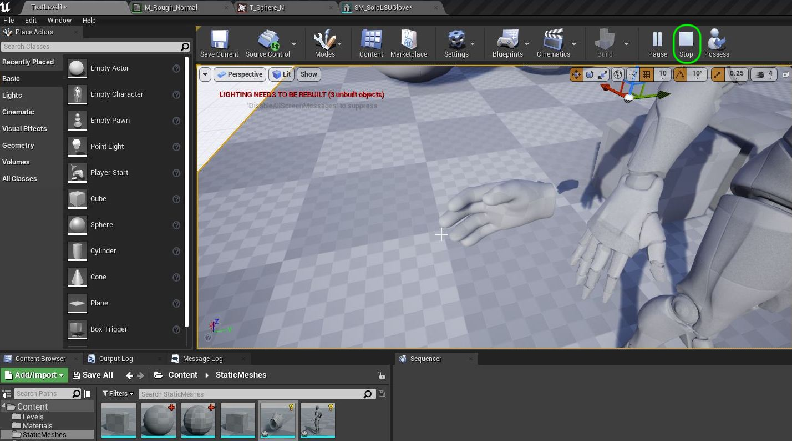
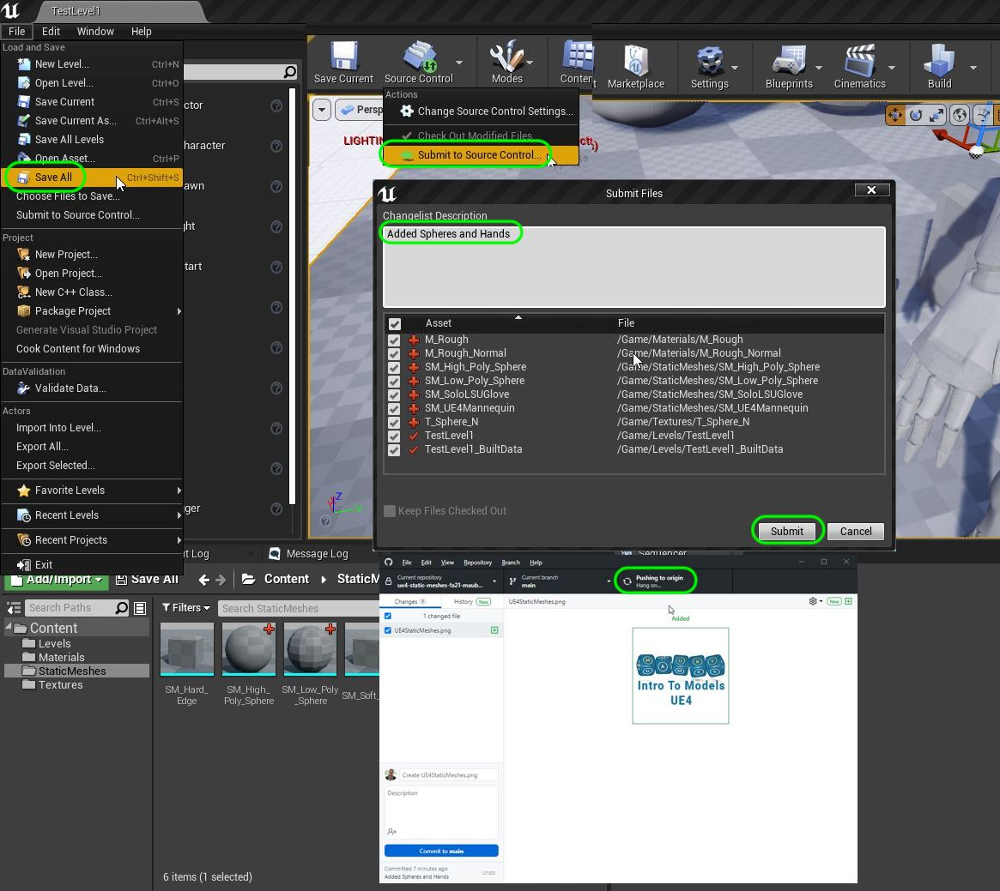

### Case Study - The Model

[previous](../normal-maps/README.md#user-content-normal-maps) • [home](../README.md#user-content-ue4-static-meshes) • [next](../)

Lets look at a model that was created for a game engine.  What goes into figuring out if a model will do the job we want it to?  Lets look at the model, the UV's, and the different texture maps.

 

---

##### `Step 1.`\|`SUU&G`|:small_blue_diamond:

The first thing we need to think about is the scale of the model.  Will it match the scale of the world? We always want to make sure that our scale on import is set to `1.0` on all axis and be the right scale in the game.  

We need to ensure that a unit in our modeling package (like **Maya**) is set to a **cm**. Now scale is determined by the type of game we are in.  Are we an ameoba, or are we an interplanitary system.  You can change what a scale unit means in Unreal based on that.

But for this example we are dealing with human scale, so a cm per unit makes sense in this case. What is the best reference we have for human scale?  It is a an average adult human.  This will give us an idea of whether the model we import next to it is scaled correctly.

Download the [UE4 Mannequin](../Assets/SM_UE4Mannequin.fbx) for scale reference into the **Static Mesh** folder.  

We deselect **Skeletal Mesh**, deselect **Generate Missing Collisions** as this is not going to be actually used it is just a scale reference.  We don't need a material or textures, and will accept generated lightmap UVs and make sure our **Transform Vertex to Absolute** is `true`.

##### `Step 2.`\|`FHIU`|:small_blue_diamond: :small_blue_diamond: 

The amount of detail we are needing in a model and its textures and materials is based on how close we get to them in the game. We are looking at how large it will be in the viewfinder on screen.  We developed a glove for a research project at LSU to mimic the Tiger's receiver glove in VR.  This was going to be the largest object on screen outside of the ball. 

This glove is a receiver's glove for LSU atheletes. It is for a 1st person game where the hands are always in front of you and are large in the game.  It is larger and more detailed than any player in the simulation. Lets take a look by downloading [Tiger Glove Model](../Assets/SM_SoloLSUGlove.fbx) and drag it into the **Static Mesh** folder.

We deselect **Skeletal Mesh**, deselect **Generate Missing Collisions** as we will create these manually.  We don't need a material or textures as we will build one from scratch, and will accept generated lightmap UVs and make sure our **Transform Vertex to Absolute** is `true`.

##### `Step 3.`\|`SUU&G`|:small_blue_diamond: :small_blue_diamond: :small_blue_diamond:

Drag a copy of the mannequin and the glove into the scene.  Double check the scale of the hand.  It is a bit smaller than the one in Unreal but it within an acceptable scale for our purposes. Place the glove next to the mannequin's hand to check for scale.

##### `Step 4.`\|`SUU&G`|:small_blue_diamond: :small_blue_diamond: :small_blue_diamond: :small_blue_diamond:

Double click on **SM_SoloLSUGlove** and look at the number of **Triangles**.  A high res character will often take 75,000 tris or more this model is still within a very acceptable limit especially given that the one model can work for both hands (the hands are a mirror of each other).  You can see the model even better if you turn off **Show | Grid**.

Press the **Wireframe** button and zoom in to look at the model.

##### `Step 5.`\|`SUU&G`| :small_orange_diamond:

When looking at a model we want to look at poly flow.  Do the triangles look evenly distributed?  Do points look like they are at the correct position on where an object might animate (finger joints for example)?  Is there enough density in where an object animates for it to deform believably? The poly flow here looks excellent. The scale looks bang on! 

##### `Step 6.`\|`SUU&G`| :small_orange_diamond: :small_blue_diamond:

The next thing we need to look at is collision.  Press the **Collision** button and select **Simple Collision**.  Do NOT select **complex collision**. This uses all **6,694 Vertices** in the model to solve collisions.  In most cases this is too expensive and slow so we want to use a simpler collision.  This model did NOT compe with a simple collision as no green mesh shows up. We did not import a collision volume (and there wasn't one in the original model), so we will need to create one on our own.

##### `Step 7.`\|`SUU&G`| :small_orange_diamond: :small_blue_diamond: :small_blue_diamond:

Go to **Collision | Add Capsule Simplified Collision** and Unreal will pick an appropriate shape often used for hands. You will now see if covers the hands with a capsule shape. 

Why do we use a simpler shape for collisions and why do we not use the entire hand mesh?  This is because collision detection is very expensive so the larger the model the more collision checks need to be made.  We are not at a point where we can do collisions with all the millions of polygons in a typical game scene.  Also, for physics if we are walking on grass.  We want it the feel flat but look undulating.  This is done by having a flat collision plane but blades of grass and clumps of dirt that extend from the ground plane.

##### `Step 8.`\|`SUU&G`| :small_orange_diamond: :small_blue_diamond: :small_blue_diamond: :small_blue_diamond:

Run the game and look at the hand model.  Does the scale look right?  It looks like the hand model was slightly smaller than the mannequin in game, but it is within the right range for the scale.  So we are happy with this part of the model but there is so much more to look at.

Now the big missing element is the texture that and the material that makes this object look like a glove.

##### `Step 9.`\|`SUU&G`| :small_orange_diamond: :small_blue_diamond: :small_blue_diamond: :small_blue_diamond: :small_blue_diamond:

Now save all your work and submit it to local source control.  When that is done push it to **GitHub**.

___

| [previous](../normal-maps/README.md#user-content-normal-maps)| [home](../README.md#user-content-ue4-static-meshes) | [next](../)|
|---|---|---|
