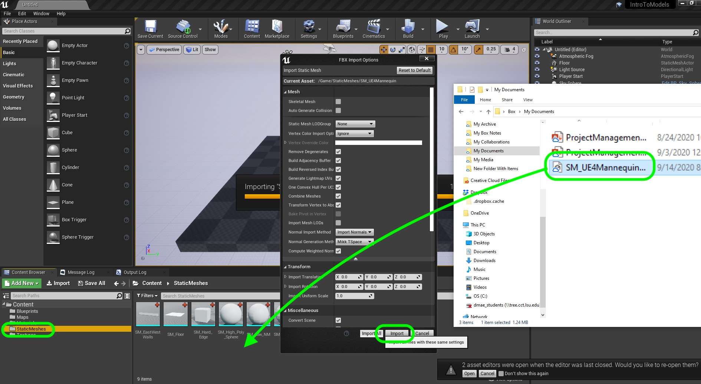
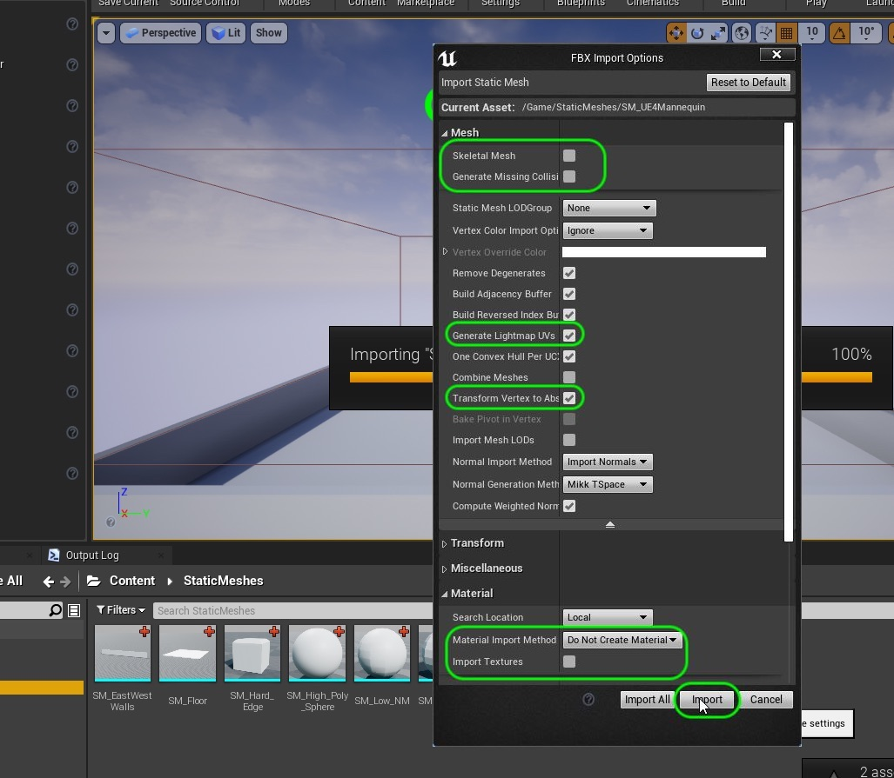
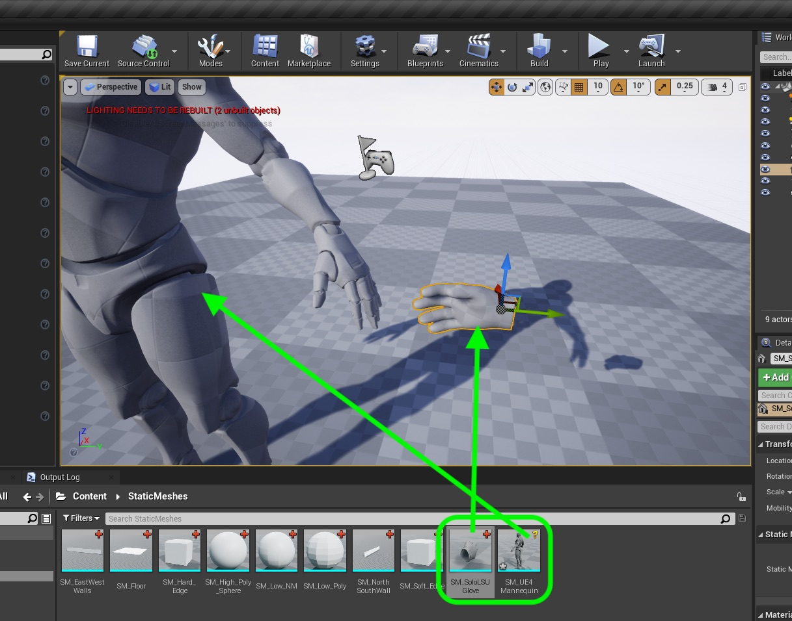
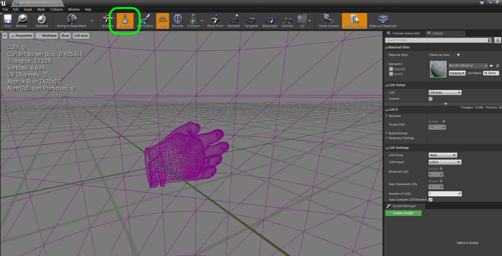

### Case Study

[previous](../normal-maps/README.md#user-content-normal-maps) • [home](../README.md#user-content-ue4-static-meshes) • [next](../)

Lets look at a model that was created for a game engine.  What goes into figuring out if a model will do the job we want it to?  Lets look at the model, the UV's, and the different texture maps.

 

---

##### `Step 1.`\|`SUU&G`|:small_blue_diamond:

The first thing we need to think about is the scale of the model.  Will it match the scale of the world? We always want to make sure that our scale on import is set to `1.0` on all axis and be the right scale in the game.  

We need to ensure that a unit in our modeling package (like **Maya**) is set to a **cm**. Now scale is determined by the type of game we are in.  Are we an ameoba, or are we an interplanitary system.  You can change what a scale unit means in Unreal based on that.

But for this example we are dealing with human scale, so a cm per unit makes sense in this case. What is the best reference we have for human scale?  It is a an average adult human.  This will give us an idea of whether the model we import next to it is scaled correctly.

Download the [UE4 Mannequin](../Assets/SM_UE4Mannequin.fbx) for scale reference into the **Static Mesh** folder.  

##### `Step 2.`\|`FHIU`|:small_blue_diamond: :small_blue_diamond: 

The amount of detail we are needing in a model and its textures and materials is based on how close we get to them in the game. We are looking at how large it will be in the viewfinder on screen.  We developed a glove for a research project at LSU to mimic the Tiger's receiver glove in VR.  This was going to be the largest object on screen outside of the ball. 

This glove is a receiver's glove for LSU atheletes. It is for a 1st person game where the hands are always in front of you and are large in the game.  It is larger and more detailed than any player in the simulation. Lets take a look by downloading [Tiger Glove Model](../Assets/SM_SoloLSUGlove.fbx) and drag it into the **Static Mesh** folder.

##### `Step 3.`\|`SUU&G`|:small_blue_diamond: :small_blue_diamond: :small_blue_diamond:

Drag a copy of the mannequin and the glove into the scene.  Double check the scale of the hand.  It is a bit smaller than the one in Unreal but it within an acceptable scale for our purposes. Place the glove next to the mannequin's hand to check for scale.

##### `Step 4.`\|`SUU&G`|:small_blue_diamond: :small_blue_diamond: :small_blue_diamond: :small_blue_diamond:

Double click on **SM_SoloLSUGlove** and look at the number of **Triangles**.  A high res character will often take 75,000 tris or more this model is still within a very acceptable limit especially given that the one model can work for both hands (the hands are a mirror of each other).  Press the **Wireframe** button and zoom in to look at the model.

##### `Step 5.`\|`SUU&G`| :small_orange_diamond:

##### `Step 6.`\|`SUU&G`| :small_orange_diamond: :small_blue_diamond:

##### `Step 7.`\|`SUU&G`| :small_orange_diamond: :small_blue_diamond: :small_blue_diamond:

##### `Step 8.`\|`SUU&G`| :small_orange_diamond: :small_blue_diamond: :small_blue_diamond: :small_blue_diamond:

##### `Step 9.`\|`SUU&G`| :small_orange_diamond: :small_blue_diamond: :small_blue_diamond: :small_blue_diamond: :small_blue_diamond:

##### `Step 10.`\|`SUU&G`| :large_blue_diamond:

##### `Step 11.`\|`SUU&G`| :large_blue_diamond: :small_blue_diamond: 

##### `Step 12.`\|`SUU&G`| :large_blue_diamond: :small_blue_diamond: :small_blue_diamond: 

##### `Step 13.`\|`SUU&G`| :large_blue_diamond: :small_blue_diamond: :small_blue_diamond:  :small_blue_diamond: 

##### `Step 14.`\|`SUU&G`| :large_blue_diamond: :small_blue_diamond: :small_blue_diamond: :small_blue_diamond:  :small_blue_diamond: 

##### `Step 15.`\|`SUU&G`| :large_blue_diamond: :small_orange_diamond: 

##### `Step 16.`\|`SUU&G`| :large_blue_diamond: :small_orange_diamond:   :small_blue_diamond: 

##### `Step 17.`\|`SUU&G`| :large_blue_diamond: :small_orange_diamond: :small_blue_diamond: :small_blue_diamond:

##### `Step 18.`\|`SUU&G`| :large_blue_diamond: :small_orange_diamond: :small_blue_diamond: :small_blue_diamond: :small_blue_diamond:

##### `Step 19.`\|`SUU&G`| :large_blue_diamond: :small_orange_diamond: :small_blue_diamond: :small_blue_diamond: :small_blue_diamond: :small_blue_diamond:

##### `Step 20.`\|`SUU&G`| :large_blue_diamond: :large_blue_diamond:

##### `Step 21.`\|`SUU&G`| :large_blue_diamond: :large_blue_diamond: :small_blue_diamond:

___

| [previous](../normal-maps/README.md#user-content-normal-maps)| [home](../README.md#user-content-ue4-static-meshes) | [next](../)|
|---|---|---|
