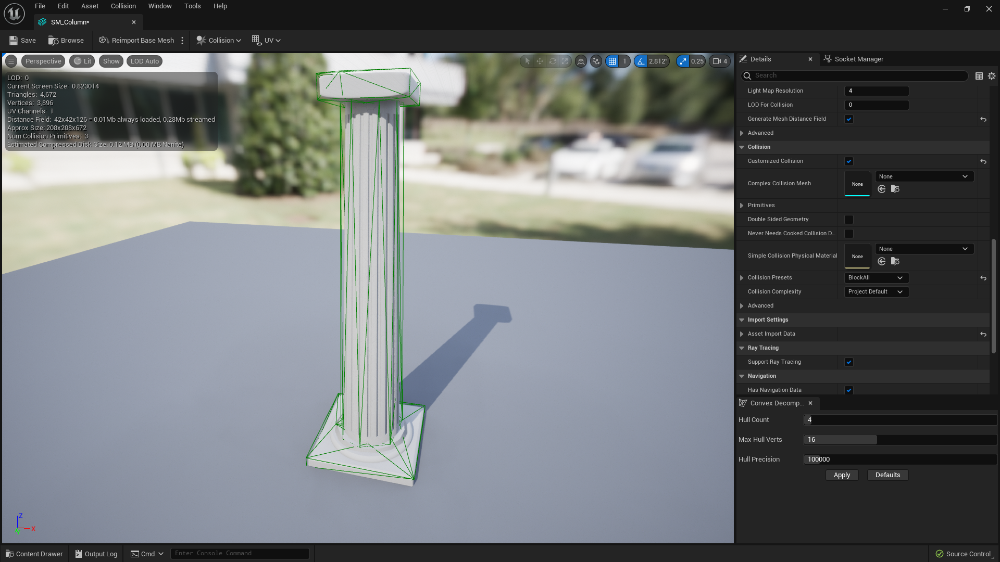
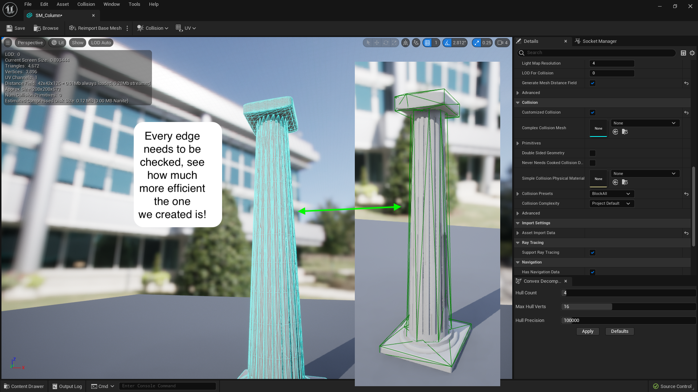
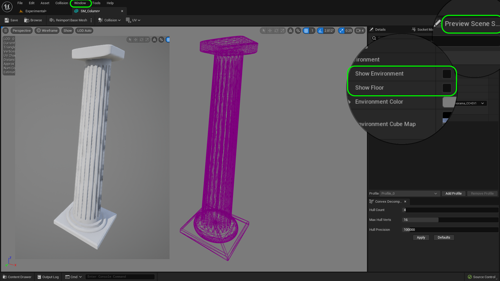
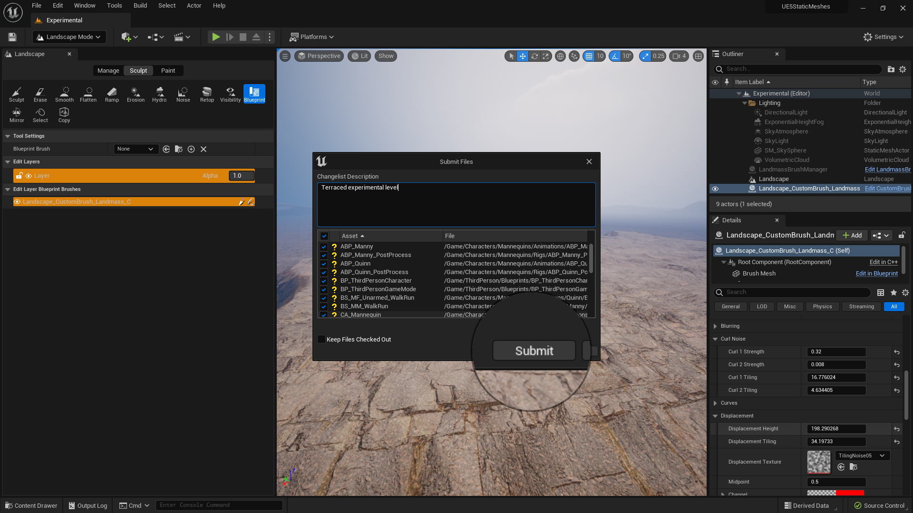

### Collisions

[previous](../basic-column-iii/README.md#user-content-basic-column-iii) • [home](../README.md#user-content-ue5-intro-to-static-meshes) • [next](../uvs/README.md#user-content-uvs)

Now we have the static mesh we can see.  But each model needs a mesh we can't see.  Lets look at collision models to finish up our work so this is usable in the game.

 

---

##### `Step 1.`\|`ITSM`|:small_blue_diamond:

Now lets run around and see this column and check it for scale and collision.  Lets go to **Add Actor** and select a **Player Start** and drag it into the level.  Rotate it to face the column and raise it above the ground then press the <kbd>End</kbd> key to get it on the surface so the player starts on the ground.

##### `Step 2.`\|`ITSM`|:small_blue_diamond: :small_blue_diamond: 

How do I know that it will select the third person player  when I press play? In fact it doesn't it goes to the spectator cam.  To change this go to the **Project Settings | Maps and Modes**.  There I should find the **Default Pawn Game Mode**. Select `BP_ThirdPersonGameMode`.  This will be the game mode that is chosen in ANY level unless it is overiden in the **World Outliner** for that one level. In this case we now have **BP_ThirdPersonCharacter** as our **Default Pawn**, which is the third person pawn that comes with the template.

##### `Step 3.`\|`ITSM`|:small_blue_diamond: :small_blue_diamond: :small_blue_diamond:

Press the <kbd>Play</kbd> button and run around.  Look at the scale to make sure it looks like it is roughly 2 stories tall.  This looks good to me.  Now run into the pillar and check out the collisions.  These also work very well.

https://user-images.githubusercontent.com/5504953/183254544-b9766b3e-9ea5-4c03-9200-47fcdc33af04.mp4

##### `Step 4.`\|`ITSM`|:small_blue_diamond: :small_blue_diamond: :small_blue_diamond: :small_blue_diamond:

Go into your **Content Drawer | Meshes** folder and delete the old temporaray shapes you are not using.  You should have one column left.

##### `Step 5.`\|`ITSM`| :small_orange_diamond:

Now double click on **SM_Column** and look at it in the static mesh viewer.  We shouldsee the model with the material on it.  We should also see the number of triangles and vertices.  Our column has ~4,600 triangles which is not bad.  Now in the past we had to worry a lot about triangle count but for high end PC games Unreal has a feature that makes that problem fairly obsolete.  We will look into that shortly.  

##### `Step 6.`\|`ITSM`| :small_orange_diamond: :small_blue_diamond:

Now the problem when using the Unreal tools for modeling is that it sets the **Collison Complexity** to **Use Complex Collisions as Simple**.  Now what that means is that it is using every point on the existing static mesh to check for collisions.  Now even though UE5 can render a whopping amount of triangles per frame it cannot resolve collisions for all of them.  So this is fine for prototyping but will be non-performant for a final game.  We need to change it to **Project Default** which **REQUIRES** a separate collision model.  Make this change. 

##### `Step 7.`\|`ITSM`| :small_orange_diamond: :small_blue_diamond: :small_blue_diamond:

Press the <kbd>Play</kbd> button and run around notice that there are no collisions!

https://user-images.githubusercontent.com/5504953/183294484-a4f872d9-76ed-4cf5-83ec-4778cafc25e3.mp4

##### `Step 8.`\|`ITSM`| :small_orange_diamond: :small_blue_diamond: :small_blue_diamond: :small_blue_diamond:

In the mesh viewer press the **Show** button and select `Simple Collisions`. 

##### `Step 9.`\|`ITSM`| :small_orange_diamond: :small_blue_diamond: :small_blue_diamond: :small_blue_diamond: :small_blue_diamond:

Now we could pick a box collision.  But the problem is that you would not be able to walk up on the bottom section and it might be too aggressive. This is processor efficient but does not create realistic gameplay. Select **Colisions | Add Box Simplified Collision**.

##### `Step 10.`\|`ITSM`| :large_blue_diamond:

UE5 has really improved its [convex polygon](https://en.wikipedia.org/wiki/Convex_polygon) tool to create decent automatic results.  We could create a simplified mesh over the shape or we can use the **Collision | Auto Convex Collision**.  I left the settings at default and pressed the <kbd>Apply</kbd> button.

##### `Step 11.`\|`ITSM`| :large_blue_diamond: :small_blue_diamond: 

Now we get a much simpler shape, but it hugs the edges of the convex shaped pillar.  This is much better.

##### `Step 12.`\|`ITSM`| :large_blue_diamond: :small_blue_diamond: :small_blue_diamond: 

Press the <kbd>Play</kbd> button and run around notice that there is practically no difference in using this reduced collision model than using the ENTIRE geometry to resolve collisions. Be very careful as it is easy to forget about this and wonder why our framerate has gone to zero when the level is full of objects (you wouldn't notice it here because we are still VERY sparse).

https://user-images.githubusercontent.com/5504953/183295237-17b38808-3203-46fd-b783-938765039e2f.mp4

##### `Step 13.`\|`ITSM`| :large_blue_diamond: :small_blue_diamond: :small_blue_diamond:  :small_blue_diamond: 

When do objects collide you need to check each edge along each face to see if they collide with any edge or face or another object.  You can see that we get pretty much the same collision result with MUCH fewer edges.

##### `Step 14.`\|`ITSM`| :large_blue_diamond: :small_blue_diamond: :small_blue_diamond: :small_blue_diamond:  :small_blue_diamond: 

If you want to see the poly flow you can go into **Polygon** view.  But there are all the background poygons in the way.  Go to **Window | Preview Scene** and turn off **Show Environment** and **Show Floor**.  This way you can isolate the model and look at your poly flow.

##### `Step 15.`\|`ITSM`| :large_blue_diamond: :small_orange_diamond: 

Select the **File | Save All** then press the <kbd>Source Control</kbd> button and select **Submit Content**.  If you are prompted, select **Check Out** for all items that are not checked out of source control. Update the **Changelist Description** message and with the latest changes. Make sure all the files are correct and press the <kbd>Submit</kbd> button. A confirmation will pop up on the bottom right with a message about a changelist was submitted with a commit number.

##### `Step 16.`\|`ITSM`| :large_blue_diamond: :small_orange_diamond:   :small_blue_diamond: 

Sometimes not all files get submitted to Unreal especially for files that don't show up in the editor.  It is good practice one you submit in **Unreal** and quit the game to right click on the top most project folder and select **Reconcile Offline Work...**.

This will either give a message saying ther is nothing to reconcile or bring up a tab.  Make sure that these are **NOT** files in the **Intermediate** and **Saved** folders as these should be ignored from the `.p4ignore`.

If the files are in **Content** or **Configuration** then press the <kbd>Reconcile</kbd> button.  Then submit the changes with a message and press the <kbd>Submit</kbd> button.

<!--  -->

| [previous](../basic-column-iii/README.md#user-content-basic-column-iii)| [home](../README.md#user-content-ue5-intro-to-static-meshes) | [next](../uvs/README.md#user-content-uvs)|
|---|---|---|
