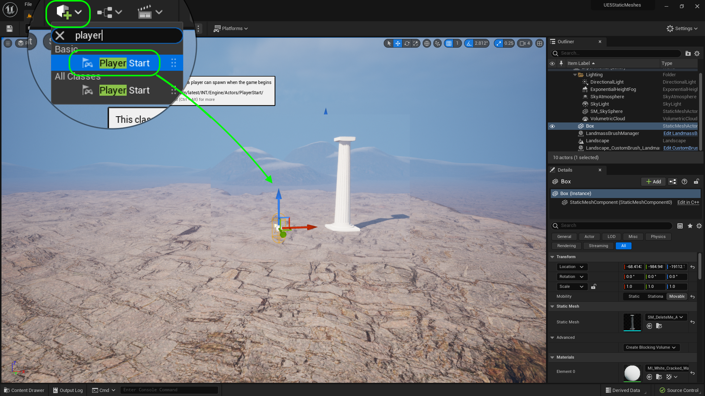
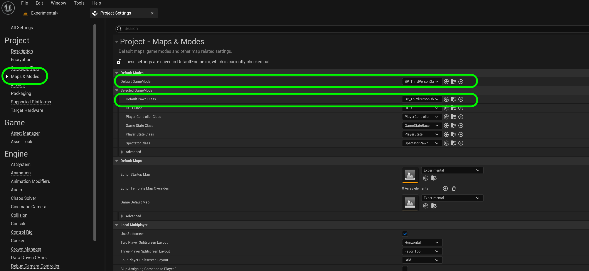
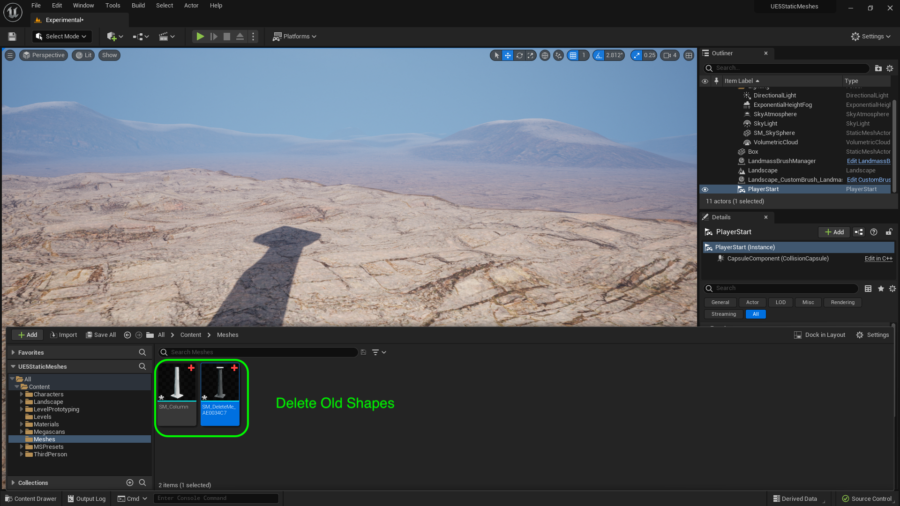
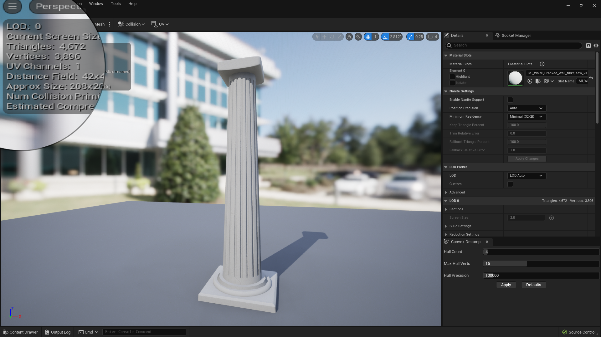
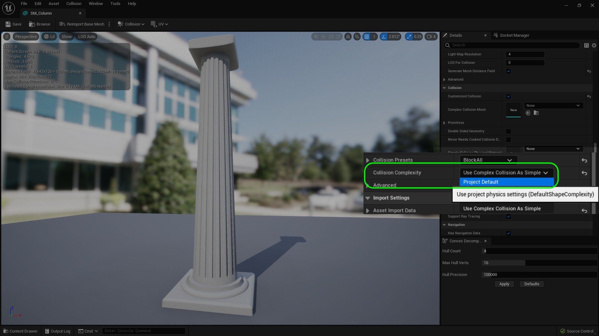
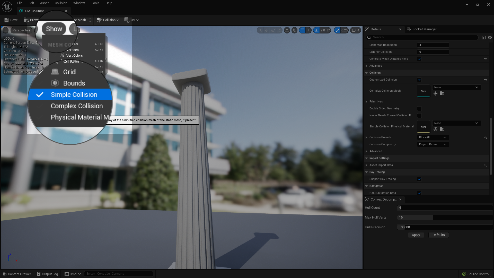
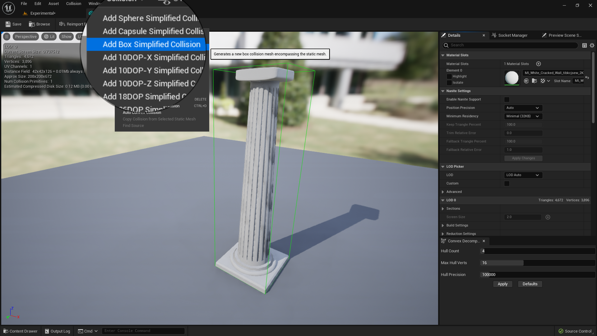
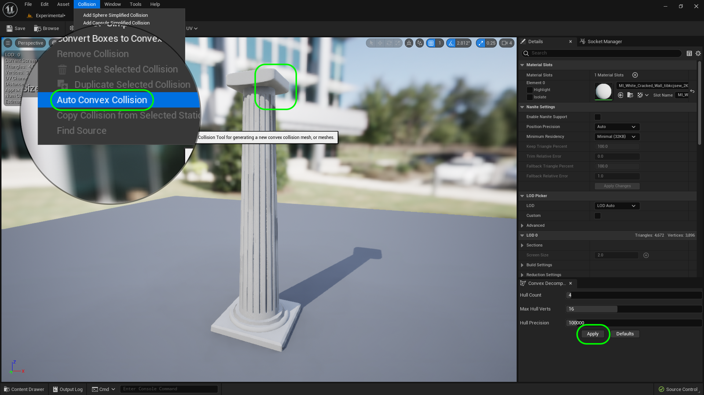

### Collisions

[previous](../basic-column-iii/README.md#user-content-basic-column-iii) • [home](../README.md#user-content-ue5-intro-to-static-meshes) • [next](../basic-column/README.md#)

Now we have the static mesh we can see.  But each model needs a mesh we can't see.  Lets look at collision models to finish up our work so this is usable in the game.

 

---

##### `Step 1.`\|`ITSM`|:small_blue_diamond:

Now lets run around and see this column and check it for scale and collision.  Lets go to **Add Actor** and select a **Player Start** and drag it into the level.  Rotate it to face the column and raise it above the ground then press the <kbd>End</kbd> key to get it on the surface so the player starts on the ground.

##### `Step 2.`\|`ITSM`|:small_blue_diamond: :small_blue_diamond: 

How do I know that it will select the third person player character?  I can go to the **Project Settings | Maps and Modes**.  There I should find the **Default Pawn Class**.  This will be the player that is chosen in ANY level unless it is overiden in the **World Outliner** for that one level. In this case we have **BP_ThirdPersonCharacter** which is the third person pawn that comes with the template.

##### `Step 3.`\|`ITSM`|:small_blue_diamond: :small_blue_diamond: :small_blue_diamond:

Press the <kbd>Play</kbd> button and run around.  Look at the scale to make sure it looks like it is roughly 2 stories tall.  This looks good to me.  Now run into the pillar and check out the collisions.  These also work very well.

https://user-images.githubusercontent.com/5504953/183254544-b9766b3e-9ea5-4c03-9200-47fcdc33af04.mp4

##### `Step 4.`\|`ITSM`|:small_blue_diamond: :small_blue_diamond: :small_blue_diamond: :small_blue_diamond:

Go into your **Content Drawer | Meshes** folder and delete the old temporaray shapes you are not using.  You should have one column left.

##### `Step 5.`\|`ITSM`| :small_orange_diamond:

Now double click on **SM_Column** and look at it in the static mesh viewer.  We shouldsee the model with the material on it.  We should also see the number of triangles and vertices.  Our column has ~4,600 triangles which is not bad.  Now in the past we had to worry a lot about triangle count but for high end PC games Unreal has a feature that makes that problem fairly obsolete.  We will look into that shortly.  

##### `Step 6.`\|`ITSM`| :small_orange_diamond: :small_blue_diamond:

Now the problem when using the Unreal tools for modeling is that it sets the **Collison Complexity** to **Use Complex Collisions as Simple**.  Now what that means is that it is using every point on the existing static mesh to check for collisions.  Now even though UE5 can render a whopping amount of triangles per frame it cannot resolve collisions for all of them.  So this is fine for prototyping but will be non-performant for a final game.  We need to change it to **Project Default** which **REQUIRES** a separate collision model.  Make this change. 

##### `Step 7.`\|`ITSM`| :small_orange_diamond: :small_blue_diamond: :small_blue_diamond:

Press the <kbd>Play</kbd> button and run around notice that there are no collisions!

https://user-images.githubusercontent.com/5504953/183294484-a4f872d9-76ed-4cf5-83ec-4778cafc25e3.mp4

##### `Step 8.`\|`ITSM`| :small_orange_diamond: :small_blue_diamond: :small_blue_diamond: :small_blue_diamond:

In the mesh viewer press the **Show** button and select `Simple Collisions`. 

##### `Step 9.`\|`ITSM`| :small_orange_diamond: :small_blue_diamond: :small_blue_diamond: :small_blue_diamond: :small_blue_diamond:

Now we could pick a box collision.  But the problem is that you would not be able to walk up on the bottom section and it might be too aggressive. This is processor efficient but does not create realistic gameplay.

##### `Step 10.`\|`ITSM`| :large_blue_diamond:

UE5 has really improved its [convex polygon](https://en.wikipedia.org/wiki/Convex_polygon) tool to create decent automatic results.  We could create a simplified mesh over the shape or we can use the 

##### `Step 11.`\|`ITSM`| :large_blue_diamond: :small_blue_diamond: 

##### `Step 12.`\|`ITSM`| :large_blue_diamond: :small_blue_diamond: :small_blue_diamond: 

##### `Step 13.`\|`ITSM`| :large_blue_diamond: :small_blue_diamond: :small_blue_diamond:  :small_blue_diamond: 

##### `Step 14.`\|`ITSM`| :large_blue_diamond: :small_blue_diamond: :small_blue_diamond: :small_blue_diamond:  :small_blue_diamond: 

##### `Step 15.`\|`ITSM`| :large_blue_diamond: :small_orange_diamond: 

##### `Step 16.`\|`ITSM`| :large_blue_diamond: :small_orange_diamond:   :small_blue_diamond: 

##### `Step 17.`\|`ITSM`| :large_blue_diamond: :small_orange_diamond: :small_blue_diamond: :small_blue_diamond:

##### `Step 18.`\|`ITSM`| :large_blue_diamond: :small_orange_diamond: :small_blue_diamond: :small_blue_diamond: :small_blue_diamond:

##### `Step 19.`\|`ITSM`| :large_blue_diamond: :small_orange_diamond: :small_blue_diamond: :small_blue_diamond: :small_blue_diamond: :small_blue_diamond:

##### `Step 20.`\|`ITSM`| :large_blue_diamond: :large_blue_diamond:

##### `Step 21.`\|`ITSM`| :large_blue_diamond: :large_blue_diamond: :small_blue_diamond:

<!--  -->

| [previous](../basic-column-iii/README.md#user-content-basic-column-iii)| [home](../README.md#user-content-ue5-intro-to-static-meshes) | [next](../)|
|---|---|---|
