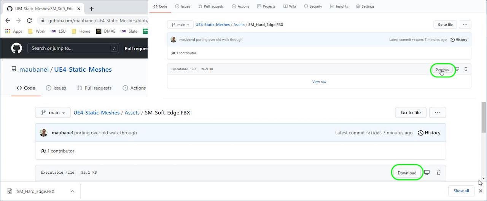
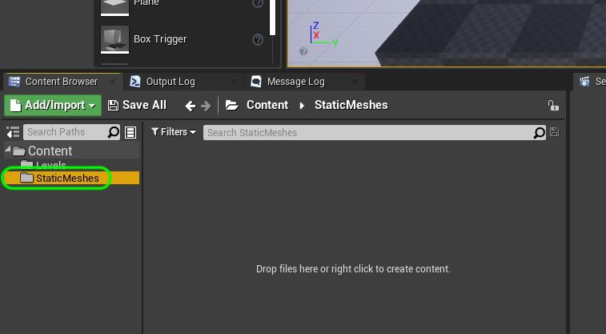
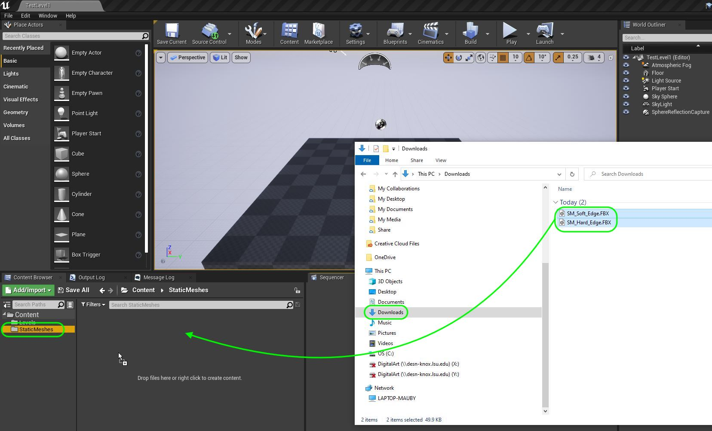
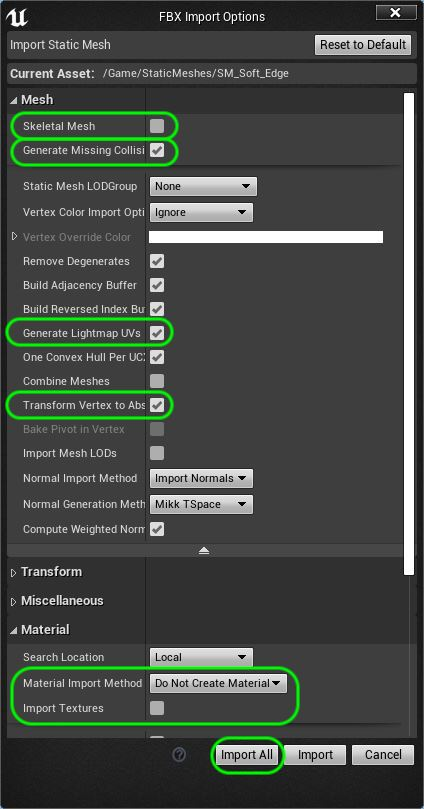
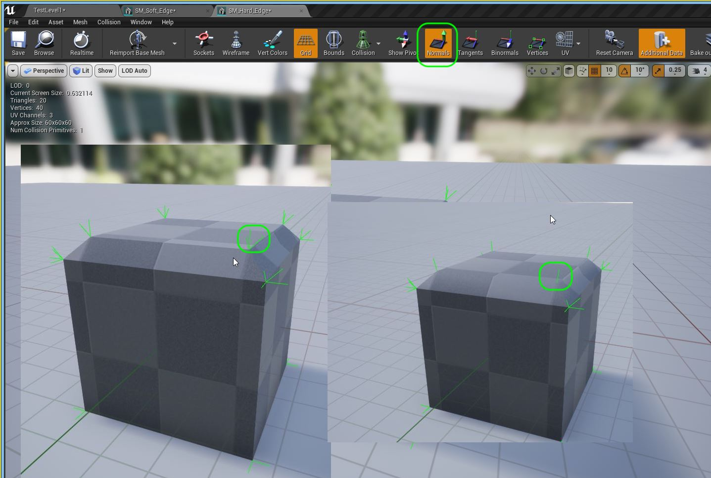
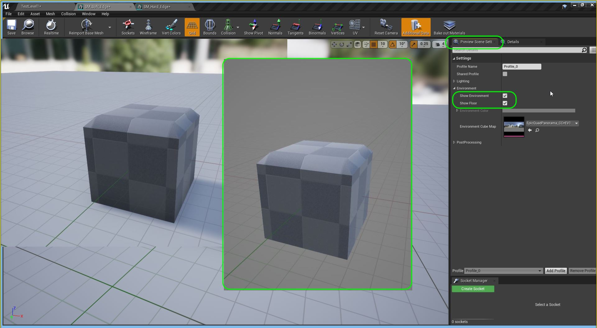
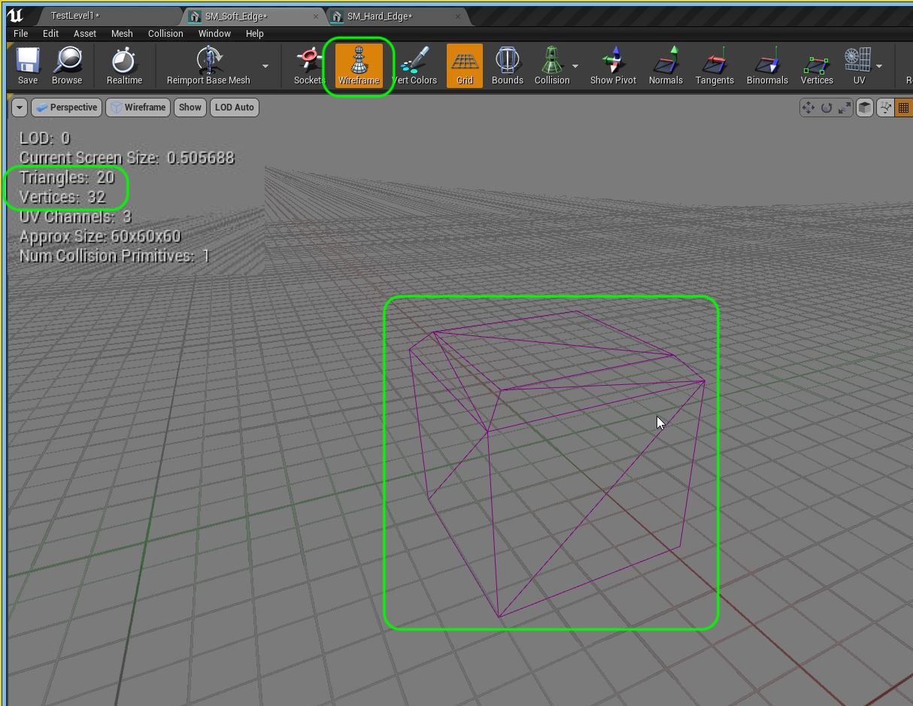

### Edge Normals in Practice

[previous](../lexicon/README.md#user-content-3-d-lexicon) • [home](../README.md#user-content-ue4-static-meshes) • [next](../)

Lets look at how edge normals can change the look of an edge on a shape.  Lets also look at importing static meshes into Unreal. 
 

---

##### `Step 1.`\|`SUU&G`|:small_blue_diamond:

The file format most used is a `.fbx` file. **[FBX](https://en.wikipedia.org/wiki/FBX)**
.  This is a 3-D format that can describe all the parts of a 3-D model and is supported by a large variety of 3-D software packages.  Interoperability between 3-D packages was the key motivation behind the format.

##### `Step 2.`\|`FHIU`|:small_blue_diamond: :small_blue_diamond: 

Download [SM_Hard_Edge.FBX](../Assets/SM_Hard_Edge.FBX) and [SM_Soft_Edge.FBX](../Assets/SM_Soft_Edge.FBX).  

##### `Step 3.`\|`SUU&G`|:small_blue_diamond: :small_blue_diamond: :small_blue_diamond:

Right click in the **Content Browser** tab and add a folder called `StaticMeshes`.  Make sure it is root to **Content**.  

##### `Step 4.`\|`SUU&G`|:small_blue_diamond: :small_blue_diamond: :small_blue_diamond: :small_blue_diamond:

One way to import static meshes that are `.fbx` files is to drag and drop them tinot the folder. Drag the two models by shift selecting them and dragging them into the **Content Browser**.  

##### `Step 5.`\|`SUU&G`| :small_orange_diamond:

Now this brings up the **FBX Import Options** menu.  Lets look at the important options we will use ythe most.  First there are only two types of models, **Static Meshes** and **Skeletal Meshes**.  So the first option if **Skeletal Mesh** is deselected it treats the fbx as a **static mesh**.

We tick **Generate Missing Collisions** as I didn't provide collisions for this model when I created it in **Maya**.  I also didn't create **Lightmap UV's** so we will click that tho `true`.  We also need to set **Transform Vertex to Absolute** to avoid issues when importing collisions with your mesh. We also do not want to create new materials for this model.  Typically we do our materials in a third party package or directly in **Unreal** so typically this is set to **Do Not Create Material** with **Import Textures** set to `false`. Press the <kbd>Import All</kbd> button and import both models into the **StaticMeshes** folder.

##### `Step 6.`\|`SUU&G`| :small_orange_diamond: :small_blue_diamond:

Open up both models in the **UE4** and press the <kbd>Normals</kbd> previewer.  You will see that the model with the soft (rounded) edge has one green edge normal and the sharp edge has three edge normals.

##### `Step 7.`\|`SUU&G`| :small_orange_diamond: :small_blue_diamond: :small_blue_diamond:

We can also look at the vertex locations on the model by selecting <kbd>Verteces</kbd>

##### `Step 8.`\|`SUU&G`| :small_orange_diamond: :small_blue_diamond: :small_blue_diamond: :small_blue_diamond:

Lets look at the faces of the model and not render the material and texture.  We first shoudl turn off the **Show Floor** and **Show Environment** in the **Preview Scene Settings** tab.

##### `Step 9.`\|`SUU&G`| :small_orange_diamond: :small_blue_diamond: :small_blue_diamond: :small_blue_diamond: :small_blue_diamond:

We can now view the cube as a wireframe by pressing the <kbd>Wireframe</kbd> button.  Now even though I modeled using **Quads** in **Maya** it converted them into triangles when importing.  You can see that I have **10 faces** that comprises of **20 triangles**.  We care about how many triangles there are as this affects our performance.

##### `Step 10.`\|`SUU&G`| :large_blue_diamond:

Run the game and position the two cubes in the level.  Move around and look at the edge. One is definitely soft and the other is sharp.  This is not created by the polygons but by the edge normals.

https://user-images.githubusercontent.com/5504953/129449924-235a4913-91a6-4381-9b9c-72026498472b.mp4

##### `Step 11.`\|`SUU&G`| :large_blue_diamond: :small_blue_diamond: 

##### `Step 12.`\|`SUU&G`| :large_blue_diamond: :small_blue_diamond: :small_blue_diamond: 

##### `Step 13.`\|`SUU&G`| :large_blue_diamond: :small_blue_diamond: :small_blue_diamond:  :small_blue_diamond: 

##### `Step 14.`\|`SUU&G`| :large_blue_diamond: :small_blue_diamond: :small_blue_diamond: :small_blue_diamond:  :small_blue_diamond: 

##### `Step 15.`\|`SUU&G`| :large_blue_diamond: :small_orange_diamond: 

##### `Step 16.`\|`SUU&G`| :large_blue_diamond: :small_orange_diamond:   :small_blue_diamond: 

##### `Step 17.`\|`SUU&G`| :large_blue_diamond: :small_orange_diamond: :small_blue_diamond: :small_blue_diamond:

##### `Step 18.`\|`SUU&G`| :large_blue_diamond: :small_orange_diamond: :small_blue_diamond: :small_blue_diamond: :small_blue_diamond:

##### `Step 19.`\|`SUU&G`| :large_blue_diamond: :small_orange_diamond: :small_blue_diamond: :small_blue_diamond: :small_blue_diamond: :small_blue_diamond:

##### `Step 20.`\|`SUU&G`| :large_blue_diamond: :large_blue_diamond:

##### `Step 21.`\|`SUU&G`| :large_blue_diamond: :large_blue_diamond: :small_blue_diamond:

___

| [previous](../lexicon/README.md#user-content-3-d-lexicon)| [home](../README.md#user-content-ue4-static-meshes) | [next](../)|
|---|---|---|
