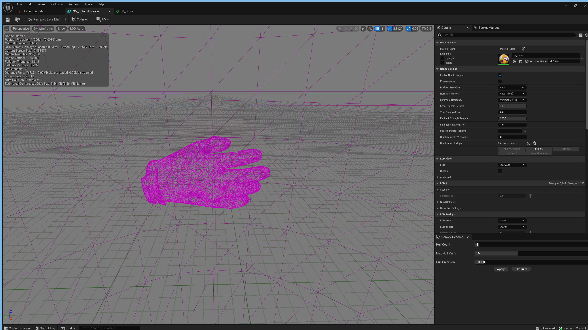

### Importing Mesh II

[previous](../importing-mesh/README.md#user-content-importing-mesh) • [home](../README.md#user-content-ue5-intro-to-static-meshes)

Lets finish up displacing the mesh to createa a high poly nanite model from a non nanite source.

 

---

##### `Step 1.`\|`ITSM`|:small_blue_diamond:

Drag a copy of **SM_Glove** into the level.  Switch to **Modeling** mode and select **Deform | Dsplce**.  Change the **Displacement Type** to `Texture 2D Map`.  Change the **Displace Intensity** to `.15` and **Subdivisions** to `4`. Set the **Displacement Map** to recently imported `T_Glove_H` that we created in **Substance Designer**. Press the <kbd>Accept</kbd> button and wait for the model to be processed.

##### `Step 2.`\|`ITSM`|:small_blue_diamond: :small_blue_diamond: 

Open up **SM_Glove** and take a look at the model.  Now we are over 2 million triangles and the UVs have changed.  But we will leave it here for now.

##### `Step 3.`\|`ITSM`|:small_blue_diamond: :small_blue_diamond: :small_blue_diamond:

Now switch to wireframe so you can see how dense the mesh is.

##### `Step 4.`\|`ITSM`|:small_blue_diamond: :small_blue_diamond: :small_blue_diamond: :small_blue_diamond:

Now zoom in and out of the glove in different visualization modes.  You can see that this is one way of upresing a model even though the original with the normal map l

https://user-images.githubusercontent.com/5504953/184560147-a3a89f75-a892-402f-bdb7-31978da2efa8.mp4

ooks better.  If the artist had provided a height map we could have made it look as good!

##### `Step 5.`\|`ITSM`| :small_orange_diamond:

Select the **File | Save All** then press the <kbd>Source Control</kbd> button and select **Submit Content**.  If you are prompted, select **Check Out** for all items that are not checked out of source control. Update the **Changelist Description** message and with the latest changes. Make sure all the files are correct and press the <kbd>Submit</kbd> button. A confirmation will pop up on the bottom right with a message about a changelist was submitted with a commit number.

| `static.meshes`\|`THE END`| 
| :--- |
| **That's All Folks!** Thanks for sticking around. That's it for this lesson. |

<!--  -->

| [previous](../importing-mesh/README.md#user-content-importing-mesh)| [home](../README.md#user-content-ue5-intro-to-static-meshes) |
|---|---|
