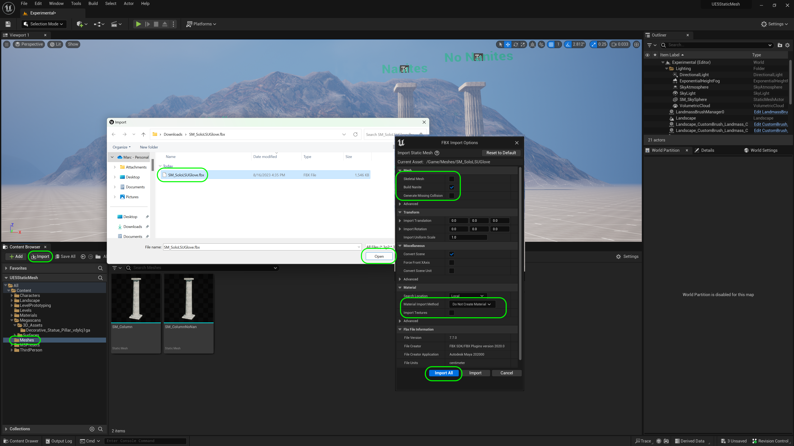
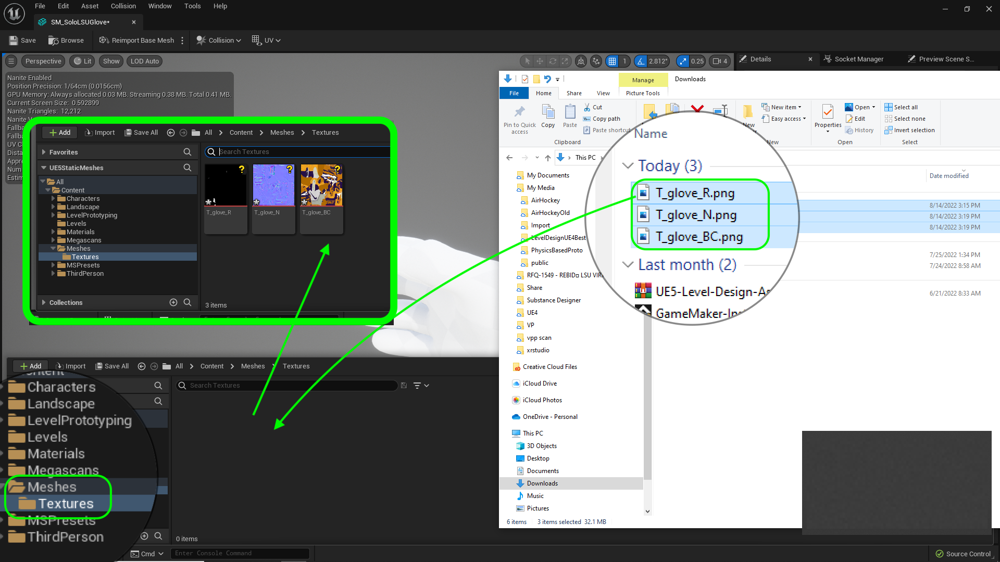

### Importing Mesh

[previous](../pivot-point/README.md#user-content-pivot-point) • [home](../README.md#user-content-ue5-intro-to-static-meshes) • [next](../)

What if we have meshes that were not designed for Nanites.  You can use a height map to displace the geometry then make adjustments to the normal map.  If you do not have a height map you can use **Substance Designer** to spit out a height map.  This is not perfect but will demonstrate a possible work around.

 

---

##### `Step 1.`\|`ITSM`|:small_blue_diamond:

Download a model of the lsu football receiver glove called [SM_SoloLSUGlove.fbx.zip](../Assets/SM_SoloLSUGlove.fbx.zip). Unzip the file then drag and drop it in the **Meshes** folder in Unreal.

##### `Step 2.`\|`ITSM`|:small_blue_diamond: :small_blue_diamond: 

Now we get the import settings menu.  Set **Build Nanite** to `true` and we will build the material seperately so select **Material Import Method** to `Do Not Create Material`. Press the <kbd>Import All</kbd> button then you will get an error about smoothing groups.  This model doesn't use them so we can ignore it by pressing the <kbd>CLEAR</kbd> button.

##### `Step 3.`\|`ITSM`|:small_blue_diamond: :small_blue_diamond: :small_blue_diamond:

Double click the glove static mesh and you will see it in the view.  Take a look at the form in both a lit and wireframe view.  Notice it uses 12,212 triangles.  It has no texture so it is hard to really see the form at the moment.

##### `Step 4.`\|`ITSM`|:small_blue_diamond: :small_blue_diamond: :small_blue_diamond: :small_blue_diamond:

Go to **Meshes** and create a new **Textures** folder.  Download the base color which provides the pixels colors [T_glove_BC.png](../Assets/T_glove_BC.png).  Then download the normal map [T_glove_N.png](../Assets/T_glove_N.png). Finally download the roughness map [T_glove_R.png](../Assets/T_glove_R.png).  Notice the postfix indicates what kind of texture map it is and the prefix is **T** for texture. Drag and drop the above three textures into the new **Textures** folder.

##### `Step 5.`\|`ITSM`| :small_orange_diamond:

Now go to the **Materials** folder and add a new **Material** called `M_Glove`.

##### `Step 6.`\|`ITSM`| :small_orange_diamond: :small_blue_diamond:

##### `Step 7.`\|`ITSM`| :small_orange_diamond: :small_blue_diamond: :small_blue_diamond:

##### `Step 8.`\|`ITSM`| :small_orange_diamond: :small_blue_diamond: :small_blue_diamond: :small_blue_diamond:

##### `Step 9.`\|`ITSM`| :small_orange_diamond: :small_blue_diamond: :small_blue_diamond: :small_blue_diamond: :small_blue_diamond:

##### `Step 10.`\|`ITSM`| :large_blue_diamond:

##### `Step 11.`\|`ITSM`| :large_blue_diamond: :small_blue_diamond: 

##### `Step 12.`\|`ITSM`| :large_blue_diamond: :small_blue_diamond: :small_blue_diamond: 

##### `Step 13.`\|`ITSM`| :large_blue_diamond: :small_blue_diamond: :small_blue_diamond:  :small_blue_diamond: 

##### `Step 14.`\|`ITSM`| :large_blue_diamond: :small_blue_diamond: :small_blue_diamond: :small_blue_diamond:  :small_blue_diamond: 

##### `Step 15.`\|`ITSM`| :large_blue_diamond: :small_orange_diamond: 

##### `Step 16.`\|`ITSM`| :large_blue_diamond: :small_orange_diamond:   :small_blue_diamond: 

##### `Step 17.`\|`ITSM`| :large_blue_diamond: :small_orange_diamond: :small_blue_diamond: :small_blue_diamond:

##### `Step 18.`\|`ITSM`| :large_blue_diamond: :small_orange_diamond: :small_blue_diamond: :small_blue_diamond: :small_blue_diamond:

##### `Step 19.`\|`ITSM`| :large_blue_diamond: :small_orange_diamond: :small_blue_diamond: :small_blue_diamond: :small_blue_diamond: :small_blue_diamond:

##### `Step 20.`\|`ITSM`| :large_blue_diamond: :large_blue_diamond:

##### `Step 21.`\|`ITSM`| :large_blue_diamond: :large_blue_diamond: :small_blue_diamond:

<!--  -->

| [previous](../pivot-point/README.md#user-content-pivot-point)| [home](../README.md#user-content-ue5-intro-to-static-meshes) | [next](../)|
|---|---|---|
