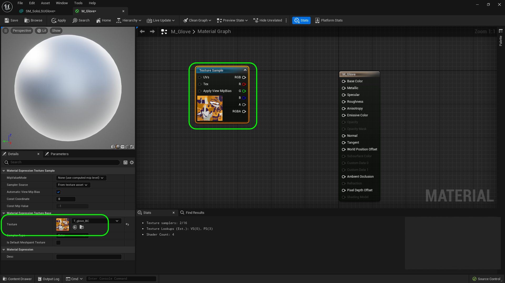
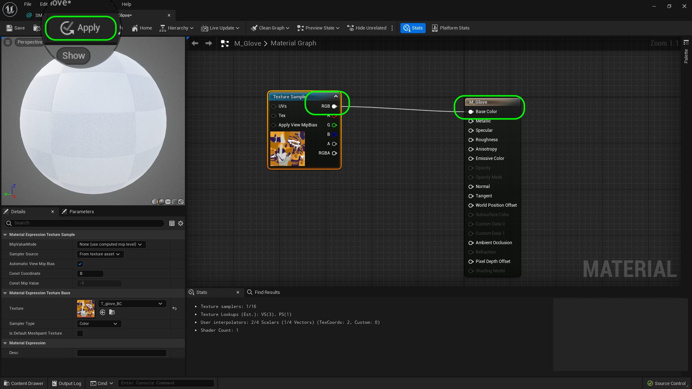
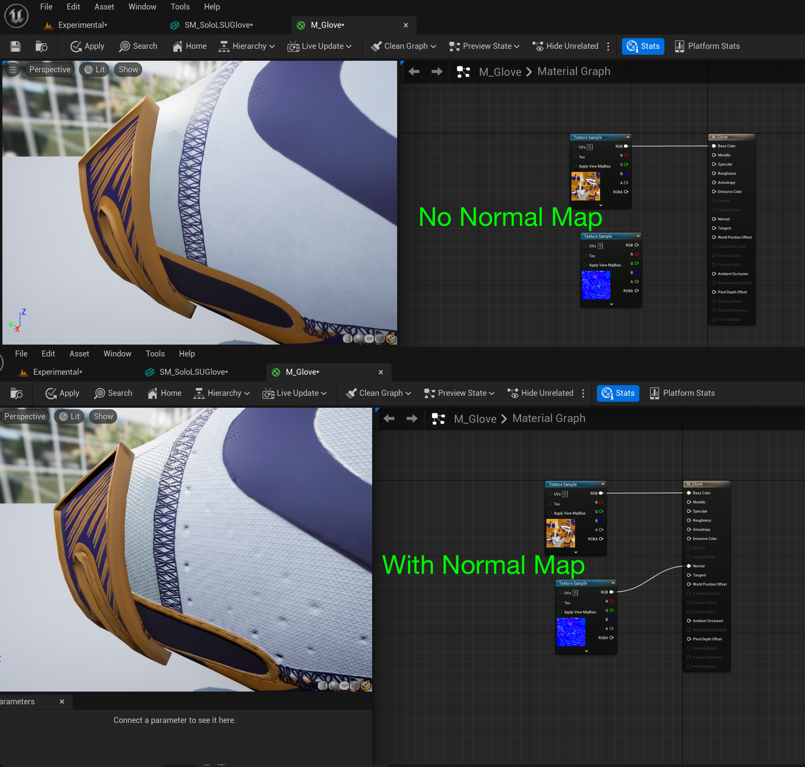
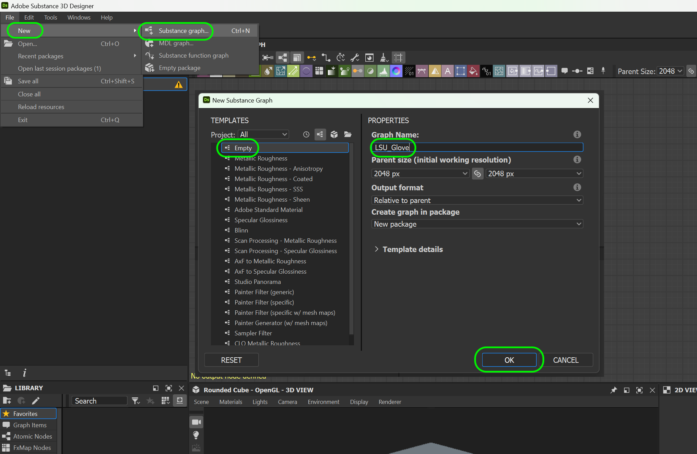

### Importing Mesh

[previous](../pivot-point/README.md#user-content-pivot-point) • [home](../README.md#user-content-ue5-intro-to-static-meshes) • [next](../)

What if we have meshes that were not designed for Nanites.  You can use a height map to displace the geometry then make adjustments to the normal map.  If you do not have a height map you can use **Substance Designer** to spit out a height map.  This is not perfect but will demonstrate a possible work around.

 

---

##### `Step 1.`\|`ITSM`|:small_blue_diamond:

Download a model of the lsu football receiver glove called [SM_SoloLSUGlove.fbx.zip](../Assets/SM_SoloLSUGlove.fbx.zip). Unzip the file then drag and drop it in the **Meshes** folder in Unreal.

##### `Step 2.`\|`ITSM`|:small_blue_diamond: :small_blue_diamond: 

Now we get the import settings menu.  Set **Build Nanite** to `true` and we will build the material seperately so select **Material Import Method** to `Do Not Create Material`. Press the <kbd>Import All</kbd> button then you will get an error about smoothing groups.  This model doesn't use them so we can ignore it by pressing the <kbd>CLEAR</kbd> button.

##### `Step 3.`\|`ITSM`|:small_blue_diamond: :small_blue_diamond: :small_blue_diamond:

Double click the glove static mesh and you will see it in the view.  Take a look at the form in both a lit and wireframe view.  Notice it uses 12,212 triangles.  It has no texture so it is hard to really see the form at the moment.

##### `Step 4.`\|`ITSM`|:small_blue_diamond: :small_blue_diamond: :small_blue_diamond: :small_blue_diamond:

Go to **Meshes** and create a new **Textures** folder.  Download the base color which provides the pixels colors [T_glove_BC.png](../Assets/T_glove_BC.png).  Then download the normal map [T_glove_N.png](../Assets/T_glove_N.png). Finally download the roughness map [T_glove_R.png](../Assets/T_glove_R.png).  Notice the postfix indicates what kind of texture map it is and the prefix is **T** for texture. Drag and drop the above three textures into the new **Textures** folder.

##### `Step 5.`\|`ITSM`| :small_orange_diamond:

Now go to the **Materials** folder and add a new **Material** called `M_Glove`.

##### `Step 6.`\|`ITSM`| :small_orange_diamond: :small_blue_diamond:

Double click **M_Glove** to open up the material and you can hold the <kbd>T</kbd> key and press the left mouse button on the graph.  If that doesn't work right click on the open graph and select a **Texture Sample** node.  Now assign the base color `T_glove_BC` to the **Texture**.

##### `Step 7.`\|`ITSM`| :small_orange_diamond: :small_blue_diamond: :small_blue_diamond:

Connect the **RGB** pin to the **Base Color** pin in the **M_Glove** material node. Press the <kbd>Apply</kbd> button.

##### `Step 8.`\|`ITSM`| :small_orange_diamond: :small_blue_diamond: :small_blue_diamond: :small_blue_diamond:

Now go back to **GM_Glove** and assign `M_Glove` to **Material SLot 0**.  This gives the color for each pixel based on the **UV** map.

##### `Step 9.`\|`ITSM`| :small_orange_diamond: :small_blue_diamond: :small_blue_diamond: :small_blue_diamond: :small_blue_diamond:

Go back to the material and add another **Texture Sample** node (left click on graph while pressing the <kbd>T</kbd> key).  Assign `T_glove_N` as the normal map and attach the **RBG** node to the **Normal** node.  Press the <kbd>Apply</kbd> button.

##### `Step 10.`\|`ITSM`| :large_blue_diamond:

Go back to the model and zoom in.  The normal map makes a huge difference and you can see the texture of the material and the holes in the glove.  So much detail that was not modeled with triangles shows up. 

##### `Step 11.`\|`ITSM`| :large_blue_diamond: :small_blue_diamond: 

Double click on **T_glove_R**.  What black means is that the surface is very smooth and where is is lighter the surface is rougher.  Make sure you just look at the red channel.  A roughness texture is just a single channel gray scale.

##### `Step 12.`\|`ITSM`| :large_blue_diamond: :small_blue_diamond: :small_blue_diamond: 

Now open up the material again and add a third **Texture Sample** node.  Assign `T_glove_R` to it. Pull off the **R** channel and attach it to **Roughness**. Press the <kbd>Apply</kbd> button.

##### `Step 13.`\|`ITSM`| :large_blue_diamond: :small_blue_diamond: :small_blue_diamond:  :small_blue_diamond: 

Now look at the model again and look around it.  You can really see the rubber versus cloth in the glove.  The roughness really makes the glossy portions reflect the light and it is now a complete glove material with just three textures!

##### `Step 14.`\|`ITSM`| :large_blue_diamond: :small_blue_diamond: :small_blue_diamond: :small_blue_diamond:  :small_blue_diamond: 

Now ideally we would have a height map and then we could tesselate then displace the geometry.  In this case we do not so we will do the next best thing and try to convert the normal map to a height map.  Open up **Substance Designer** and select **File | New | Substance graph...**.

##### `Step 15.`\|`ITSM`| :large_blue_diamond: :small_orange_diamond: 

##### `Step 16.`\|`ITSM`| :large_blue_diamond: :small_orange_diamond:   :small_blue_diamond: 

##### `Step 17.`\|`ITSM`| :large_blue_diamond: :small_orange_diamond: :small_blue_diamond: :small_blue_diamond:

##### `Step 18.`\|`ITSM`| :large_blue_diamond: :small_orange_diamond: :small_blue_diamond: :small_blue_diamond: :small_blue_diamond:

##### `Step 19.`\|`ITSM`| :large_blue_diamond: :small_orange_diamond: :small_blue_diamond: :small_blue_diamond: :small_blue_diamond: :small_blue_diamond:

##### `Step 20.`\|`ITSM`| :large_blue_diamond: :large_blue_diamond:

##### `Step 21.`\|`ITSM`| :large_blue_diamond: :large_blue_diamond: :small_blue_diamond:

<!--  -->

| [previous](../pivot-point/README.md#user-content-pivot-point)| [home](../README.md#user-content-ue5-intro-to-static-meshes) | [next](../)|
|---|---|---|
