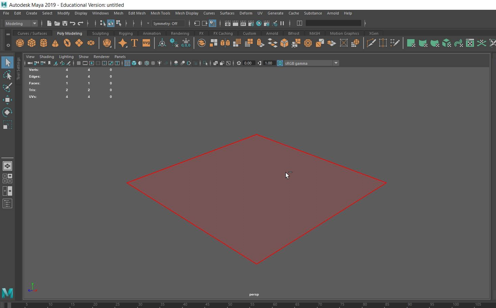
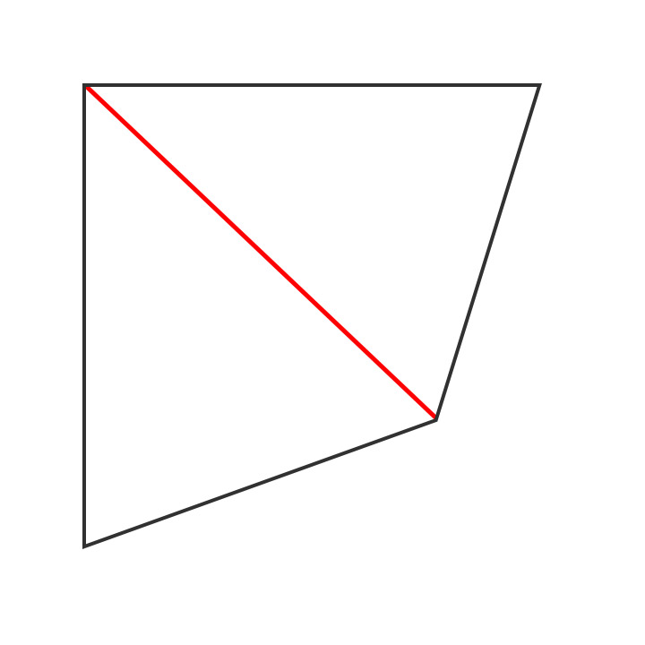
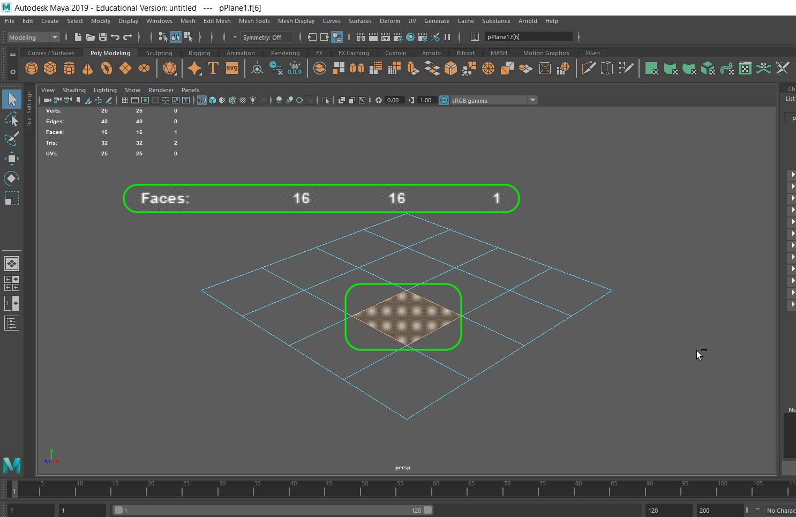
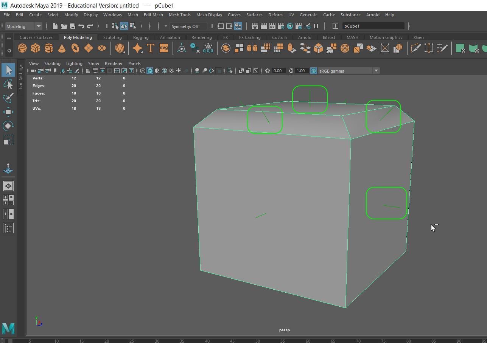
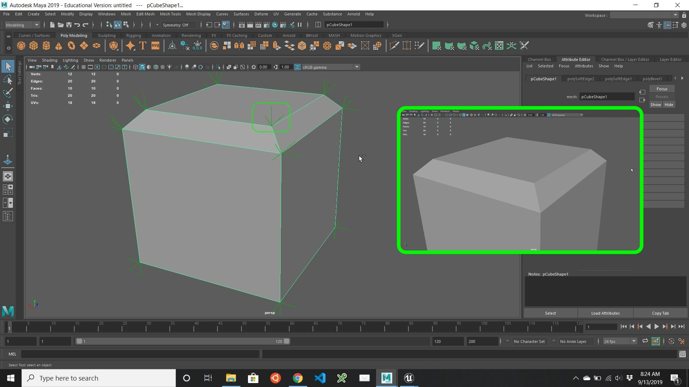
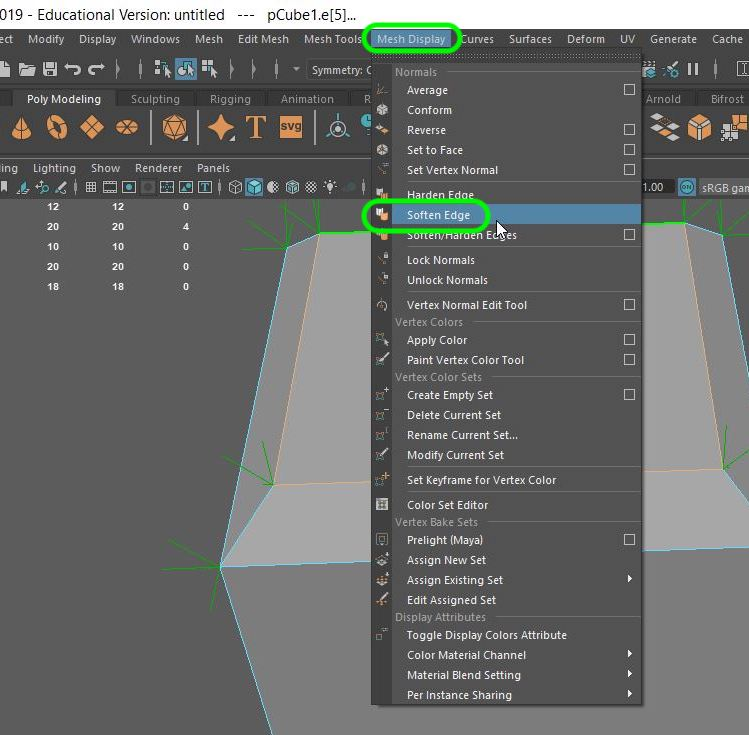
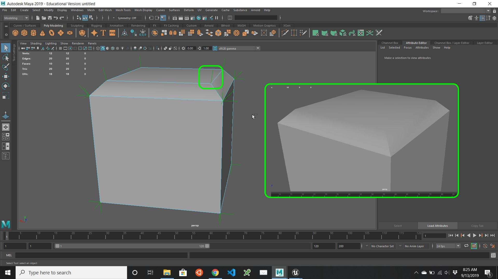

### 3-D Lexicon

[previous](../setting-up/README.md#user-content-setting-up) • [home](../README.md#user-content-ue4-static-meshes) • [next](../)

Lets look at the some terminology and what it means for static meshes (3-D model).

 

---

##### `Step 1.`\|`SUU&G`|:small_blue_diamond:

A static mesh is an approximation of a real world object.  It simplifies the shape to a point where it looks nearly identical to its natural form.  Details can be described through polygons (faces) and with materials and textures (normal maps).  So a detailed object if zoomed in enough will result in a series of simple geometric shapes.

##### `Step 2.`\|`FHIU`|:small_blue_diamond: :small_blue_diamond: 

Lets look at the most obvious part of a static mesh, the [face](polygon)(https://en.wikipedia.org/wiki/Face_(geometry)).  Here it is displayed in **Maya**. It is the area within the edges covering the area of the plane.

##### `Step 3.`\|`SUU&G`|:small_blue_diamond: :small_blue_diamond: :small_blue_diamond:

A face (polygon) is made up of [vertices](https://en.wikipedia.org/wiki/Vertex_(geometry)) and edges.  Lets look at a vertice.  It is an **X, Y, Z** point in 3-D Space. So a 4 sided plane consists of 4 vertices.  

##### `Step 4.`\|`SUU&G`|:small_blue_diamond: :small_blue_diamond: :small_blue_diamond: :small_blue_diamond:

When two vertices connect, we call that an [edge](https://en.wikipedia.org/wiki/Edge_(geometry)). So this plane consists of 4 **Edges**.  Every pair of connected vertices contains one edge. Multiple edges can share the same vertice.  So these 4 edges just have 4 vertices as each one is used twice.

##### `Step 5.`\|`SUU&G`| :small_orange_diamond:

Every group of edges that form a closed polygon is called a face (Yes we have come full circle back to the face).

##### `Step 6.`\|`SUU&G`| :small_orange_diamond: :small_blue_diamond:

In modeling we can look at a 4 sided quadrilateral polygon as containing two triangles (tris).  In a GPU and in Unreal all models are reduced to triangles when drawn. This is done by joining two opposite vertices that are not edges.

##### `Step 7.`\|`SUU&G`| :small_orange_diamond: :small_blue_diamond: :small_blue_diamond:

Now even on a single plane, it can contain multiple faces.  If we divide this one plane up into a 4 by 4 grid.  We get 16 planes. Make **need** to make sure you have no faces that are made up of more than 4 lines.  These Ngons (**N** stands for any number greater than 4) will be problematic in Unreal (and most other 3-D packages as well). Go to **[Turbosqid 3D Resources](https://resources.turbosquid.com/training/modeling/tris-quads-n-gons/)** to get a more detaile description.

Why would we describe a plane with more than a single face?  Two big reasons is that an object can animate (or tessilate) without an edge.  So if we imagine that this flat surface is a cloth flag it can only bend on an edge. There are also many other things we can do with vertices that require denser packing of planes.

##### `Step 8.`\|`SUU&G`| :small_orange_diamond: :small_blue_diamond: :small_blue_diamond: :small_blue_diamond:

Now lets look at some hidden attributes that you don't see but are very important to how surfaces are displayed.  Each **face** has a [normal](https://en.wikipedia.org/wiki/Normal_(geometry)) which is a perpendicular line to the tangent plane of the surface. One use of the normal is for determining how light affects the surface based on this normal and the direction of the light source hitting the face.

##### `Step 9.`\|`SUU&G`| :small_orange_diamond: :small_blue_diamond: :small_blue_diamond: :small_blue_diamond: :small_blue_diamond:

A [vertex normal](https://en.wikipedia.org/wiki/Vertex_normal) has the normals from all adjacent faces.  This way the renderer can figure out where the edge lies for lighting and shading. It can determine how *sharp* an edge is.

##### `Step 10.`\|`SUU&G`| :large_blue_diamond:

These vertex normals can be adjusted to behave differently without adding geometry to the model.  In 3D Studio Max is is called **Smoothing Groups**.  In Maya you can affect the surface normals by softening the edge of the vertex normals on a face.

##### `Step 11.`\|`SUU&G`| :large_blue_diamond: :small_blue_diamond: 

This takes an average of the three vertex normals and softens the edge.  This will be exported and viewable in UE4. Lets look at this in **Unreal**.

___

| [previous](../setting-up/README.md#user-content-setting-up)| [home](../README.md#user-content-ue4-static-meshes) | [next](../)|
|---|---|---|
