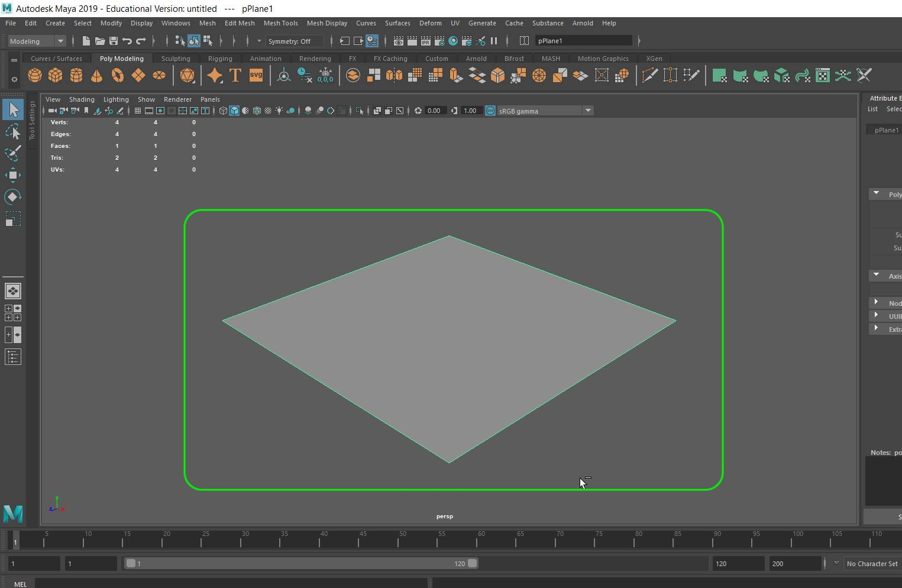
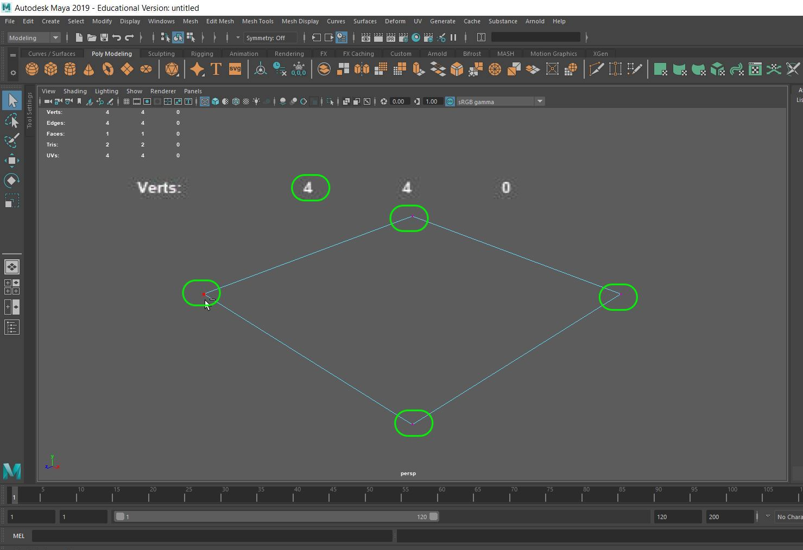
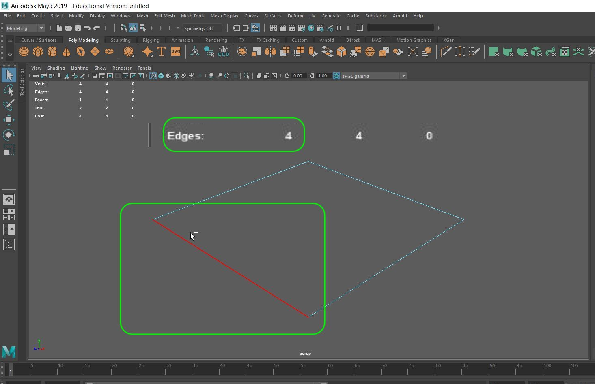

### 3-D Lexicon

[previous](../setting-up/README.md#user-content-setting-up) • [home](../README.md#user-content-ue4-static-meshes) • [next](../)

Lets look at the some terminology and what it means for static meshes (3-D model).

 

---

##### `Step 1.`\|`SUU&G`|:small_blue_diamond:

A static mesh is an approximation of a real world object.  It simplifies the shape to a point where it looks nearly identical to its natural form.  Details can be described through polygons (faces) and with materials and textures (normal maps).  So a detailed object if zoomed in enough will result in a series of simple geometric shapes.

##### `Step 2.`\|`FHIU`|:small_blue_diamond: :small_blue_diamond: 

Lets look at the most obvious part of a static mesh, the [face](polygon)(https://en.wikipedia.org/wiki/Face_(geometry)).  Here it is displayed in **Maya**. It is the area within the edges covering the area of the plane.

##### `Step 3.`\|`SUU&G`|:small_blue_diamond: :small_blue_diamond: :small_blue_diamond:

A face (polygon) is made up of [vertices](https://en.wikipedia.org/wiki/Vertex_(geometry)) and edges.  Lets look at a vertice.  It is an **X, Y, Z** point in 3-D Space. So a 4 sided plane consists of 4 vertices.  

##### `Step 4.`\|`SUU&G`|:small_blue_diamond: :small_blue_diamond: :small_blue_diamond: :small_blue_diamond:

When two vertices connect, we call that an [edge](https://en.wikipedia.org/wiki/Edge_(geometry)). So this plane consists of 4 **Edges**.  Every pair of connected vertices contains one edge. Multiple edges can share the same vertice.  So these 4 edges just have 4 vertices as each one is used twice.

##### `Step 5.`\|`SUU&G`| :small_orange_diamond:

##### `Step 6.`\|`SUU&G`| :small_orange_diamond: :small_blue_diamond:

##### `Step 7.`\|`SUU&G`| :small_orange_diamond: :small_blue_diamond: :small_blue_diamond:

##### `Step 8.`\|`SUU&G`| :small_orange_diamond: :small_blue_diamond: :small_blue_diamond: :small_blue_diamond:

##### `Step 9.`\|`SUU&G`| :small_orange_diamond: :small_blue_diamond: :small_blue_diamond: :small_blue_diamond: :small_blue_diamond:

##### `Step 10.`\|`SUU&G`| :large_blue_diamond:

##### `Step 11.`\|`SUU&G`| :large_blue_diamond: :small_blue_diamond: 

##### `Step 12.`\|`SUU&G`| :large_blue_diamond: :small_blue_diamond: :small_blue_diamond: 

##### `Step 13.`\|`SUU&G`| :large_blue_diamond: :small_blue_diamond: :small_blue_diamond:  :small_blue_diamond: 

##### `Step 14.`\|`SUU&G`| :large_blue_diamond: :small_blue_diamond: :small_blue_diamond: :small_blue_diamond:  :small_blue_diamond: 

##### `Step 15.`\|`SUU&G`| :large_blue_diamond: :small_orange_diamond: 

##### `Step 16.`\|`SUU&G`| :large_blue_diamond: :small_orange_diamond:   :small_blue_diamond: 

##### `Step 17.`\|`SUU&G`| :large_blue_diamond: :small_orange_diamond: :small_blue_diamond: :small_blue_diamond:

##### `Step 18.`\|`SUU&G`| :large_blue_diamond: :small_orange_diamond: :small_blue_diamond: :small_blue_diamond: :small_blue_diamond:

##### `Step 19.`\|`SUU&G`| :large_blue_diamond: :small_orange_diamond: :small_blue_diamond: :small_blue_diamond: :small_blue_diamond: :small_blue_diamond:

##### `Step 20.`\|`SUU&G`| :large_blue_diamond: :large_blue_diamond:

##### `Step 21.`\|`SUU&G`| :large_blue_diamond: :large_blue_diamond: :small_blue_diamond:

___

| [previous](../setting-up/README.md#user-content-setting-up)| [home](../README.md#user-content-ue4-static-meshes) | [next](../)|
|---|---|---|
