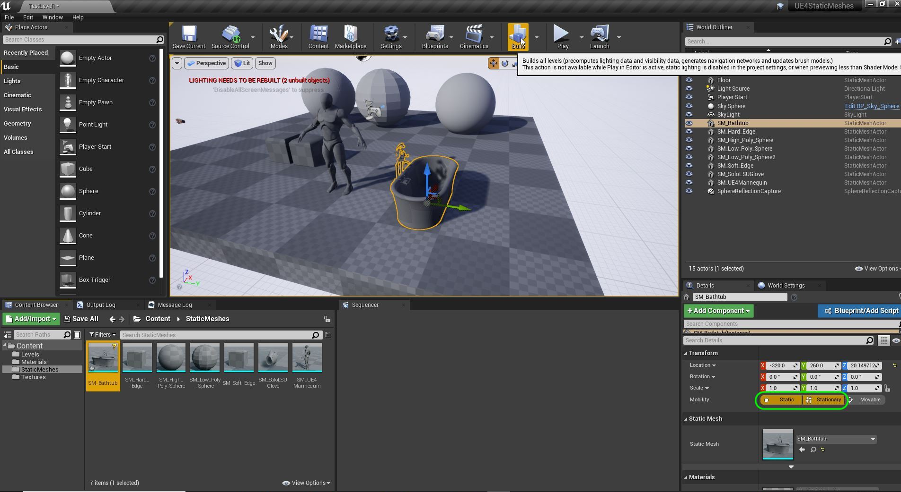
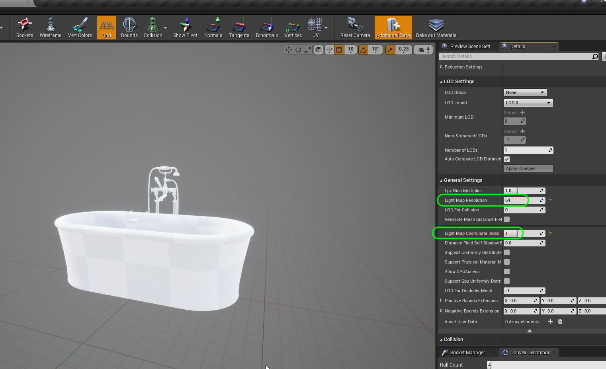
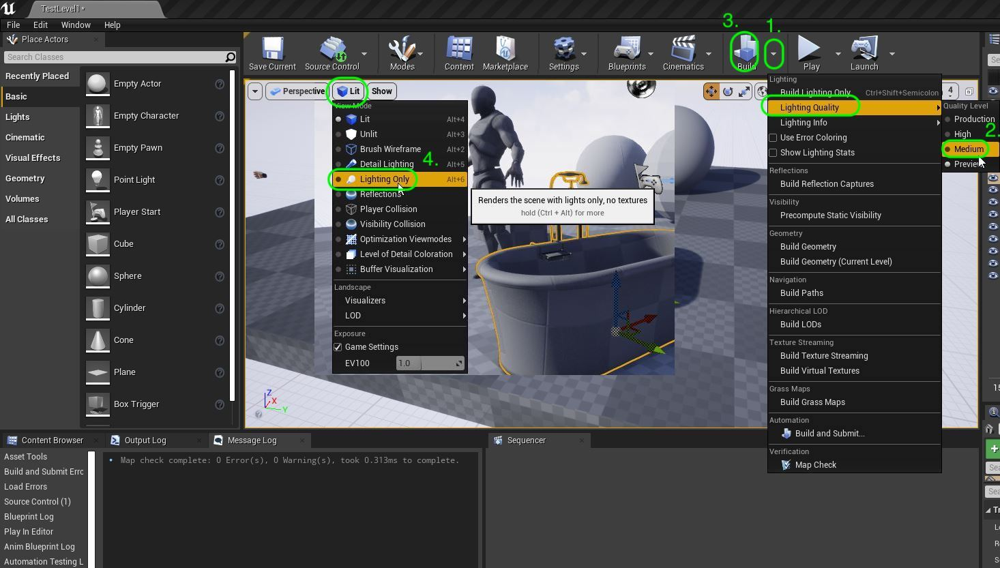
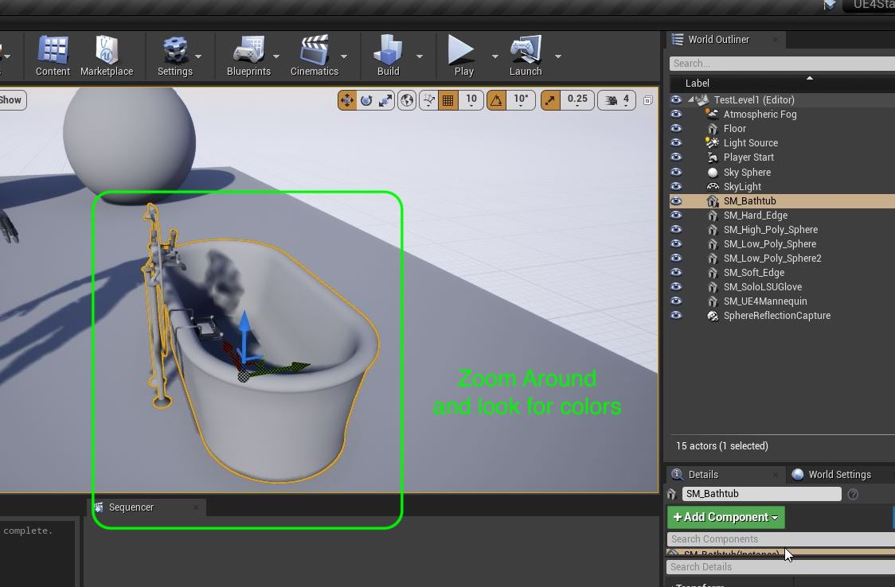
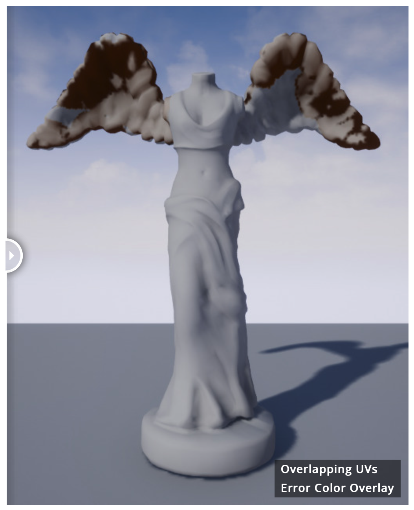
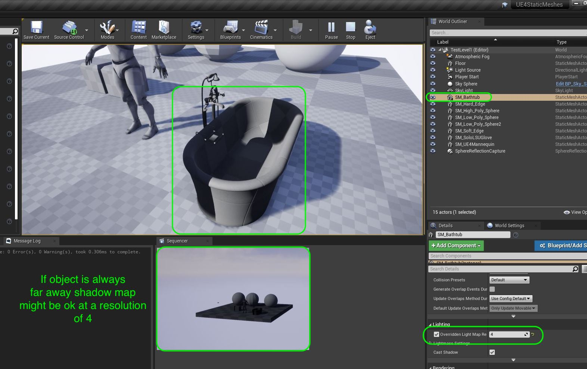
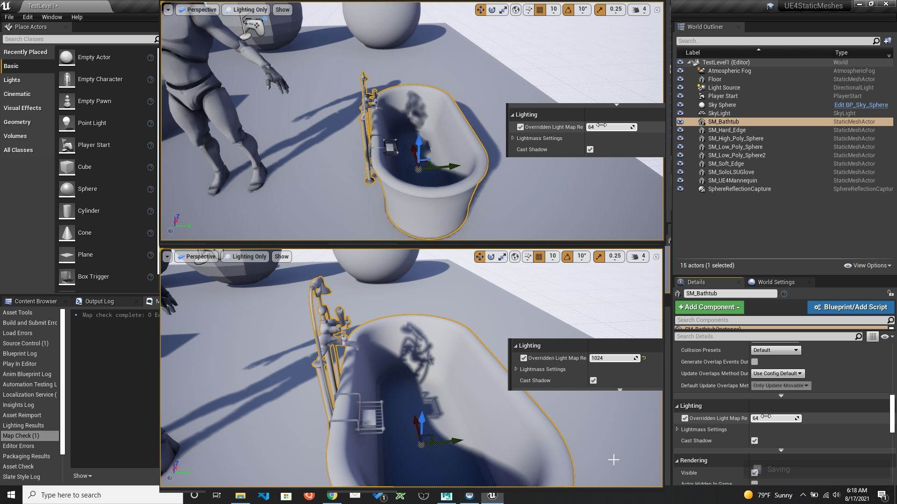
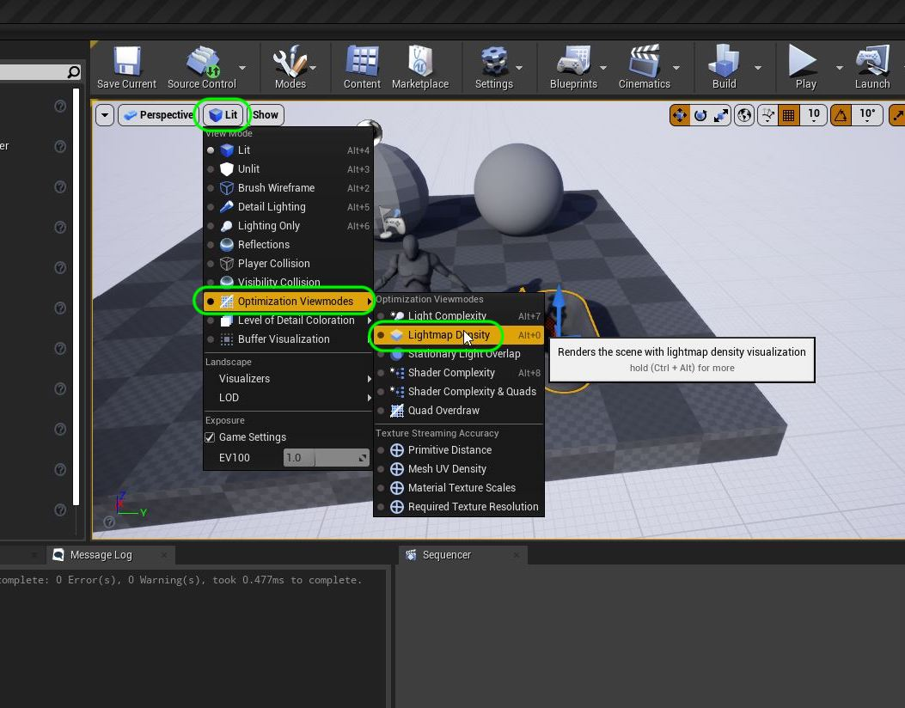
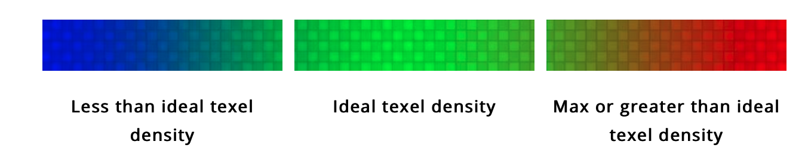
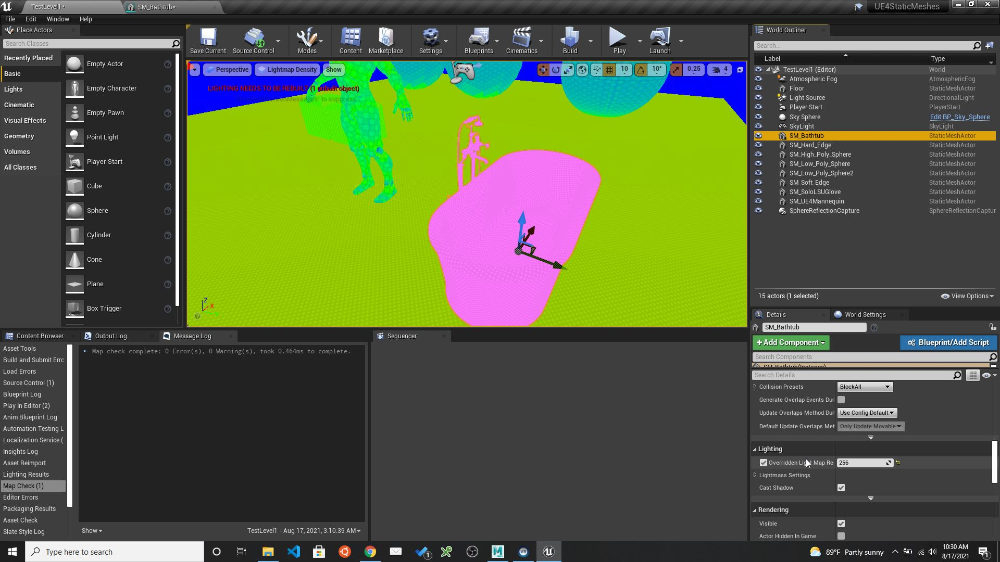

### Lightmap UVs

[previous](../model-maya/README.md#user-content-setting-up-model-in-maya) • [home](../README.md#user-content-ue4-static-meshes) • [next](../)

One of the most expensive parts of a 3-D scene is real time lighting.  Games use a combination of real time lighting and baked lighting to improve performance and make the game look as realistic as possible.  The lighting information is stored inside a shadow map generated by the lightmap UV's.

 

---

##### `Step 1.`\|`SUU&G`|:small_blue_diamond:

If you have a prop that is fixed to the world and does not animate with either user input of physics (getting hit by another object) then the model is marked as **Static** or **Stationary**. That means some lighting will be baked into the scene. This means you have to have a UV channel 1 for the lightmap.  If it was movable it will only use the one uv channel and ignore the second one if provided.

##### `Step 2.`\|`FHIU`|:small_blue_diamond: :small_blue_diamond: 

Now back in the **SM_Bathtub** model viewer the two most important settings are **Light Map Resolution** and **Light Map Coordinate Index**.  Normally the index is `1` but can be changed and the resolution is a power of 2 number (2, 4, 8, 16, 32, 64, 128, 256 etc...). If you ever have a model that does not receive color and the texture is black it is either a problem with the reflection (a reflective surface reflecting black) or one of these two settings.

##### `Step 3.`\|`SUU&G`|:small_blue_diamond: :small_blue_diamond: :small_blue_diamond:

Now there is often an error that comes up in the error menu about incorrect light map UV's.  It is always best to check visually though were we set our **Light Quality** to `Medium` and press the <kbd>Build</kbd> button.  We can then change the lighting scheme to `Lighting Only`.

##### `Step 4.`\|`SUU&G`|:small_blue_diamond: :small_blue_diamond: :small_blue_diamond: :small_blue_diamond:

Now if there were any lightmap errors it would show up as a color.  I only see gray so there are no errors in this model.

Here is an example of a model with lightmap errors and you would see a different color where the UV's are incorrect (on the wings there are overlapping UV's).

##### `Step 5.`\|`SUU&G`| :small_orange_diamond:

Now we can also set a different light map resolution for each instance in the game.  Maybe in some scenes the bathtub will be way in the background where the use can't go and maybe in another scene the user can sit in the bathtub. You can go to **Lighting** and override the setting in the model.  Set the **Overridden lightmap resolution** to `true` and the value to `4`.  Press the <kbd>Build</kbd> button then wait for the scene to build the new shadows.

This is a VERY low resolution map.  This might not be acceptable for close in viewing but for an object in the distance we might be ok with it.  

##### `Step 6.`\|`SUU&G`| :small_orange_diamond: :small_blue_diamond:

Play around with different power of 2 numbers to see the visual difference.  Remember you need to build after each change to build the new shadows in the scene.  How do we tell if we have the right value when it comes to performance?

##### `Step 7.`\|`SUU&G`| :small_orange_diamond: :small_blue_diamond: :small_blue_diamond:

Unreal provides a visualization tool to look at the density of the lighting maps.  Go to ***Light | Optimization Viewmodes** then to **Lightmap Density**.  This will color code our scene.

The colors will appear on a scale from green to red (too many) or to blue (too few).

##### `Step 8.`\|`SUU&G`| :small_orange_diamond: :small_blue_diamond: :small_blue_diamond: :small_blue_diamond:

So now if you make changes to the size of the lightmap density you will see the colors change.  Unreal is saying `4` is too small, and `256` is too large. It is always a balance between performance and visual look so you can still decide how you want to proceed based on the priorities of your project.

___

| [previous](../model-maya/README.md#user-content-setting-up-model-in-maya)| [home](../README.md#user-content-ue4-static-meshes) | [next](../)|
|---|---|---|
