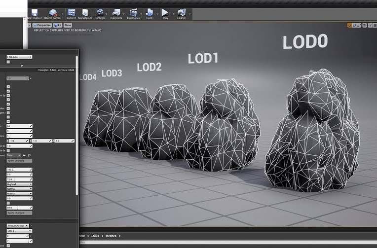
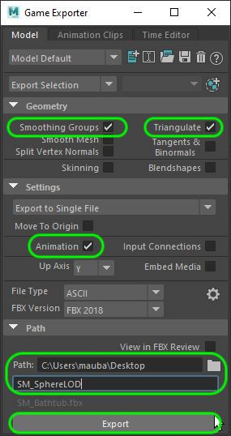
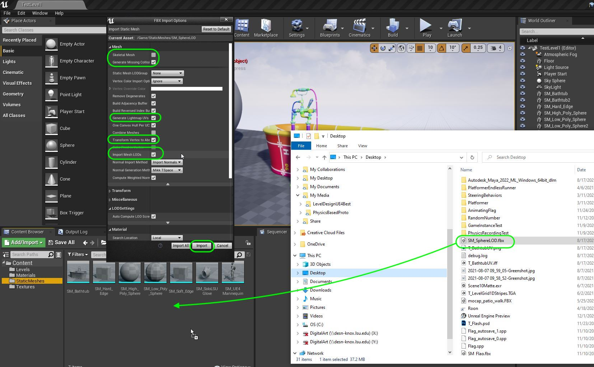
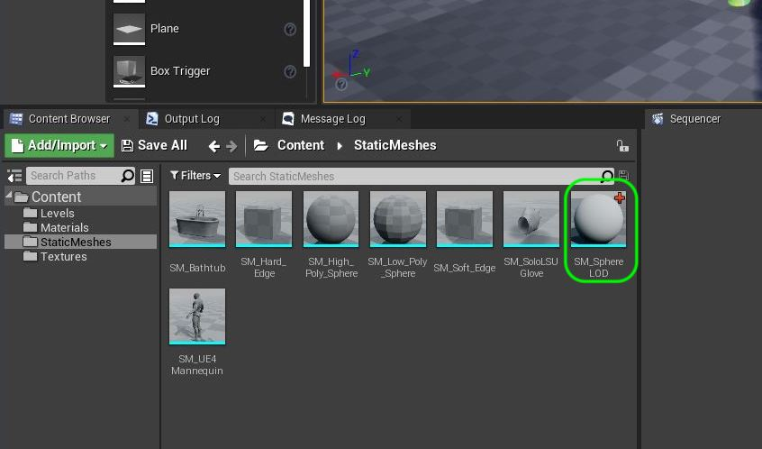
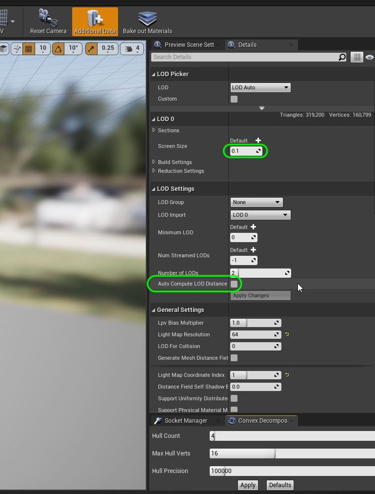

### Levels of Detail (LOD)

[previous](../bathtub-material/README.md#user-content-bathtub-test-material) • [home](../README.md#user-content-ue4-static-meshes) • [next](../)

Levels of detail (LOD) are standard practice to apply when creating models in 3-D games. When an object gets further in a scene less detail is required in both the texture maps and the geometry to accurately represent the model in the scene. This way since most models are far away from the camera we can reduce our total vertice count and the size of our large textures by having lower resolution versions.

 

---

##### `Step 1.`\|`SUU&G`|:small_blue_diamond:

So a different model is loaded based on how far away from the camera the model is. This is called LOD's and is very common in real time simulations to make the game look better and run faster.

##### `Step 2.`\|`FHIU`|:small_blue_diamond: :small_blue_diamond: 

Download and open in Maya [SM_Sphere_LOD.fbx](../Assets/SM_Sphere_LOD.fbx). You will have a **SM_Sphere** and an **SM_Sphere1**.  These are the same two spheres as previous but are in the same file.  We will use the higher poly one when the camera is close and the lower poly one when the camera is far from the sphere.  Press **contrl H** and **shift H** to hide and show the two models.  You need to make sure both models are in the same world space and that the pivot is in the same place.  I have two spheres here right on top of each other.

https://user-images.githubusercontent.com/5504953/129810965-107fab0f-a51d-4578-9b24-7fd9e3d9dc8a.mp4

##### `Step 3.`\|`SUU&G`|:small_blue_diamond: :small_blue_diamond: :small_blue_diamond:

I select in **Object Mode** the highest poly model first then the next level in order from highest detail to smallest.  I press the **Edit | LOD Level of Detail | Create LOD Group**.

https://user-images.githubusercontent.com/5504953/129811510-29e749ea-4f69-421e-b307-a2f7c3fb1b6c.mp4

##### `Step 4.`\|`SUU&G`|:small_blue_diamond: :small_blue_diamond: :small_blue_diamond: :small_blue_diamond:

Open up the **Outliner** and expand the **LOD_Group_1** and look at the LOD's.  I can see the change of model LOD's when zooming in and out of Maya.

https://user-images.githubusercontent.com/5504953/129811684-5ec8e094-ab03-4729-919d-a9ae3c024746.mp4

##### `Step 5.`\|`SUU&G`| :small_orange_diamond:

Use the **File | Game Exporter** option in Maya.  We have only one change to our base settings.  The levels of detail will NOT export wihtout having **Animation** selected.  So select this and then also select **Smoothing Groups** and **Triangulate**.  Pick a **Path** and call it `SM_SphereLOD`. Press the <kbd>Export</kbd> button.

##### `Step 6.`\|`SUU&G`| :small_orange_diamond: :small_blue_diamond:

Drag this file from the operating system folder into the content browser. A message should appear saying the object is being imported. Now an **FBX Import Options** menu appears.    You HAVE to set **Import Mesh LODs** to true for it to work.
 

##### `Step 7.`\|`SUU&G`| :small_orange_diamond: :small_blue_diamond: :small_blue_diamond:

You should now see a static mesh called **SM_Sphere_LOD** that has only one image of a sphere in it (so it is not two objects).

##### `Step 8.`\|`SUU&G`| :small_orange_diamond: :small_blue_diamond: :small_blue_diamond: :small_blue_diamond:

Open up **SM_Sphere_LOD** and you can switch between the two models as it is loaded as one. You can change **LOD** between `LOD 0` and `LOD 1`. Return it to `LOD Auto` so we can see it in the preview window.

https://user-images.githubusercontent.com/5504953/129813840-364f91f2-79b6-4936-8c48-6b85d30feaea.mp4

##### `Step 9.`\|`SUU&G`| :small_orange_diamond: :small_blue_diamond: :small_blue_diamond: :small_blue_diamond: :small_blue_diamond:
Unreal automatically tried to figure out when to go from **LOD 0** to **LOD 1**. If you zoom in and out you can see that it switches almost right away to the lower poly version.

https://user-images.githubusercontent.com/5504953/129814208-e0545a1d-54a5-47e3-a039-e5888f3644fa.mp4

##### `Step 10.`\|`SUU&G`| :large_blue_diamond:

Now you can see the **Current Screen Size** on the menu in the corner of the preview window.  This way I can look and see at what point I want to switch the **LODs**.  I think `0.1` makes a good value.  First I turn off **Auto Compute LOD Distance** then I change the **LOD 0 | Screen Size** to `0.1`.  I then move back and forth and we can see the change. 

##### `Step 11.`\|`SUU&G`| :large_blue_diamond: :small_blue_diamond: 

##### `Step 12.`\|`SUU&G`| :large_blue_diamond: :small_blue_diamond: :small_blue_diamond: 

##### `Step 13.`\|`SUU&G`| :large_blue_diamond: :small_blue_diamond: :small_blue_diamond:  :small_blue_diamond: 

##### `Step 14.`\|`SUU&G`| :large_blue_diamond: :small_blue_diamond: :small_blue_diamond: :small_blue_diamond:  :small_blue_diamond: 

##### `Step 15.`\|`SUU&G`| :large_blue_diamond: :small_orange_diamond: 

##### `Step 16.`\|`SUU&G`| :large_blue_diamond: :small_orange_diamond:   :small_blue_diamond: 

##### `Step 17.`\|`SUU&G`| :large_blue_diamond: :small_orange_diamond: :small_blue_diamond: :small_blue_diamond:

##### `Step 18.`\|`SUU&G`| :large_blue_diamond: :small_orange_diamond: :small_blue_diamond: :small_blue_diamond: :small_blue_diamond:

##### `Step 19.`\|`SUU&G`| :large_blue_diamond: :small_orange_diamond: :small_blue_diamond: :small_blue_diamond: :small_blue_diamond: :small_blue_diamond:

##### `Step 20.`\|`SUU&G`| :large_blue_diamond: :large_blue_diamond:

##### `Step 21.`\|`SUU&G`| :large_blue_diamond: :large_blue_diamond: :small_blue_diamond:

___

| [previous](../bathtub-material/README.md#user-content-bathtub-test-material)| [home](../README.md#user-content-ue4-static-meshes) | [next](../)|
|---|---|---|
