### Setting Up Model in Maya

[previous](../case-study-material/README.md#user-content-case-study---the-material) • [home](../README.md#user-content-ue4-static-meshes) • [next](../)

Now lets look at how we export models from **Maya** (the same rules will apply for other 3-D software).  It is best to load it up first in modeling software and adjust scale to match Unreal's. We will use the same technique that we did in Unreal by importing a scale character model into Maya to scale our objects to the correct size."

 

---

| `required.software`\|`Static Meshes`| 
| :--- |
| :floppy_disk: If you have not already installed **[Maya](https://www.autodesk.com/education/edu-software/overview?sorting=featured&page=1)**, please do so now. The student version is available free of charge and works on mac and pc.|

##### `Step 1.`\|`SUU&G`|:small_blue_diamond:

Open up Maya (after you installed the free student version). First we want to make sure the scale in the modelling software's unit is set to 1 unit is 1 centimeter (cm).  In Maya this can be set in **Windows | Settings/Preferences | Preferences**.

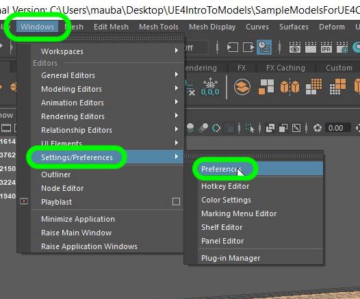

##### `Step 2.`\|`FHIU`|:small_blue_diamond: :small_blue_diamond: 

Select the **Settings** tab and make sure the **Working Units** is set to **centimeter**.  You can keep the units as **Y** up as this can be flipped on the export or import into UE4.  It may be best to stay in the native coordinate system to the software being used.

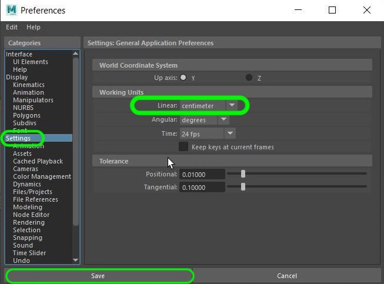

##### `Step 3.`\|`SUU&G`|:small_blue_diamond: :small_blue_diamond: :small_blue_diamond:

Lets make the ground plane grid the same as UE4.  Each grid piece is `10` units.  So in Maya go to **Display** and **Grid** and press the settings square. This puts the grid lines every 10 cm (~4 inches).

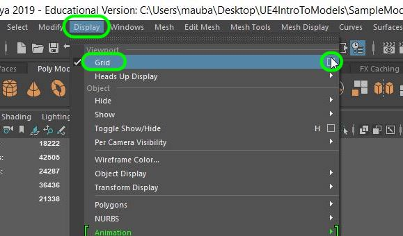

##### `Step 4.`\|`SUU&G`|:small_blue_diamond: :small_blue_diamond: :small_blue_diamond: :small_blue_diamond:
In **Grid Options** adjust **Grid lines every:** to `10.0` units (10 cm or ~4 inches).

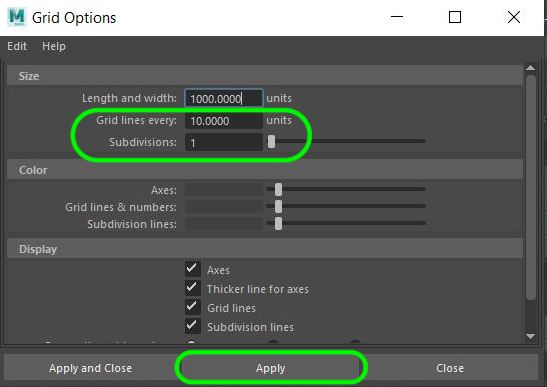

##### `Step 5.`\|`SUU&G`| :small_orange_diamond:

In your modelling scene use a reference object to eyeball scale.  Using a to scale human model in the scene you will not export can help (or scaled reference of what you are trying to model).",

##### `Step 6.`\|`SUU&G`| :small_orange_diamond: :small_blue_diamond:

If you still have th downloaded mannequin model that you used in Unreal you can skip this step.  Otherwise, you download the exact same [Mannequin model](../Assets/SM_UE4Mannequin.fbx).  This way you can bring it into your scene to check scale. Drag it into the modeling window in Maya.

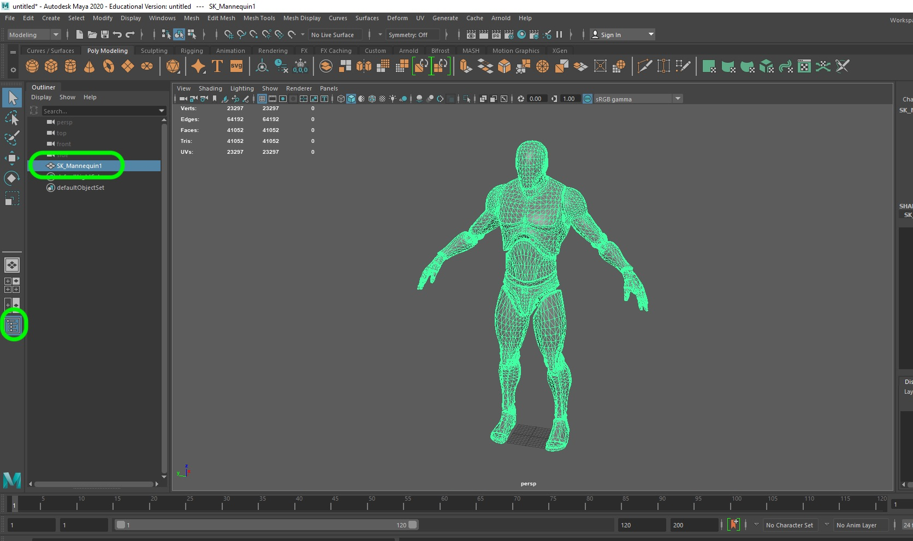

##### `Step 7.`\|`SUU&G`| :small_orange_diamond: :small_blue_diamond: :small_blue_diamond:

Now you can use this reference game model in UE4 and your modeling software.  I have already included it in UE4, check it with the mannequin in the **Mannequin | Character | Mesh | SK_Mannequin**.  It should match the scene in your modeling software.

Now if you game is about insects or giant monsters you might want to use a different object to use to base your scale on.

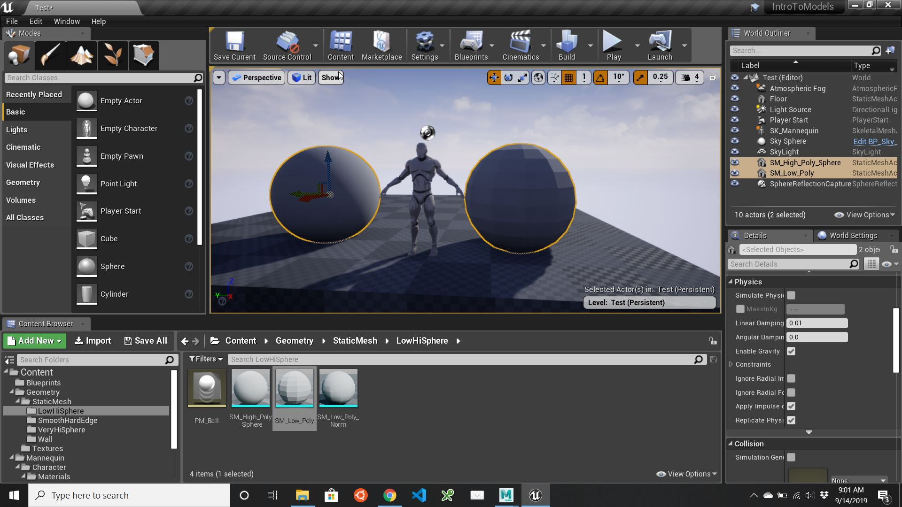

##### `Step 8.`\|`SUU&G`| :small_orange_diamond: :small_blue_diamond: :small_blue_diamond: :small_blue_diamond:

A [UV map](https://en.wikipedia.org/wiki/UV_mapping) is the process of projecting a two dimensional texture onto a 3-D object.  Imagine the model unwrapped into a 2-Dimensional space.  Each group of pixels is mapped to a face on the object.  Here is what a simple cube might look like.

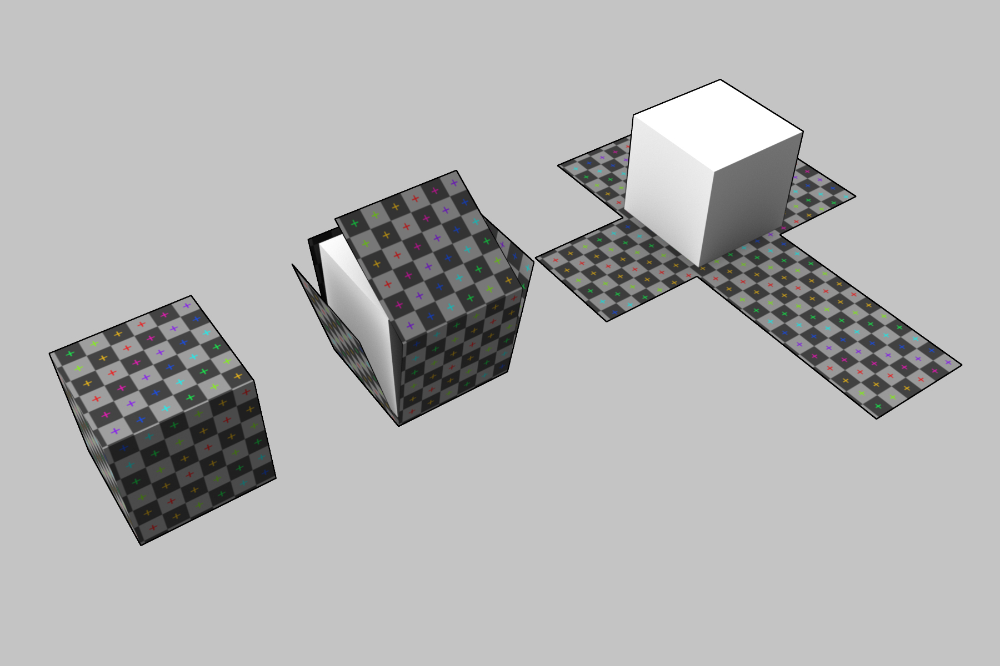

##### `Step 9.`\|`SUU&G`| :small_orange_diamond: :small_blue_diamond: :small_blue_diamond: :small_blue_diamond: :small_blue_diamond:

The **U** is the X axis in the scene and the **V** is the Y axis.  It is a normalized range between `0` and `1` as it can work with a texture of any size.  Please note that the aspect ratio is square.  So most texture maps that are used will be square (unless the UV map is stretched on an axis).  In fact in **Unreal** all textures have to be square to render properly otherwise they will not be [mip-mapped](https://en.wikipedia.org/wiki/Mipmap).

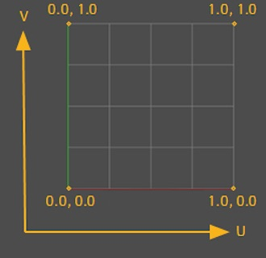

##### `Step 10.`\|`SUU&G`| :large_blue_diamond:

Open up **Maya** with the reference mannequin and download the [SM_Bathtub.FBX](../Assets/SM_Bathtub.FBX) and drag the file into Maya to open it.

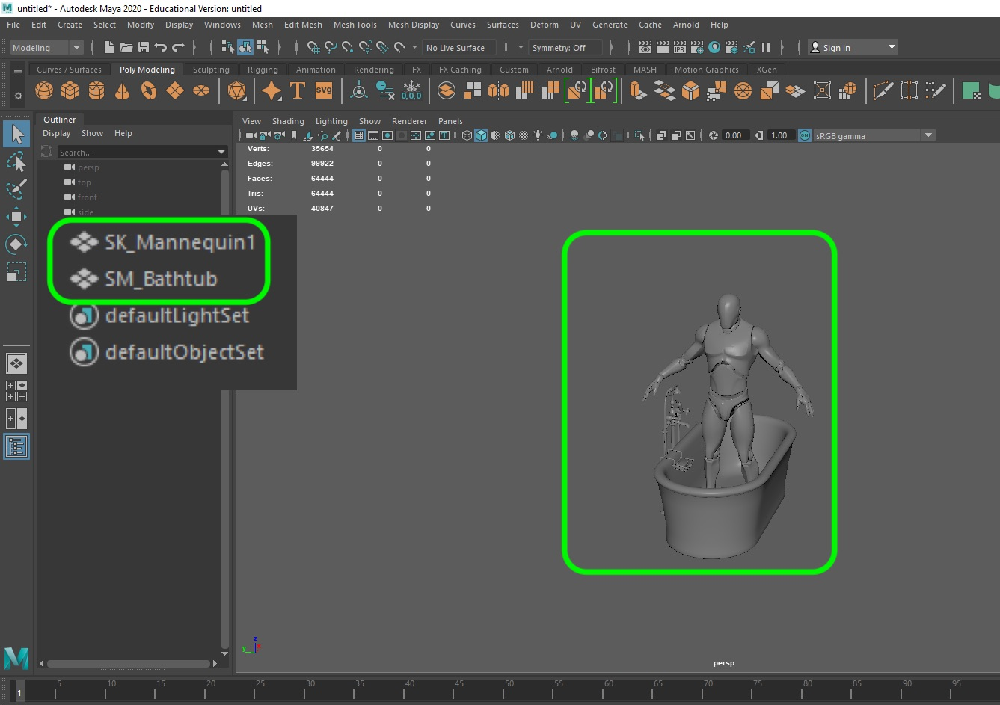

##### `Step 11.`\|`SUU&G`| :large_blue_diamond: :small_blue_diamond: 

Once we are happy with the scale we can hide the model we don't want to see that is not part of the scene.  Select the mannequin model and press the <kbd>cntrl H</kbd> keys to hide.  To show it you can select it again at any time in the **Outliner** and press <kbd>shift H</kbd> to show it again.

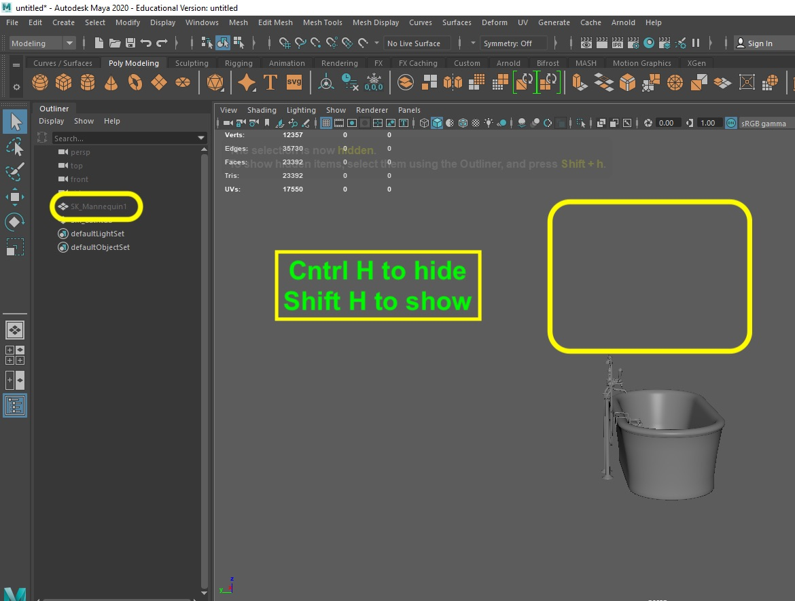

##### `Step 12.`\|`SUU&G`| :large_blue_diamond: :small_blue_diamond: :small_blue_diamond: 

Make sure you are in the **Modelling** toolset. 2. Press the UV Editor button.  3. Click on the model to see where the corresponding mesh appears on the model.  You can see that each mesh has a position in the UV Space all normalized between `0` and `1`.

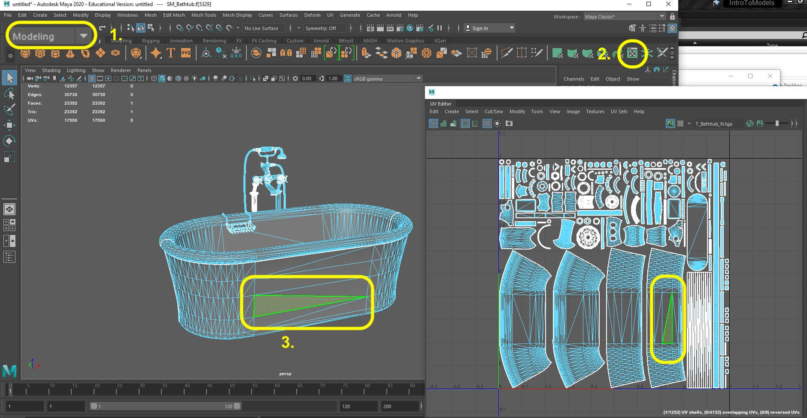

##### `Step 13.`\|`SUU&G`| :large_blue_diamond: :small_blue_diamond: :small_blue_diamond:  :small_blue_diamond: 

You can also preview how a texture will be mapped to see if there is distortion or stretching.  You can press the **Checkerboard** preview button in the **UV Editor**.  Please note this is for previewing only, this will not bake this texture in your model.

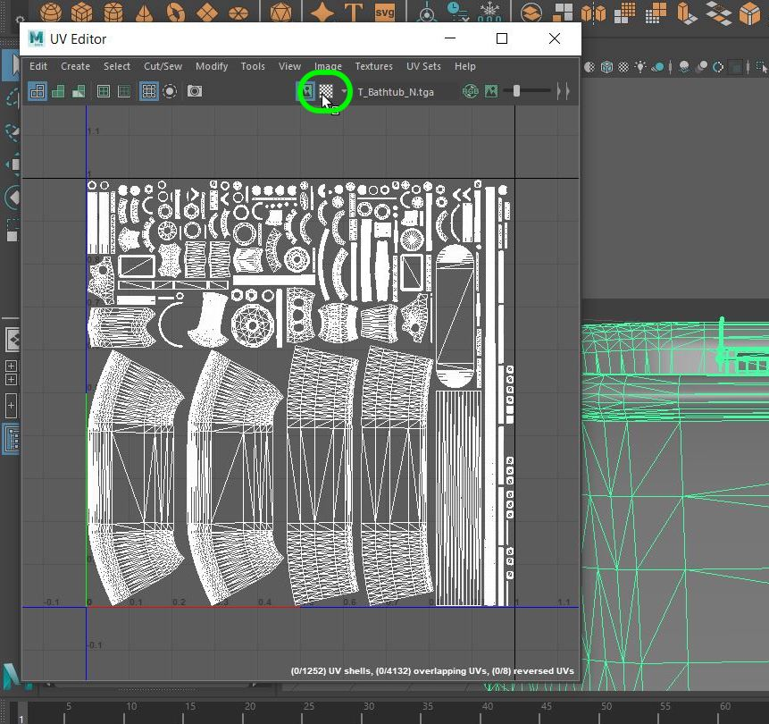

##### `Step 14.`\|`SUU&G`| :large_blue_diamond: :small_blue_diamond: :small_blue_diamond: :small_blue_diamond:  :small_blue_diamond: 

##### `Step 15.`\|`SUU&G`| :large_blue_diamond: :small_orange_diamond: 

##### `Step 16.`\|`SUU&G`| :large_blue_diamond: :small_orange_diamond:   :small_blue_diamond: 

##### `Step 17.`\|`SUU&G`| :large_blue_diamond: :small_orange_diamond: :small_blue_diamond: :small_blue_diamond:

##### `Step 18.`\|`SUU&G`| :large_blue_diamond: :small_orange_diamond: :small_blue_diamond: :small_blue_diamond: :small_blue_diamond:

##### `Step 19.`\|`SUU&G`| :large_blue_diamond: :small_orange_diamond: :small_blue_diamond: :small_blue_diamond: :small_blue_diamond: :small_blue_diamond:

##### `Step 20.`\|`SUU&G`| :large_blue_diamond: :large_blue_diamond:

##### `Step 21.`\|`SUU&G`| :large_blue_diamond: :large_blue_diamond: :small_blue_diamond:

___

| [previous](../case-study-material/README.md#user-content-case-study---the-material)| [home](../README.md#user-content-ue4-static-meshes) | [next](../)|
|---|---|---|
