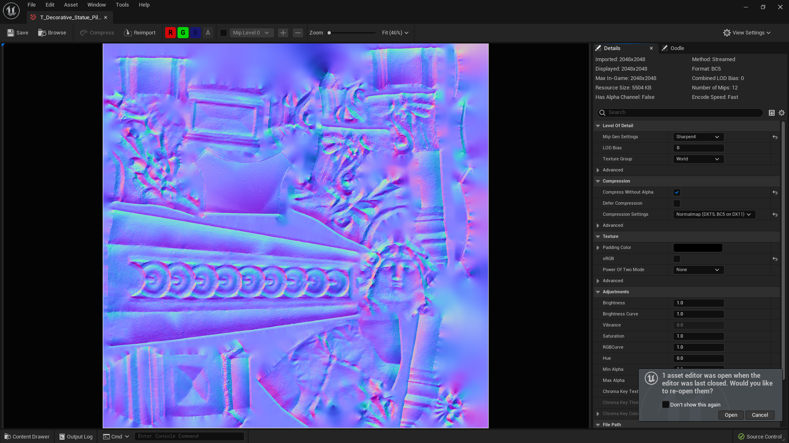

### Nanites II

[previous](../nanites/README.md#user-content-nanites) • [home](../README.md#user-content-ue5-intro-to-static-meshes) • [next](../)

We have looked at the size of nanites and their advantages.  Lets look at performance.

 

---

##### `Step 1.`\|`ITSM`|:small_blue_diamond:

Right click on **Content | Level | Experimental** and select **Duplicate**.  Call this new level `Nanite Statues`.  Open up the new level and delete the two columns and two statues as well as the text on top of it so we just have the landscape.

##### `Step 2.`\|`ITSM`|:small_blue_diamond: :small_blue_diamond: 

Drag the original **SM_Decorative_Statue_Pillar** nanite into the level.  Duplicate it and fill a large area up.  I put around 288 copies of the model which would be 288,000,000 triangles (288 million) as each model has ~1,000,000 triangles.  Make sure you **Player Start** is not inside a statue.  Press the three lines to the left of **Lit** and select `Show FPS`.

Now *press* the <kbd>Play</kbd> button in the top menu bar to launch the game. Run around and you will see the framerate.

https://user-images.githubusercontent.com/5504953/184535866-12079a17-074d-4eee-b92e-9c2b06b78273.mp4

##### `Step 3.`\|`ITSM`|:small_blue_diamond: :small_blue_diamond: :small_blue_diamond:

Right click on **Content | Levels | Nanite Statues** and select **Duplicate** it and call it `NonNaniteStatues`.  Open up this new level by double clicking on it.

##### `Step 4.`\|`ITSM`|:small_blue_diamond: :small_blue_diamond: :small_blue_diamond: :small_blue_diamond:

In the **World Outliner** select all the statues in the level. Now we can edit the **Details** panel and change the **Static Mesh** to `SM_Decorative_Statue_Pillar_NoNan`.

##### `Step 5.`\|`ITSM`| :small_orange_diamond:

Now *press* the <kbd>Play</kbd> button in the top menu bar to launch the game. Now the framerate in my case is about half of what it was when using **Nanites**.

https://user-images.githubusercontent.com/5504953/184536436-a44a3fbd-2da3-4d28-a873-f2ac4107459f.mp4

##### `Step 6.`\|`ITSM`| :small_orange_diamond: :small_blue_diamond:

So how did we create details before when we didn't have nanites (or when we can't use nanites like models with transparency or animated characters)? 

We use a [UV](https://en.wikipedia.org/wiki/UV_mapping) map, which assigns pixels in the image to a face on the model. So this is what a sphere would look like with a map texture applied to the UVs. A UV map is an unwrapped 2-D version of a 3-D Model.  This allows the renderer to know what pixel on the texture in the uv map gets placed where in the model (which is 3-D). For a quick 2 minute dive checkout this [video](https://www.youtube.com/watch?v=mAcEzlsoad0).

##### `Step 7.`\|`ITSM`| :small_orange_diamond: :small_blue_diamond: :small_blue_diamond:

So lets go back to **Quixel Bridge** and download a `Medium` quality **Decorative Statue Pillar**. Press the <kbd>Download</kbd> button and then the <kbd>+ Add</kbd> button to download it and add it to our project. Rename the file to `SM_Decorative_Statue_Pillar_Med`.

##### `Step 8.`\|`ITSM`| :small_orange_diamond: :small_blue_diamond: :small_blue_diamond: :small_blue_diamond:

Just like we can control the normals on an edge to change how light reacts to it.  We can also adjust normals along the face to produce the same effect.  Load up the file in the **Megascans | DecorativeStatuePillar** folder that in my case is called **T_Decorative_Statue_???**. 

What the **RGB** channel holds is **XYZ** data of a [vector](https://en.wikipedia.org/wiki/Euclidean_vector).  This uses the face normal on the high polygon model and encodes it in a pixel on a texture map.  The texture normal map of this sphere looks like this. For a deeper dive take a look at this [CG Video](https://www.youtube.com/watch?v=oOOeV3IU2Yo). here is a normal map created from the high poly sphere. So this tricks the engine to not reflect light at a 90° angle to the face but at a different angle as if there was another face on that area.  They tend to look **blue** as 100% blue is a normal 90° angle.

##### `Step 9.`\|`ITSM`| :small_orange_diamond: :small_blue_diamond: :small_blue_diamond: :small_blue_diamond: :small_blue_diamond:

How does it know where the light reflections get altered?  Well it uses the same **UV** map that it uses to figure out the pixel color. Look at how the shape matches the UV unfolded sections.

Here is is with the Normal Map overlayed over the UVS.

##### `Step 10.`\|`ITSM`| :large_blue_diamond:

Open up **SM_Decorative_Statue_Pillar_Med** and double click the material instance (this file that starts with `MI_`).  Notice that the **Normal Strength** is `1.0` and even though the model only has 2,611 triangles. But there seems to be a lot of detail.

##### `Step 11.`\|`ITSM`| :large_blue_diamond: :small_blue_diamond: 

If you set the **Normal Strength** to `0` then you remove the normal map and you can see that the underlying geometry does not provide much detail to the shape of the statue.  It is important to relalize that this is not new geometry but an illusion by bending the light when it hits a face as if the face was more complex.  Look at the sihouette of the model and you will see more jagged bits.

##### `Step 12.`\|`ITSM`| :large_blue_diamond: :small_blue_diamond: :small_blue_diamond: 

Now reopen **Level | Experimental** and add **SM_Decorative_Statue_Pillar_Med**  to the left of the other statues.  Copy a text to describe our third version of the statue.

##### `Step 13.`\|`ITSM`| :large_blue_diamond: :small_blue_diamond: :small_blue_diamond:  :small_blue_diamond: 

Zoom into the medium quality model then the nanites model.  Notice that the effect of the normal map doesn't work when really close and you can see lots of sharp edges.  Look at the scene in **Lit** and **Wireframe** mode.  Now when you play the game if you run by quickly it might be a subtle difference.

##### `Step 14.`\|`ITSM`| :large_blue_diamond: :small_blue_diamond: :small_blue_diamond: :small_blue_diamond:  :small_blue_diamond: 

Select the **File | Save All** then press the <kbd>Source Control</kbd> button and select **Submit Content**.  If you are prompted, select **Check Out** for all items that are not checked out of source control. Update the **Changelist Description** message and with the latest changes. Make sure all the files are correct and press the <kbd>Submit</kbd> button. A confirmation will pop up on the bottom right with a message about a changelist was submitted with a commit number.

##### `Step 15.`\|`ITSM`| :large_blue_diamond: :small_orange_diamond: 

Confirm that the data got sent to the **Perforce** server by going to the **History** tab in **P4V** to confirm that you see the message you just entered above.

##### `Step 16.`\|`ITSM`| :large_blue_diamond: :small_orange_diamond:   :small_blue_diamond: 

##### `Step 17.`\|`ITSM`| :large_blue_diamond: :small_orange_diamond: :small_blue_diamond: :small_blue_diamond:

##### `Step 18.`\|`ITSM`| :large_blue_diamond: :small_orange_diamond: :small_blue_diamond: :small_blue_diamond: :small_blue_diamond:

##### `Step 19.`\|`ITSM`| :large_blue_diamond: :small_orange_diamond: :small_blue_diamond: :small_blue_diamond: :small_blue_diamond: :small_blue_diamond:

##### `Step 20.`\|`ITSM`| :large_blue_diamond: :large_blue_diamond:

##### `Step 21.`\|`ITSM`| :large_blue_diamond: :large_blue_diamond: :small_blue_diamond:

<!--  -->

| [previous](../nanites/README.md#user-content-nanites)| [home](../README.md#user-content-ue5-intro-to-static-meshes) | [next](../)|
|---|---|---|
