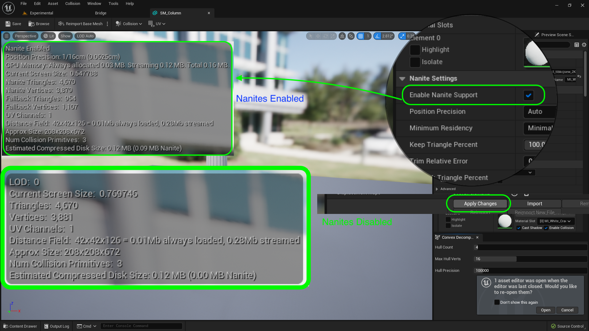
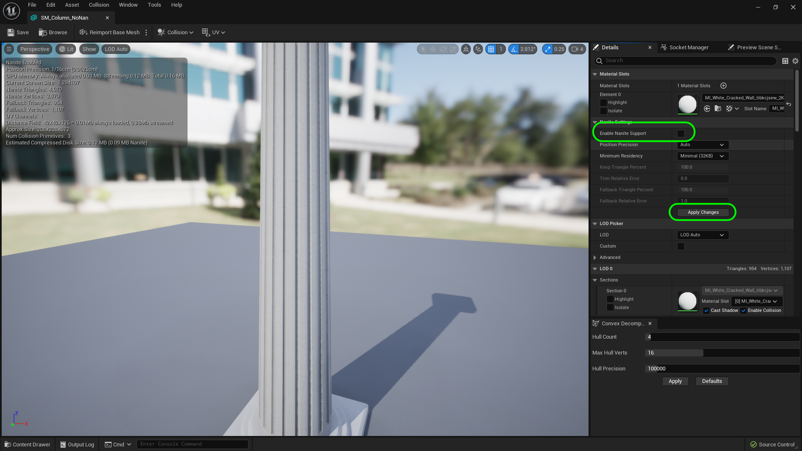
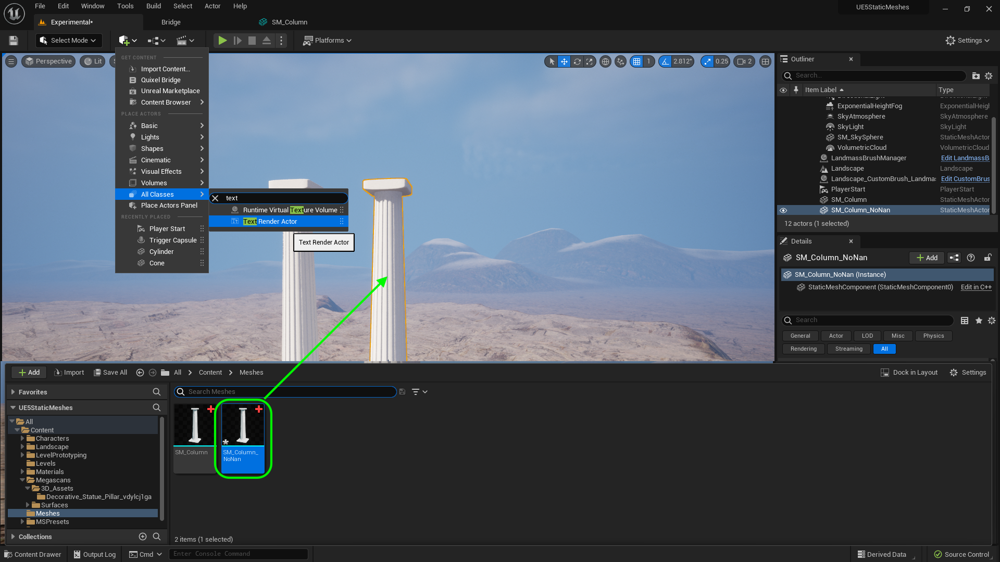
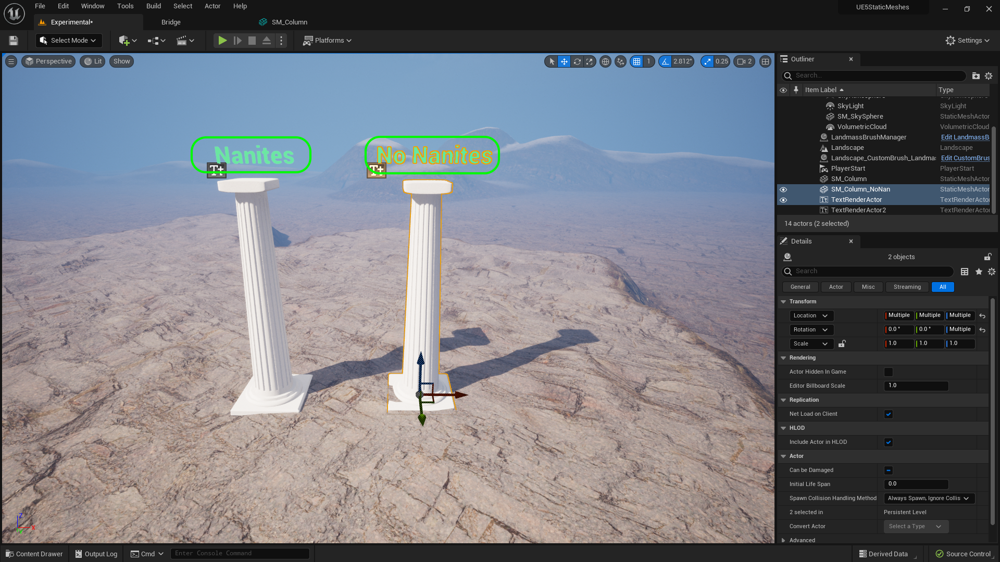
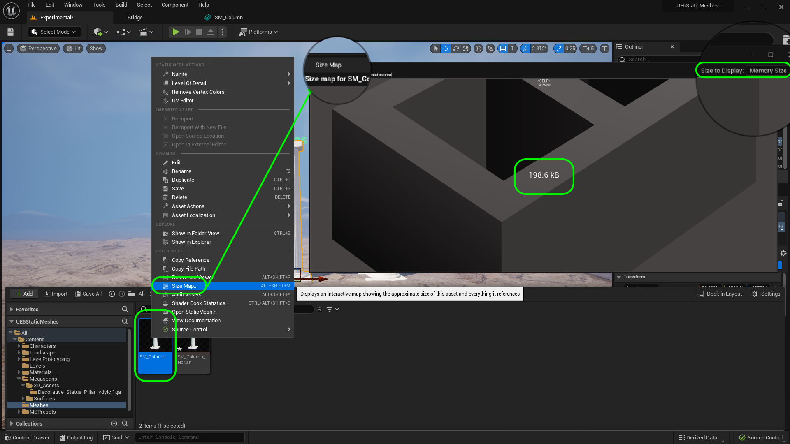
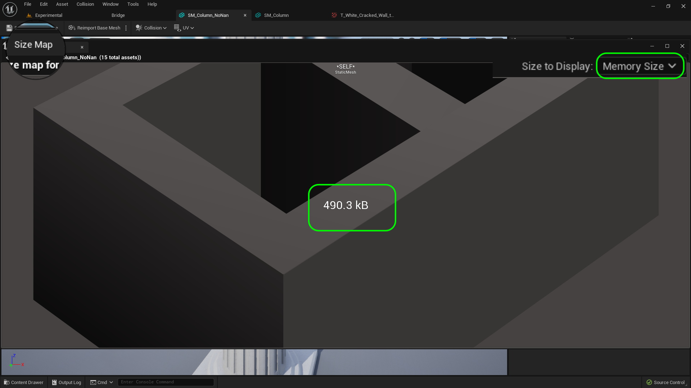
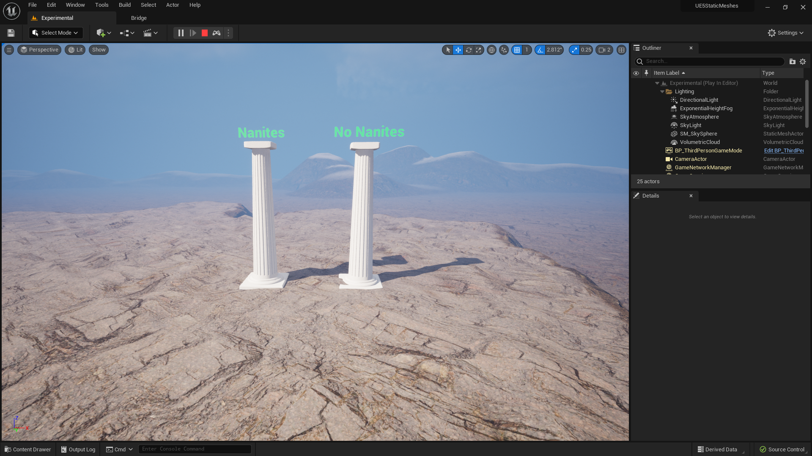
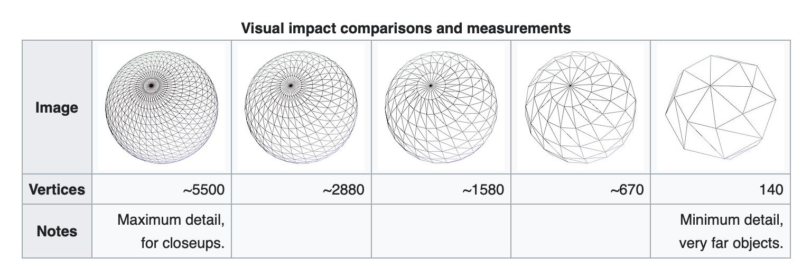
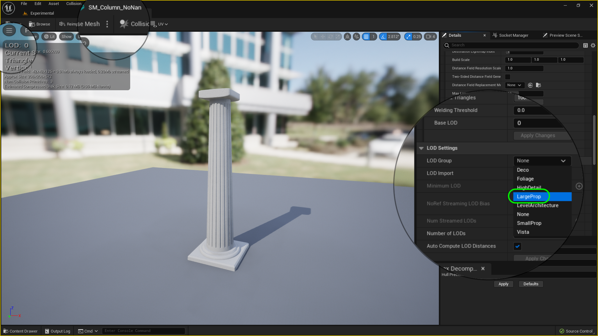

### Nanites

[previous](../uvs/README.md#user-content-uvs) • [home](../README.md#user-content-ue5-intro-to-static-meshes) • [next](../)

[Nanites](https://docs.unrealengine.com/5.0/en-US/nanite-virtualized-geometry-in-unreal-engine/) are a game change in Unreal Engine 5. This is a virtual geometry system that uses its own mesh format and rendering technology to limit how many polygone it renders.  It tries to to keep it so that a screen pixel contains a single polygon.  It also compresses and streams in the levels of detail.  This ulitmately allows us to have much greater geometrical complexity (and rely less on normal maps to create surface topoolgy) and MUCH higher triangle and object counts than prior.  Frame budgets are not constraint by draw calls and poly counts. The artist no longer needs to create LODs (Level of Detail) lower poly meshes as this is handled automatically by the engine. 

 

---

##### `Step 1.`\|`ITSM`|:small_blue_diamond:

There are two ways of turning on Nanites.  You can double click on the **SM_Column** static mesh and turn them on the viewer.  Or you can right click on the mesh and **Enable Nanite**.  If you do it in the viewer you will see the stats change.  Play attention to **LOD** (Level of Detail) changing to **Nanite Enabled**.

##### `Step 2.`\|`ITSM`|:small_blue_diamond: :small_blue_diamond: 

Now lets duplicate the column and see the difference between a static mesh using nanites and no nanites. Right click on **SM_Column** and select **Duplicate** and call the new mesh `SM_Column_NoNan`.

##### `Step 3.`\|`ITSM`|:small_blue_diamond: :small_blue_diamond: :small_blue_diamond:

Open up **SM_Column_NoNan** and turn off nanites on this model. Press the <kbd>Apply Changes</kbd> button.

##### `Step 4.`\|`ITSM`|:small_blue_diamond: :small_blue_diamond: :small_blue_diamond: :small_blue_diamond:

Drag a copy of **SM_Column_NoNan** into the level to the right of the column with **Nanites** on. Press the <kbd>Add Content</kbd> button and choose **All Classes | Text Render Actor**.

##### `Step 5.`\|`ITSM`| :small_orange_diamond:

Adjust the text size and place it on top of the column on the right.  Change the text to `No Nanites`. Give it a color that contrasts with the sky.  Duplicate the text and move it to the column on the left and change it to `Nanites`.

##### `Step 6.`\|`ITSM`| :small_orange_diamond: :small_blue_diamond:

Right click on **SM_Column** and select **Size Map**.  Press the **Size to Display** to `Memory Size`.  Notice that in my case the model takes up 198.6Kb of RAM.  

##### `Step 7.`\|`ITSM`| :small_orange_diamond: :small_blue_diamond: :small_blue_diamond:

Right click on **SM_Column_NoNan** and select **Size Map**.  Press the **Size to Display** to `Memory Size`. So the size on disk is the same but the size in memory for nanites and non-nanite meshes are quite different. The non-nanite version takes up 2.5 times more space (it will be more dramatic in larger models). So there is a huge advantage for non-nanite models as they take up less memory in game as the data is highly compressed.

##### `Step 8.`\|`ITSM`| :small_orange_diamond: :small_blue_diamond: :small_blue_diamond: :small_blue_diamond:

Now *press* the <kbd>Play</kbd> button in the top menu bar to launch the game. Now change to **Wireframe** view mode (from **Lit**).  Then move backwards and forwards.  If you look carefully the density of the mesh will change on the left nanite model and will try and keep it to no more than one triangle per pixel.  Whereas the non nanite nesh will render all the triangles so there are far more triangles per pixels and the mesh becomes a solid blob, wher you can still make out faces on the nanite mesh.  But when you get closer the rull resolution appears.

https://user-images.githubusercontent.com/5504953/184508765-0a79bc08-9555-42e3-8dae-0193d0332817.mp4

##### `Step 9.`\|`ITSM`| :small_orange_diamond: :small_blue_diamond: :small_blue_diamond: :small_blue_diamond: :small_blue_diamond:

A nanite mesh can really be dense ~>1,000,000 triangles per object.  Where as with regular meshes you are limited to maybe 100,000K triangles for a hero mesh like a player and 5k-20K triangles for props. 

Nanites allows us to use very large data sets for the models in levels.  But nanites **DO NOT** work on:

* Any deformation
* Skeletal Meshes
* World position offset in materials
* Custom stencils
* Defered Decals
* Material blend Modes using Masked or Translucent
* Two sided materials
* [more](https://docs.unrealengine.com/5.0/en-US/nanite-virtualized-geometry-in-unreal-engine/)...

##### `Step 10.`\|`ITSM`| :large_blue_diamond:

So if you are going to have a non-nanite mesh on a character like a skeletal mesh or a surface that animates like water then you will need to use a level of detail to maintain a proper framerate.  So you will have to create different models with less and less trianlges. This is called [Level of Detail](https://en.wikipedia.org/wiki/Level_of_detail_(computer_graphics)) (LOD).

##### `Step 11.`\|`ITSM`| :large_blue_diamond: :small_blue_diamond: 

Unreal has an automated way to generate lower resolution meshes from a high resolution mesh.  Double click **SM_Column_NoNan** and set **LOD Group** to `Large Prop`.  Press the <kbd>Apply</kbd> button. 

##### `Step 12.`\|`ITSM`| :large_blue_diamond: :small_blue_diamond: :small_blue_diamond: 

Now *press* the <kbd>Play</kbd> button in the top menu bar to launch the game. Now you have 4 level of details (0, 1, 2, and 3).  Go to **Wireframe** mode and you can see that the meshes get smaller with each lod.  Now change **LOD** back to **Auto** and notice that they change when you move in and out. Now look at the entire model change when you move in and out.

https://user-images.githubusercontent.com/5504953/184509779-e3d43958-dcaf-4152-ac1d-61491794cab4.mp4

##### `Step 13.`\|`ITSM`| :large_blue_diamond: :small_blue_diamond: :small_blue_diamond:  :small_blue_diamond: 

Now right click on **SM_Column_NoNan** and select **Size Map**. Notice it has gone up to include the level of details so it is .

##### `Step 14.`\|`ITSM`| :large_blue_diamond: :small_blue_diamond: :small_blue_diamond: :small_blue_diamond:  :small_blue_diamond: 

##### `Step 15.`\|`ITSM`| :large_blue_diamond: :small_orange_diamond: 

##### `Step 16.`\|`ITSM`| :large_blue_diamond: :small_orange_diamond:   :small_blue_diamond: 

##### `Step 17.`\|`ITSM`| :large_blue_diamond: :small_orange_diamond: :small_blue_diamond: :small_blue_diamond:

##### `Step 18.`\|`ITSM`| :large_blue_diamond: :small_orange_diamond: :small_blue_diamond: :small_blue_diamond: :small_blue_diamond:

##### `Step 19.`\|`ITSM`| :large_blue_diamond: :small_orange_diamond: :small_blue_diamond: :small_blue_diamond: :small_blue_diamond: :small_blue_diamond:

##### `Step 20.`\|`ITSM`| :large_blue_diamond: :large_blue_diamond:

##### `Step 21.`\|`ITSM`| :large_blue_diamond: :large_blue_diamond: :small_blue_diamond:

<!--  -->

| [previous](../uvs/README.md#user-content-uvs)| [home](../README.md#user-content-ue5-intro-to-static-meshes) | [next](../)|
|---|---|---|
