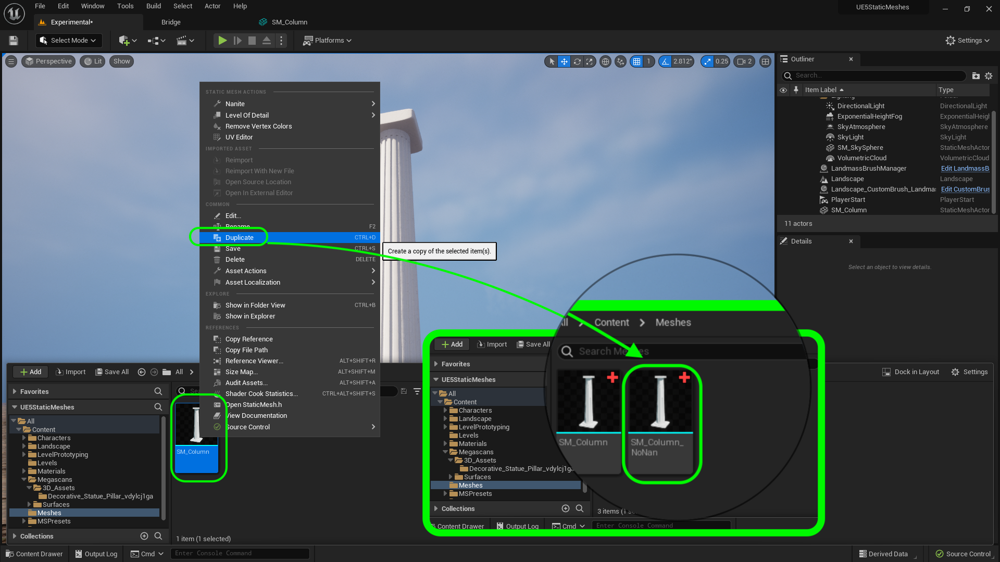
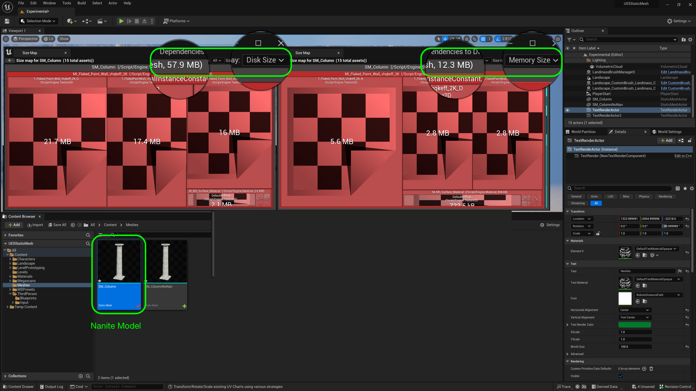
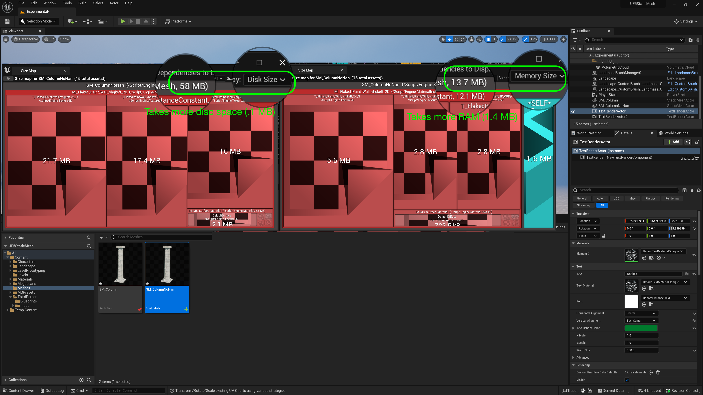
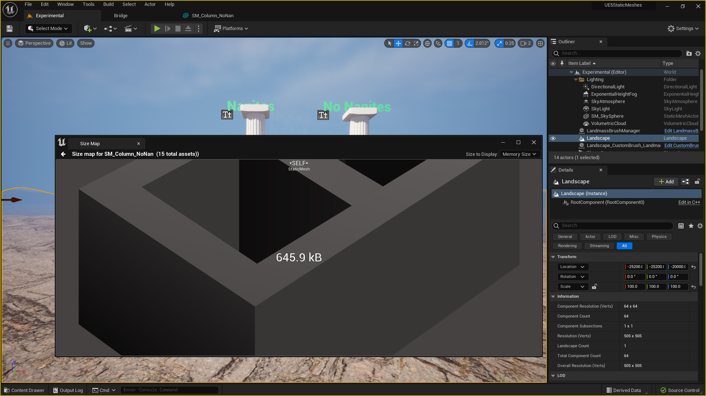
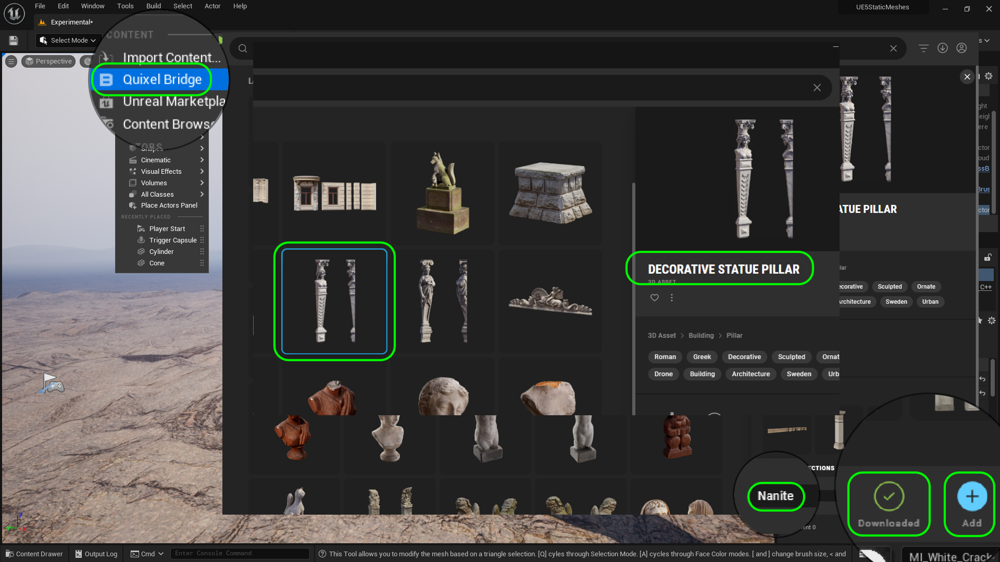
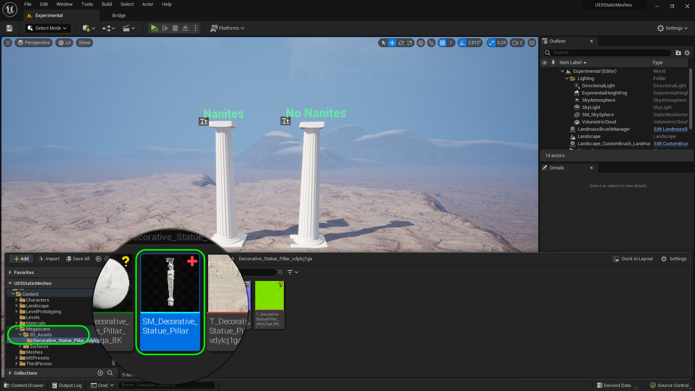
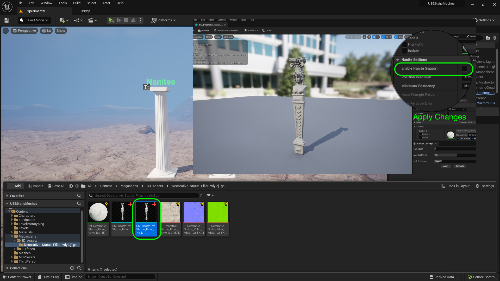
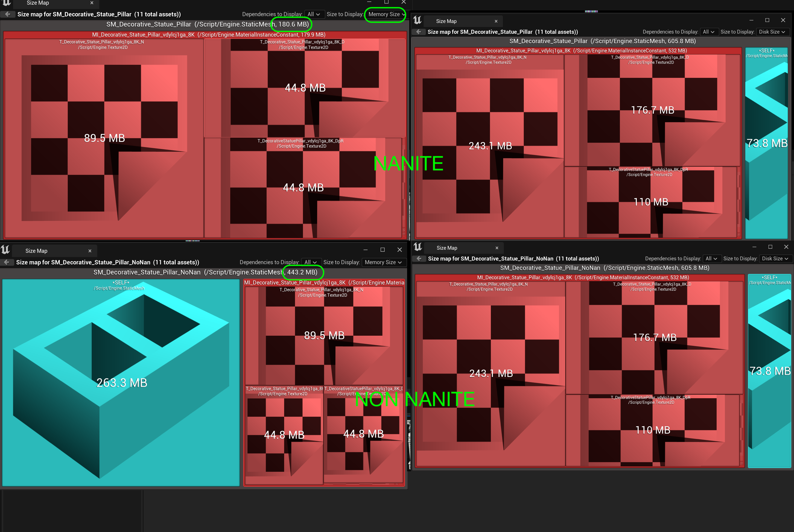

### Nanites

[previous](../uvs/README.md#user-content-uvs) • [home](../README.md#user-content-ue5-intro-to-static-meshes) • [next](../nanites-ii/README.md#user-content-nanites-ii)

[Nanites](https://docs.unrealengine.com/5.2/en-US/nanite-virtualized-geometry-in-unreal-engine/) are a game change in Unreal Engine 5. This is a virtual geometry system that uses its own mesh format and rendering technology to limit how many polygone it renders.  It tries to to keep it so that a screen pixel contains a single polygon.  It also compresses and streams in the levels of detail.  This ulitmately allows us to have much greater geometrical complexity (and rely less on normal maps to create surface topoolgy) and MUCH higher triangle and object counts than prior.  Frame budgets are not constraint by draw calls and poly counts. The artist no longer needs to create LODs (Level of Detail) lower poly meshes as this is handled automatically by the engine. 

 

---

##### `Step 1.`\|`ITSM`|:small_blue_diamond:

There are two ways of turning on Nanites.  You can double click on the **SM_Column** static mesh and turn them on the viewer. For it to actually switch to Nanites, you need to press the <kbd>Apply Changes</kbd> button. Alternatively you can right click on the mesh and **Enable Nanite**.  If you do it in the viewer you will see the stats change.  Play attention to **LOD** (Level of Detail) changing to **Nanite Enabled**.

##### `Step 2.`\|`ITSM`|:small_blue_diamond: :small_blue_diamond: 

Now lets duplicate the column and see the difference between a static mesh using nanites and no nanites. Right click on **SM_Column** and select **Duplicate** and call the new mesh `SM_Column_NoNan`.

##### `Step 3.`\|`ITSM`|:small_blue_diamond: :small_blue_diamond: :small_blue_diamond:

Open up **SM_Column_NoNan** and turn off nanites on this model. Press the <kbd>Apply Changes</kbd> button.

##### `Step 4.`\|`ITSM`|:small_blue_diamond: :small_blue_diamond: :small_blue_diamond: :small_blue_diamond:

Drag a copy of **SM_Column_NoNan** into the level to the right of the column with **Nanites** on. Press the <kbd>Add Content</kbd> button and choose **All Classes | Text Render Actor**.

##### `Step 5.`\|`ITSM`| :small_orange_diamond:

Adjust the text size and place it on top of the column on the right.  Change the text to `No Nanites`. Give it a color that contrasts with the sky.  Duplicate the text and move it to the column on the left and change it to `Nanites`.

##### `Step 6.`\|`ITSM`| :small_orange_diamond: :small_blue_diamond:

So what is the trade off for using Nanites versus non-nanite meshes?  There is definitely a performance hit - but nanites are dramatcially compressed.  So the trade off is that it takes more disc space to store nanites but less ram to display them. There is a way of finding out what is happening under the hoold Right click on the Nanite **SM_Column** and select **Size Map**.  Press the **Size to Display** to `Memory Size`.  Notice that in my case the model takes up 12.3 MB of RAM and 57.9 MB of disc space.  

##### `Step 7.`\|`ITSM`| :small_orange_diamond: :small_blue_diamond: :small_blue_diamond:

Right click on **SM_Column_NoNan** and select **Size Map**.  Press the **Size to Display** to `Memory Size` and `Disc Space`. Notice that for a small model the disc size is within `.1` MB and is slightly larger on the non-nanite version.  You do notice that it does take more in game memory(above 10%)  to display the non-nanite version with such a dense polygon.  This is due to the fact that Nanites are heavily compressed. So if the game image is not an issue then you can have more models in a scenes using Nanites than conventional (depending on how efficient you are with your low poly work). 

##### `Step 8.`\|`ITSM`| :small_orange_diamond: :small_blue_diamond: :small_blue_diamond: :small_blue_diamond:

Now change the viewport from **Lit** to **Wireframe** view mode.  Then move backwards and forwards.  If you look carefully the density of the mesh will change on the left nanite model and will try and keep it to no more than one triangle per pixel.  Whereas the non nanite nesh will render all the triangles so there are far more triangles per pixels and the mesh becomes a solid blob, wher you can still make out faces on the nanite mesh.  But when you get closer the rull resolution appears.

The non nanite version is rendering hundreds of polygons for a single pixel and the nanite version is only rendering at most a few. This means that our framerate is not polygon based but resolution based.  The fact that you can see blank spaces in the nanite version as you zoom out demonstrates that it is trying to minize the detail needed to expose a single pixel.

https://user-images.githubusercontent.com/5504953/184508765-0a79bc08-9555-42e3-8dae-0193d0332817.mp4

##### `Step 9.`\|`ITSM`| :small_orange_diamond: :small_blue_diamond: :small_blue_diamond: :small_blue_diamond: :small_blue_diamond:

A nanite mesh can really be dense ~>1,000,000 triangles per object.  Where as with regular meshes you are limited to maybe 100,000K triangles for a hero mesh like a player and 5k-20K triangles for props. 

Nanites allows us to use very large data sets for the models in levels.  But nanites **DO NOT** work on:

* Any deformation
* Skeletal Meshes
* World position offset in materials
* Custom stencils
* Defered Decals
* Material blend Modes using Translucent
* Two sided materials
* [more](https://docs.unrealengine.com/5.2/en-US/nanite-virtualized-geometry-in-unreal-engine/)...

##### `Step 10.`\|`ITSM`| :large_blue_diamond:

So if you are going to have a non-nanite mesh on a character like a skeletal mesh or a surface that animates like water then you will need to use a level of detail to maintain a proper framerate.  So you will have to create different models with less and less trianlges. This is called [Level of Detail](https://en.wikipedia.org/wiki/Level_of_detail_(computer_graphics)) (LOD).

##### `Step 11.`\|`ITSM`| :large_blue_diamond: :small_blue_diamond: 

Unreal has an automated way to generate lower resolution meshes from a high resolution mesh.  Double click **SM_Column_NoNan** and set **LOD Group** to `Large Prop`.  Press the <kbd>Apply</kbd> button. 

##### `Step 12.`\|`ITSM`| :large_blue_diamond: :small_blue_diamond: :small_blue_diamond: 

Now *press* the <kbd>Play</kbd> button in the top menu bar to launch the game. Now you have 4 level of details (0, 1, 2, and 3).  Go to **Wireframe** mode and you can see that the meshes get smaller with each lod.  Now change **LOD** back to **Auto** and notice that they change when you move in and out. Now look at the entire model change when you move in and out.

https://user-images.githubusercontent.com/5504953/184509779-e3d43958-dcaf-4152-ac1d-61491794cab4.mp4

##### `Step 13.`\|`ITSM`| :large_blue_diamond: :small_blue_diamond: :small_blue_diamond:  :small_blue_diamond: 

Now right click on **SM_Column_NoNan** and select **Size Map**. Notice it has gone up to include the level of details so it is has grown to 645.9 mb of memory. So it is more performant in terms of framerate but is taking up valuable ram.

##### `Step 14.`\|`ITSM`| :large_blue_diamond: :small_blue_diamond: :small_blue_diamond: :small_blue_diamond:  :small_blue_diamond: 

Change the rendering from **Lit** to **Nanite Visualization | Triangles**.  Zoom in and out.  Notice that it store clusters of polygons in these triangles.  They do change as they zoom in and out and unlike LOD's different sections change on their own at different times.  This masks the transitions and makes them quite imperceptible. 

https://user-images.githubusercontent.com/5504953/184510148-00b27063-84d3-4bce-8b34-54bac28402fd.mp4

##### `Step 15.`\|`ITSM`| :large_blue_diamond: :small_orange_diamond: 

Now the model we made was not that large so lets download a large model that wouldn't be able to be used in prior rendering methods. Click on the **Add Content** button and select **Quixel Bridge**.  Search for **Decorative Statue Pillar** and select a **Quality** of `Nanite` and then press the <kbd>Download</kbd> button and press <kbd>+ Add</kbd>. 

##### `Step 16.`\|`ITSM`| :large_blue_diamond: :small_orange_diamond:   :small_blue_diamond: 

Now rename the model in **Megascans | SM_Assets | Decorative_Slate_Pillar** to `SM_Decorative_Statue_Pillar`.

##### `Step 17.`\|`ITSM`| :large_blue_diamond: :small_orange_diamond: :small_blue_diamond: :small_blue_diamond:

Now right click on **SM_Decorative_Statue_Pillar** and select **Duplicate**.  Call this model `SM_Decorative_Statue_Pillar_NoNan`. Double click on this new model and turn **Enable Nanite Support** `off` and press the <kbd>Apply Changes</kbd> button.  

##### `Step 18.`\|`ITSM`| :large_blue_diamond: :small_orange_diamond: :small_blue_diamond: :small_blue_diamond: :small_blue_diamond:

Now you can switch from **Lit** to **Wireframe** and zoom in and out.  You will notice the non nanite mesh has 3 LOD's and the nanite mesh always shows a less dense mesh but adapts to the distance from ther camera.

https://user-images.githubusercontent.com/5504953/184512529-7802ddfb-fab6-4189-8929-14d614954517.mp4

##### `Step 19.`\|`ITSM`| :large_blue_diamond: :small_orange_diamond: :small_blue_diamond: :small_blue_diamond: :small_blue_diamond: :small_blue_diamond:

Now you can switch from **Lit** to **Nanite Vizulizations | Triangles** and zoom in and out.  You will notice the non triangle groups change in separate sections and now as the entire model helping hide the changes to the mesh as it scales.

https://user-images.githubusercontent.com/5504953/184513738-1e38b8b1-85a4-47e4-9b68-af781a84b1f0.mp4

##### `Step 20.`\|`ITSM`| :large_blue_diamond: :large_blue_diamond:

Now if you right click on both statue models and select **Size Map** you will notice that with very dense meshes that the nanite version takes _> 128_ times **less** space (1 mb = 1000 kb).  This makes the nanite version take a fraction of the memory as a traditional model.

<!--  -->

| [previous](../uvs/README.md#user-content-uvs)| [home](../README.md#user-content-ue5-intro-to-static-meshes) | [next](../nanites-ii/README.md#user-content-nanites-ii)|
|---|---|---|
