### Normal Maps

[previous](../edge-normals/README.md#user-content-edge-normals-in-practice) • [home](../README.md#user-content-ue4-static-meshes) • [next](../)

Now as you can see we can add detail by manipulating normals.  We can do the same thing by manipulating face normals using **[normal maps](https://en.wikipedia.org/wiki/Normal_mapping)**. This is a texture amp that instead of representing the color of the pixel, represents the angle of the light refracting from the surface. To learn a bit more about normal maps check out this [video](https://www.youtube.com/watch?v=GyfVQmoFX4c).

 

---

##### `Step 1.`\|`SUU&G`|:small_blue_diamond:
There is another way of simulating geometric details that are not in the base model.  Lets look at these two objects.  Here is a low poly sphere with 144 faces. Notice that **Maya** is representing the faces as quads.

##### `Step 2.`\|`FHIU`|:small_blue_diamond: :small_blue_diamond: 

The faces are so small that the ball looks perfectly round. So we see we have one model that is much smaller (and therefore faster in the engine) than the other, but one contains far more vertices than the other.

##### `Step 3.`\|`SUU&G`|:small_blue_diamond: :small_blue_diamond: :small_blue_diamond:

Just like we can control the normals on an edge to change how light reacts to it.  We can also adjust normals along the face to produce the same effect.  What we can do though is grab the normal's from the high poly spheres and use those normals to shade our low poly model. This is done by saving them as a texture as opposed to geometry.  What the **RGB** channel holds is **XYZ** data of a [vector](https://en.wikipedia.org/wiki/Euclidean_vector).  This uses the face normal on the high polygon model and encodes it in a pixel on a texture map.  The texture normal map of this sphere looks like this. For a deeper dive take a look at this [CG Video](https://www.youtube.com/watch?v=oOOeV3IU2Yo). here is a normal map created from the high poly sphere.

##### `Step 4.`\|`SUU&G`|:small_blue_diamond: :small_blue_diamond: :small_blue_diamond: :small_blue_diamond:

This texture matches the UV coordinates of the low poly sphere.

##### `Step 5.`\|`SUU&G`| :small_orange_diamond:

A [UV](https://en.wikipedia.org/wiki/UV_mapping) is a texture map that assigns pixels in the image to a face on the model. So this is what a sphere would look like with a map texture applied to the UVs. A UV map is an unwrapped 2-D version of a 3-D Model.  This allows the renderer to know what pixel on the texture in the uv map gets placed where in the model (which is 3-D). For a quick 2 minute dive checkout this [video](https://www.youtube.com/watch?v=mAcEzlsoad0).
    

##### `Step 6.`\|`SUU&G`| :small_orange_diamond: :small_blue_diamond:

Download [SM_Low_Poly_Sphere.FBX](../Assets/SM_Low_Poly_Sphere.FBX) and [SM_High_Poly_Sphere.FBX](../Assets/SM_High_Poly_Sphere.FBX). These are the two models shown above.

##### `Step 7.`\|`SUU&G`| :small_orange_diamond: :small_blue_diamond: :small_blue_diamond:

Drag them into the the **StaticMeshes** folder and lets keep the same import settings.  It is a static mesh and not a skeletal one, we need to generate collisions as I did not do this in the model, we need to generate lightmap uv's as I did not do this, we keep **Transform Vertext to Absolute** as `true`and change the import setting of **Material Import Method** to `Do Not Create Material` and turn off **Import Textures**.  Press the <kbd>Import All</kbd> button.  

##### `Step 8.`\|`SUU&G`| :small_orange_diamond: :small_blue_diamond: :small_blue_diamond: :small_blue_diamond:

Double click **SM_Low_Poly_Sphere** folder, turn off .  Turn on **Wireframe** to get a better view of the geometric topology. Notice that it has 552 vertices. Make sure the **Show Environment** and **Show Floor** are false.  You can see the faces are large and up close this does not look like a sphere and you can clearly see the faces.

##### `Step 9.`\|`SUU&G`| :small_orange_diamond: :small_blue_diamond: :small_blue_diamond: :small_blue_diamond: :small_blue_diamond:

Open up **SM_High_Poly** mesh by double clicking on it.  Notice that is uses 40,399 vertices. Now the faces are so small that it retains the shape of a sphere and you do not notice the faces. These were both generated from the model we saw above in Maya.

##### `Step 10.`\|`SUU&G`| :large_blue_diamond:

Add a folder called `Materials`.  Right click and add a new **Material** and call it `M_Rough`.

##### `Step 11.`\|`SUU&G`| :large_blue_diamond: :small_blue_diamond: 

Open the material and either **left mouse click** while pressing the <kbd>3</kbd> key, or right click on the graph and select a `Constant3Vector`.  This represents three floats (that we will be using for the **RGB** channels).

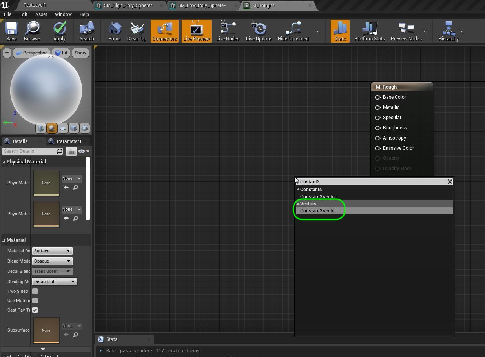

##### `Step 12.`\|`SUU&G`| :large_blue_diamond: :small_blue_diamond: :small_blue_diamond: 

Now double click on the black swatch (press the arrow at the top if you don't see it) and you will get a color picker menu.  Lets make it a 25% gray by setting all three channels to `0.25`.

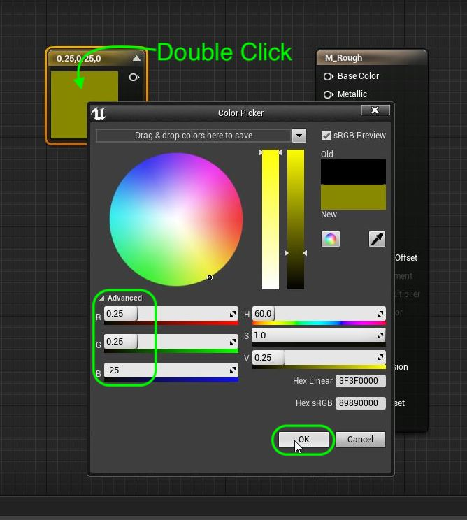

##### `Step 13.`\|`SUU&G`| :large_blue_diamond: :small_blue_diamond: :small_blue_diamond:  :small_blue_diamond: 

After a short while the base color should turn to a gray.  Now either **left mouse click** while pressing the <kbd>1</kbd> key, or right click on the graph and select a `Constant` to get a single float that will represent roughness.

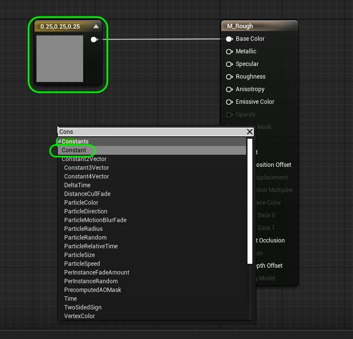

##### `Step 14.`\|`SUU&G`| :large_blue_diamond: :small_blue_diamond: :small_blue_diamond: :small_blue_diamond:  :small_blue_diamond: 

Now this will be used for roughness.  A value of `0` means that it is a very reflective material (glossy) and a value of 1 means that it is has minimal reflected light (matte).  We will set a value of `0.95` making it mostly matte.  We connect the output of the **Constant** node to the **Roughness** input pin.

##### `Step 15.`\|`SUU&G`| :large_blue_diamond: :small_orange_diamond: 

Those changes will not be reflected in game until you press the <kb>Apply button</kbd>.  Do so now and wait a bit for the material to compile

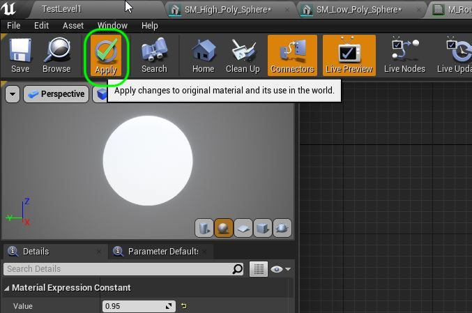

##### `Step 16.`\|`SUU&G`| :large_blue_diamond: :small_orange_diamond:   :small_blue_diamond: 

Now add an instance of **SM_High_Poly_Sphere** and **SM_Low_Poly_Sphere** to the level.  Drag and drop the new **M_Rough** material onto the sphere.

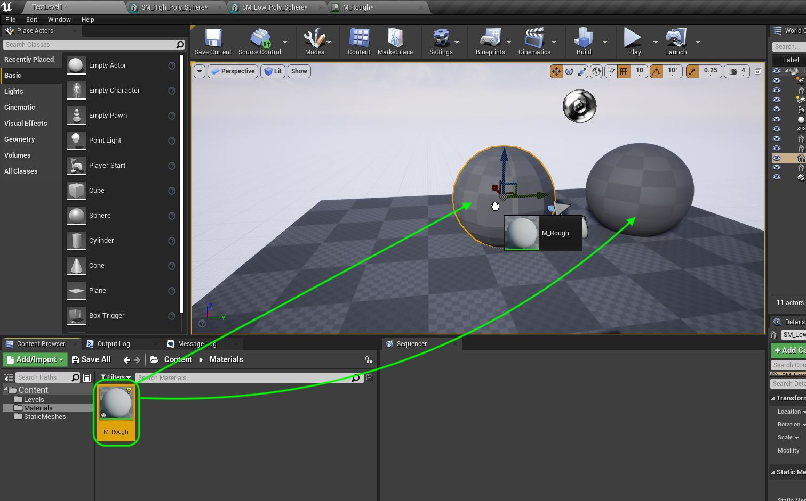

##### `Step 17.`\|`SUU&G`| :large_blue_diamond: :small_orange_diamond: :small_blue_diamond: :small_blue_diamond:

It should look like this with two spheres and a matte material on them.  Press run and move around to look at them.  Notice that even when you are far away that you still notice the faces from the lighting on the low poly sphere.

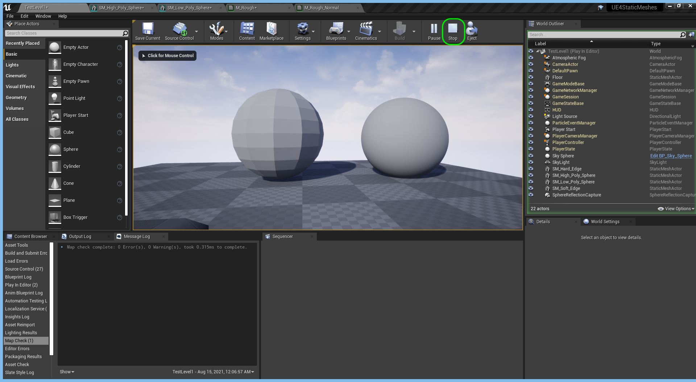
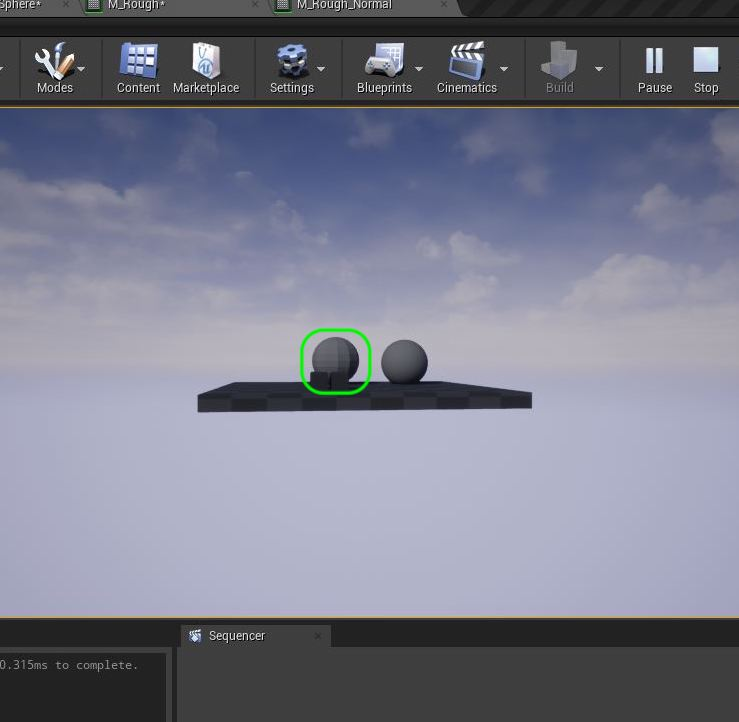

##### `Step 18.`\|`SUU&G`| :large_blue_diamond: :small_orange_diamond: :small_blue_diamond: :small_blue_diamond: :small_blue_diamond:
Download [T_Sphere_N.TGA](../Assets/T_Sphere_N.TGA).  Create a new folder called **Textures** and drop it in this folder. There are not any import settings for textures, Unreal just ingensts it and guesses what kind of compression to apply.

##### `Step 19.`\|`SUU&G`| :large_blue_diamond: :small_orange_diamond: :small_blue_diamond: :small_blue_diamond: :small_blue_diamond: :small_blue_diamond:

Right click on **M_Rough** and select **Duplicate**.  Call this new material `M_Rough_Normal`.  Open it and press the left mouse button while holding the <kbd>T</kbd> key or right click on the empty graph and select a **Texture Sample** node.

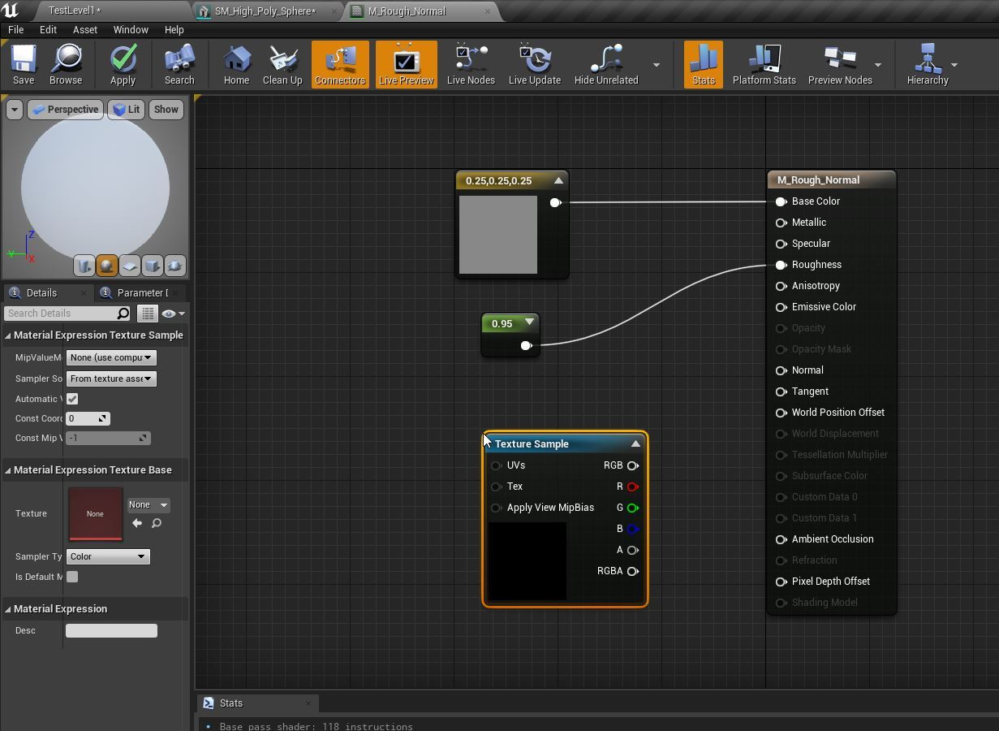

##### `Step 20.`\|`SUU&G`| :large_blue_diamond: :large_blue_diamond:

Go to the details panel and select the **Texture** and assign the new **T_Sphere_N** normal map texture to the sphere.
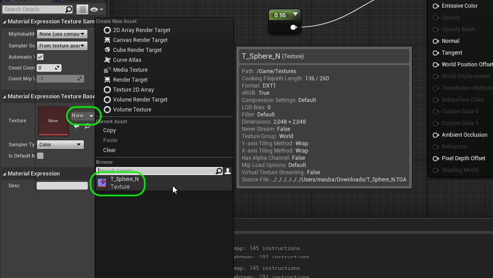

##### `Step 21.`\|`SUU&G`| :large_blue_diamond: :large_blue_diamond: :small_blue_diamond:

Since a normal map is only an **RGB** value (there is only a value representing **X, Y & Z**) pull from the **RGB** output pin of the **Texture Sample** node and put it into the **Normal Map** node in the shader node.

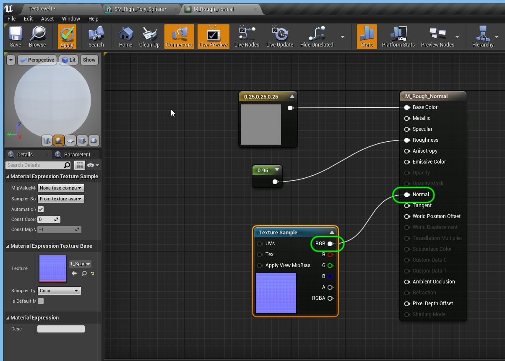

##### `Step 22.`\|`SUU&G`| :large_blue_diamond: :large_blue_diamond: :small_blue_diamond: :small_blue_diamond:

We can preview this material on the model it is intended for.  Go to the editor tab and select **StaticMeshes | SM_Low_Poly_Sphere**. Go back to the **M_Rough_Normal** tab and press the <kbd>Apply</kbd> button. Now go to the model preview window and press the <kbd>Use Selected Model</kbd> button. Now the result looks wrong the polygons are warping inwards and not outwards.  We will fix this issue.

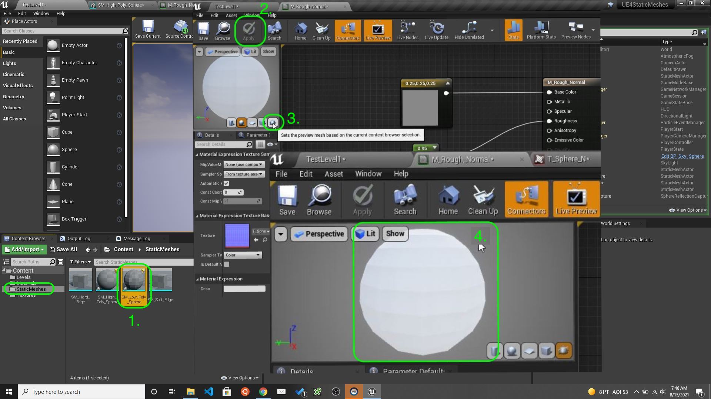

##### `Step 23.`\|`SUU&G`| :large_blue_diamond: :large_blue_diamond: :small_blue_diamond: :small_blue_diamond: :small_blue_diamond:

Open up **T_Sphere_N** and set the **Compression Settings** to `Normalmap (DXT5, BCS on DX11)` if you have DX11 loaded.  Also some game engines use left handed and right handed 3-D systems.  This means that sometimes the green channel in the normal map is backwards.  This caused two problems.  The first we picked by changing the compression to one that is suitable for normal maps and the other is the **Flip Green Channel** to `true` to invert the green value (changing the sign). Press the <kbd>Save</kbd> button.

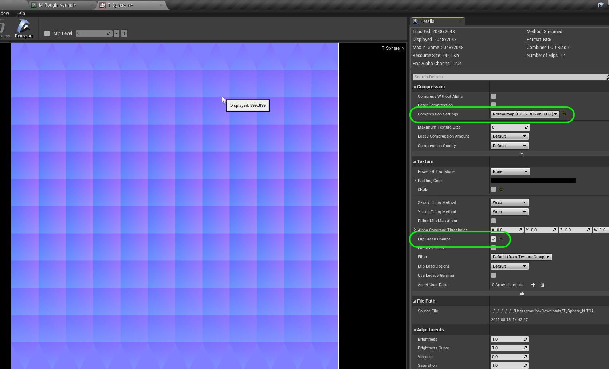

##### `Step 24.`\|`SUU&G`| :large_blue_diamond: :large_blue_diamond: :small_blue_diamond: :small_blue_diamond: :small_blue_diamond:

Now go back to the material.  You will likely get an error and will have rehook up the **RGB** output with the **Normal Map** pin. Now you should see that it looks more like a sphere.  Now this will affect the outline as the normal map just affects the way light bounces off the faces and does NOT adjust the geometry.

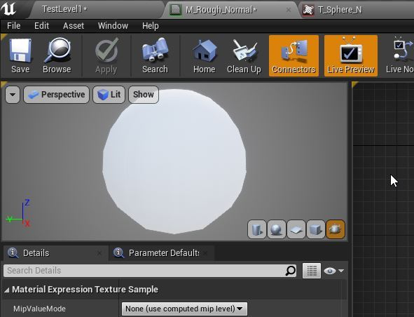

##### `Step 24.`\|`SUU&G`| :large_blue_diamond: :large_blue_diamond: :small_blue_diamond: :small_blue_diamond: :small_blue_diamond: :small_blue_diamond:

Copy the low poly sphere in the level to make a duplicate.  Assign the **M_Rough_Normal** to the second copy. Now it is a lot more like a sphere inside the sphere itself but up close the sillhouette is wrong.  But if you move the camera back the sillhouette starts to look better and it is hard to tell the difference between the two models even though the high polygon sphere has 70 times the number of vertices.  This is one way that a game can make an object look *higher resolution* than it really is.  One key element to think about is how close will you get to a model.  When it is far away, all we are trying to do is maintain its sillhouette as interior detail will be difficult to make out.

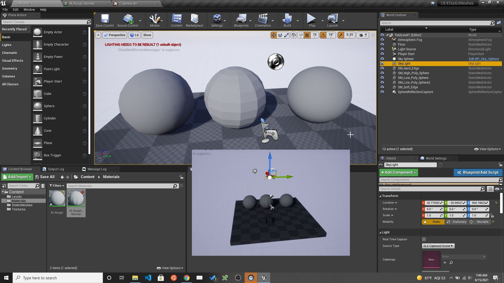

___

| [previous](../edge-normals/README.md#user-content-edge-normals-in-practice)| [home](../README.md#user-content-ue4-static-meshes) | [next](../)|
|---|---|---|
