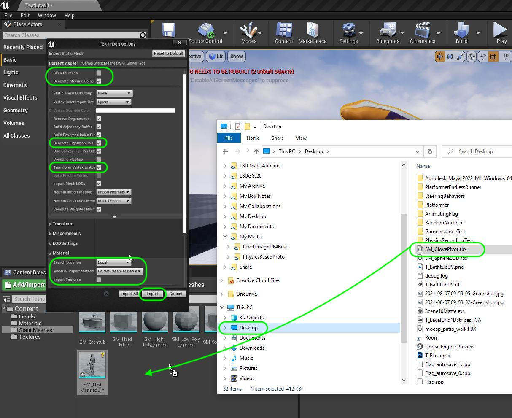
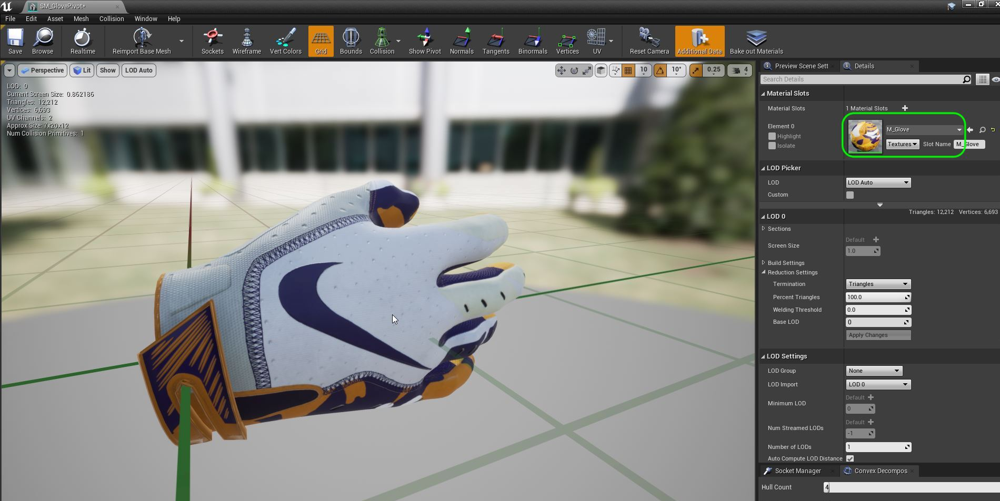
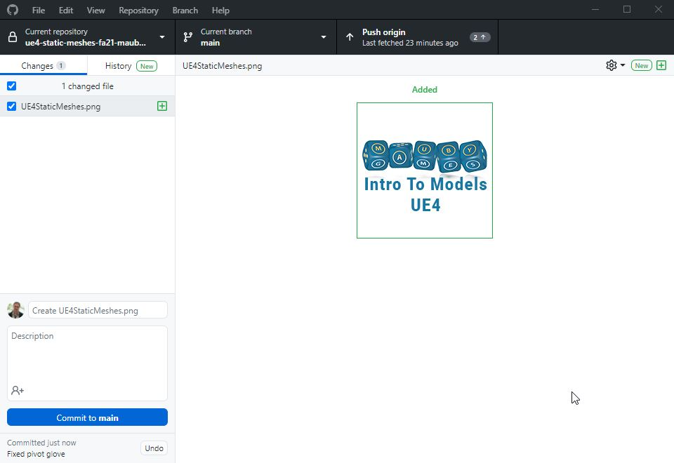

### Pivot Point

[previous](../lod/README.md#user-content-levels-of-detail-lod) • [home](../README.md#user-content-ue4-static-meshes)

The pivot point of the model is where the movement widget is placed in UE5.  It is where you move the model to and from.  This is also the point of where the model is rotated from.  It is very important to the level designer that these are consistently placed and logically with how they need to snap to the level.  Any object that is supposed to snap to the group usually has its pivot point at the bottom center.  This is often ignored by the artist and good team communication is key on placing these correctly.

 

---

##### `Step 1.`\|`SUU&G`|:small_blue_diamond:

Go to the game and lets look at a bad pivot.  Lets move our pivot on the nanite column.  Change to **Modeling Mode** and select the column. Select the column to edit then **Tranform | Pivot** and you can change the location of the pivot.  Put it somewhere just outside the model then press the <kbc>Accept</kbd> button. What this does is moves where the transform gizmo is located.  So when you move the model it will be based from this pivot point. 

https://user-images.githubusercontent.com/5504953/184548700-8993a7fb-c4aa-4e56-bc8a-b24d9dddf1d7.mp4

##### `Step 2.`\|`FHIU`|:small_blue_diamond: :small_blue_diamond: 

This also affects where the object will rotate from.  So when you switch to the **Rotation** gizmo the column will rotate from that point.  Clearly this is not a great spot to rotate this object around for placement.

https://user-images.githubusercontent.com/5504953/184548825-c9c6187b-fc66-4ff1-8a75-ef9fb808e638.mp4

##### `Step 3.`\|`SUU&G`|:small_blue_diamond: :small_blue_diamond: :small_blue_diamond:

We can also scale from this pivot point.  So the object will move to and from this point when scaling.  Again, strange to have it outside the model like this.

https://user-images.githubusercontent.com/5504953/184548936-6ece2990-7ce6-43e1-9f14-5317d86b6498.mp4

##### `Step 4.`\|`SUU&G`|:small_blue_diamond: :small_blue_diamond: :small_blue_diamond: :small_blue_diamond:

You want the pivot point to be where the object rotates and moves from.  So if this object was a floating pickup then the center of the object would be a logical place.  In **Tranform | Pivot** you can press the <kbd>Center</kbd> button and set the pivot in the center.  

Now go to the **Move Tool**, **Rotate Tool** and **Scale Tool** and see how it moves and rotates from this point.  This would be good for free placement of objects in the X,Y,Z axis.

##### `Step 5.`\|`SUU&G`| :small_orange_diamond:

It might make more sense to move the pivot point to the center of the wrist at the top of the model.  To do this in Maya press the **D** key to move the pivot in movement mode.  Zoom in and rotate around to confirm the placement.

When it is correct, select the model and press **File | Game Exporter**. Now select the folder and the name of the file.  I called it in `SM_GlovePivot.fbx`. We not only have **Smoothing Groups** and **Trinagulate** selected but we also should **Move To Origin**.  Sometimes I find the pivot is not the same in Unreal and Maya unless this is selected.  The model is at origin so there should be no issues. Finally, press the **Export** button. 

##### `Step 6.`\|`SUU&G`| :small_orange_diamond: :small_blue_diamond:

Drag and drop this new **SM_GlovePivot** fbx into the **StaticMeshes** folder. Generate a collision and keep the other settings the same.  We will reuse the material we already created for the glove.

##### `Step 7.`\|`SUU&G`| :small_orange_diamond: :small_blue_diamond: :small_blue_diamond:

Assign the **M_Glove** material to **SM_GlovePivot** in the model viewer.

##### `Step 8.`\|`SUU&G`| :small_orange_diamond: :small_blue_diamond: :small_blue_diamond: :small_blue_diamond:

Drag the model in the game and notice the pivot point has changed but the rest of the model is intact.

https://user-images.githubusercontent.com/5504953/129878996-4da02739-b923-4da2-b39a-6c36de91c2cf.mp4

##### `Step 9.`\|`SUU&G`| :small_orange_diamond: :small_blue_diamond: :small_blue_diamond: :small_blue_diamond: :small_blue_diamond:

That's it for this lesson, **Save All** and submit to source control.  Push your final work to **GitHub**.

##### `Step 10.`\|`SUU&G`| :large_blue_diamond:

| `static.meshes`\|`THE END`| 
| :--- |
| **That's All Folks!** Thanks for sticking around. That's it for this lesson. |

| [previous](../lod/README.md#user-content-levels-of-detail-lod)| [home](../README.md#user-content-ue4-static-meshes) |
|---|---|
