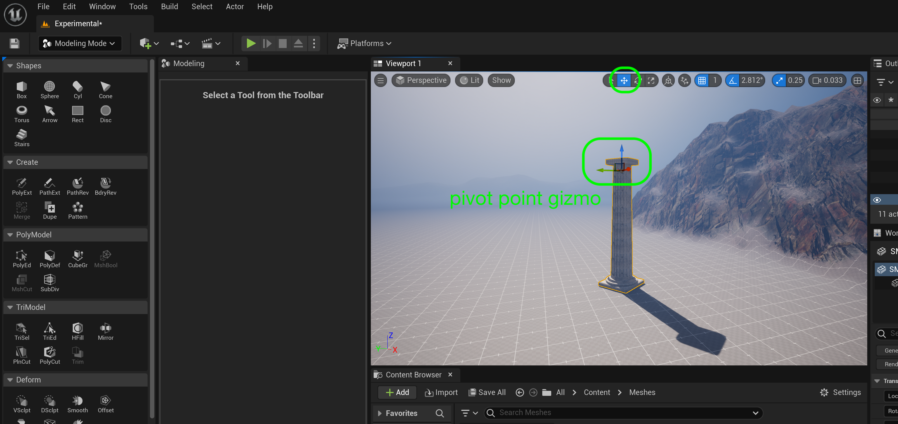
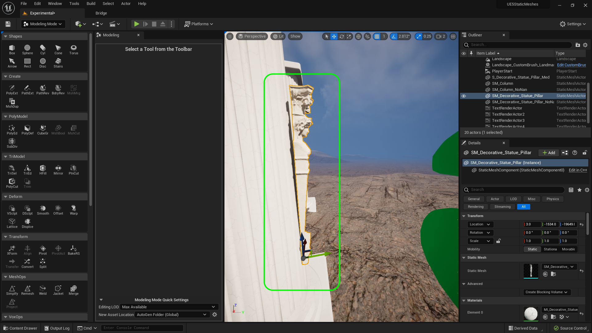
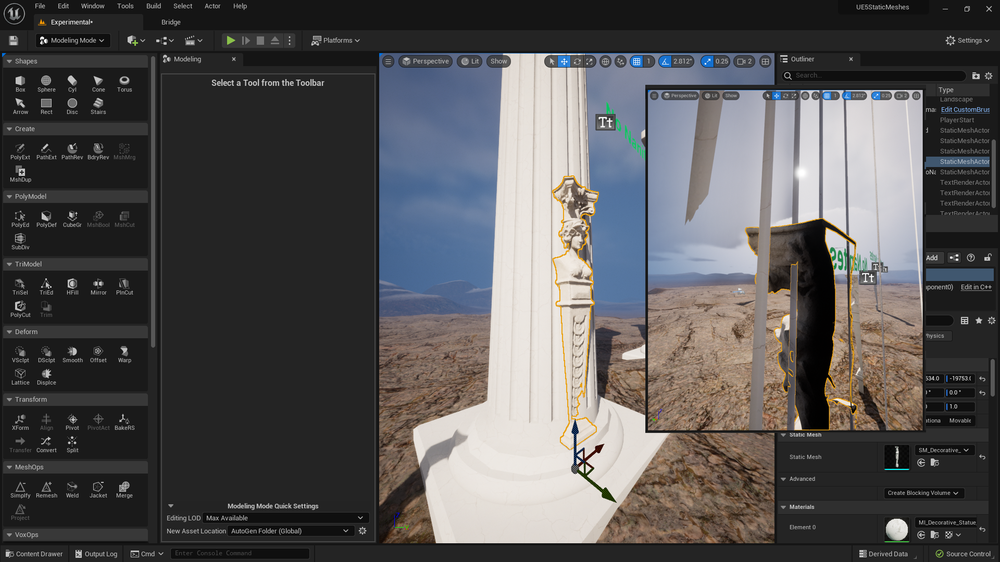
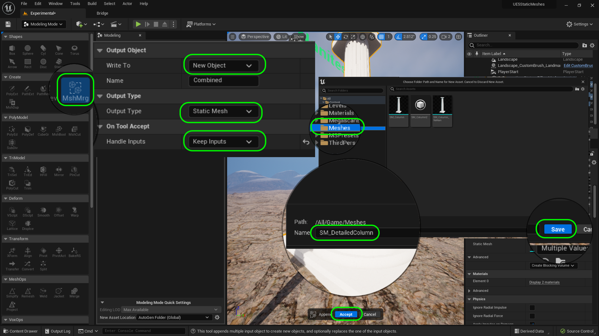
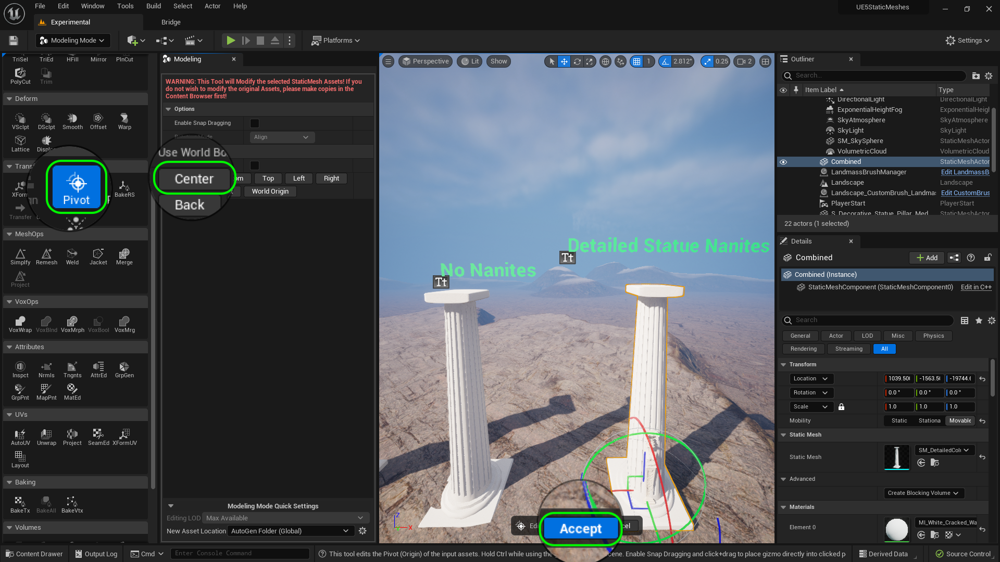
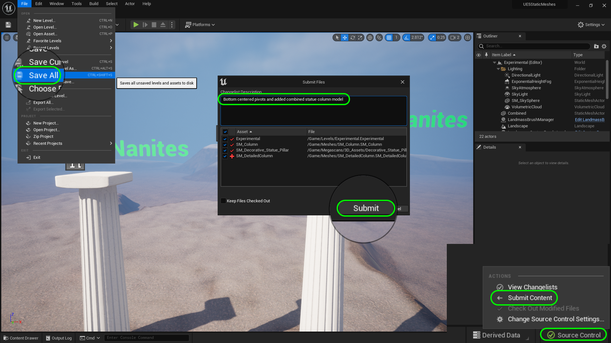

### Pivot Point

[previous](../basic-column-iv/README.md#user-content-basic-column-iv) • [home](../README.md#user-content-ue5-intro-to-static-meshes) • [next](../importing-mesh/README.md#user-content-importing-mesh)

The pivot point of the model is where the movement widget is placed in UE5.  It is where you move the model to and from.  This is also the point of where the model is rotated from.  It is very important to the level designer that these are consistently placed and logically with how they need to snap to the level.  Any object that is supposed to snap to the group usually has its pivot point at the bottom center.  This is often ignored by the artist and good team communication is key on placing these correctly.

 

---

##### `Step 1.`\|`ITSM`|:small_blue_diamond:

A pivot point is a point in 3D space that defines the center of rotation or scaling for an object. In Unreal Engine, the pivot point can be moved or adjusted to change the way an object moves, rotates or scales. It is indicated in movement mode with the arrow gizmos. Right now we have not crafted where our pivot should go.

##### `Step 2.`\|`ITSM`|:small_blue_diamond: :small_blue_diamond: 

Go to the game and lets look at a bad pivot.  Lets move our pivot on the nanite column.  Change to **Modeling Mode** and select the column. Select the column to edit then **Tranform | Pivot** and you can change the location of the pivot.  Put it somewhere just outside the model then press the <kbc>Accept</kbd> button. What this does is moves where the transform gizmo is located.  So when you move the model it will be based from this pivot point. 

This also affects where the object will rotate from.  So when you switch to the **Rotation** gizmo the column will rotate from that point.  Clearly this is not a great spot to rotate this object around for placement.

We can also scale from this pivot point.  So the object will move to and from this point when scaling.  Again, strange to have it outside the model like this.

https://github.com/maubanel/UE5-Static-Meshes/assets/5504953/878aff2a-4cfd-48f2-899c-70dca2ba05ec

##### `Step 3.`\|`ITSM`|:small_blue_diamond: :small_blue_diamond: :small_blue_diamond:

If this object was a chandelier and would be hung from the ceiling we might want to place the pivot point at the top center of the shape. Go to **Tranform | Pivot** and press the <kbd>Top</kbd> button.  This moves the pivot to the top.  Now add a **Cube** and make the **X** and **Y** scale `5` and move it on top of the colomn.  Now go into side view and line up the top column with the ceiling piece.  Having the pivot at the top allows for precise placement where it is most important.

Notice that in mine we have a problem.  The column is not orthoganal to the world and is rotated.  Ideally I want the front of hte column to be square.  **X** should be pointing into the screen, **Y** to the right and **Z** up.  Lets fix this.

https://github.com/maubanel/UE5-Static-Meshes/assets/5504953/dc1a23cd-f73e-49e5-8251-10a0c55c11be

##### `Step 4.`\|`ITSM`|:small_blue_diamond: :small_blue_diamond: :small_blue_diamond: :small_blue_diamond:

You want the pivot point to be where the object rotates and moves from.  So if this object was a floating pickup then the center of the object would be a logical place.  In **Tranform | Pivot** you can press the <kbd>Center</kbd> button and set the pivot in the center.  

Now go to the **Move Tool**, **Rotate Tool** and **Scale Tool** and see how it moves and rotates from this point.  This would be good for free placement of objects in the X,Y,Z axis.

https://user-images.githubusercontent.com/5504953/184551359-5d703ac7-c2f6-4b8e-ad01-150c9dbb0f5f.mp4

##### `Step 5.`\|`ITSM`| :small_orange_diamond:

Now lets imagine you only wanted these columns in the corner of a room. These are columns on the ground so you would go to **Tranform | Pivot** you can press the <kbd>Bottom</kbd> as they are always on the ground and you might want to move the pivot to a corner for better corner placement.

https://user-images.githubusercontent.com/5504953/184551520-36610342-cdea-4072-a383-2332093e69d0.mp4

##### `Step 6.`\|`ITSM`| :small_orange_diamond: :small_blue_diamond:

It might make more sense to move the pivot point to the center of bottom of the column as this will probably be placed around an outdoor setting and moved around on the X & Y axis.  So lets set the **Tranform | Pivot** to the <kbd>Bottom</kbd> button and leave it in the bottom center.  For this shape, this will be the best spot.  Notice this is the same spot that the creators of the statue model placed theirs!  Go ahead and make sure all the column models have the pivot in the bottom center.

https://user-images.githubusercontent.com/5504953/184551972-be0455f7-292a-401e-8e07-0d8ff1e5c924.mp4

##### `Step 7.`\|`ITSM`| :small_orange_diamond: :small_blue_diamond: :small_blue_diamond:

Lets now create a column that incorporates the statue in it.  Drag the nanite version of **SM_Column** and **SM_Decorative_Statue_Pillar**.  We will set them up to combine them at the base.

##### `Step 8.`\|`ITSM`| :small_orange_diamond: :small_blue_diamond: :small_blue_diamond: :small_blue_diamond:

Rotate and place the statue so that it fits just inside the column to make it look like a single model. Go inside and make sure there is some overlap.

##### `Step 9.`\|`ITSM`| :small_orange_diamond: :small_blue_diamond: :small_blue_diamond: :small_blue_diamond: :small_blue_diamond:

Now select **both** the column and the statue (shift left mouse click).  Press the **Create | MshMrg** and make sure you are 
setting **Write To** to `New Object` as we want to spawn a separate detailed pillar.  Set **Output Type** to `Static Mesh`and **Handle Inputs** to `Keep Inputs`. Press the <kbd>Accept</kbd> button.

Now select the **Meshes** directory and call this new model `SM_DetailedColumn`.  Press the <kbd>Save</kbd> button.
 

##### `Step 10.`\|`ITSM`| :large_blue_diamond:

Now center the pivot to the **Bottom** for this new mesh. Add a text on top of it.  We can just stay with the nanite version adn don't need any others.

##### `Step 11.`\|`ITSM`| :large_blue_diamond: :small_blue_diamond: 

Select the **File | Save All** then press the <kbd>Source Control</kbd> button and select **Submit Content**.  If you are prompted, select **Check Out** for all items that are not checked out of source control. Update the **Changelist Description** message and with the latest changes. Make sure all the files are correct and press the <kbd>Submit</kbd> button. A confirmation will pop up on the bottom right with a message about a changelist was submitted with a commit number.

<!--  -->

| [previous](../basic-column-iv/README.md#user-content-basic-column-iv)| [home](../README.md#user-content-ue5-intro-to-static-meshes) | [next](../importing-mesh/README.md#user-content-importing-mesh)|
|---|---|---|
