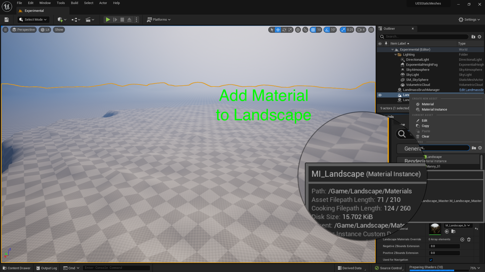
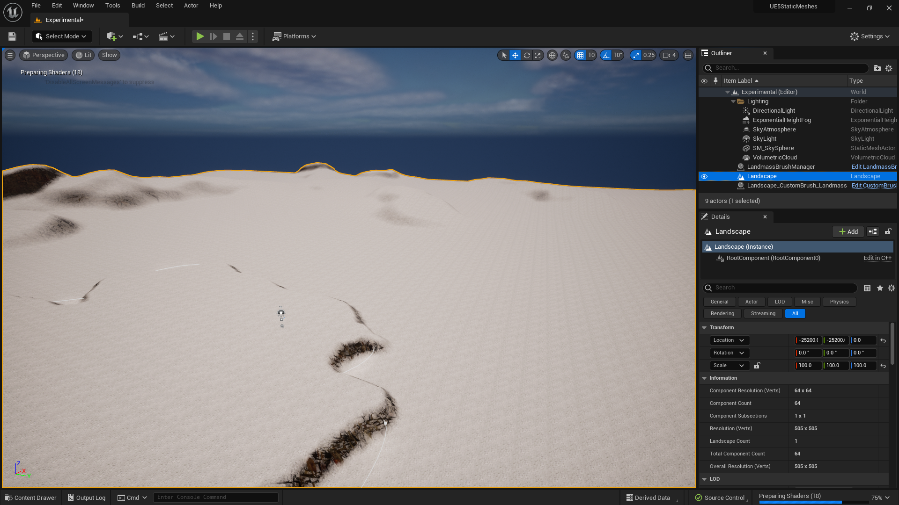
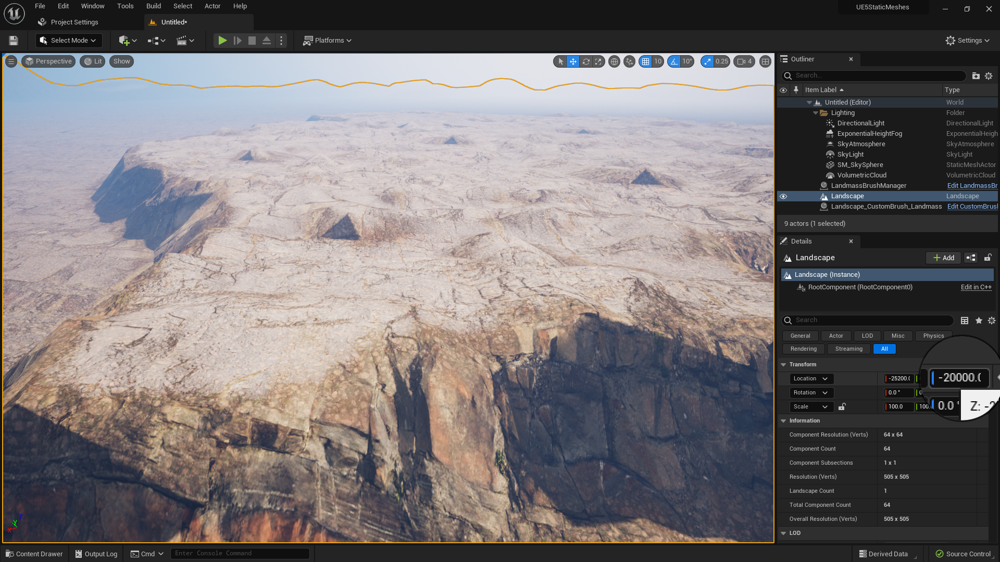
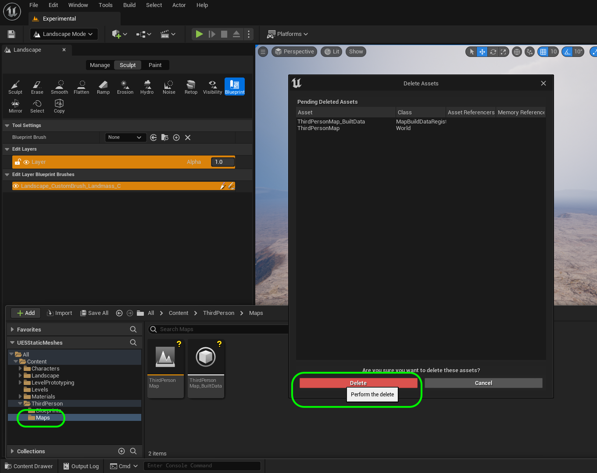
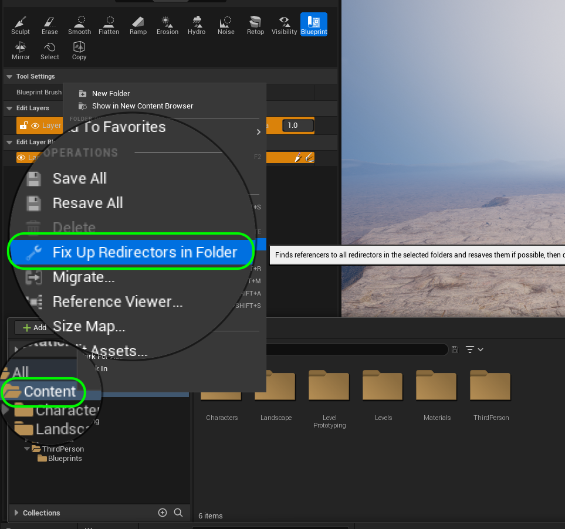
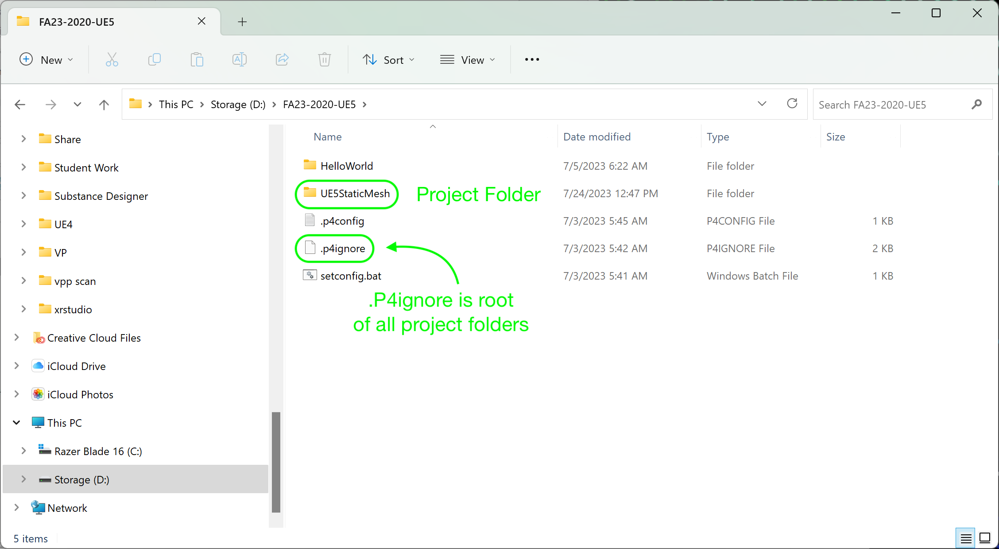
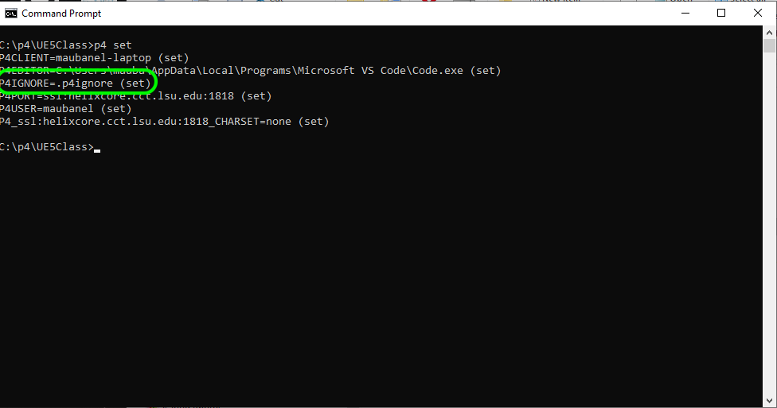

### Setting Up II

[previous](../setting-up/README.md#user-content-setting-up) • [home](../README.md#user-content-ue5-intro-to-static-meshes) • [next](../lexicon/README.md#user-content-3-d-lexicon)

Finish setting up our level.

 

---

##### `Step 1.`\|`ITSM`|:small_blue_diamond:

Add **Material** `MI_Landscape` to the Landscape. 

##### `Step 2.`\|`ITSM`|:small_blue_diamond: :small_blue_diamond: 

Now it will be like we are really high in the atmosphere based on the height of our previous landscape that this was built on. So the numbers for where surfaces appear and disappear are wrong.

##### `Step 3.`\|`ITSM`|:small_blue_diamond: :small_blue_diamond: :small_blue_diamond:

On the landscape change the **Transform | Location | Z** to `-20000` (-20,000). Now we are in a rocky world.  That will do.

##### `Step 4.`\|`ITSM`|:small_blue_diamond: :small_blue_diamond: :small_blue_diamond: :small_blue_diamond:

We do not need the **Third Person | Maps** folder anymore so you can delete it. Right click the **Maps** folder then select the <kbd>Delete</kbd> option.

##### `Step 5.`\|`ITSM`| :small_orange_diamond:

Right click on hte the **Content** folder and select **Fix Up Redirectors in Folder**.

##### `Step 6.`\|`ITSM`| :small_orange_diamond: :small_blue_diamond:

One last step we need to take care of is that we need to add a [.p4ignore](../files/p4ignore.zip) file to our project.  Download this file then decompress it and put it in your root folder with the `.uproject` file.  You can press **Refresh** in **P4V** to see it update in **Perforce** as well. Please note that you might need to make adjustments to your default settings to see hidden files.  `.p4ignore` is a hidden file.  Any file without a prefix before the extension is hidden by default. Go to [Microsoft Help](https://support.microsoft.com/en-us/windows/show-hidden-files-0320fe58-0117-fd59-6851-9b7f9840fdb2) to find out how to alter your settings.

Please note that we **DO NOT** want `p4ignore.zip` as this will not do anything in its compressed state.

##### `Step 7.`\|`ITSM`| :small_orange_diamond: :small_blue_diamond: :small_blue_diamond:

Open up command prompt and type `p4 set`.  You should see that the file for `.p4ignore` is shown.  If not type `p4 set P4IGNORE=.p4ignore`.  Then confirm that it is now set.

##### `Step 8.`\|`ITSM`| :small_orange_diamond: :small_blue_diamond: :small_blue_diamond: :small_blue_diamond:

Select the **File | Save All** then press the <kbd>Source Control</kbd> button and select **Submit Content**.  If you are prompted, select **Check Out** for all items that are not checked out of source control. Update the **Changelist Description** message and with the latest changes. Make sure all the files are correct and press the <kbd>Submit</kbd> button. A confirmation will pop up on the bottom right with a message about a changelist was submitted with a commit number.

<!--  -->

| [previous](../setting-up/README.md#user-content-setting-up)| [home](../README.md#user-content-ue5-intro-to-static-meshes) | [next](../lexicon/README.md#user-content-3-d-lexicon)|
|---|---|---|
