### Setting up Unreal & Github

<sub>[home](../README.md#user-content-ue4-intro-to-level-design) • [next](../camera-mechanics/README.md#user-content-lock-cameras-and-mechanics)</sub>


We will be working in a third person game and will use the UE4 default and alter it for our needs.  This will give us all we need for a character that we can control."

<br>

---


##### `Step 1.`\|`SUU&G`|:small_blue_diamond:

If you have not installed the required software go and add [Epic Games Launcher](https://www.epicgames.com/store/en-US/download), [git (PC only)](https://git-scm.com/downloads), [Github Desktop](https://desktop.github.com), [Git LFS (Large File System)](https://git-lfs.github.com) on your mac or PC.  Make sure you have a valid [GitHub](https://github.com) account.  Make sure it has a `4.26` in front of the version (`4.26.x`) so that we know this walk through will be compatible with your version of Unreal.

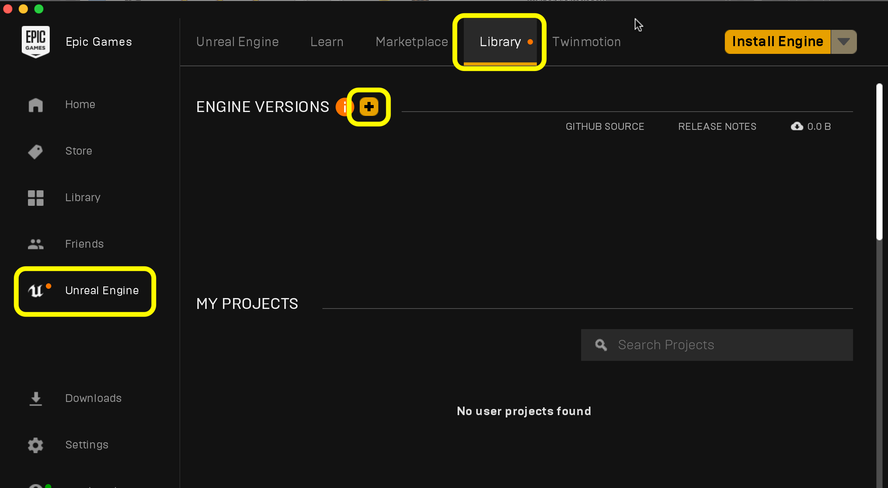


##### `Step 2.`\|`FHIU`|:small_blue_diamond: :small_blue_diamond: 
Run the **Epic Games Launcher** and Press **Launch** button to go to the *Select or Create New Project* screen.


##### `Step 3.`\|`SUU&G`|:small_blue_diamond: :small_blue_diamond: :small_blue_diamond:

You can pick from different starting templates with Games, Film/TV, Architecture and Design as options.  Lets start by selecting **Games** and then press the <kbd>Next</kbd> button.

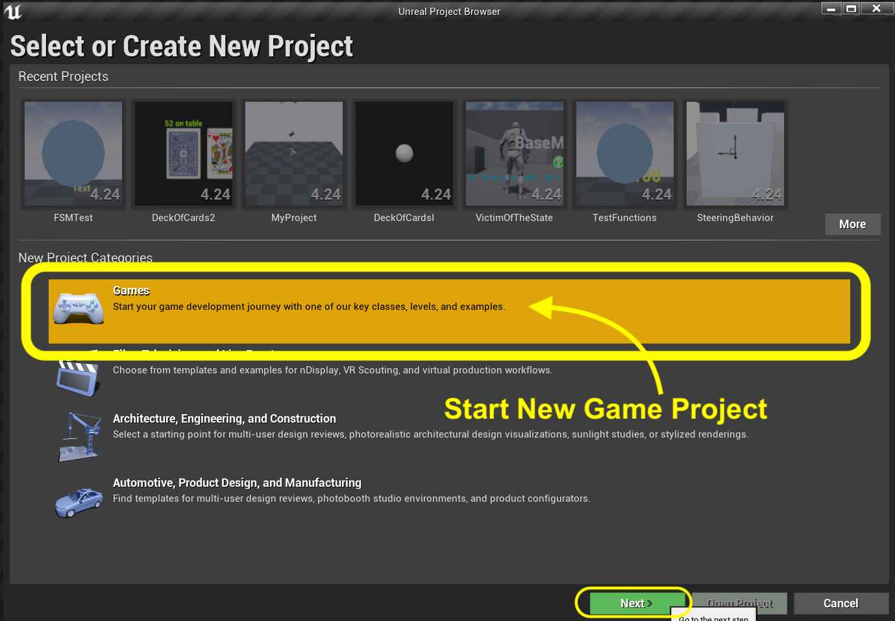


##### `Step 4.`\|`SUU&G`|:small_blue_diamond: :small_blue_diamond: :small_blue_diamond: :small_blue_diamond:

**Unreal** has various boiler point template for different genres of games.  WThe sidescroller template would be interesting but it is for 2 dimensional movement and we want a fully navigatable 3-D level. For now lets just start with a **Third Person** template then press the <kbd>Next</kbd> button.

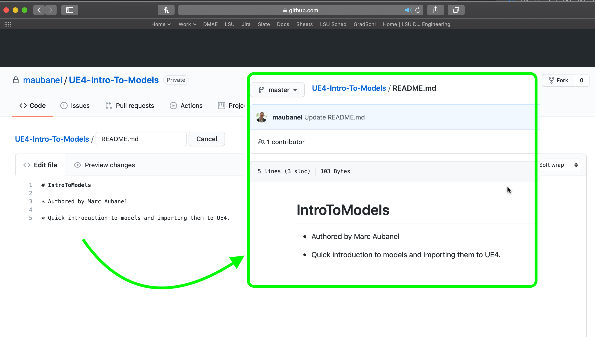


##### `Step 5.`\|`SUU&G`| :small_orange_diamond:

This now takes you to the *Project Settings* screen. The first settings on the top left is set to Blueprints.  You can select between C++ and Blueprint.  Since we will not be doing any C++ programming in this exercise we will leave it with Blueprint.  I am leaving the quality settings to **Maximum Quality** as we are developing this for a modern computer.  We will leave **Raytracing** off as we will not be using it at the moment.  We set the paltform to **Desktop** as we will be on a PC or Mac playing the game and not on a game console or on mobile.  We will be importing the needed content so we will set the **Starter Content** to `No Starter Content` to keep our project size at bay.

Select a folder to put it in (I suggest `Documents/github/` and then assign a project name and I am calling it `IntroLevelDesign`.  Press the <kbd>Create Project</kbd> button to start the new project.

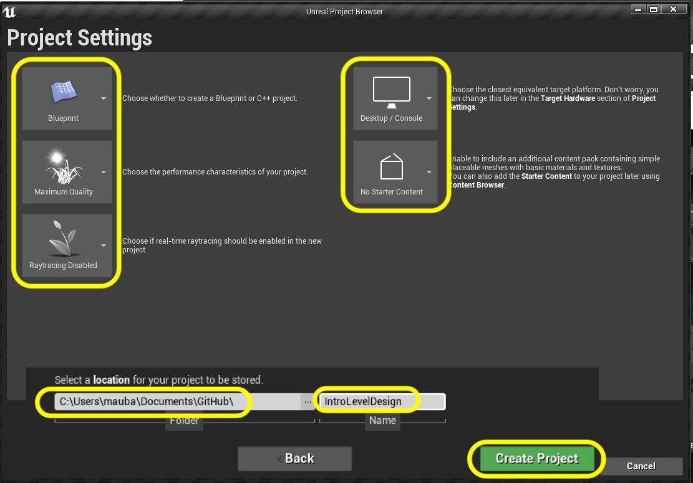


| `version.control`\|`Introduction To Level Design`| 
| :--- |
| :floppy_disk: &nbsp;&nbsp;Version control saves lots of space on our laptops so that all project data can be safely backed up and saved on the server but we only need the assets we are currently using on our local hard drive.  It is also good practice as most game projects use some form of version control. |


##### `Step 6.`\|`SUU&G`| :small_orange_diamond: :small_blue_diamond:

In the editor select the **Edit** menu item then from the drop down menu select **Editor Preferences**. Select **Loading & Saving** tab from the left hand side.  Go to *Source Control* and set **Prompt for Checkout on Asset Modification** to `true` and **Add New Files when Modified** to `true`.  Leave the other two settings at `false` and accept their default editor to deal with merge conflicts. 

https://user-images.githubusercontent.com/5504953/127741784-aa262ff8-e4be-4973-9bb7-4ce7abbc171b.mp4


##### `Step 7.`\|`SUU&G`| :small_orange_diamond: :small_blue_diamond: :small_blue_diamond:

Make sure you have a GitHub account and that you are logged into it. Click on the GitHub Classroom [Introduction-to-Level-Design-FA21 Link](https://classroom.github.com/a/bV3pgozG). Accept the prompt if it asks you go join the class and you should get to a **Accept the Assignment – Introduction To Level Design-FA21**. Press the <kbd>Accept this assignment</kbd> button.

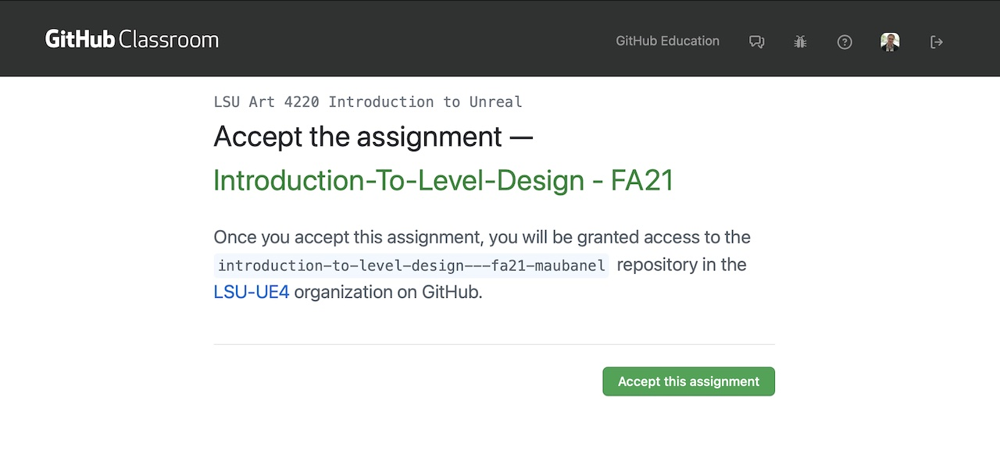


##### `Step 8.`\|`SUU&G`| :small_orange_diamond: :small_blue_diamond: :small_blue_diamond: :small_blue_diamond:

You will get a message saying the repository is geing setup.  Refresh/Reload your web browser as instructed.

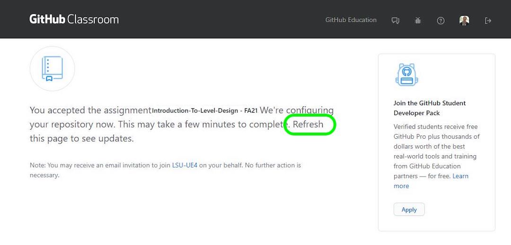


##### `Step 9.`\|`SUU&G`| :small_orange_diamond: :small_blue_diamond: :small_blue_diamond: :small_blue_diamond: :small_blue_diamond:

Eventually you will get a link for the repository.  Click on this link:

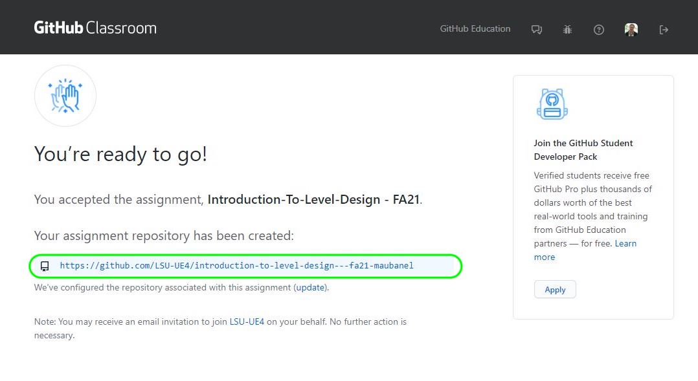


##### `Step 10.`\|`SUU&G`| :large_blue_diamond:

Now our server has no files on it. We will be using command line (**Terminal** on the mac Or **Git Bash** on the PC). You can see the commands below.  We are creating a **main** branch and making it our default branch (`-M` switch).  We are then taking the content we **Already Have** in our folder and pushing it to the server.

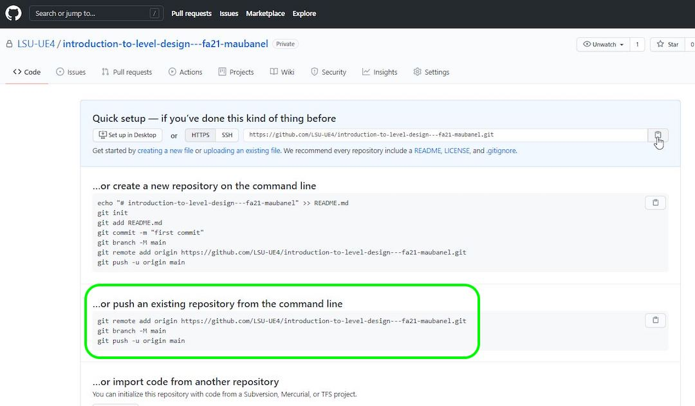


##### `Step 11.`\|`SUU&G`| :large_blue_diamond: :small_blue_diamond: 

Lets start by copying the link to the clipboard so we can add it to Unreal, and use UE4 to **Initialze** the project.

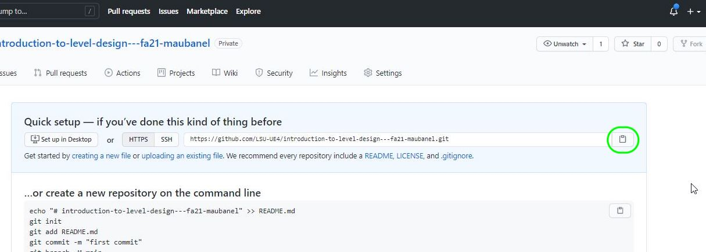


##### `Step 12.`\|`SUU&G`| :large_blue_diamond: :small_blue_diamond: :small_blue_diamond: 

Go back to **Unreal Engine** and press the <kbd>Source Control</kbd> button and select the `Connect to Source Control...` dropdown. This brings up the menu to select the source provider (in our game GitHub).

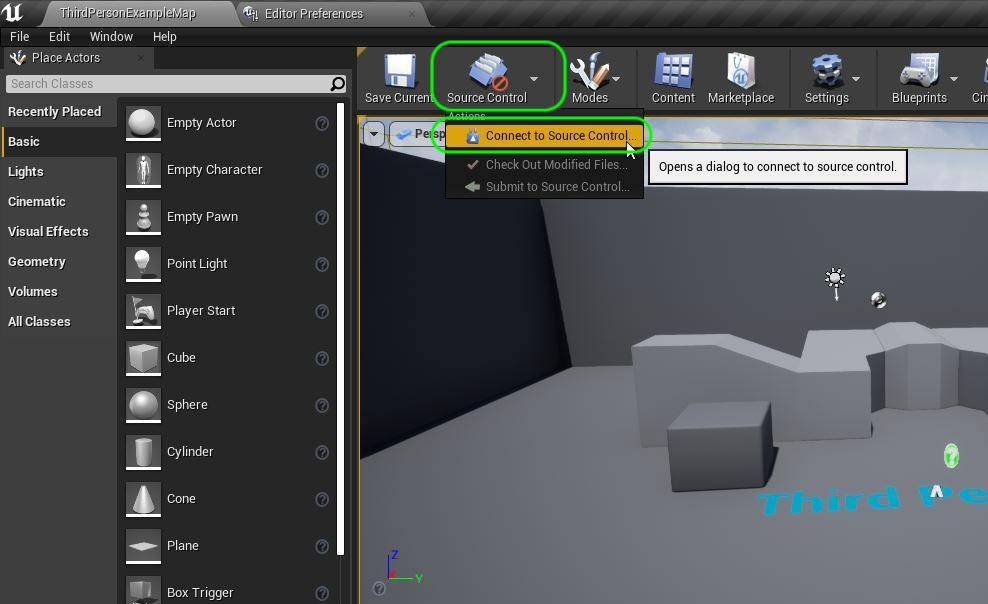

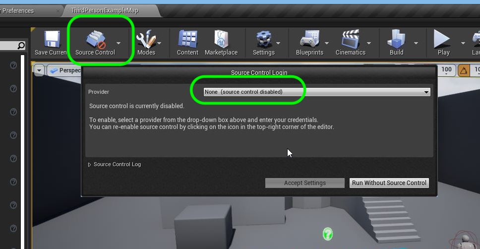


##### `Step 13.`\|`SUU&G`| :large_blue_diamond: :small_blue_diamond: :small_blue_diamond:  :small_blue_diamond: 

In the menu select **Git (beta version)** as the source control you will be using. Paste the directory for your GitHub project into the **Url of the remote server 'origin'** in Unreal.  Then make sure you add a **.gitignore** file, a **README.md** file, a **.gitattributes for Git LFS** file and finally **Make the initial Git Commit** file.  Then press the <kbd>Initialize project with Git</kbd> button and on the next pop up press the **Accept Settings** button. You should see message pop up saying *Connection to source control was successful!*.

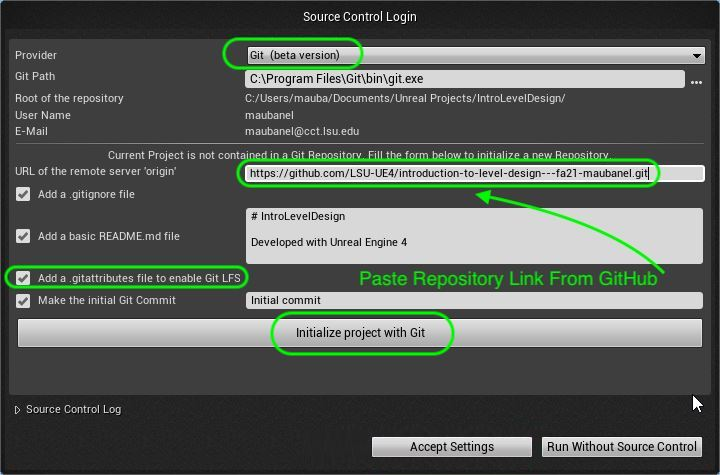

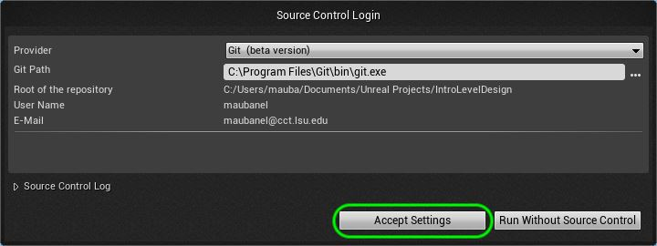


##### `Step 14.`\|`SUU&G`| :large_blue_diamond: :small_blue_diamond: :small_blue_diamond: :small_blue_diamond:  :small_blue_diamond: 

Lets make sure it installed GitHub in our project.  First we need to turn on hidden folders. On the PC follow these [Windows 10 Turn on Hidden Folders](https://support.microsoft.com/en-us/help/4028316/windows-view-hidden-files-and-folders-in-windows-10) directions. On the Mac it is a bit more involved so go and [turn on hidden folders on Mac](https://ianlunn.co.uk/articles/quickly-showhide-hidden-files-mac-os-x-mavericks). You should now see a `.git` hidden folder in the root directory of the project, if you do – you succesfully created a GitHub repo and connected it to the server.

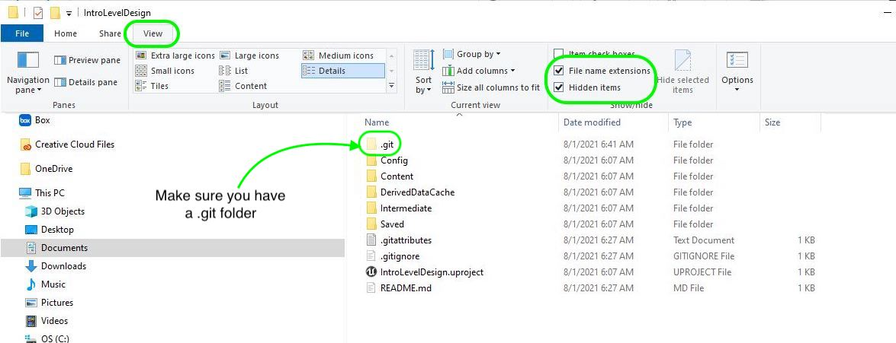


##### `Step 15.`\|`SUU&G`| :large_blue_diamond: :small_orange_diamond: 

Now we are going to use the **Command Line** tools just once.  On a **PC**, right click and run [Git Bash](https://www.windowscentral.com/how-launch-bash-shell-right-click-context-menu-windows-10).  This should have been installed with **Git** when you installed it above.  On a mac, it is a little more involved as you will see by this [website description](https://www.groovypost.com/howto/open-command-window-terminal-window-specific-folder-windows-mac-linux/).  The trick is to navigate to your working Directory (typically `Documents | Unreal Projects | Our First Project`).

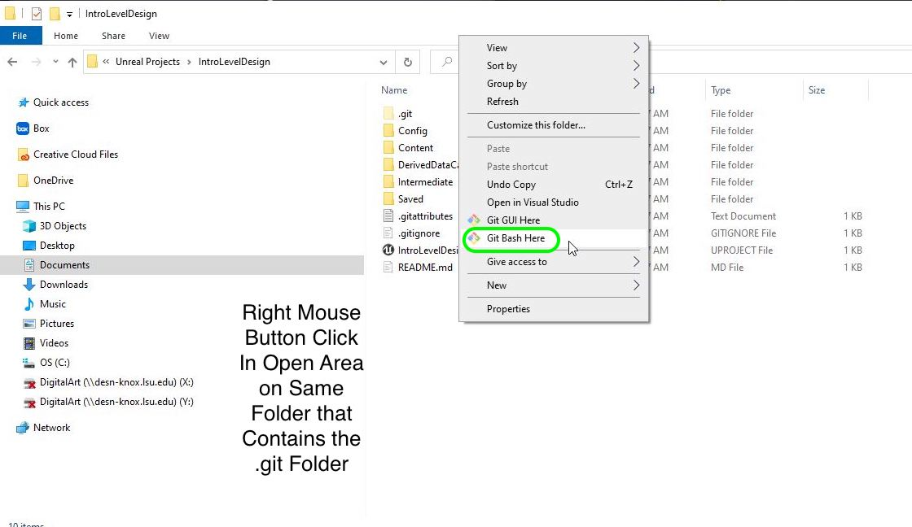


##### `Step 16.`\|`SUU&G`| :large_blue_diamond: :small_orange_diamond:   :small_blue_diamond: 

Type in:

```
git branch -M main
```
in either **Terminal** or **Git Bash**.  This will create a new **Default** branch called `Main`.

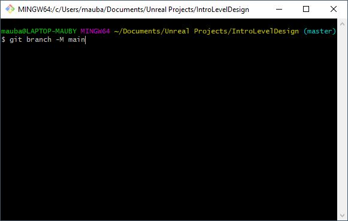


##### `Step 17.`\|`SUU&G`| :large_blue_diamond: :small_orange_diamond: :small_blue_diamond: :small_blue_diamond:

Now lets switch to the **Main** branch by typing

```
git checkout main
```

Now lets take all the work we have done to date on our computer and **Push** it to the server.  This will ensure that all the files are safely stored on the server. It will take a while then you should get a message confirming the branch creation and the push.

```
git push -u origin main
```


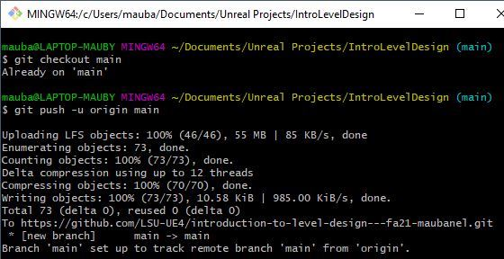


##### `Step 18.`\|`SUU&G`| :large_blue_diamond: :small_orange_diamond: :small_blue_diamond: :small_blue_diamond: :small_blue_diamond:

Go back to **GitHub** on the web and refesh your browser.  If you did the above correctly you should now see all the folders on **GitHub**:

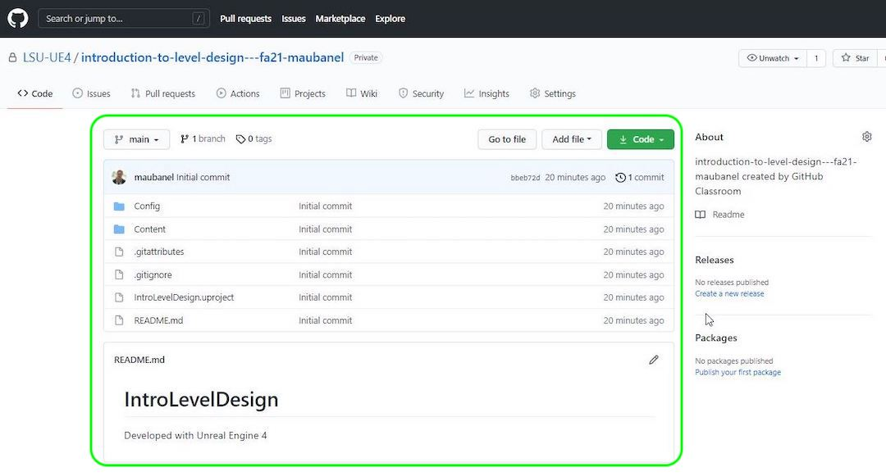


##### `Step 19.`\|`SUU&G`| :large_blue_diamond: :small_orange_diamond: :small_blue_diamond: :small_blue_diamond: :small_blue_diamond: :small_blue_diamond:

Now I tried doing the above step in **GitHub Desktop** but got some errors.  So now we need to link it to **GitHub Desktop** as we can use this moving forward to push data to the server.  Open up **GitHub Desktop** and select `File | Add local repository`.  Select the <kbd>Choose</kbd> button.

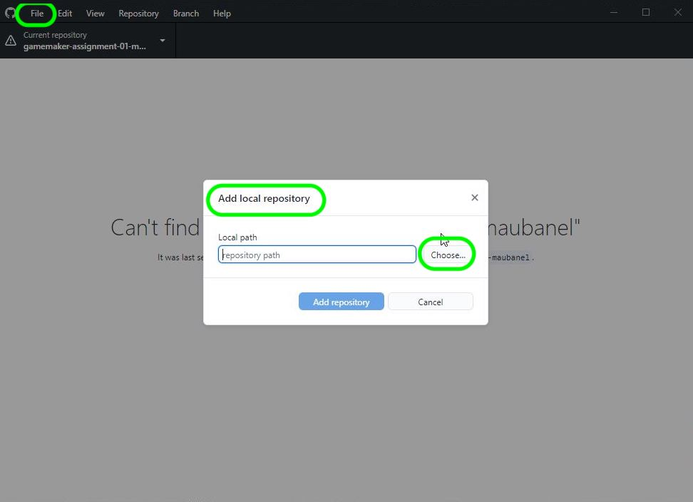


##### `Step 20.`\|`SUU&G`| :large_blue_diamond: :large_blue_diamond:

Locate the root folder of your project.  This is the folder that contains the `.git` folder.  This is the top most folder of your Unreal project. In my case it is in the `Documents | Unreal Projects | OurFirstProject` folder.  Press the <kbd>Select Folder</kbd> button.

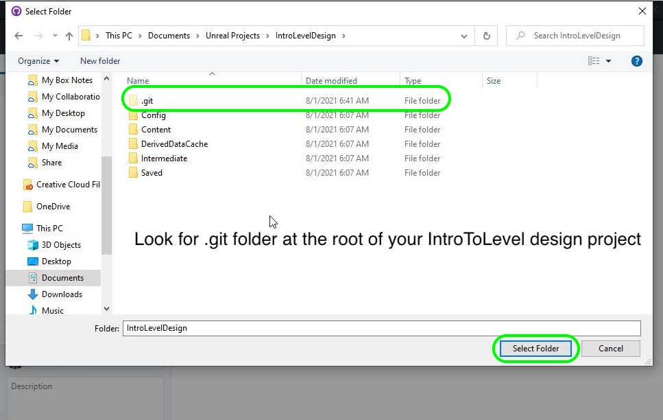


##### `Step 21.`\|`SUU&G`| :large_blue_diamond: :large_blue_diamond: :small_blue_diamond:

Press the <kbd>Add Repository</kbd> button to select this project. Then press the <kbd>Fetch origin</kbd> button to make sure that the permissions all work. 

You will get a pop up asking to **Initialize Git LFS** you will press the <kbd>Initialize Git LFS</kbd> button.

You should now see the message `Last feteched just now`. This means that we are ready to go. 

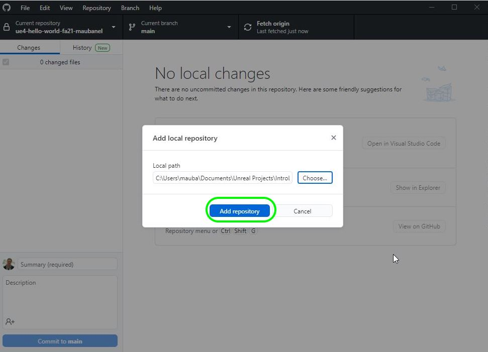

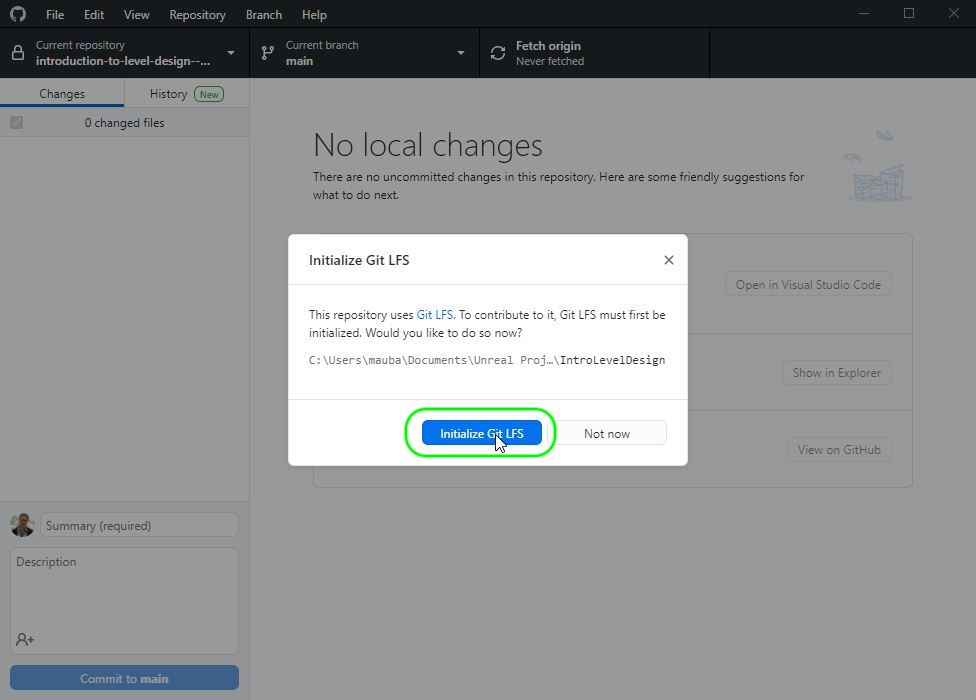


##### `Step 22.`\|`SUU&G`| :large_blue_diamond: :large_blue_diamond: :small_blue_diamond: :small_blue_diamond:

Edit the **README.md** file on GitHub and enter your name as the author and a brief description of the project.  I added `Level design for third person adventure game`.

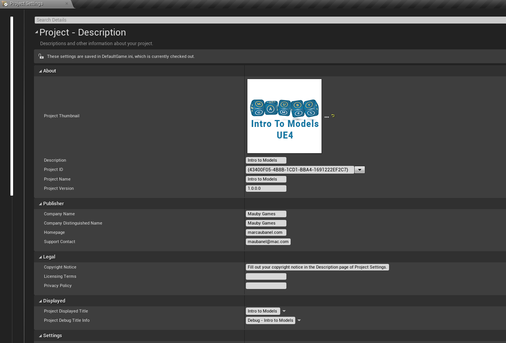


##### `Step 23.`\|`SUU&G`| :large_blue_diamond: :large_blue_diamond: :small_blue_diamond: :small_blue_diamond: :small_blue_diamond:

Go to **GitHub** and press the **Add file** button and select **Create new file**. Type in `LICENSE`.  A button pops up on the right and press **Choose a license template**. I recommend the **MIT License**. Then you press **Review and submit**. Go back to the main page and select **Compare and pull request**. Press the **Create pull request** button. Select **Merge pull request** and go back to the main page.  The `LICENSE` file should now show up. Now this is on the server so lets bring it onto our laptop.  Go to **GitHub** deskto and press **Fetch Origin** to get the latest.

https://user-images.githubusercontent.com/5504953/127746302-3c6ce54d-0905-4a1d-9273-c9bacabba65c.mp4


##### `Step 24.`\|`SUU&G`| :large_blue_diamond: :large_blue_diamond: :small_blue_diamond: :small_blue_diamond: :small_blue_diamond: :small_blue_diamond:

Download a thumbnail that you can use on this project [Intro Thumbnail](images/IntroToLevelDesign.png). Press the **Settings** button and select **Project Settings**.  Make sure you are in the **Project Description** tab and press the three dots in the **About** tab next to the thumbnail and attach the thumbnail you just downloaded. Enter a **Description**, **Project Name**.  Put your name as the **Publisher | Company Name** and you can add your email in **Support Contact**. Add the **Project Displayed Title** and **Project Debug Title Info**.

Go back to the game screen, press **Source Control** add a message and press submit.  Open up **GitHub** desktop and push to the server.

https://user-images.githubusercontent.com/5504953/127775522-662de1a2-997c-4bbe-ae35-beb582a67cd1.mp4


##### `Step 25.`\|`SUU&G`| :large_blue_diamond: :small_orange_diamond: 

Press play and lets see what we get? Run around using the **UP | DOWN | LEFT | RIGHT** keys on the keyboard. Press **Space Bar** to jump.  Get used to teh controls - we will make some changes in the next section.

https://user-images.githubusercontent.com/5504953/127747095-54362efe-c04c-4607-8cbc-e1adf34156e8.mp4


##### `Step 26.`\|`SUU&G`| :large_blue_diamond: :small_orange_diamond: :small_blue_diamond: 

OK, that is a good start for now.  Lets save and upload our progress to GitHub.  Open up **GitHub Desktop** and add a **Commit** message.  Press the <kbd>Commit to main</kbd> button. All you need to do to get it to the server is the press the <kbd>Push origin</kbd> button.

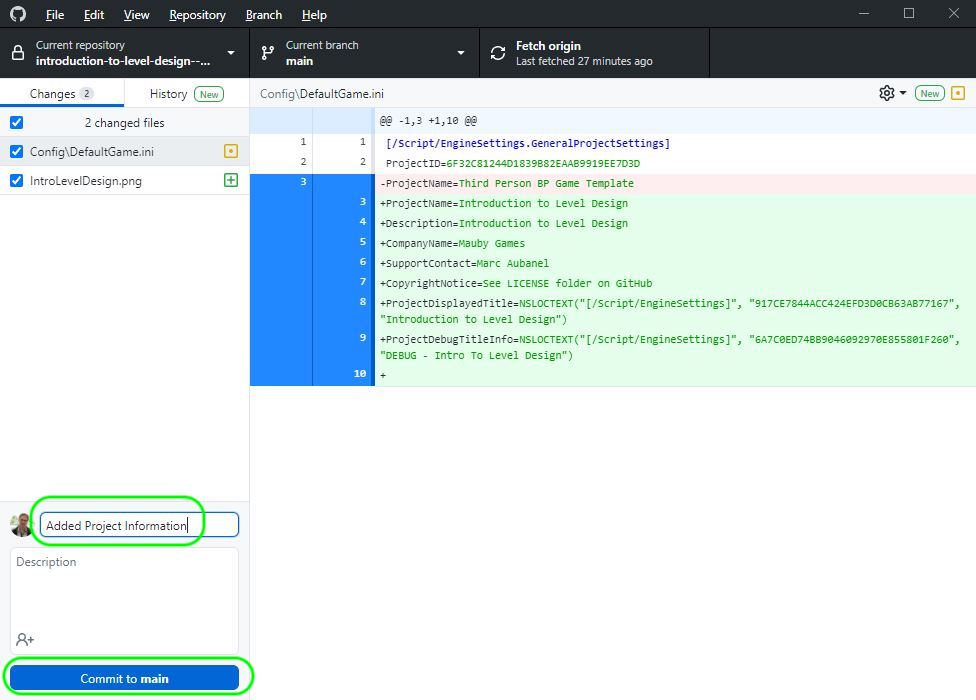

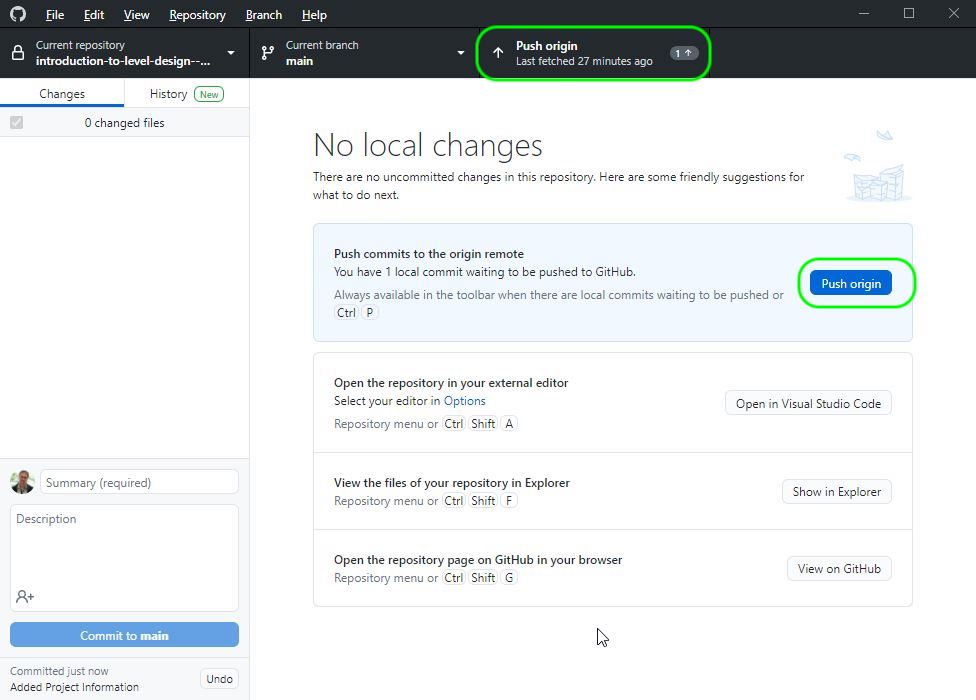


| [home](../README.md#user-content-ue4-intro-to-level-design) | [next](../camera-mechanics/README.md#user-content-lock-cameras-and-mechanics)|
|---|---|
