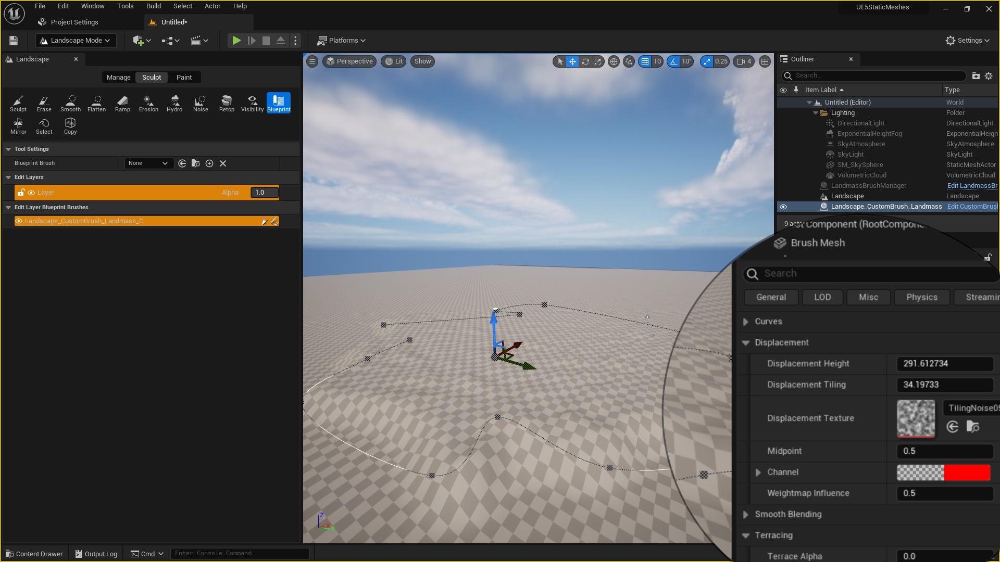
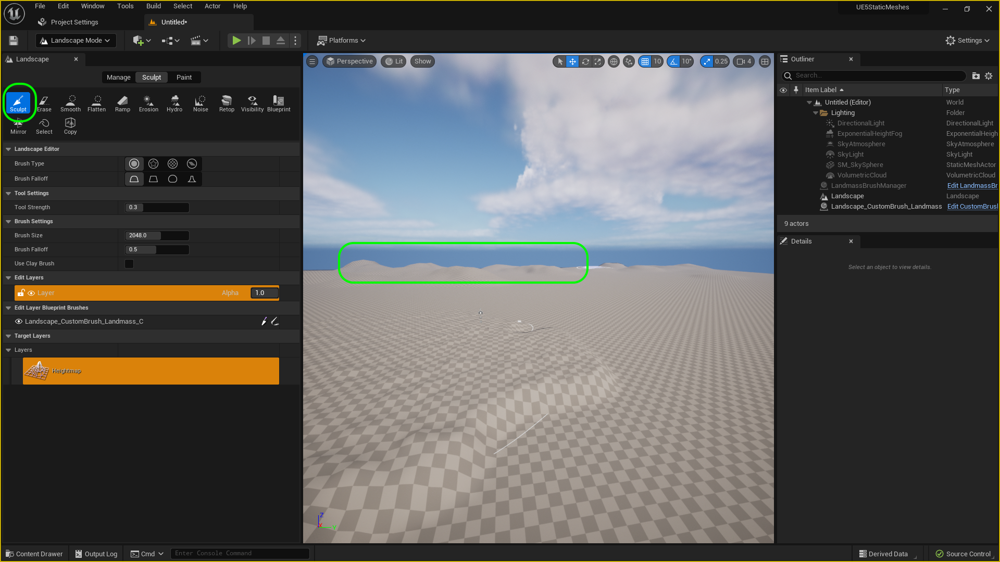
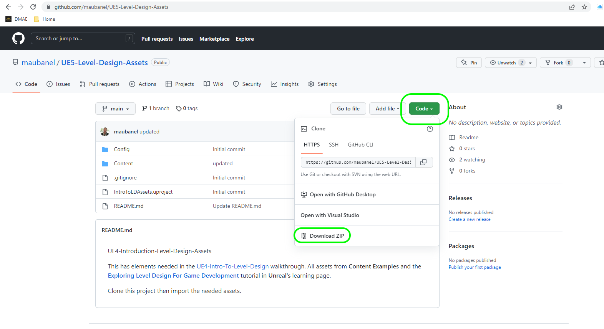
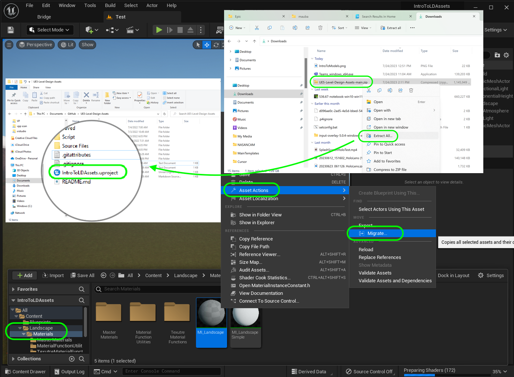
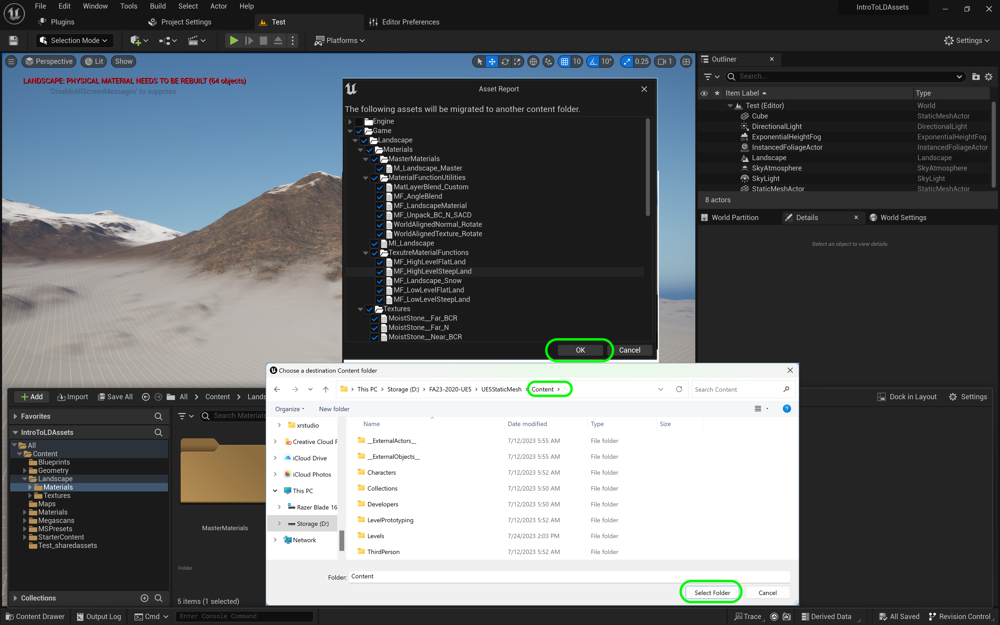

### Setting Up

[home](../README.md#user-content-ue5-intro-to-static-meshes) • [next](../setting-up-ii/README.md#user-content-setting-up-ii)

We will be working using the third person template so we can run around the environment.  We will be looking at static meshes and different ways of using them and tweaking the settings in the game engine.

 

---
| `required.software`\|`Static Meshes`| 
| :--- |
| :floppy_disk:You will need to install the latest version of _UE4 5.2.X_ by downloading the [Epic Games Launcher](https://www.epicgames.com/store/en-US/download). You will also need to download [P4V](https://www.perforce.com/downloads/helix-visual-client-p4v)  which is free to sign up for as we will be using version control. I strongly recommned the use of a PC with a good video card to unlock all the powerful features of UE5. On the PC follow these [Windows 10 & 11 Turn on Hidden Folders](hhttps://support.microsoft.com/en-us/windows/view-hidden-files-and-folders-in-windows-97fbc472-c603-9d90-91d0-1166d1d9f4b5) directions. 
|

##### `Step 1.`\|`ITSM`|:small_blue_diamond:

Run the **Epic Games Launcher** and press either **Launch** button to start the editor.

##### `Step 2.`\|`ITSM`|:small_blue_diamond: :small_blue_diamond: 

Now we will be using **Perforce** for version control.  If you do not have access to a server you can set one up yourself.  Make sure you have access to a server and have a **Depot** to use.  We are using a depot called **2023-Fall-ART-2020-UE5** and my **Workspace** is: **MaubyLaptopUE5Class**.

##### `Step 3.`\|`ITSM`|:small_blue_diamond: :small_blue_diamond: :small_blue_diamond:

You can pick from recent projects or different starting templates with Games, Film/Video & Live Events, Architecture and Automotive Product Designing & Manufacturing as categories.  Lets start by selecting **Games**. Lets select the **Third Person** template.

You can select between C++ and Blueprint.  Since we will not be doing any C++ programming in this exercise we will leave it with its default setting of **Blueprint**.  I am leaving the **Target Platform** at `Desktop` and **Quality Presets** at to `Maximum` as my computer is powerful enough to handle it.  We will leave **Raytracing** on as I have an RTX video card that supports ray tracing.  If you do not you can leave this set to on or off - it will only activate if you have a compatible card. We will also not bloat our project size and leave out **Starter Content** as it adds unecessary files and takes up a lot of hard drive space.

Choose the folder that holds your **Perforce Workspace | Depot** and call this project `UE5StaticMeshes`.  Press the <kbd>Create</kbd> button to start the create and open the new project.

##### `Step 4.`\|`ITSM`|:small_blue_diamond: :small_blue_diamond: :small_blue_diamond: :small_blue_diamond:

Now we need to hook up source control.  Press **Source Control Off** and connect to source control.  Pick the **Provider** set to `Perforce`.  Click on the **Workspace** drop down to select your local workspace for the machine you are working on.  Press the <kbd>Accept Settings</kbd> button.

##### `Step 5.`\|`ITSM`| :small_orange_diamond:

Create a new folder called **Levels**. Now we don't want to use the default level for 3rd person game so press **File | New Level** and select `Basic`.  Press the <kbd>Create</kbd> button.

##### `Step 6.`\|`ITSM`| :small_orange_diamond: :small_blue_diamond:

Press **File | Save Current** and save the new level as `Experimental` in the **Levels** folder.

##### `Step 7.`\|`ITSM`| :small_orange_diamond: :small_blue_diamond: :small_blue_diamond:

Download a thumbnail that you can use on this project [Intro Thumbnail](../Assets/IntroToModels.png). Open up **Edit Project Settings**.  Make sure you are in the **Project Description** tab and press the three dots in the **Project Thumbnail** section and attach the thumbnail you just downloaded. Enter a project title for the **Description**, **Project Name**.  Put your name as the **Company Name** and you can add your email in **Support Contact**. Add the **Project Displayed Title** and **Project Debug Title Info**. Add the legal information on how you want to publish your work, I publish mine using the open source [MIT License](https://opensource.org/licenses/MIT).

##### `Step 8.`\|`ITSM`| :small_orange_diamond: :small_blue_diamond: :small_blue_diamond: :small_blue_diamond:

Go to **Settings | Project Settings** and select the **Maps and Modes** tab.  Change the **Editor Startup Map** and **Game Default Map** to `Experimental`. 

##### `Step 9.`\|`ITSM`| :small_orange_diamond: :small_blue_diamond: :small_blue_diamond: :small_blue_diamond: :small_blue_diamond:

In the editor select the **Edit** menu item then from the drop down menu select **Editor Preferences**. Select **Loading & Saving** tab from the left hand side.  Go to *Source Control* and set **Automatically Checkout on Asset Modifcation** and **Add New Files when Modified** to `true`.  We want the editor to checkout and lockout changes from files that we are working on as well as adding new files we are creating. 

##### `Step 10.`\|`ITSM`| :large_blue_diamond:

We need two plugins.  Go to **Edit | Plugins** and add the **Landmass** and **Water** plugins.  Press the <kbd>Restart Now</kbd> button and take a break as it will take a while to compile and load these two plugins.

##### `Step 11.`\|`ITSM`| :large_blue_diamond: :small_blue_diamond: 

Click on the ground plane and delete it.  We will not be using it. We will replace it with a landscape.

##### `Step 12.`\|`ITSM`| :large_blue_diamond: :small_blue_diamond: :small_blue_diamond: 

Go into **Landscape** editing mode.  Set **Enable Edit Layers** to `true`.  Leave all other defaults the same - press the <kbd>Create</kbd> button. 

##### `Step 13.`\|`ITSM`| :large_blue_diamond: :small_blue_diamond: :small_blue_diamond:  :small_blue_diamond: 

Select a **Blueprint** brush with a `CustomBrush_Landmass`.

##### `Step 14.`\|`ITSM`| :large_blue_diamond: :small_blue_diamond: :small_blue_diamond: :small_blue_diamond:  :small_blue_diamond: 

Lets build a platform in the middle of the level. So, click on the center of the amp and you will see a shape with a spline that we can start with.  It has three splines and it looks like a pyramid.

##### `Step 15.`\|`ITSM`| :large_blue_diamond: :small_orange_diamond: 

You can add points to the spline by clicking on either end while pressing the <kbd>Alt</kbd> key.  Remember to let go and press again when trying to add a new point then pull along the X & Y axis to make a large mountain area in the middle of the level to work on. If it does not work try the other end of the line by clicking on the control point on the spline.

https://github.com/maubanel/UE5-Static-Meshes/assets/5504953/4e9716a7-d20d-49f2-b6c2-9df029fba928

##### `Step 16.`\|`ITSM`| :large_blue_diamond: :small_orange_diamond:   :small_blue_diamond: 

Make sure you have the **Layer | Landscape_CustomBrush_Landmass** selected.  In the details panel go to **Falloff** and select **Cap Shape** and set to true to flatten the surface so we can work on it.  Then adjust the **Falloff Angle**, **Falloff Width** and **Falloff Width Offset** to your liking.  Adjust the **Z Offset** to adjust the height of the shelf.

https://user-images.githubusercontent.com/5504953/182507827-de28e269-7b8f-4990-aec7-50c23ca344dd.mp4

##### `Step 17.`\|`ITSM`| :large_blue_diamond: :small_orange_diamond: :small_blue_diamond: :small_blue_diamond:

Lets add some roughness to the surface of the shelf by setting the 
**Displacement** using their noise texture. This gives it a more natural top surface.  Play with any other settings available to get used to the settings and create an effect you like!

##### `Step 18.`\|`ITSM`| :large_blue_diamond: :small_orange_diamond: :small_blue_diamond: :small_blue_diamond: :small_blue_diamond:

Select the **Sculpt** tool and draw some mountains in the horizon.  This will make the scene look more realistic. Surround the endge of the entire level so you do not have the land just end as a flat edge to block the horizon.

https://user-images.githubusercontent.com/5504953/182509295-46f21364-bb88-4187-a19d-74a995bac395.mp4

##### `Step 19.`\|`ITSM`| :large_blue_diamond: :small_orange_diamond: :small_blue_diamond: :small_blue_diamond: :small_blue_diamond: :small_blue_diamond:

##### `Step 20.`\|`ITSM`| :large_blue_diamond: :large_blue_diamond:

Unzip the folder and open up **IntroToLDAssets.uproject** and go to **Content Drawer | Landscape | Materials** and right click on **M_Landscape** and select **Asset Actions | Migrate**.  This will start the migration process of all the files you will need for our project.

##### `Step 21.`\|`ITSM`| :large_blue_diamond: :large_blue_diamond: :small_blue_diamond:

When migrating Unreal knows all the files that this material needs to render correctly.  Agree to all of them.  An explorer window will pop up to where you want to migrate to?  You need to go to the route level design folder that contains your `.uproject` file and then select the **Content** folder. It is always best to migrate to the route **Content** folder to preserve all the prior folders from the source project you are importing from.

You should see a message that declares the migration succesful at the bottom right corner.

<!--  -->

| [home](../README.md#user-content-ue5-intro-to-static-meshes) | [next](../setting-up-ii/README.md#user-content-setting-up-ii)|
|---|---|
