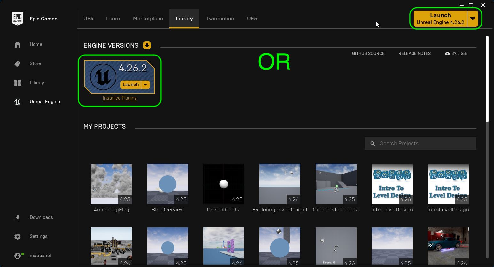
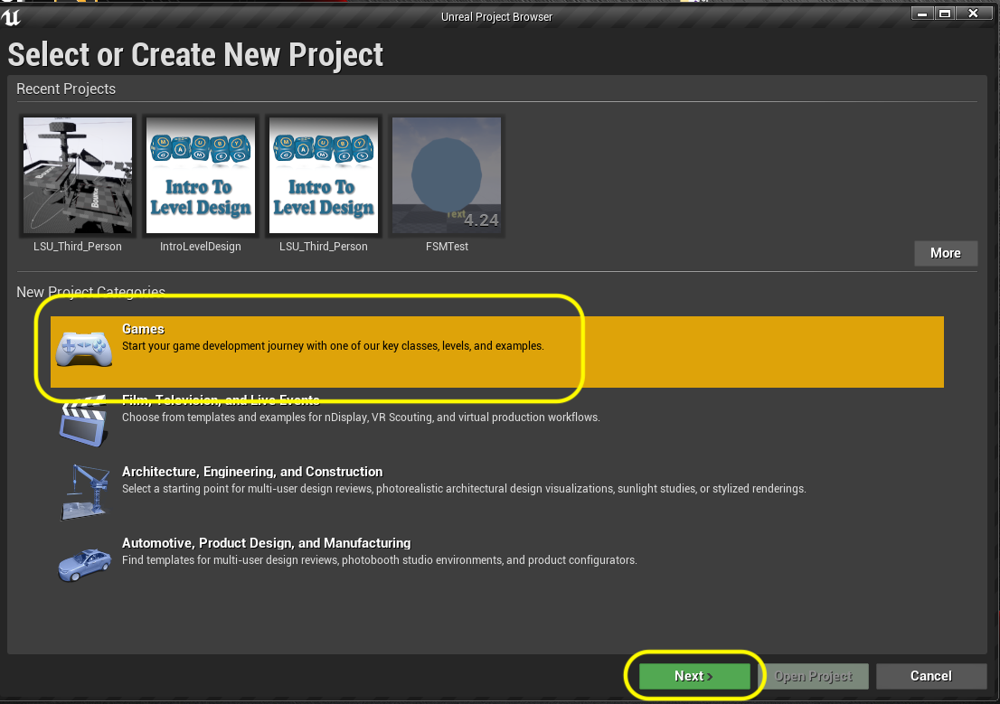
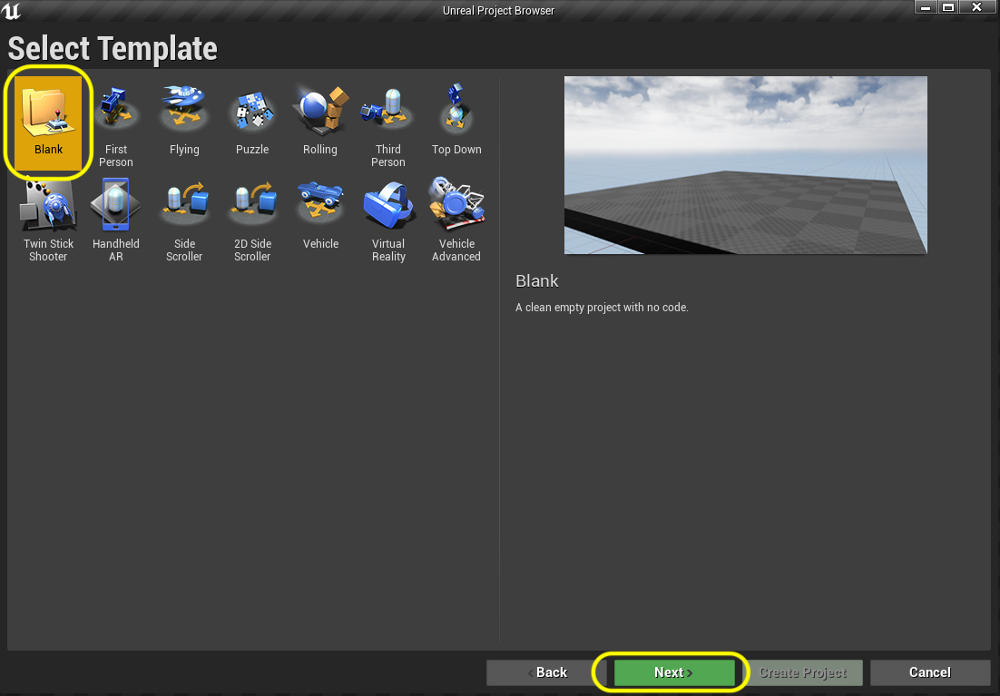
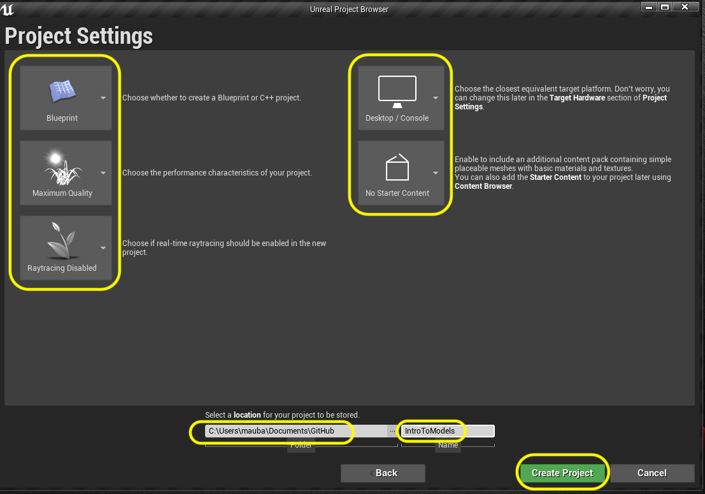
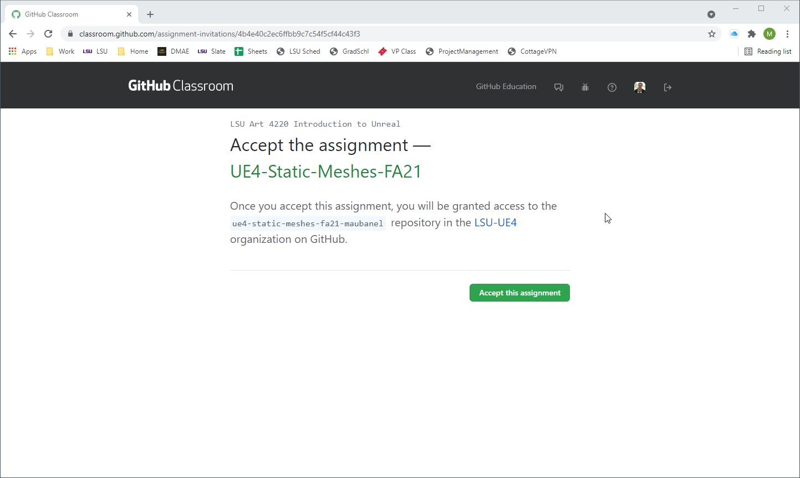
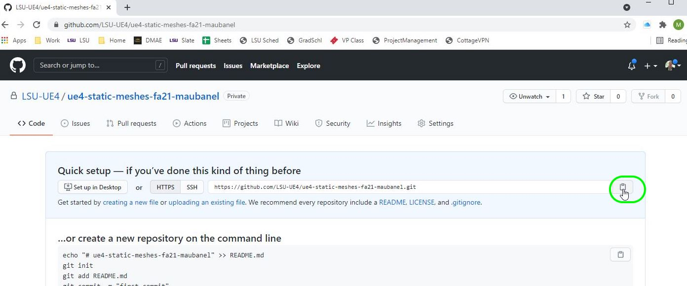

### Setting Up

[home](../README.md#user-content-ue4-static-meshes) • [next](../)

We will be working in a third person template and will use the UE4 default and alter it for our needs.  This will give us all we need for a character that we can control."

 

---
| `required.software`\|`Hello World`| 
| :--- |
| :floppy_disk:You will need to install the latest version of _UE4 4.26.x_ by downloading the [Epic Games Launcher](https://www.epicgames.com/store/en-US/download). You will also need a [GitHub](https://github.com/) account which is free to sign up for as we will be using version control. You will also need a mac or PC that is powerful enough to run unreal. If you are on a PC you will have to download and install [git](https://git-scm.com/downloads) (on a mac it may prompt you to install git as well but you can do it through the terminal). We will also install [Github Desktop](https://desktop.github.com) as it provides a GUI interface so you don't have to worry about command line. Once git is installed you will also need to download and install the [Git LFS (Large File System)](https://git-lfs.github.com) as well for both PC and mac.  You will also need access to Maya 2020..\n\nLets make sure you can see hidden folders. On the PC follow these [Windows 10 Turn on Hidden Folders](https://support.microsoft.com/en-us/help/4028316/windows-view-hidden-files-and-folders-in-windows-10) directions. On the Mac it is a bit more involved so go and [turn on hidden folders on Mac](https://ianlunn.co.uk/articles/quickly-showhide-hidden-files-mac-os-x-mavericks). |

##### `Step 1.`\|`SUU&G`|:small_blue_diamond:

Run the **Epic Games Launcher** and press either **Launch** button to go to the *Select or Create New Project* screen.

##### `Step 2.`\|`FHIU`|:small_blue_diamond: :small_blue_diamond: 

You can pick from different starting templates with Games, Film/TV, Architecture and Design as options.  Lets start by selecting **Games** and then press the **Next** button.

##### `Step 3.`\|`SUU&G`|:small_blue_diamond: :small_blue_diamond: :small_blue_diamond:

Unreal then allows us to have various starting point template for different genres of games.  Lets select the **Blank** template.

This now takes you to the *Project Settings* screen. The first settings on the top left is set to Blueprints.  You can select between C++ and Blueprint.  Since we will not be doing any C++ programming in this exercise we will leave it with Blueprint.  I am leaving the quality settings to **Maximum Quality** as my computer is powerful enough to handle it.  If you feel your computer is not at a gaming level select a lower quality.  We will leave **Raytracing** off as we will not be using it at the moment.  We set the paltform to **Desktop** as we will be on a PC or Mac playing the game and not on a game console or on mobile.  Then you can load up the project with some basic content and we will **NOT** be loading this  to keep our project file sizes down.

Select a folder to put it in (I suggest `Documents/github/` and then assign a project name and I am calling it `UE4StaticMeshes`.  Press the **Create Project** button to start the new project.",

##### `Step 4.`\|`SUU&G`|:small_blue_diamond: :small_blue_diamond: :small_blue_diamond: :small_blue_diamond:

Make sure you have a GitHub account and that you are logged into it. Click on the GitHub Classroom [UE4-Static-Meshes-FA21 Link](https://classroom.github.com/a/W90fu96j). Accept the prompt if it asks you go join the class and you should get to a **Accept the Assignment – UE4-Static-Meshes-FA21**. Press the <kbd>Accept this assignment</kbd> button.

##### `Step 5.`\|`SUU&G`| :small_orange_diamond:

Now navigate to the new **GitHub** project and copy the location of the **repository**.

##### `Step 6.`\|`SUU&G`| :small_orange_diamond: :small_blue_diamond:

In the editor select the **Edit** menu item then from the drop down menu select **Editor Preferences**. Select **Loading & Saving** tab from the left hand side.  Go to *Source Control* and set **Prompt for Checkout on Asset Modification** to `true` and **Add New Files when Modified** to `true`.  Leave the other two settings at `false` and accept their default editor to deal with merge conflicts. 

https://user-images.githubusercontent.com/5504953/127741784-aa262ff8-e4be-4973-9bb7-4ce7abbc171b.mp4
    

##### `Step 7.`\|`SUU&G`| :small_orange_diamond: :small_blue_diamond: :small_blue_diamond:

We will turn this folder into a git repository.  We can do this inside of Unreal.  Click on the **Source Control** button and select **Connect to Source Control**.  This opens up a menu that shows your **Connect to Source Control**.  Then in the menu select **Git (beta version)** as the source control you will be using. Make sure you add a **.gitignore** file, a **README.md** file, a **.gitattributes for Git LFS** file and paste in the GitHub link for the project. Finally **Initialize project with Git** file.

##### `Step 8.`\|`SUU&G`| :small_orange_diamond: :small_blue_diamond: :small_blue_diamond: :small_blue_diamond:

##### `Step 9.`\|`SUU&G`| :small_orange_diamond: :small_blue_diamond: :small_blue_diamond: :small_blue_diamond: :small_blue_diamond:

##### `Step 10.`\|`SUU&G`| :large_blue_diamond:

##### `Step 11.`\|`SUU&G`| :large_blue_diamond: :small_blue_diamond: 

##### `Step 12.`\|`SUU&G`| :large_blue_diamond: :small_blue_diamond: :small_blue_diamond: 

##### `Step 13.`\|`SUU&G`| :large_blue_diamond: :small_blue_diamond: :small_blue_diamond:  :small_blue_diamond: 

##### `Step 14.`\|`SUU&G`| :large_blue_diamond: :small_blue_diamond: :small_blue_diamond: :small_blue_diamond:  :small_blue_diamond: 

##### `Step 15.`\|`SUU&G`| :large_blue_diamond: :small_orange_diamond: 

##### `Step 16.`\|`SUU&G`| :large_blue_diamond: :small_orange_diamond:   :small_blue_diamond: 

##### `Step 17.`\|`SUU&G`| :large_blue_diamond: :small_orange_diamond: :small_blue_diamond: :small_blue_diamond:

##### `Step 18.`\|`SUU&G`| :large_blue_diamond: :small_orange_diamond: :small_blue_diamond: :small_blue_diamond: :small_blue_diamond:

##### `Step 19.`\|`SUU&G`| :large_blue_diamond: :small_orange_diamond: :small_blue_diamond: :small_blue_diamond: :small_blue_diamond: :small_blue_diamond:

##### `Step 20.`\|`SUU&G`| :large_blue_diamond: :large_blue_diamond:

##### `Step 21.`\|`SUU&G`| :large_blue_diamond: :large_blue_diamond: :small_blue_diamond:

___

| [previous](../)| [home](../README.md#user-content-ue4-static-meshes) | [next](../)|
|---|---|---|
