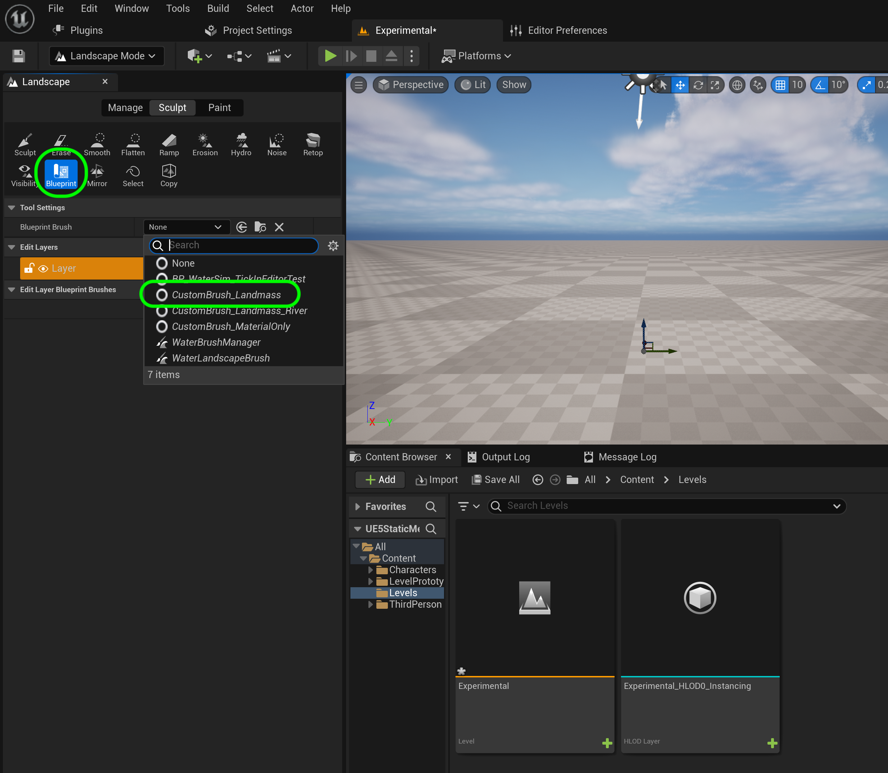

### Setting Up

[home](../README.md#user-content-ue4-static-meshes) • [next](../lexicon/README.md#user-content-3-d-lexicon)

We will be working in a third person template and will use the UE4 default and alter it for our needs.  This will give us all we need for a character that we can control."

 

---
| `required.software`\|`Static Meshes`| 
| :--- |
| :floppy_disk:You will need to install the latest version of _UE4 4.5.X_ by downloading the [Epic Games Launcher](https://www.epicgames.com/store/en-US/download). You will also need to download [P4V](https://www.perforce.com/downloads/helix-visual-client-p4v)  which is free to sign up for as we will be using version control. I strongly recommned the use of a PC with a good video card to unlock all the powerful features of UE5. On the PC follow these [Windows 10 Turn on Hidden Folders](https://support.microsoft.com/en-us/help/4028316/windows-view-hidden-files-and-folders-in-windows-10) directions. 
|

##### `Step 1.`\|`ITSM`|:small_blue_diamond:

Run the **Epic Games Launcher** and press either **Launch** button to start the editor.

##### `Step 2.`\|`ITSM`|:small_blue_diamond: :small_blue_diamond: 

Now we will be using **Perforce** for version control.  If you do not have access to a server you can set one up yourself.  Make sure you have access to a server and have a **Depot** to use.  I am using a depot called **UE5 Class** and my **Workspace** is: **maubanel-laptop**.

##### `Step 3.`\|`ITSM`|:small_blue_diamond: :small_blue_diamond: :small_blue_diamond:

You can pick from recent projects or different starting templates with Games, Film/Video & Live Events, Architecture and Automotive Product Designing & Manufacturing as categories.  Lets start by selecting **Games**. Lets select the **Third Person** template.

You can select between C++ and Blueprint.  Since we will not be doing any C++ programming in this exercise we will leave it with its default setting of **Blueprint**.  I am leaving the **Target Platform** at `Desktop` and **Quality Presets** at to `Maximum` as my computer is powerful enough to handle it.  We will leave **Raytracing** off as we will not be using it at the moment and will eventually be depricated from UE5.  We will also not bloat our project size and leave out **Starter Content**.

Choose the folder that holds your **Perforce Workspace | Depot** and call this project `UE4StaticMeshes`.  Press the <kbd>Create</kbd> button to start the create and open the new project.

##### `Step 4.`\|`ITSM`|:small_blue_diamond: :small_blue_diamond: :small_blue_diamond: :small_blue_diamond:

Now we need to hook up source control.  Press **Source Control Off** and connect to source control.  Pick the **Provider** set to `Perforce`.  Click on the **Workspace** drop down to select your local workspace for the machine you are working on.  Press the <kbd>Accept Settings</kbd> button.

##### `Step 5.`\|`ITSM`| :small_orange_diamond:

Create a new folder called **Levels**. Now we don't want to use the default level for 3rd person game so press **File | New Level** and select `Basic`.  Press the <kbd>Create</kbd> button.

##### `Step 6.`\|`ITSM`| :small_orange_diamond: :small_blue_diamond:

Press **File | Save Current** and save the new level as `Experimental` in the **Levels** folder.

##### `Step 7.`\|`ITSM`| :small_orange_diamond: :small_blue_diamond: :small_blue_diamond:

Download a thumbnail that you can use on this project [Intro Thumbnail](../Assets/IntroToModels.png). Press the **Settings** button and select **Project Settings**.  Make sure you are in the **Project Description** tab and press the three dots in the **Project Thumbnail** section and attach the thumbnail you just downloaded. Enter a project title for the **Description**, **Project Name**.  Put your name as the **Company Name** and you can add your email in **Support Contact**. Add the **Project Displayed Title** and **Project Debug Title Info**. Add the legal information on how you want to publish your work, I publish mine using the open source [MIT License](https://opensource.org/licenses/MIT).

##### `Step 8.`\|`ITSM`| :small_orange_diamond: :small_blue_diamond: :small_blue_diamond: :small_blue_diamond:

Go to **Settings | Project Settings** and select the **Maps and Modes** tab.  Change the **Editor Startup Map** and **Game Default Map** to `Experimental`. 

##### `Step 9.`\|`ITSM`| :small_orange_diamond: :small_blue_diamond: :small_blue_diamond: :small_blue_diamond: :small_blue_diamond:

In the editor select the **Edit** menu item then from the drop down menu select **Editor Preferences**. Select **Loading & Saving** tab from the left hand side.  Go to *Source Control* and set **Automatically Checkout on Asset Modifcation**, **Prompt for Checkout on Asset Modifaction** and **Add New Files when Modified** to `true`.  We want the editor to checkout and lockout changes from files that we are working on as well as adding new files we are creating. 

##### `Step 10.`\|`ITSM`| :large_blue_diamond:

We need two plugins.  Go to **Edit | Plugins** and add the **Landmass** and **Water** plugins.  PRess the <kbd>Restart Now</kbd> button and take a break as it will take a while to compile and load these two plugins.

##### `Step 11.`\|`ITSM`| :large_blue_diamond: :small_blue_diamond: 

Click on the ground plane and delete it.  We will not be using it. We will replace it with a landscape.

##### `Step 12.`\|`ITSM`| :large_blue_diamond: :small_blue_diamond: :small_blue_diamond: 

Go into **Landscape** editing mode.  Set **Enable Edit Layers** to `true`.  Leave all other defaults the same - press the <kbd>Create</kbd> button. 

##### `Step 13.`\|`ITSM`| :large_blue_diamond: :small_blue_diamond: :small_blue_diamond:  :small_blue_diamond: 

Select a **Blueprint** brush with a `CustomBrush_Landmass`.

##### `Step 14.`\|`ITSM`| :large_blue_diamond: :small_blue_diamond: :small_blue_diamond: :small_blue_diamond:  :small_blue_diamond: 

Click on the center of the level and you will see a shape with a spline that we can start with.  It has three splines and it looks like a pyramid.

##### `Step 15.`\|`ITSM`| :large_blue_diamond: :small_orange_diamond: 

You can add points to the spline by clicking on either end while pressing the <kbd>Alt</kbd> key.  Remember to let go and press again when trying to add a new point then pull along the X & Y axis to make a large mountain area in the middle of the level to work on.

https://user-images.githubusercontent.com/5504953/182507211-314f8823-40f6-4958-8a35-d4a49aae55c2.mp4

##### `Step 16.`\|`ITSM`| :large_blue_diamond: :small_orange_diamond:   :small_blue_diamond: 

Now go and cap the shape to create a shelf that we can work on.  x

https://user-images.githubusercontent.com/5504953/182507827-de28e269-7b8f-4990-aec7-50c23ca344dd.mp4

##### `Step 17.`\|`ITSM`| :large_blue_diamond: :small_orange_diamond: :small_blue_diamond: :small_blue_diamond:

Press **Source Control | Submit to Source Control** and type in a message of what you just did.  Press **Submit** and you have now succesfully saved the changes locally.

https://user-images.githubusercontent.com/5504953/129446160-222dc30f-1f11-46ca-a750-1e3a49ad4600.mp4

<!--  -->

| [previous](../)| [home](../README.md#user-content-ue4-static-meshes) | [next](../lexicon/README.md#user-content-3-d-lexicon)|
|---|---|---|
