### UVs

[previous](../collisions/README.md#user-content-collisions) • [home](../README.md#user-content-ue5-intro-to-static-meshes) • [next](../nanites/README.md#user-content-nanites)

[UV Mapping](https://en.wikipedia.org/wiki/UV_mapping) is a method of project a 2-dimensional texture on the surface of a 3-d model.  This can be for a texture color, the reflective qualities of an area on the surface or many other shader related topics.  The **U** and the **V** denote the X & Y axis of the 2D texture because **X**, **Y** and **Z** are used by the verticese in the 3-D model.  So **U** is the horizontal axis and **Z** is the vertical axis of the 2-D texture.

 

---

##### `Step 1.`\|`ITSM`|:small_blue_diamond:

[UV]() mapping is the process of projecting a 2-D image to a 3D model's surface for texture mapping.  This allows the model to know what pixel in the 2-d image goes to what portion of the polygon (face) in a model.  The larger the size of the texture, the more detail you will get in the model.  The letters "U" and "V" are used to represent the two axis of a 2-D texture as **X, Y & Z** are already representing the points of the 3-D model.  **U** represents the horizontal axis (x) and **V** represents the vertical axis (y) of the texture.

This is the 3-D shaped unwrapped so that it is like you cut the seams on the sides of the box and laid them out flat.  It is often called UV unwrapping, the act of taking a 3-D model and creating UVs.

* Picture from Wikipedia

##### `Step 2.`\|`ITSM`|:small_blue_diamond: :small_blue_diamond: 

Now go back to modeling mode and select **UVs | Layout**.  Now what this shows is a square texture with an exploded view of the polygons of the faces of the individual pieces were before they were combined.  So each pixel in this texture maps relates to a face in the model. 

You will notice that the box shapes only have one face rather than 6 faces.  This means that all 6 faces are using the same material so all sides of the box will be identical in the way that UV's are layed out here currently.

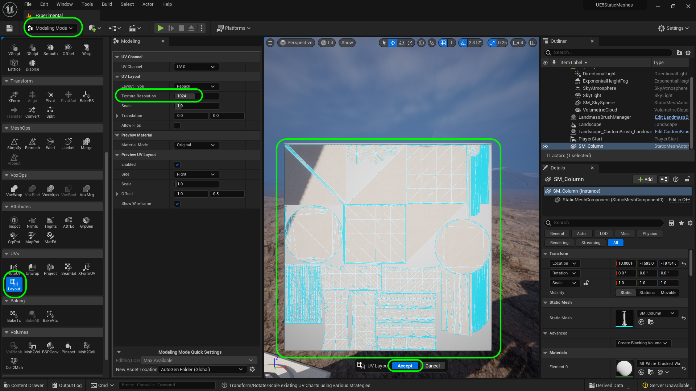

##### `Step 3.`\|`ITSM`|:small_blue_diamond: :small_blue_diamond: :small_blue_diamond:

So first lets try **UVs | Auto UV**. Make sure **Material Mode** is set to `Checkerboard`. Play around with the settings.  What we want to see is 1 meter squares evenly spaced.  No matter what I change I can't seem to get a clean uv map with the auto uv setting.

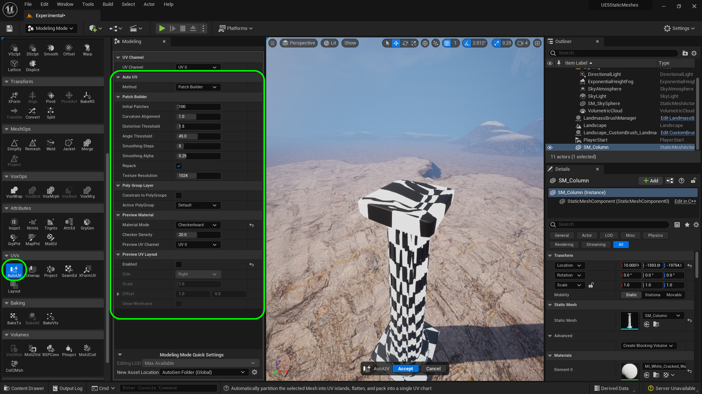

##### `Step 4.`\|`ITSM`|:small_blue_diamond: :small_blue_diamond: :small_blue_diamond: :small_blue_diamond:

Lets try unwrapping where the engine will try and unwrap the model to create a good UV map.  Again, I do not get any desired results.  In fact it is worse I have no texture at all on the top portion of the model.

##### `Step 5.`\|`ITSM`| :small_orange_diamond:

Now our final attempt is to project the UV's onto the closest shape.  Now since this is still cylindrical, select **Projection Type** and then select `Cylindrical`.  Press the <kbd>Accept</kbd> button.

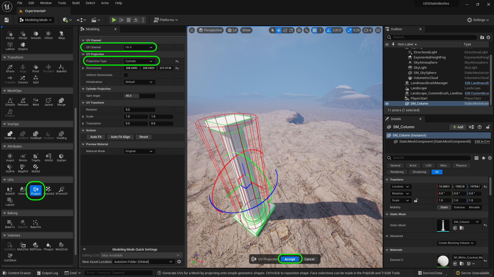

##### `Step 6.`\|`ITSM`| :small_orange_diamond: :small_blue_diamond:

Now go back to **UVs | Auto UV** and it looks a bit better.  I can see some shapes that are not visible, like the top of the old cylinder.  I should have done a beter job cutting and discarding unused model before we merged the geometry. 

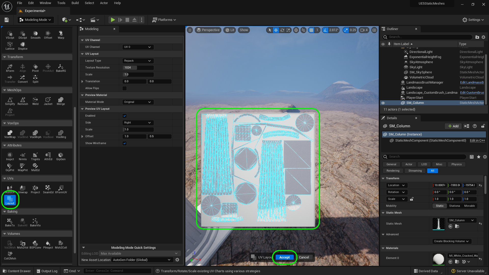

##### `Step 7.`\|`ITSM`| :small_orange_diamond: :small_blue_diamond: :small_blue_diamond:

Press **File | Save All** to save all your work to date.  There is a new plugin tool that we can use to edit UV's as well.  Go to **Edit | Plugins** and search for **UV Editor**. There will be a disclaimer about the tool not being final and you will need to restart the game.

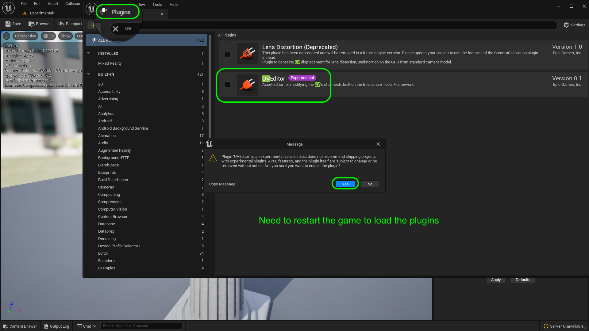

##### `Step 8.`\|`ITSM`| :small_orange_diamond: :small_blue_diamond: :small_blue_diamond: :small_blue_diamond:

Now select the column in the game engine and select **Actor | Asset Tools | UV Editor**.

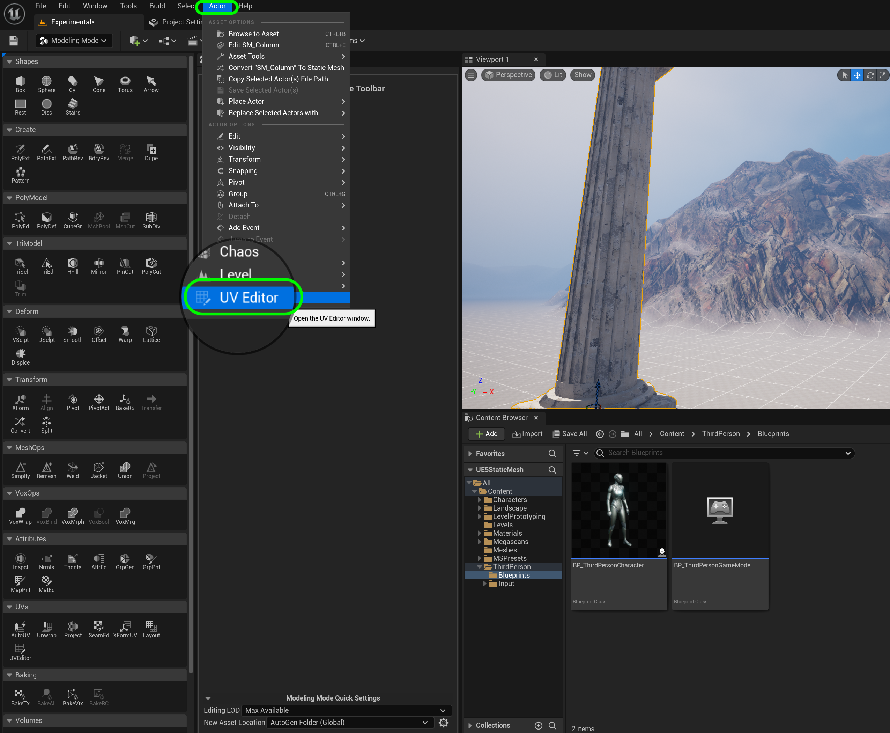

##### `Step 9.`\|`ITSM`| :small_orange_diamond: :small_blue_diamond: :small_blue_diamond: :small_blue_diamond: :small_blue_diamond:

So you now see your UV's and they can be edited if you like.

##### `Step 10.`\|`ITSM`| :large_blue_diamond:

You can go to **Display** and select `Background` and you will see a UV sheet show you the texel density and where each object is projected.  So you can see **A1** in your 2D UV sheet and where it projecst on the model. If it looks bad you can try **Unwrapping** it in the UV tool in this editor.  I got better results than unwrapping it in the Modeling package (but that might be the steps I took prior being different).

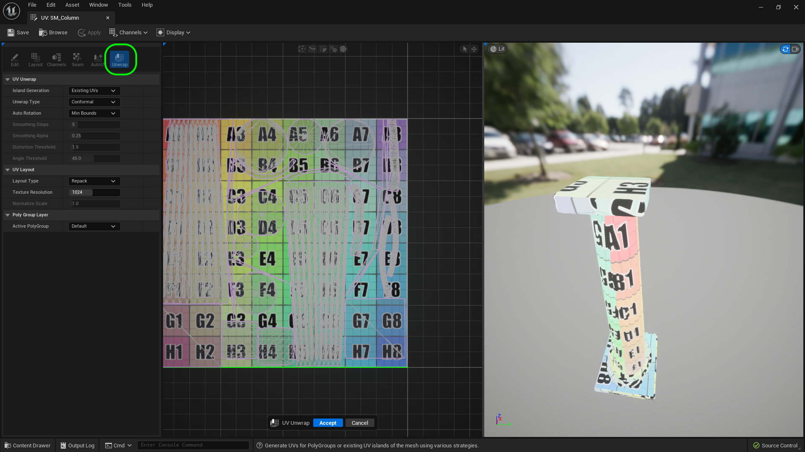

##### `Step 11.`\|`ITSM`| :large_blue_diamond: :small_blue_diamond: 

Now we have some extraneous UV's of objects we can't see.  This is the top of the cone that was included when we merged the two models.  If you **Invert Normals** you will see that this shape exists inside (revert the normals back to the shape being correct). In hindsite we should have sliced the model first and deleted the hidden part.

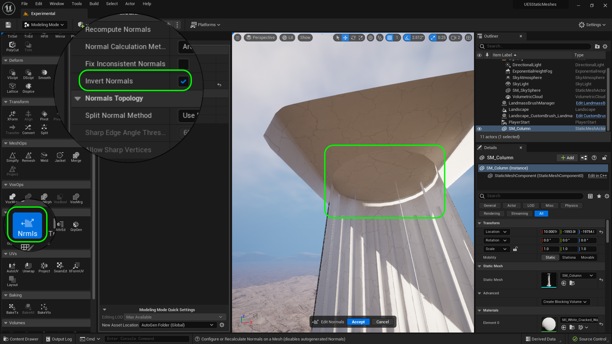

##### `Step 12.`\|`ITSM`| :large_blue_diamond: :small_blue_diamond: :small_blue_diamond: 

Now select the **Tri Model | TriSel** tool and paint carefully to just choose this one set of planes that was the top of the column when first created.  Press the <kbd>Delete</kbd> button to get rid of it. Then press the <kbd>Accept</kbd> button.

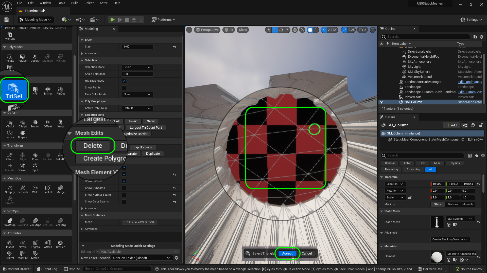

##### `Step 13.`\|`ITSM`| :large_blue_diamond: :small_blue_diamond: :small_blue_diamond:  :small_blue_diamond: 

That should now cut the faces we no longer need that are hidden.

##### `Step 14.`\|`ITSM`| :large_blue_diamond: :small_blue_diamond: :small_blue_diamond: :small_blue_diamond:  :small_blue_diamond: 

Go back to the UV Editor Tool and resize the **Texture Resolution** to `2048` to match the medium size we downloaded from **Quixel**.

##### `Step 15.`\|`ITSM`| :large_blue_diamond: :small_orange_diamond: 

Redo the **Unwrap** with this slightly altered shape.  We should have a bit more UV space for the visible parts of the model.

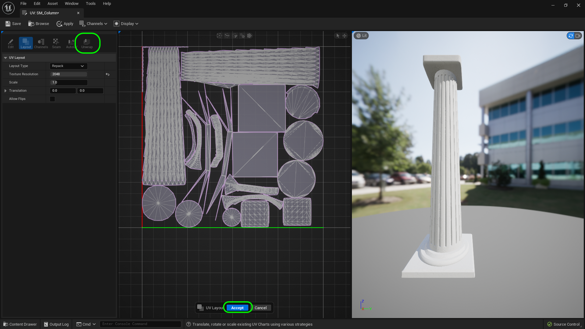

##### `Step 16.`\|`ITSM`| :large_blue_diamond: :small_orange_diamond:   :small_blue_diamond: 

If you imagine unwrapping as cutting away a shape (like along the column) then uncurling it until it is flat.  This is done by having seams in the model.  If you go to the **Seam** editor you can see how it has unwrapped the seams.  You can add seams but I have not been able to delete them in this version of the editor.

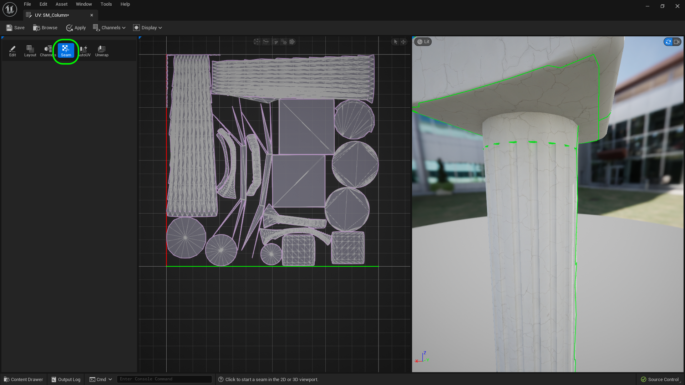

##### `Step 17.`\|`ITSM`| :large_blue_diamond: :small_orange_diamond: :small_blue_diamond: :small_blue_diamond:

Go into the game and inspect the UVs.  Make sure that the textures have no unsightly seams and that the resolution holds up.  Check out ALL parts of the model.

##### `Step 18.`\|`ITSM`| :large_blue_diamond: :small_orange_diamond: :small_blue_diamond: :small_blue_diamond: :small_blue_diamond:

##### `Step 19.`\|`ITSM`| :large_blue_diamond: :small_orange_diamond: :small_blue_diamond: :small_blue_diamond: :small_blue_diamond: :small_blue_diamond:

##### `Step 20.`\|`ITSM`| :large_blue_diamond: :large_blue_diamond:

##### `Step 21.`\|`ITSM`| :large_blue_diamond: :large_blue_diamond: :small_blue_diamond:

<!--  -->

| [previous](../collisions/README.md#user-content-collisions)| [home](../README.md#user-content-ue5-intro-to-static-meshes) | [next](../nanites/README.md#user-content-nanites)|
|---|---|---|
