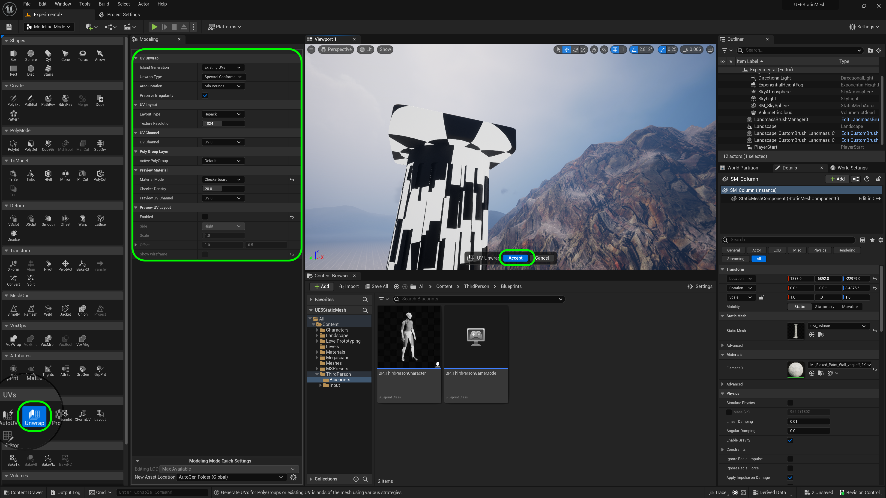
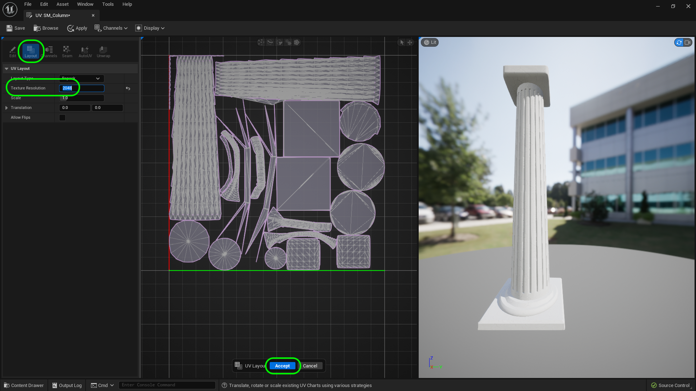
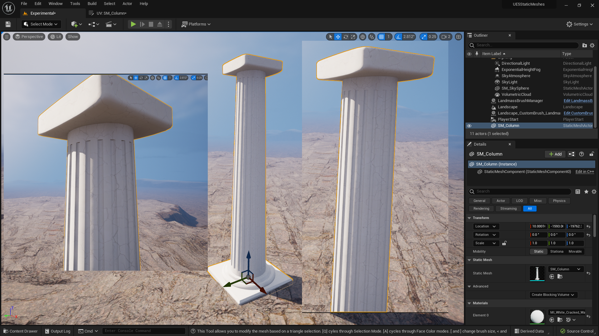

### UVs

[previous](../collisions/README.md#user-content-collisions) • [home](../README.md#user-content-ue5-intro-to-static-meshes) • [next](../nanites/README.md#user-content-nanites)

[UV Mapping](https://en.wikipedia.org/wiki/UV_mapping) is a method of project a 2-dimensional texture on the surface of a 3-d model.  This can be for a texture color, the reflective qualities of an area on the surface or many other shader related topics.  The **U** and the **V** denote the X & Y axis of the 2D texture because **X**, **Y** and **Z** are used by the verticese in the 3-D model.  So **U** is the horizontal axis and **Z** is the vertical axis of the 2-D texture.

 

---

##### `Step 1.`\|`ITSM`|:small_blue_diamond:

[UV]() mapping is the process of projecting a 2-D image to a 3D model's surface for texture mapping.  This allows the model to know what pixel in the 2-d image goes to what portion of the polygon (face) in a model.  The larger the size of the texture, the more detail you will get in the model.  The letters "U" and "V" are used to represent the two axis of a 2-D texture as **X, Y & Z** are already representing the points of the 3-D model.  **U** represents the horizontal axis (x) and **V** represents the vertical axis (y) of the texture.

This is the 3-D shaped unwrapped so that it is like you cut the seams on the sides of the box and laid them out flat.  It is often called UV unwrapping, the act of taking a 3-D model and creating UVs.

* Picture from Wikipedia

##### `Step 2.`\|`ITSM`|:small_blue_diamond: :small_blue_diamond: 

Now go back to modeling mode and select **UVs | Layout**.  Now what this shows is a square texture with an exploded view of the polygons of the faces of the individual pieces were before they were combined.  So each pixel in this texture maps relates to a face in the model. 

You will notice that the box shapes only have one face rather than 6 faces.  This means that all 6 faces are using the same material so all sides of the box will be identical in the way that UV's are layed out here currently.

##### `Step 3.`\|`ITSM`|:small_blue_diamond: :small_blue_diamond: :small_blue_diamond:

So first lets try **UVs | Auto UV**. Make sure **Material Mode** is set to `Checkerboard`. Play around with the settings.  What we want to see is 1 meter squares evenly spaced.  I am getting a pretty good result with the default settings. The uv-ing is especially poor along the columns and is not handling the grooves very well. Press the <kbd>Accept</kbd> button. Now when you select **UVs | Layout** it is a lot more organized and the unwrapping is improved but not good enough.

##### `Step 4.`\|`ITSM`|:small_blue_diamond: :small_blue_diamond: :small_blue_diamond: :small_blue_diamond:

Lets try unwrapping where the engine will try and unwrap the model to create a good UV map based on the existing UVs.  There is not a dramatic change from what we had with the auto uv setting.  We could have also done it by Poly groups but with so many triangles would have taken a long time to paint the zones and unwrap based on them.  This does not fix the issues around the column at all.

##### `Step 5.`\|`ITSM`| :small_orange_diamond:

Now our final attempt is to project the UV's onto the closest shape and re-cut and unwarp it.  Now since this is still cylindrical, select **Projection Type** and then select `Cylindrical`.  Press the <kbd>Accept</kbd> button. Now we get a nice distribution of our UV's and a much cleaner UV map as well. The UV's are smoother along the column but wished they were better lined up.  This will be good enough for us for this exercise.

##### `Step 6.`\|`ITSM`| :small_orange_diamond: :small_blue_diamond:

Press **File | Save All** to save all your work to date.  There is a new plugin tool that we can use to edit UV's as well.  Go to **Edit | Plugins** and search for **UV Editor**. There will be a disclaimer about the tool not being final and you will need to restart the game.

##### `Step 7.`\|`ITSM`| :small_orange_diamond: :small_blue_diamond: :small_blue_diamond:

Now select the column in the game engine while in modeling mode and select **Actor | UV Editor**.

##### `Step 8.`\|`ITSM`| :small_orange_diamond: :small_blue_diamond: :small_blue_diamond: :small_blue_diamond:

So you now see your UV's and they can be edited if you like.

##### `Step 9.`\|`ITSM`| :small_orange_diamond: :small_blue_diamond: :small_blue_diamond: :small_blue_diamond: :small_blue_diamond:

You can go to **Display** and select `Background` and you will see a UV sheet show you the texel density and where each object is projected.  So you can see **A1** in your 2D UV sheet and where it projecst on the model. If it looks bad you can try **Unwrapping** it in the UV tool in this editor.  I got better results than unwrapping it in the Modeling package (but that might be the steps I took prior being different).

##### `Step 10.`\|`ITSM`| :large_blue_diamond:

In the UV Editor Tool and resize the **Layout | Texture Resolution** to `2048` to match the medium size we downloaded from **Quixel**.

##### `Step 11.`\|`ITSM`| :large_blue_diamond: :small_blue_diamond: 

If you imagine unwrapping as cutting away a shape (like along the column) then uncurling it until it is flat.  This is done by having seams in the model.  If you go to the **Seam** editor you can see how it has unwrapped the seams.  You can add seams but I have not been able to delete them in this version of the editor.

##### `Step 12.`\|`ITSM`| :large_blue_diamond: :small_blue_diamond: :small_blue_diamond: 

##### `Step 13.`\|`ITSM`| :large_blue_diamond: :small_blue_diamond: :small_blue_diamond:  :small_blue_diamond: 

##### `Step 14.`\|`ITSM`| :large_blue_diamond: :small_blue_diamond: :small_blue_diamond: :small_blue_diamond:  :small_blue_diamond: 

Redo the **Unwrap** with this slightly altered shape.  We should have a bit more UV space for the visible parts of the model.

##### `Step 15.`\|`ITSM`| :large_blue_diamond: :small_orange_diamond: 

##### `Step 16.`\|`ITSM`| :large_blue_diamond: :small_orange_diamond:   :small_blue_diamond: 

Go into the game and inspect the UVs.  Make sure that the textures have no unsightly seams and that the resolution holds up.  Check out ALL parts of the model.

##### `Step 17.`\|`ITSM`| :large_blue_diamond: :small_orange_diamond: :small_blue_diamond: :small_blue_diamond:

Select the **File | Save All** then press the <kbd>Source Control</kbd> button and select **Submit Content**.  If you are prompted, select **Check Out** for all items that are not checked out of source control. Update the **Changelist Description** message and with the latest changes. Make sure all the files are correct and press the <kbd>Submit</kbd> button. A confirmation will pop up on the bottom right with a message about a changelist was submitted with a commit number.

##### `Step 18.`\|`ITSM`| :large_blue_diamond: :small_orange_diamond: :small_blue_diamond: :small_blue_diamond: :small_blue_diamond:

<!--  -->

| [previous](../collisions/README.md#user-content-collisions)| [home](../README.md#user-content-ue5-intro-to-static-meshes) | [next](../nanites/README.md#user-content-nanites)|
|---|---|---|
